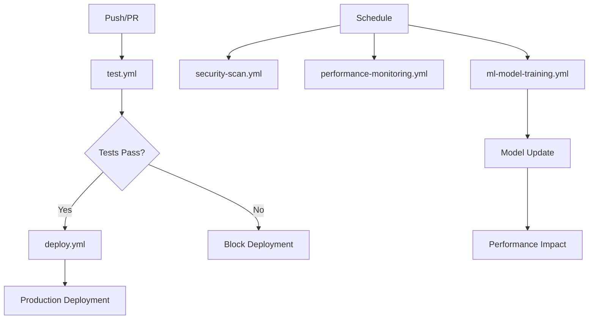

# 🚀 AttendanceX CI/CD Workflows

Ce dossier contient tous les workflows GitHub Actions pour AttendanceX, incluant les fonctionnalités ML/IA avancées.

## 📋 Vue d'ensemble des Workflows

### 🧪 Tests et Qualité (`test.yml`)
**Déclencheurs:** Push, Pull Request
**Durée:** ~15-20 minutes

- **Code Quality** - ESLint, Prettier, TypeScript
- **Frontend Tests** - Unit, Integration, Coverage
- **Backend Tests** - Unit, Integration, ML Tests
- **E2E Tests** - Playwright avec Firebase Emulator
- **Security Tests** - npm audit, Snyk
- **Build & Deploy Preview** - Firebase Preview Channels

### 🚀 Déploiement (`deploy.yml`)
**Déclencheurs:** Push sur main, Tags, Manuel
**Durée:** ~10-15 minutes

- **Pre-deployment Checks** - Version, Environment
- **Full Test Suite** - Réutilise le workflow de tests
- **Production Build** - Frontend + Backend + ML Models
- **Firebase Deployment** - Hosting + Functions
- **Post-deployment Tests** - Smoke tests, ML endpoints
- **Performance Monitoring** - Lighthouse CI
- **Notifications** - Slack, Email
- **Release Creation** - GitHub Releases automatiques

### 🤖 Entraînement ML (`ml-model-training.yml`)
**Déclencheurs:** Hebdomadaire (Dimanche 2h), Manuel
**Durée:** ~30-60 minutes

- **Data Validation** - Qualité et quantité des données
- **Model Training** - Entraînement parallèle des modèles
- **Model Validation** - Tests de performance
- **Model Deployment** - Déploiement automatique
- **Performance Report** - Métriques et analytics
- **Cleanup** - Nettoyage des anciens modèles

### 🔒 Sécurité (`security-scan.yml`)
**Déclencheurs:** Quotidien (3h), Push, Pull Request
**Durée:** ~20-30 minutes

- **Dependency Scan** - npm audit, Snyk
- **Code Security** - CodeQL, Semgrep
- **Secrets Scan** - TruffleHog, GitLeaks
- **Web Security** - OWASP ZAP (programmé)
- **Firebase Security** - Rules et configuration
- **ML Security** - Bandit, Safety pour Python
- **Consolidated Report** - Rapport de sécurité complet

### 📊 Performance (`performance-monitoring.yml`)
**Déclencheurs:** Quotidien (6h), Manuel
**Durée:** ~25-35 minutes

- **Lighthouse Audit** - Performance web
- **Load Testing** - Tests de charge avec k6
- **ML Performance** - Performance des APIs IA
- **Mobile Performance** - Tests mobile
- **Core Web Vitals** - Métriques UX
- **Consolidated Report** - Rapport de performance

## 🔧 Configuration Requise

### Secrets GitHub
```yaml
# Firebase
FIREBASE_SERVICE_ACCOUNT: "Service account JSON"
FIREBASE_PROJECT_ID: "project-id"
FIREBASE_TOKEN: "CI token"

# Environnements
PRODUCTION_FIREBASE_SERVICE_ACCOUNT: "Production service account"
PRODUCTION_FIREBASE_PROJECT_ID: "production-project-id"
PRODUCTION_APP_URL: "https://app.attendancex.com"
PRODUCTION_API_URL: "https://api.attendancex.com"

STAGING_FIREBASE_SERVICE_ACCOUNT: "Staging service account"
STAGING_FIREBASE_PROJECT_ID: "staging-project-id"
STAGING_APP_URL: "https://staging.attendancex.com"
STAGING_API_URL: "https://staging-api.attendancex.com"

# Sécurité
SNYK_TOKEN: "Snyk API token"
SEMGREP_APP_TOKEN: "Semgrep token"

# Notifications
SLACK_WEBHOOK_URL: "Slack webhook"
EMAIL_USERNAME: "SMTP username"
EMAIL_PASSWORD: "SMTP password"
DEPLOYMENT_EMAIL_LIST: "team@attendancex.com"
SECURITY_TEAM_EMAIL_LIST: "security@attendancex.com"
PERFORMANCE_TEAM_EMAIL_LIST: "performance@attendancex.com"
ML_TEAM_EMAIL_LIST: "ml@attendancex.com"

# ML/IA
WANDB_API_KEY: "Weights & Biases API key"
```

### Fichiers de Configuration
```
.lighthouserc.json          # Configuration Lighthouse
.lighthouserc-mobile.json   # Configuration Lighthouse mobile
.zap/rules.tsv             # Règles OWASP ZAP
tests/performance/         # Scripts de tests de performance
scripts/ml/                # Scripts ML/IA
```

## 🎯 Fonctionnalités Spéciales ML/IA

### Entraînement Automatique
- **Programmé** - Chaque dimanche à 2h du matin
- **Validation des données** - Vérification qualité avant entraînement
- **Entraînement parallèle** - Plusieurs modèles simultanément
- **Déploiement automatique** - Modèles validés déployés automatiquement

### Tests ML Intégrés
- **Tests unitaires** - Services ML/IA
- **Tests d'intégration** - APIs de prédiction
- **Tests de performance** - Latence des modèles
- **Tests de charge** - Capacité des endpoints IA

### Monitoring IA
- **Performance des modèles** - Temps de réponse, précision
- **Utilisation des ressources** - CPU, mémoire pour l'IA
- **Qualité des prédictions** - Métriques de performance
- **Alertes automatiques** - Dégradation de performance

## 📊 Métriques et Reporting

### Rapports Automatiques
- **Tests** - Coverage, résultats par composant
- **Sécurité** - Vulnérabilités, recommandations
- **Performance** - Core Web Vitals, temps de chargement
- **ML** - Précision des modèles, performance

### Notifications
- **Slack** - Déploiements, alertes critiques
- **Email** - Rapports détaillés, résumés hebdomadaires
- **GitHub Issues** - Problèmes de sécurité automatiques

## 🔄 Workflow Dependencies



## 🚀 Déploiement et Environnements

### Environnements
- **Development** - Branches feature
- **Staging** - Branch develop
- **Production** - Branch main + tags

### Stratégie de Déploiement
1. **Preview Deployments** - Chaque PR
2. **Staging Deployment** - Push sur develop
3. **Production Deployment** - Push sur main ou tag
4. **Rollback** - Réversion automatique si échec

### Canary Deployments
- **ML Models** - Déploiement progressif des nouveaux modèles
- **Feature Flags** - Activation progressive des fonctionnalités
- **A/B Testing** - Tests de performance comparatifs

## 🛠️ Maintenance et Optimisation

### Nettoyage Automatique
- **Artifacts** - Suppression après 30-90 jours
- **Preview Deployments** - Nettoyage après merge
- **Old Models** - Conservation des 5 dernières versions
- **Logs** - Rotation automatique

### Optimisations
- **Cache** - Dependencies, builds
- **Parallel Jobs** - Exécution simultanée
- **Conditional Execution** - Skip si pas de changements
- **Resource Limits** - Timeout et limites mémoire

## 📚 Documentation Complémentaire

- [Guide de Contribution](../CONTRIBUTING.md)
- [Architecture ML/IA](../docs/🏗️%20ARCHITECTURE.md)
- [Guide de Sécurité](../docs/🔐%20SECURITY.md)
- [Guide de Déploiement](../docs/🚀%20DEPLOYMENT.md)

## 🆘 Dépannage

### Échecs Fréquents
1. **Tests ML** - Vérifier les dépendances Python
2. **Firebase Deploy** - Vérifier les permissions
3. **Security Scan** - Mettre à jour les tokens
4. **Performance** - Vérifier la disponibilité des URLs

### Contacts
- **CI/CD Issues** - devops@attendancex.com
- **ML/IA Issues** - ml@attendancex.com
- **Security Issues** - security@attendancex.com
- **Performance Issues** - performance@attendancex.com