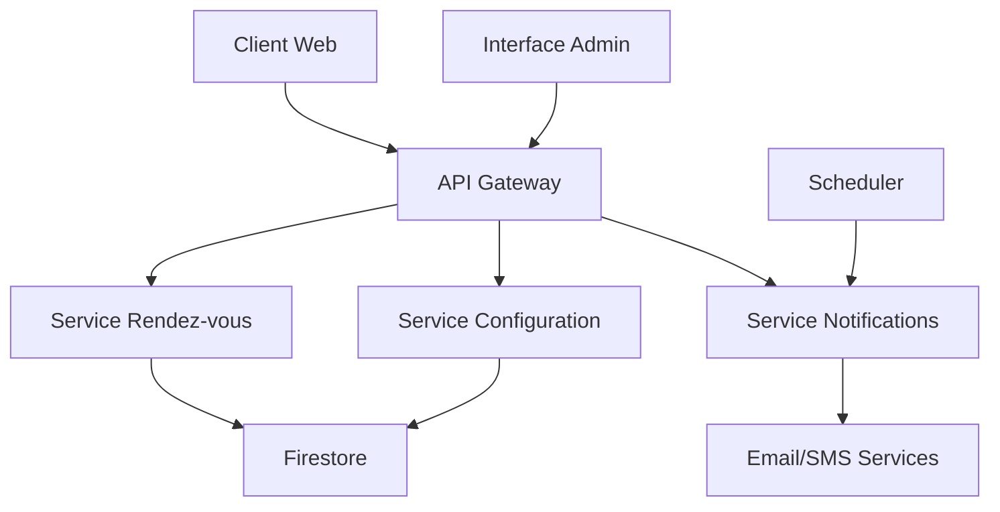

# Design Document - Gestion des rendez-vous

## Overview

Le système de gestion des rendez-vous est conçu pour permettre aux organisations de gérer efficacement leurs rendez-vous avec les clients. Il offre une interface complète pour la création, modification, et suivi des rendez-vous, ainsi qu'un système de réservation en ligne pour les clients. Le système intègre des fonctionnalités de rappels automatiques, de gestion de planning avec vue calendrier, et d'analyse statistique.

### Objectifs principaux
- Simplifier la prise de rendez-vous pour les clients et les praticiens
- Réduire les absences grâce aux rappels automatiques
- Optimiser la gestion du planning avec une interface intuitive
- Fournir des outils d'analyse pour améliorer les performances

## Architecture

### Architecture générale
Le système suit une architecture modulaire basée sur les principes suivants :

**Frontend (React/TypeScript)**
- Interface d'administration pour les praticiens
- Interface publique de réservation pour les clients
- Composants calendrier interactifs
- Tableaux de bord statistiques

**Backend (Node.js/Firebase Functions)**
- API REST pour la gestion des rendez-vous
- Système de notifications automatiques
- Gestion des utilisateurs et organisations
- Services de validation et de logique métier

**Base de données (Firestore)**
- Collections pour les rendez-vous, clients, praticiens
- Configuration des organisations
- Logs et statistiques

**Services externes**
- Service d'email (SendGrid/Firebase)
- Service SMS (Twilio)
- Système de planification des tâches (Firebase Scheduler)

### Flux de données principaux



## Components and Interfaces

### 1. Composant Gestion des Rendez-vous

**AppointmentService**
- `createAppointment(appointmentData)`: Création d'un nouveau rendez-vous
- `updateAppointment(id, updates)`: Modification d'un rendez-vous existant
- `deleteAppointment(id)`: Suppression d'un rendez-vous
- `getAppointments(filters)`: Récupération des rendez-vous avec filtres
- `checkAvailability(date, time, duration)`: Vérification de disponibilité

**Rationale**: Centralise toute la logique métier liée aux rendez-vous, garantit la cohérence des données et facilite la maintenance.

### 2. Composant Réservation Client

**BookingService**
- `getAvailableSlots(date, serviceType)`: Récupération des créneaux disponibles
- `bookAppointment(clientData, slotData)`: Réservation par le client
- `modifyBooking(bookingId, changes)`: Modification de réservation
- `cancelBooking(bookingId, reason)`: Annulation de réservation

**PublicBookingInterface**
- Calendrier de sélection de créneaux
- Formulaire de saisie client
- Confirmation et gestion des réservations

**Rationale**: Sépare l'interface publique de l'interface d'administration pour des raisons de sécurité et d'expérience utilisateur optimisée.

### 3. Composant Notifications

**NotificationService**
- `scheduleReminder(appointmentId, reminderConfig)`: Planification des rappels
- `sendNotification(type, recipient, content)`: Envoi de notifications
- `processReminders()`: Traitement des rappels programmés
- `updateNotificationStatus(notificationId, status)`: Mise à jour du statut

**Rationale**: Système asynchrone pour gérer les notifications sans impacter les performances de l'interface utilisateur.

### 4. Composant Planning et Calendrier

**CalendarComponent**
- Vue mensuelle, hebdomadaire, et journalière
- Drag & drop pour reprogrammer les rendez-vous
- Filtrage par praticien, service, statut
- Gestion des conflits et disponibilités

**ScheduleService**
- `getSchedule(practitioner, dateRange)`: Récupération du planning
- `moveAppointment(appointmentId, newSlot)`: Déplacement de rendez-vous
- `detectConflicts(appointment)`: Détection de conflits

**Rationale**: Interface intuitive pour la gestion visuelle du planning, avec validation automatique des conflits.

### 5. Composant Configuration

**ConfigurationService**
- `updateOrganizationSettings(orgId, settings)`: Mise à jour des paramètres
- `getBookingRules(orgId)`: Récupération des règles de réservation
- `setReminderConfig(orgId, config)`: Configuration des rappels
- `generatePublicLink(orgId)`: Génération du lien public

**Rationale**: Centralise la configuration pour permettre une personnalisation flexible selon les besoins de chaque organisation.

### 6. Composant Statistiques

**AnalyticsService**
- `getAttendanceStats(filters)`: Statistiques de présence
- `getCancellationRates(filters)`: Taux d'annulation
- `getPeakHours(dateRange)`: Heures de pointe
- `generateReport(type, filters)`: Génération de rapports

**Rationale**: Fournit des insights pour optimiser la gestion des rendez-vous et améliorer les performances.

## Data Models

### Appointment
```typescript
interface Appointment {
  id: string;
  organizationId: string;
  clientId: string;
  practitionerId: string;
  serviceType: string;
  date: Date;
  startTime: string;
  duration: number; // en minutes
  status: 'scheduled' | 'confirmed' | 'completed' | 'cancelled' | 'no-show';
  notes?: string;
  createdAt: Date;
  updatedAt: Date;
  reminders: Reminder[];
}
```

### Client
```typescript
interface Client {
  id: string;
  organizationId: string;
  firstName: string;
  lastName: string;
  email: string;
  phone: string;
  preferences: {
    reminderMethod: 'email' | 'sms' | 'both';
    language: string;
  };
  createdAt: Date;
}
```

### Organization
```typescript
interface Organization {
  id: string;
  name: string;
  settings: {
    workingHours: {
      [day: string]: { start: string; end: string; };
    };
    services: Service[];
    bookingRules: {
      advanceBookingDays: number;
      cancellationDeadlineHours: number;
      allowOnlineBooking: boolean;
    };
    reminderConfig: {
      enabled: boolean;
      timings: number[]; // heures avant le RDV
      templates: NotificationTemplate[];
    };
  };
  publicBookingUrl?: string;
}
```

### Service
```typescript
interface Service {
  id: string;
  name: string;
  duration: number;
  price?: number;
  practitioners: string[]; // IDs des praticiens
  color: string; // pour l'affichage calendrier
}
```

### Reminder
```typescript
interface Reminder {
  id: string;
  appointmentId: string;
  type: 'email' | 'sms';
  scheduledFor: Date;
  status: 'pending' | 'sent' | 'failed';
  content: string;
}
```

**Rationale**: Structure de données normalisée qui permet une gestion efficace des relations et une évolutivité du système.

## Error Handling

### Stratégie de gestion d'erreurs

**1. Validation des données**
- Validation côté client et serveur
- Messages d'erreur localisés et explicites
- Prévention des conflits de réservation

**2. Gestion des erreurs réseau**
- Retry automatique pour les opérations critiques
- Mode offline avec synchronisation différée
- Indicateurs de statut de connexion

**3. Gestion des erreurs de notification**
- Queue de retry pour les notifications échouées
- Logs détaillés pour le debugging
- Fallback vers d'autres canaux de communication

**4. Gestion des conflits de données**
- Détection de conflits en temps réel
- Résolution automatique ou manuelle selon le contexte
- Historique des modifications pour audit

### Codes d'erreur standardisés
```typescript
enum AppointmentErrorCodes {
  SLOT_NOT_AVAILABLE = 'SLOT_NOT_AVAILABLE',
  CLIENT_NOT_FOUND = 'CLIENT_NOT_FOUND',
  INVALID_TIME_SLOT = 'INVALID_TIME_SLOT',
  BOOKING_DEADLINE_PASSED = 'BOOKING_DEADLINE_PASSED',
  NOTIFICATION_FAILED = 'NOTIFICATION_FAILED'
}
```

**Rationale**: Gestion d'erreurs robuste pour assurer la fiabilité du système et une expérience utilisateur fluide.

## Testing Strategy

### 1. Tests unitaires
- Couverture de tous les services métier
- Tests des validations et règles de gestion
- Mocking des services externes

### 2. Tests d'intégration
- Tests des API endpoints
- Tests de la base de données
- Tests des services de notification

### 3. Tests end-to-end
- Parcours complet de réservation client
- Gestion du planning par les praticiens
- Processus de rappels automatiques

### 4. Tests de performance
- Tests de charge sur les créneaux de réservation
- Performance des requêtes de calendrier
- Optimisation des notifications en masse

### 5. Tests d'accessibilité
- Conformité WCAG pour l'interface publique
- Navigation au clavier
- Support des lecteurs d'écran

**Rationale**: Stratégie de test complète pour garantir la qualité, la performance et l'accessibilité du système.

### Outils de test
- **Jest** pour les tests unitaires et d'intégration
- **Cypress** pour les tests end-to-end
- **Lighthouse** pour les tests de performance et d'accessibilité
- **Firebase Emulator** pour les tests locaux

Cette approche de test garantit la fiabilité du système dans tous les scénarios d'usage et facilite la maintenance continue.