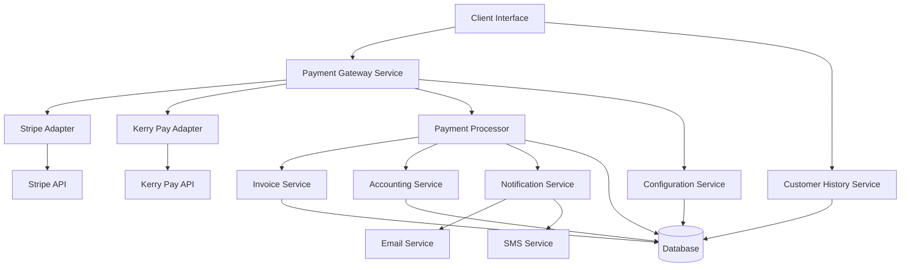

# Design Document - Système de Facturation et Paiement

## Overview

Le système de facturation et paiement est conçu pour offrir une solution complète de gestion des paiements avec support multi-devises et multi-méthodes. L'architecture privilégie la flexibilité pour supporter à la fois les paiements internationaux via Stripe et les paiements locaux africains via Kerry Pay (Orange Money et Mobile Money).

### Key Design Principles

- **Modularité**: Chaque méthode de paiement est implémentée comme un module indépendant
- **Extensibilité**: Architecture permettant l'ajout facile de nouveaux moyens de paiement
- **Sécurité**: Conformité PCI DSS via Stripe Elements et sécurisation des API Kerry Pay
- **Traçabilité**: Logging complet de toutes les transactions pour audit et réconciliation

## Architecture

### High-Level Architecture



### Service Layer Architecture

Le système utilise une architecture en couches avec séparation claire des responsabilités:

1. **Presentation Layer**: Interface utilisateur et API endpoints
2. **Business Logic Layer**: Services métier et orchestration des paiements
3. **Integration Layer**: Adaptateurs pour les APIs externes (Stripe, Kerry Pay)
4. **Data Layer**: Persistance et gestion des données

## Components and Interfaces

### Payment Gateway Service

Service central orchestrant tous les paiements avec une interface unifiée.

```typescript
interface PaymentGatewayService {
  processPayment(paymentRequest: PaymentRequest): Promise<PaymentResult>
  getAvailablePaymentMethods(location: string, currency: string): PaymentMethod[]
  getPaymentStatus(transactionId: string): Promise<PaymentStatus>
  processRefund(refundRequest: RefundRequest): Promise<RefundResult>
}
```

**Design Rationale**: Interface unifiée permettant de traiter tous types de paiements sans exposer la complexité des différents providers aux couches supérieures.

### Payment Adapters

#### Stripe Adapter
```typescript
interface StripeAdapter {
  createPaymentIntent(amount: number, currency: string, metadata: object): Promise<StripePaymentIntent>
  confirmPayment(paymentIntentId: string): Promise<StripePaymentResult>
  createRefund(paymentIntentId: string, amount?: number): Promise<StripeRefund>
  handleWebhook(payload: string, signature: string): Promise<WebhookEvent>
}
```

#### Kerry Pay Adapter
```typescript
interface KerryPayAdapter {
  initiateMobileMoneyPayment(request: MobileMoneyRequest): Promise<KerryPayResponse>
  initiateOrangeMoneyPayment(request: OrangeMoneyRequest): Promise<KerryPayResponse>
  checkTransactionStatus(transactionId: string): Promise<TransactionStatus>
  processRefund(originalTransactionId: string, amount: number): Promise<RefundResponse>
}
```

**Design Rationale**: Adaptateurs séparés permettant d'encapsuler la logique spécifique à chaque provider et facilitant la maintenance et les tests.

### Configuration Service

```typescript
interface PaymentConfigurationService {
  getEnabledPaymentMethods(): PaymentMethodConfig[]
  updatePaymentMethodConfig(method: string, config: PaymentMethodConfig): Promise<void>
  getCurrencySettings(): CurrencyConfig[]
  getTransactionFeeConfig(): FeeConfiguration
}
```

**Design Rationale**: Centralisation de la configuration permettant aux administrateurs de gérer dynamiquement les moyens de paiement sans redéploiement.

### Invoice Service

```typescript
interface InvoiceService {
  getInvoice(invoiceId: string): Promise<Invoice>
  updateInvoicePaymentStatus(invoiceId: string, status: PaymentStatus): Promise<void>
  generatePaymentLink(invoiceId: string): Promise<string>
  getCustomerInvoices(customerId: string): Promise<Invoice[]>
}
```

### Accounting Service

```typescript
interface AccountingService {
  recordPayment(payment: PaymentRecord): Promise<void>
  recordRefund(refund: RefundRecord): Promise<void>
  generatePaymentReport(criteria: ReportCriteria): Promise<PaymentReport>
  reconcileTransactions(period: DateRange): Promise<ReconciliationReport>
}
```

**Design Rationale**: Service dédié à la comptabilité pour assurer la traçabilité complète et faciliter la génération de rapports financiers.

### Notification Service

```typescript
interface NotificationService {
  sendPaymentConfirmation(customerId: string, payment: PaymentRecord): Promise<void>
  sendRefundConfirmation(customerId: string, refund: RefundRecord): Promise<void>
  sendPaymentFailureAlert(customerId: string, error: PaymentError): Promise<void>
  sendAdminAlert(alertType: AlertType, data: any): Promise<void>
  configureNotificationThresholds(config: NotificationConfig): Promise<void>
}

enum AlertType {
  HIGH_VALUE_PAYMENT = 'high_value_payment',
  REPEATED_FAILURES = 'repeated_failures',
  SUSPICIOUS_ACTIVITY = 'suspicious_activity',
  PERIODIC_REPORT = 'periodic_report'
}
```

**Design Rationale**: Service centralisé pour toutes les notifications permettant une gestion cohérente des communications avec les clients et administrateurs.

### Customer History Service

```typescript
interface CustomerHistoryService {
  getPaymentHistory(customerId: string, filters?: HistoryFilters): Promise<PaymentHistory[]>
  generatePaymentReceipt(transactionId: string): Promise<PaymentReceipt>
  downloadReceiptPDF(transactionId: string): Promise<Buffer>
  searchTransactions(customerId: string, criteria: SearchCriteria): Promise<Transaction[]>
}

interface HistoryFilters {
  dateRange?: DateRange
  paymentMethod?: PaymentMethodType
  status?: PaymentStatus
  amountRange?: AmountRange
}
```

**Design Rationale**: Service dédié à l'historique client pour permettre aux utilisateurs de consulter et gérer leurs transactions passées.

## Data Models

### Core Payment Models

```typescript
interface PaymentRequest {
  invoiceId: string
  amount: number
  currency: string
  paymentMethod: PaymentMethodType
  customerInfo: CustomerInfo
  metadata?: Record<string, any>
}

interface PaymentResult {
  transactionId: string
  status: PaymentStatus
  amount: number
  currency: string
  fees: number
  providerTransactionId: string
  timestamp: Date
  errorMessage?: string
}

enum PaymentStatus {
  PENDING = 'pending',
  PROCESSING = 'processing',
  COMPLETED = 'completed',
  FAILED = 'failed',
  CANCELLED = 'cancelled',
  REFUNDED = 'refunded'
}

enum PaymentMethodType {
  STRIPE_CARD = 'stripe_card',
  ORANGE_MONEY = 'orange_money',
  MOBILE_MONEY_MTN = 'mobile_money_mtn',
  MOBILE_MONEY_MOOV = 'mobile_money_moov'
}
```

### Configuration Models

```typescript
interface PaymentMethodConfig {
  method: PaymentMethodType
  enabled: boolean
  supportedCurrencies: string[]
  feeConfiguration: FeeConfig
  regionRestrictions?: string[]
  apiCredentials: Record<string, string>
}

interface FeeConfig {
  fixedFee: number
  percentageFee: number
  currency: string
  absorbedByMerchant: boolean
}
```

**Design Rationale**: Modèles de données flexibles permettant de supporter différentes devises et configurations de frais par méthode de paiement.

### Transaction Models

```typescript
interface Transaction {
  id: string
  invoiceId: string
  customerId: string
  amount: number
  currency: string
  paymentMethod: PaymentMethodType
  status: PaymentStatus
  providerTransactionId: string
  fees: number
  createdAt: Date
  updatedAt: Date
  metadata: Record<string, any>
}

interface RefundTransaction {
  id: string
  originalTransactionId: string
  amount: number
  reason: string
  status: RefundStatus
  providerRefundId: string
  createdAt: Date
}
```

## Error Handling

### Error Classification

```typescript
enum PaymentErrorType {
  VALIDATION_ERROR = 'validation_error',
  PAYMENT_DECLINED = 'payment_declined',
  INSUFFICIENT_FUNDS = 'insufficient_funds',
  NETWORK_ERROR = 'network_error',
  PROVIDER_ERROR = 'provider_error',
  CONFIGURATION_ERROR = 'configuration_error'
}

interface PaymentError {
  type: PaymentErrorType
  code: string
  message: string
  providerError?: any
  retryable: boolean
  suggestedActions: string[]
}
```

### Error Handling Strategy

1. **Retry Logic**: Implémentation d'un système de retry avec backoff exponentiel pour les erreurs temporaires
2. **Fallback Methods**: Proposition automatique de méthodes de paiement alternatives en cas d'échec
3. **User-Friendly Messages**: Traduction des erreurs techniques en messages compréhensibles
4. **Logging and Monitoring**: Enregistrement détaillé de tous les échecs pour analyse

**Design Rationale**: Gestion d'erreurs robuste essentielle pour maintenir une bonne expérience utilisateur et faciliter le support technique.

### Webhook Handling

```typescript
interface WebhookHandler {
  handleStripeWebhook(event: StripeWebhookEvent): Promise<void>
  handleKerryPayCallback(payload: KerryPayCallback): Promise<void>
  verifyWebhookSignature(payload: string, signature: string, provider: string): boolean
}
```

**Design Rationale**: Gestion centralisée des webhooks pour assurer la synchronisation en temps réel des statuts de paiement.

## Testing Strategy

### Unit Testing
- Tests unitaires pour chaque adapter de paiement
- Mock des APIs externes (Stripe, Kerry Pay)
- Tests de validation des modèles de données
- Tests des services métier avec injection de dépendances

### Integration Testing
- Tests d'intégration avec les APIs Stripe et Kerry Pay en mode sandbox
- Tests de bout en bout du flux de paiement complet
- Tests de gestion des webhooks et callbacks
- Tests de réconciliation comptable

### Security Testing
- Tests de validation des signatures de webhook
- Tests de gestion des données sensibles
- Tests de conformité PCI DSS
- Tests de résistance aux attaques (injection, CSRF)

**Design Rationale**: Stratégie de test complète nécessaire pour assurer la fiabilité d'un système de paiement critique.

### Performance Testing
- Tests de charge sur les endpoints de paiement
- Tests de performance des requêtes de base de données
- Tests de latence des APIs externes
- Tests de scalabilité horizontale

### Monitoring and Observability

```typescript
interface PaymentMetrics {
  transactionVolume: number
  successRate: number
  averageProcessingTime: number
  errorRateByProvider: Record<string, number>
  revenueByMethod: Record<string, number>
}
```

**Design Rationale**: Monitoring complet nécessaire pour détecter rapidement les problèmes et optimiser les performances du système de paiement.