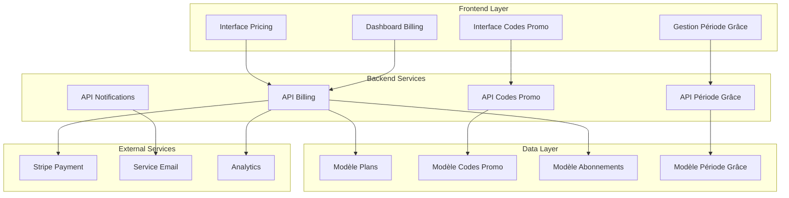
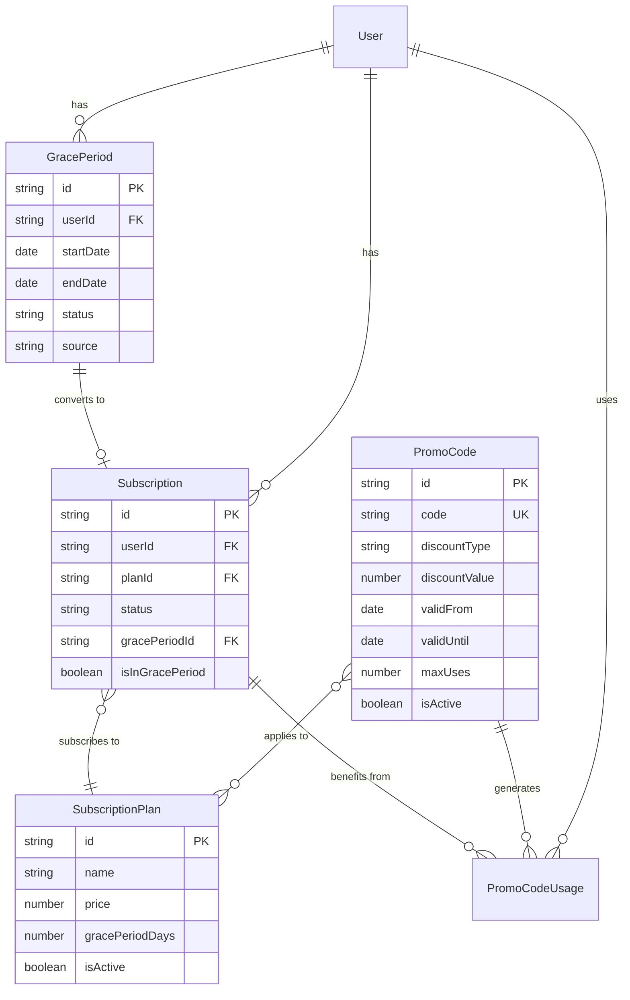

# Design Document - Restructuration du Système de Billing

## Overview

Ce document décrit l'architecture et la conception technique pour restructurer le système de billing d'AttendanceX en supprimant l'offre gratuite, introduisant trois offres payantes avec période de grâce variable, et ajoutant un système de codes promotionnels.

### Objectifs de conception

1. **Migration transparente** : Transition fluide depuis le système actuel
2. **Flexibilité tarifaire** : Support de trois plans payants avec options personnalisables
3. **Système de codes promos** : Gestion complète des réductions et promotions
4. **Période de grâce configurable** : Durée d'essai variable selon les besoins business
5. **Sécurité et conformité** : Respect des standards PCI DSS et RGPD

## Architecture

### Vue d'ensemble de l'architecture



### Patterns architecturaux

1. **Service Layer Pattern** : Séparation claire des responsabilités
2. **Repository Pattern** : Abstraction de l'accès aux données
3. **Strategy Pattern** : Gestion flexible des types de réductions
4. **Observer Pattern** : Notifications automatiques des changements
5. **Factory Pattern** : Création des différents types de plans

## Components and Interfaces

### Nouveaux modèles de données

#### 1. Plan Model (Mise à jour)
```typescript
interface SubscriptionPlan {
  id: string;
  name: string;
  description: string;
  price: number;
  currency: string;
  billingCycle: 'monthly' | 'yearly';
  features: PlanFeatures;
  limits: PlanLimits;
  isActive: boolean;
  sortOrder: number;
  gracePeriodDays: number; // Nouveau champ
  stripeProductId: string;
  stripePriceId: string;
  createdAt: Date;
  updatedAt: Date;
}

// Suppression du plan gratuit - seulement 3 plans payants
enum PlanType {
  STARTER = 'starter',
  PROFESSIONAL = 'professional', 
  ENTERPRISE = 'enterprise'
}
```

#### 2. Promo Code Model (Nouveau)
```typescript
interface PromoCode {
  id: string;
  code: string; // Code unique (ex: "WELCOME2024")
  name: string; // Nom descriptif
  description?: string;
  
  // Type de réduction
  discountType: 'percentage' | 'fixed_amount';
  discountValue: number; // Pourcentage (0-100) ou montant fixe
  
  // Validité
  isActive: boolean;
  validFrom: Date;
  validUntil?: Date;
  
  // Limitations d'usage
  maxUses?: number; // Nombre max d'utilisations
  currentUses: number; // Utilisations actuelles
  maxUsesPerUser?: number; // Max par utilisateur
  
  // Restrictions
  applicablePlans?: string[]; // Plans éligibles (vide = tous)
  minimumAmount?: number; // Montant minimum requis
  newUsersOnly?: boolean; // Réservé aux nouveaux utilisateurs
  
  // Métadonnées
  createdBy: string;
  tenantId?: string; // Pour les codes spécifiques à un tenant
  metadata?: Record<string, any>;
  
  createdAt: Date;
  updatedAt: Date;
}

interface PromoCodeUsage {
  id: string;
  promoCodeId: string;
  userId: string;
  subscriptionId: string;
  discountApplied: number;
  usedAt: Date;
  ipAddress?: string;
}
```

#### 3. Grace Period Model (Nouveau)
```typescript
interface GracePeriod {
  id: string;
  userId: string;
  tenantId: string;
  
  // Configuration de la période
  startDate: Date;
  endDate: Date;
  durationDays: number;
  
  // Statut
  status: GracePeriodStatus;
  
  // Origine de la période de grâce
  source: 'new_registration' | 'plan_migration' | 'admin_granted' | 'promo_code';
  sourceDetails?: {
    promoCodeId?: string;
    adminUserId?: string;
    migrationReason?: string;
  };
  
  // Notifications envoyées
  notificationsSent: GraceNotification[];
  
  // Conversion
  convertedAt?: Date;
  selectedPlanId?: string;
  
  createdAt: Date;
  updatedAt: Date;
}

enum GracePeriodStatus {
  ACTIVE = 'active',
  EXPIRED = 'expired',
  CONVERTED = 'converted',
  CANCELLED = 'cancelled'
}

interface GraceNotification {
  type: 'reminder_7d' | 'reminder_3d' | 'reminder_1d' | 'expired';
  sentAt: Date;
  emailSent: boolean;
  pushSent: boolean;
}
```

#### 4. Subscription Model (Mise à jour)
```typescript
interface Subscription {
  // Champs existants...
  id: string;
  tenantId: string;
  planId: string;
  status: SubscriptionStatus;
  
  // Nouveaux champs pour les codes promo
  appliedPromoCode?: {
    promoCodeId: string;
    code: string;
    discountType: 'percentage' | 'fixed_amount';
    discountValue: number;
    appliedAt: Date;
    expiresAt?: Date; // Pour les réductions temporaires
  };
  
  // Période de grâce
  gracePeriodId?: string;
  isInGracePeriod: boolean;
  gracePeriodEndsAt?: Date;
  
  // Historique des changements
  planHistory: PlanChange[];
}

interface PlanChange {
  fromPlanId?: string;
  toPlanId: string;
  changedAt: Date;
  reason: 'upgrade' | 'downgrade' | 'grace_conversion' | 'admin_change';
  promoCodeUsed?: string;
}
```

### Services principaux

#### 1. Billing Service (Mise à jour)
```typescript
class BillingService {
  // Méthodes existantes mises à jour...
  
  // Nouvelles méthodes pour les codes promo
  async applyPromoCode(userId: string, promoCode: string): Promise<PromoCodeApplication>
  async validatePromoCode(code: string, userId: string, planId?: string): Promise<PromoCodeValidation>
  async removePromoCode(subscriptionId: string): Promise<void>
  
  // Gestion de la période de grâce
  async createGracePeriod(userId: string, durationDays: number, source: string): Promise<GracePeriod>
  async extendGracePeriod(gracePeriodId: string, additionalDays: number): Promise<GracePeriod>
  async convertGracePeriod(gracePeriodId: string, planId: string): Promise<Subscription>
  
  // Migration des utilisateurs existants
  async migrateExistingUsers(): Promise<MigrationResult>
  async migrateUser(userId: string): Promise<UserMigrationResult>
}
```

#### 2. Promo Code Service (Nouveau)
```typescript
class PromoCodeService {
  // CRUD des codes promo
  async createPromoCode(data: CreatePromoCodeRequest): Promise<PromoCode>
  async updatePromoCode(id: string, data: UpdatePromoCodeRequest): Promise<PromoCode>
  async deletePromoCode(id: string): Promise<void>
  async getPromoCode(id: string): Promise<PromoCode>
  async listPromoCodes(filters: PromoCodeFilters): Promise<PaginatedPromoCodes>
  
  // Validation et application
  async validateCode(code: string, context: ValidationContext): Promise<ValidationResult>
  async applyCode(code: string, userId: string, subscriptionId: string): Promise<ApplicationResult>
  async revokeCode(usageId: string): Promise<void>
  
  // Statistiques et rapports
  async getPromoCodeStats(promoCodeId: string): Promise<PromoCodeStats>
  async getUsageReport(filters: UsageReportFilters): Promise<UsageReport>
}
```

#### 3. Grace Period Service (Nouveau)
```typescript
class GracePeriodService {
  // Gestion des périodes de grâce
  async createGracePeriod(userId: string, config: GracePeriodConfig): Promise<GracePeriod>
  async getActiveGracePeriod(userId: string): Promise<GracePeriod | null>
  async extendGracePeriod(gracePeriodId: string, days: number): Promise<GracePeriod>
  async cancelGracePeriod(gracePeriodId: string, reason: string): Promise<void>
  
  // Notifications
  async sendGraceReminders(): Promise<NotificationResult>
  async scheduleNotifications(gracePeriodId: string): Promise<void>
  
  // Conversion et expiration
  async convertToSubscription(gracePeriodId: string, planId: string): Promise<Subscription>
  async handleExpiredGracePeriods(): Promise<ExpirationResult>
  
  // Statistiques
  async getGracePeriodStats(filters: GraceStatsFilters): Promise<GraceStats>
}
```

## Data Models

### Schémas de validation

#### Promo Code Validation
```typescript
const promoCodeSchema = z.object({
  code: z.string().min(3).max(50).regex(/^[A-Z0-9_-]+$/),
  name: z.string().min(1).max(100),
  description: z.string().max(500).optional(),
  discountType: z.enum(['percentage', 'fixed_amount']),
  discountValue: z.number().positive(),
  validFrom: z.date(),
  validUntil: z.date().optional(),
  maxUses: z.number().positive().optional(),
  maxUsesPerUser: z.number().positive().optional(),
  applicablePlans: z.array(z.string()).optional(),
  minimumAmount: z.number().positive().optional(),
  newUsersOnly: z.boolean().optional(),
}).refine(data => {
  // Validation personnalisée
  if (data.discountType === 'percentage' && data.discountValue > 100) {
    return false;
  }
  if (data.validUntil && data.validUntil <= data.validFrom) {
    return false;
  }
  return true;
});
```

#### Grace Period Validation
```typescript
const gracePeriodSchema = z.object({
  userId: z.string().min(1),
  durationDays: z.number().min(1).max(365),
  source: z.enum(['new_registration', 'plan_migration', 'admin_granted', 'promo_code']),
  sourceDetails: z.object({
    promoCodeId: z.string().optional(),
    adminUserId: z.string().optional(),
    migrationReason: z.string().optional(),
  }).optional(),
});
```

### Relations entre entités



## Error Handling

### Types d'erreurs spécifiques

#### Promo Code Errors
```typescript
enum PromoCodeErrorType {
  CODE_NOT_FOUND = 'PROMO_CODE_NOT_FOUND',
  CODE_EXPIRED = 'PROMO_CODE_EXPIRED',
  CODE_INACTIVE = 'PROMO_CODE_INACTIVE',
  MAX_USES_EXCEEDED = 'PROMO_MAX_USES_EXCEEDED',
  USER_LIMIT_EXCEEDED = 'PROMO_USER_LIMIT_EXCEEDED',
  PLAN_NOT_ELIGIBLE = 'PROMO_PLAN_NOT_ELIGIBLE',
  MINIMUM_AMOUNT_NOT_MET = 'PROMO_MINIMUM_AMOUNT_NOT_MET',
  NEW_USERS_ONLY = 'PROMO_NEW_USERS_ONLY',
  ALREADY_APPLIED = 'PROMO_ALREADY_APPLIED'
}

class PromoCodeError extends Error {
  constructor(
    public type: PromoCodeErrorType,
    public message: string,
    public details?: any
  ) {
    super(message);
    this.name = 'PromoCodeError';
  }
}
```

#### Grace Period Errors
```typescript
enum GracePeriodErrorType {
  ALREADY_IN_GRACE = 'ALREADY_IN_GRACE_PERIOD',
  GRACE_EXPIRED = 'GRACE_PERIOD_EXPIRED',
  GRACE_NOT_FOUND = 'GRACE_PERIOD_NOT_FOUND',
  INVALID_CONVERSION = 'INVALID_GRACE_CONVERSION',
  EXTENSION_NOT_ALLOWED = 'GRACE_EXTENSION_NOT_ALLOWED'
}
```

### Gestion centralisée des erreurs
```typescript
class BillingErrorHandler {
  static handlePromoCodeError(error: PromoCodeError): ApiResponse {
    const errorMessages = {
      [PromoCodeErrorType.CODE_NOT_FOUND]: 'Code promotionnel invalide',
      [PromoCodeErrorType.CODE_EXPIRED]: 'Ce code promotionnel a expiré',
      [PromoCodeErrorType.MAX_USES_EXCEEDED]: 'Ce code a atteint sa limite d\'utilisation',
      // ... autres messages
    };
    
    return {
      success: false,
      error: errorMessages[error.type] || 'Erreur avec le code promotionnel',
      errorCode: error.type,
      details: error.details
    };
  }
}
```

## Testing Strategy

### Tests unitaires

#### Promo Code Service Tests
```typescript
describe('PromoCodeService', () => {
  describe('validateCode', () => {
    it('should validate active percentage code', async () => {
      const result = await promoCodeService.validateCode('WELCOME20', {
        userId: 'user123',
        planId: 'starter'
      });
      
      expect(result.isValid).toBe(true);
      expect(result.discountAmount).toBe(20);
    });
    
    it('should reject expired code', async () => {
      const result = await promoCodeService.validateCode('EXPIRED', {
        userId: 'user123'
      });
      
      expect(result.isValid).toBe(false);
      expect(result.error).toBe(PromoCodeErrorType.CODE_EXPIRED);
    });
  });
});
```

#### Grace Period Service Tests
```typescript
describe('GracePeriodService', () => {
  describe('createGracePeriod', () => {
    it('should create grace period for new user', async () => {
      const gracePeriod = await gracePeriodService.createGracePeriod('user123', {
        durationDays: 14,
        source: 'new_registration'
      });
      
      expect(gracePeriod.status).toBe(GracePeriodStatus.ACTIVE);
      expect(gracePeriod.durationDays).toBe(14);
    });
  });
});
```

### Tests d'intégration

#### Workflow complet de conversion
```typescript
describe('Billing Integration', () => {
  it('should handle complete grace period to subscription flow', async () => {
    // 1. Créer utilisateur avec période de grâce
    const user = await createTestUser();
    const gracePeriod = await gracePeriodService.createGracePeriod(user.id, {
      durationDays: 14,
      source: 'new_registration'
    });
    
    // 2. Appliquer code promo
    const promoResult = await promoCodeService.applyCode('WELCOME20', user.id, '');
    expect(promoResult.success).toBe(true);
    
    // 3. Convertir en abonnement
    const subscription = await gracePeriodService.convertToSubscription(
      gracePeriod.id, 
      'starter'
    );
    
    expect(subscription.appliedPromoCode?.code).toBe('WELCOME20');
    expect(subscription.isInGracePeriod).toBe(false);
  });
});
```

## Security Considerations

### Sécurité des codes promotionnels

#### Protection contre l'abus
```typescript
class PromoCodeSecurityService {
  // Rate limiting par IP
  async checkRateLimit(ipAddress: string): Promise<boolean> {
    const key = `promo_attempts:${ipAddress}`;
    const attempts = await redis.get(key) || 0;
    
    if (attempts >= 10) { // Max 10 tentatives par heure
      return false;
    }
    
    await redis.setex(key, 3600, attempts + 1);
    return true;
  }
  
  // Détection de patterns suspects
  async detectSuspiciousActivity(userId: string, code: string): Promise<boolean> {
    const recentAttempts = await this.getRecentAttempts(userId);
    
    // Vérifier si l'utilisateur teste beaucoup de codes
    if (recentAttempts.length > 5) {
      await this.flagSuspiciousUser(userId);
      return true;
    }
    
    return false;
  }
  
  // Audit trail
  async logPromoCodeUsage(usage: PromoCodeUsageLog): Promise<void> {
    await auditService.log({
      action: 'promo_code_used',
      userId: usage.userId,
      details: {
        code: usage.code,
        discountApplied: usage.discountApplied,
        ipAddress: usage.ipAddress,
        userAgent: usage.userAgent
      }
    });
  }
}
```

#### Chiffrement des codes sensibles
```typescript
class PromoCodeEncryption {
  // Chiffrer les codes à usage unique
  static encryptCode(code: string): string {
    return crypto.encrypt(code, process.env.PROMO_ENCRYPTION_KEY);
  }
  
  // Générer des codes sécurisés
  static generateSecureCode(length: number = 8): string {
    const chars = 'ABCDEFGHIJKLMNOPQRSTUVWXYZ0123456789';
    let result = '';
    
    for (let i = 0; i < length; i++) {
      result += chars.charAt(Math.floor(Math.random() * chars.length));
    }
    
    return result;
  }
}
```

### Conformité et audit

#### Traçabilité des transactions
```typescript
interface BillingAuditLog {
  id: string;
  userId: string;
  action: BillingAction;
  entityType: 'subscription' | 'promo_code' | 'grace_period';
  entityId: string;
  oldValue?: any;
  newValue?: any;
  performedBy: string;
  ipAddress: string;
  userAgent: string;
  timestamp: Date;
}

enum BillingAction {
  SUBSCRIPTION_CREATED = 'subscription_created',
  SUBSCRIPTION_UPDATED = 'subscription_updated',
  SUBSCRIPTION_CANCELLED = 'subscription_cancelled',
  PROMO_CODE_APPLIED = 'promo_code_applied',
  PROMO_CODE_REMOVED = 'promo_code_removed',
  GRACE_PERIOD_STARTED = 'grace_period_started',
  GRACE_PERIOD_CONVERTED = 'grace_period_converted',
  GRACE_PERIOD_EXPIRED = 'grace_period_expired'
}
```

## Performance Considerations

### Optimisations de base de données

#### Index pour les codes promo
```typescript
// Index pour recherche rapide des codes
db.promoCodes.createIndex({ code: 1 }, { unique: true });
db.promoCodes.createIndex({ isActive: 1, validFrom: 1, validUntil: 1 });
db.promoCodes.createIndex({ tenantId: 1, isActive: 1 });

// Index pour les usages
db.promoCodeUsages.createIndex({ promoCodeId: 1, userId: 1 });
db.promoCodeUsages.createIndex({ userId: 1, usedAt: -1 });
```

#### Cache des codes fréquents
```typescript
class PromoCodeCache {
  private cache = new Map<string, PromoCode>();
  private readonly TTL = 300000; // 5 minutes
  
  async getCode(code: string): Promise<PromoCode | null> {
    // Vérifier le cache d'abord
    const cached = this.cache.get(code);
    if (cached && this.isValid(cached)) {
      return cached;
    }
    
    // Charger depuis la DB
    const promoCode = await promoCodeRepository.findByCode(code);
    if (promoCode) {
      this.cache.set(code, promoCode);
    }
    
    return promoCode;
  }
  
  private isValid(cached: PromoCode): boolean {
    return Date.now() - cached.updatedAt.getTime() < this.TTL;
  }
}
```

### Optimisation des notifications

#### Batch processing pour les rappels
```typescript
class GraceNotificationProcessor {
  async processReminders(): Promise<void> {
    const batches = await this.getNotificationBatches();
    
    for (const batch of batches) {
      await Promise.all([
        this.sendEmailBatch(batch.emails),
        this.sendPushBatch(batch.pushNotifications),
        this.sendSMSBatch(batch.sms)
      ]);
      
      // Marquer comme envoyées
      await this.markNotificationsSent(batch.gracePeriodIds);
    }
  }
  
  private async getNotificationBatches(): Promise<NotificationBatch[]> {
    // Grouper les notifications par type et par timing
    const gracePeriods = await gracePeriodRepository.findPendingNotifications();
    
    return this.groupByNotificationType(gracePeriods);
  }
}
```

## Integration Points

### Intégration avec Stripe

#### Gestion des codes promo Stripe
```typescript
class StripePromoIntegration {
  async createStripeCoupon(promoCode: PromoCode): Promise<string> {
    const coupon = await stripe.coupons.create({
      id: promoCode.code,
      name: promoCode.name,
      percent_off: promoCode.discountType === 'percentage' ? promoCode.discountValue : undefined,
      amount_off: promoCode.discountType === 'fixed_amount' ? promoCode.discountValue * 100 : undefined,
      currency: promoCode.discountType === 'fixed_amount' ? 'eur' : undefined,
      duration: 'once', // ou 'repeating' selon les besoins
      max_redemptions: promoCode.maxUses,
      redeem_by: promoCode.validUntil ? Math.floor(promoCode.validUntil.getTime() / 1000) : undefined
    });
    
    return coupon.id;
  }
  
  async applyPromoToSubscription(subscriptionId: string, promoCode: string): Promise<void> {
    await stripe.subscriptions.update(subscriptionId, {
      coupon: promoCode
    });
  }
}
```

### Intégration avec le système de notifications

#### Templates d'emails pour la période de grâce
```typescript
const graceNotificationTemplates = {
  reminder_7d: {
    subject: 'Plus que 7 jours pour choisir votre plan AttendanceX',
    template: 'grace-reminder-7d',
    variables: ['userName', 'daysRemaining', 'planSelectionUrl']
  },
  reminder_3d: {
    subject: 'Derniers jours pour profiter d\'AttendanceX',
    template: 'grace-reminder-3d',
    variables: ['userName', 'daysRemaining', 'planSelectionUrl', 'featuresUsed']
  },
  expired: {
    subject: 'Votre période d\'essai AttendanceX a expiré',
    template: 'grace-expired',
    variables: ['userName', 'planSelectionUrl', 'dataRetentionDays']
  }
};
```

## Deployment Strategy

### Migration des utilisateurs existants

#### Script de migration
```typescript
class UserMigrationService {
  async migrateAllUsers(): Promise<MigrationReport> {
    const freeUsers = await userRepository.findByPlan('free');
    const report: MigrationReport = {
      total: freeUsers.length,
      migrated: 0,
      failed: 0,
      errors: []
    };
    
    for (const user of freeUsers) {
      try {
        await this.migrateUser(user);
        report.migrated++;
      } catch (error) {
        report.failed++;
        report.errors.push({
          userId: user.id,
          error: error.message
        });
      }
    }
    
    return report;
  }
  
  private async migrateUser(user: User): Promise<void> {
    // Créer période de grâce de 14 jours
    const gracePeriod = await gracePeriodService.createGracePeriod(user.id, {
      durationDays: 14,
      source: 'plan_migration',
      sourceDetails: {
        migrationReason: 'free_plan_removal'
      }
    });
    
    // Envoyer email d'information
    await notificationService.sendMigrationNotification(user, gracePeriod);
    
    // Logger la migration
    await auditService.log({
      action: 'user_migrated_from_free',
      userId: user.id,
      details: { gracePeriodId: gracePeriod.id }
    });
  }
}
```

### Déploiement progressif

#### Feature flags
```typescript
const billingFeatureFlags = {
  PROMO_CODES_ENABLED: process.env.PROMO_CODES_ENABLED === 'true',
  GRACE_PERIOD_ENABLED: process.env.GRACE_PERIOD_ENABLED === 'true',
  FREE_PLAN_REMOVAL: process.env.FREE_PLAN_REMOVAL === 'true',
  NEW_PRICING_UI: process.env.NEW_PRICING_UI === 'true'
};

// Utilisation dans les contrôleurs
if (!billingFeatureFlags.PROMO_CODES_ENABLED) {
  return res.status(404).json({ error: 'Feature not available' });
}
```

#### Rollback strategy
```typescript
class BillingRollbackService {
  async rollbackMigration(): Promise<void> {
    // Restaurer les plans gratuits pour les utilisateurs en période de grâce
    const activeGracePeriods = await gracePeriodRepository.findActive();
    
    for (const gracePeriod of activeGracePeriods) {
      if (gracePeriod.source === 'plan_migration') {
        await this.restoreFreeSubscription(gracePeriod.userId);
        await gracePeriodService.cancelGracePeriod(gracePeriod.id, 'rollback');
      }
    }
  }
}
```