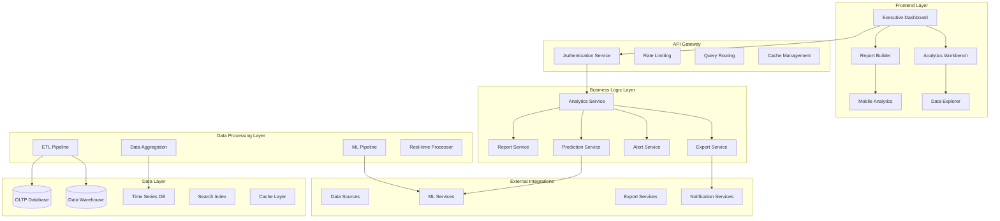
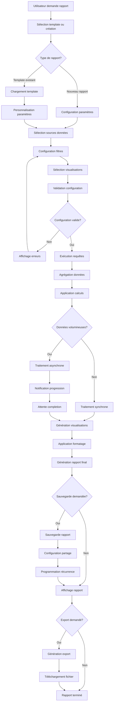
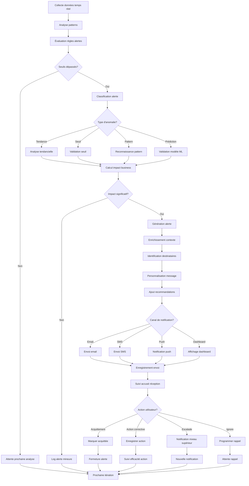
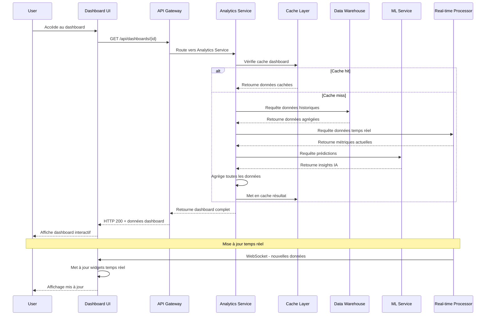
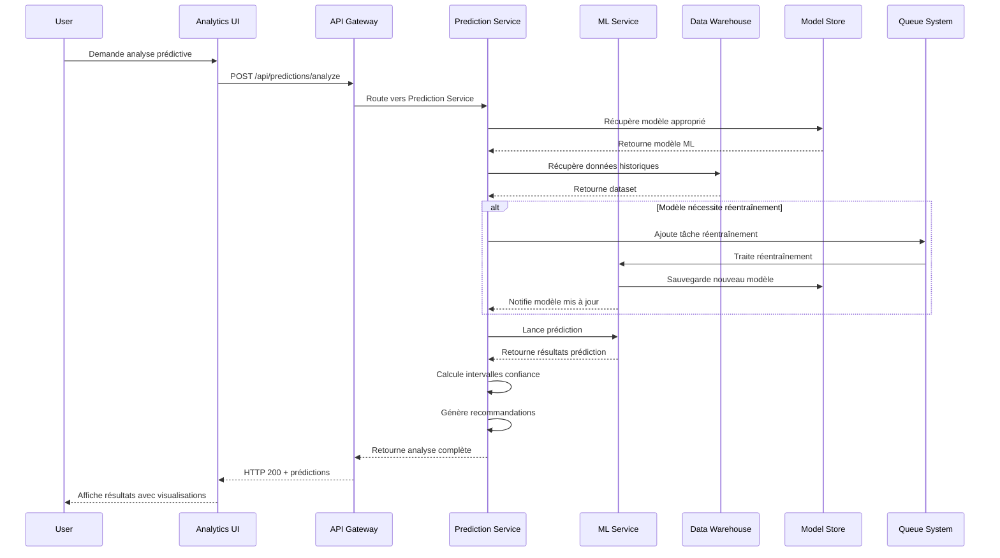

# Design Document - Business Intelligence

## Overview

Le système de Business Intelligence fournit des capacités d'analyse avancées avec tableaux de bord interactifs, rapports automatisés, prédictions IA, et recommandations stratégiques. L'architecture est conçue pour traiter de gros volumes de données en temps réel tout en offrant une interface intuitive pour tous les niveaux d'utilisateurs.

## Architecture

### Architecture Générale



### Diagramme de Flow - Génération de Rapport



### Diagramme de Flow - Système d'Alertes Intelligentes



### Diagrammes de Séquence

#### Séquence de Génération de Dashboard



#### Séquence d'Analyse Prédictive



## Components and Interfaces

### Services Backend

#### AnalyticsService
```typescript
interface AnalyticsService {
  getDashboard(dashboardId: string, filters?: DashboardFilters): Promise<Dashboard>
  executeQuery(query: AnalyticsQuery): Promise<QueryResult>
  getMetrics(metricIds: string[], period: DateRange): Promise<MetricData[]>
  createCustomMetric(metric: CustomMetricDefinition): Promise<CustomMetric>
  getInsights(datasetId: string, options: InsightOptions): Promise<Insight[])
  exportData(query: AnalyticsQuery, format: ExportFormat): Promise<ExportResult>
}
```

#### ReportService
```typescript
interface ReportService {
  createReport(report: CreateReportRequest): Promise<Report>
  generateReport(reportId: string, parameters?: ReportParameters): Promise<ReportResult>
  scheduleReport(reportId: string, schedule: ReportSchedule): Promise<void>
  getReportHistory(reportId: string): Promise<ReportExecution[]>
  shareReport(reportId: string, sharing: SharingOptions): Promise<ShareResult>
  exportReport(reportId: string, format: ExportFormat): Promise<Buffer>
}
```

#### PredictionService
```typescript
interface PredictionService {
  createPredictionModel(model: ModelDefinition): Promise<PredictionModel>
  trainModel(modelId: string, dataset: Dataset): Promise<TrainingResult>
  predict(modelId: string, input: PredictionInput): Promise<PredictionResult>
  getForecast(metricId: string, horizon: number): Promise<ForecastResult>
  getAnomalies(datasetId: string, sensitivity: number): Promise<Anomaly[]>
  getRecommendations(context: BusinessContext): Promise<Recommendation[]>
}
```

### Composants Frontend

#### ExecutiveDashboard
```typescript
interface ExecutiveDashboardProps {
  organizationId: string
  period: DateRange
  kpis: KPI[]
  onKPIClick: (kpi: KPI) => void
  onPeriodChange: (period: DateRange) => void
  realTimeEnabled: boolean
}
```

#### ReportBuilder
```typescript
interface ReportBuilderProps {
  dataSources: DataSource[]
  templates: ReportTemplate[]
  onSave: (report: ReportDefinition) => void
  onPreview: (report: ReportDefinition) => void
  onExport: (report: ReportDefinition, format: ExportFormat) => void
}
```

#### DataExplorer
```typescript
interface DataExplorerProps {
  datasets: Dataset[]
  onQueryExecute: (query: AnalyticsQuery) => void
  onVisualizationChange: (type: VisualizationType) => void
  onFilterApply: (filters: DataFilter[]) => void
  naturalLanguageEnabled: boolean
}
```

## Data Models

### Core Entities

```typescript
interface Dashboard {
  id: string
  organizationId: string
  
  // Basic Info
  name: string
  description?: string
  category: string
  
  // Layout
  layout: DashboardLayout
  widgets: Widget[]
  
  // Configuration
  refreshInterval: number // seconds
  autoRefresh: boolean
  
  // Access
  visibility: 'PRIVATE' | 'SHARED' | 'PUBLIC'
  permissions: DashboardPermission[]
  
  // Filters
  globalFilters: DashboardFilter[]
  
  // Metadata
  tags: string[]
  createdBy: string
  lastModifiedBy: string
  
  createdAt: Date
  updatedAt: Date
}

interface Widget {
  id: string
  type: WidgetType
  title: string
  position: WidgetPosition
  size: WidgetSize
  
  // Data Configuration
  dataSource: DataSourceConfig
  query: AnalyticsQuery
  
  // Visualization
  visualization: VisualizationConfig
  
  // Behavior
  drillDownEnabled: boolean
  exportEnabled: boolean
  
  // Refresh
  refreshInterval?: number
  lastRefresh?: Date
  
  // Alerts
  alerts: WidgetAlert[]
  
  createdAt: Date
  updatedAt: Date
}

interface Report {
  id: string
  organizationId: string
  
  // Basic Info
  name: string
  description?: string
  category: string
  
  // Definition
  template?: string
  sections: ReportSection[]
  
  // Data
  dataSources: DataSourceConfig[]
  parameters: ReportParameter[]
  
  // Scheduling
  schedule?: ReportSchedule
  
  // Distribution
  recipients: ReportRecipient[]
  deliveryMethod: DeliveryMethod[]
  
  // Status
  status: ReportStatus
  lastExecution?: Date
  nextExecution?: Date
  
  // Metadata
  tags: string[]
  createdBy: string
  
  createdAt: Date
  updatedAt: Date
}

interface PredictionModel {
  id: string
  organizationId: string
  
  // Basic Info
  name: string
  description?: string
  type: ModelType
  
  // Configuration
  algorithm: MLAlgorithm
  features: ModelFeature[]
  target: string
  
  // Training
  trainingData: DatasetReference
  hyperparameters: Record<string, any>
  
  // Performance
  metrics: ModelMetrics
  accuracy: number
  lastTrained: Date
  
  // Deployment
  status: ModelStatus
  version: string
  
  // Usage
  predictionCount: number
  lastUsed?: Date
  
  createdAt: Date
  updatedAt: Date
}

interface Alert {
  id: string
  organizationId: string
  
  // Basic Info
  name: string
  description?: string
  
  // Trigger
  condition: AlertCondition
  threshold: AlertThreshold
  
  // Notification
  recipients: AlertRecipient[]
  channels: NotificationChannel[]
  
  // Behavior
  frequency: AlertFrequency
  snoozeUntil?: Date
  
  // Status
  status: AlertStatus
  lastTriggered?: Date
  triggerCount: number
  
  // Metadata
  tags: string[]
  createdBy: string
  
  createdAt: Date
  updatedAt: Date
}
```

### Supporting Types

```typescript
interface AnalyticsQuery {
  dataSources: string[]
  dimensions: string[]
  metrics: string[]
  filters: QueryFilter[]
  groupBy?: string[]
  orderBy?: OrderBy[]
  limit?: number
  offset?: number
  dateRange?: DateRange
}

interface QueryFilter {
  field: string
  operator: FilterOperator
  value: any
  dataType: DataType
}

interface VisualizationConfig {
  type: VisualizationType
  options: VisualizationOptions
  colors?: ColorScheme
  axes?: AxisConfiguration
  legend?: LegendConfiguration
}

interface ModelFeature {
  name: string
  type: FeatureType
  importance?: number
  transformation?: FeatureTransformation
}

interface AlertCondition {
  metric: string
  operator: ComparisonOperator
  value: number
  aggregation?: AggregationType
  timeWindow?: number // minutes
}

interface Insight {
  id: string
  type: InsightType
  title: string
  description: string
  confidence: number
  impact: ImpactLevel
  recommendations: string[]
  data: any
  generatedAt: Date
}

interface Recommendation {
  id: string
  type: RecommendationType
  title: string
  description: string
  priority: Priority
  expectedImpact: string
  effort: EffortLevel
  actions: RecommendedAction[]
  confidence: number
}

enum WidgetType {
  METRIC = 'METRIC',
  CHART = 'CHART',
  TABLE = 'TABLE',
  MAP = 'MAP',
  GAUGE = 'GAUGE',
  SCORECARD = 'SCORECARD',
  TEXT = 'TEXT'
}

enum VisualizationType {
  LINE_CHART = 'LINE_CHART',
  BAR_CHART = 'BAR_CHART',
  PIE_CHART = 'PIE_CHART',
  SCATTER_PLOT = 'SCATTER_PLOT',
  HEATMAP = 'HEATMAP',
  FUNNEL = 'FUNNEL',
  WATERFALL = 'WATERFALL',
  TREEMAP = 'TREEMAP'
}

enum ModelType {
  REGRESSION = 'REGRESSION',
  CLASSIFICATION = 'CLASSIFICATION',
  CLUSTERING = 'CLUSTERING',
  TIME_SERIES = 'TIME_SERIES',
  ANOMALY_DETECTION = 'ANOMALY_DETECTION'
}

enum InsightType {
  TREND = 'TREND',
  ANOMALY = 'ANOMALY',
  CORRELATION = 'CORRELATION',
  FORECAST = 'FORECAST',
  OPPORTUNITY = 'OPPORTUNITY',
  RISK = 'RISK'
}

enum RecommendationType {
  OPTIMIZATION = 'OPTIMIZATION',
  COST_REDUCTION = 'COST_REDUCTION',
  REVENUE_INCREASE = 'REVENUE_INCREASE',
  RISK_MITIGATION = 'RISK_MITIGATION',
  PROCESS_IMPROVEMENT = 'PROCESS_IMPROVEMENT'
}
```

## Error Handling

### Stratégie de Gestion d'Erreurs

```typescript
enum BIErrorCode {
  QUERY_TIMEOUT = 'QUERY_TIMEOUT',
  INSUFFICIENT_DATA = 'INSUFFICIENT_DATA',
  MODEL_TRAINING_FAILED = 'MODEL_TRAINING_FAILED',
  PREDICTION_ERROR = 'PREDICTION_ERROR',
  EXPORT_FAILED = 'EXPORT_FAILED',
  DASHBOARD_LOAD_ERROR = 'DASHBOARD_LOAD_ERROR',
  ALERT_DELIVERY_FAILED = 'ALERT_DELIVERY_FAILED',
  DATA_SOURCE_UNAVAILABLE = 'DATA_SOURCE_UNAVAILABLE'
}

interface BIError {
  code: BIErrorCode
  message: string
  details?: any
  timestamp: Date
  queryId?: string
  dashboardId?: string
  modelId?: string
  recoverable: boolean
  retryAfter?: number
}
```

### Gestion des Cas d'Erreur

1. **Erreurs de Performance**
   - Timeout configurable par requête
   - Pagination automatique
   - Cache intelligent

2. **Erreurs de Données**
   - Validation des sources
   - Fallback sur données historiques
   - Interpolation intelligente

3. **Erreurs ML**
   - Retry avec modèles alternatifs
   - Dégradation gracieuse
   - Alertes de qualité

## Testing Strategy

### Tests Unitaires
- Logique d'agrégation
- Calculs de métriques
- Algorithmes ML

### Tests d'Intégration
- Pipelines ETL
- APIs de données
- Modèles ML

### Tests de Performance
- Requêtes complexes
- Dashboards temps réel
- Exports volumineux

### Tests de Qualité des Données
- Validation des sources
- Cohérence des métriques
- Précision des prédictions