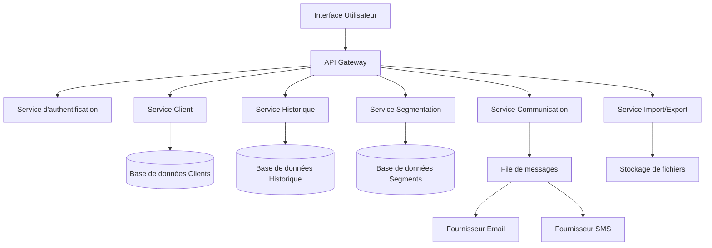

# Design Document - Gestion des clients

## Overview

Le système de gestion des clients est une fonctionnalité centrale qui permet aux organisations de gérer leur base de clients de manière complète et efficace. Il offre une interface unifiée pour la création, modification, recherche et segmentation des clients, tout en respectant les exigences RGPD et en fournissant des outils de communication intégrés.

Le système est conçu pour être flexible et adaptable aux différents secteurs d'activité grâce à des champs personnalisables et une architecture modulaire.

## Architecture

### Architecture générale



### Couches applicatives

1. **Couche Présentation** : Interface utilisateur React avec composants réutilisables
2. **Couche API** : Endpoints REST pour toutes les opérations CRUD et fonctionnalités avancées
3. **Couche Service** : Logique métier et orchestration des opérations
4. **Couche Données** : Persistance avec Firestore et stockage de fichiers avec Firebase Storage

## Components and Interfaces

### Service Client Principal

```typescript
interface ClientService {
  createClient(clientData: ClientCreateRequest): Promise<Client>
  updateClient(clientId: string, updates: ClientUpdateRequest): Promise<Client>
  deleteClient(clientId: string): Promise<void>
  getClient(clientId: string): Promise<Client>
  searchClients(criteria: SearchCriteria): Promise<ClientSearchResult>
  getClientHistory(clientId: string): Promise<InteractionHistory[]>
}
```

### Service de Segmentation

```typescript
interface SegmentationService {
  createSegment(segmentData: SegmentCreateRequest): Promise<Segment>
  updateSegment(segmentId: string, criteria: SegmentCriteria): Promise<Segment>
  getSegmentClients(segmentId: string): Promise<Client[]>
  previewSegment(criteria: SegmentCriteria): Promise<number>
}
```

### Service de Communication

```typescript
interface CommunicationService {
  sendMessage(clientId: string, message: MessageRequest): Promise<void>
  createTemplate(template: MessageTemplate): Promise<MessageTemplate>
  scheduleMessage(clientId: string, message: ScheduledMessage): Promise<void>
  getMessageHistory(clientId: string): Promise<MessageHistory[]>
}
```

### Service Import/Export

```typescript
interface ImportExportService {
  importClients(file: File, mapping: FieldMapping): Promise<ImportResult>
  exportClients(criteria: ExportCriteria, format: ExportFormat): Promise<string>
  scheduleExport(schedule: ExportSchedule): Promise<void>
  validateImportFile(file: File): Promise<ValidationResult>
}
```

## Data Models

### Modèle Client Principal

```typescript
interface Client {
  id: string
  organizationId: string
  personalInfo: {
    firstName: string
    lastName: string
    email: string
    phone?: string
    dateOfBirth?: Date
    address?: Address
  }
  preferences: {
    communicationChannels: CommunicationChannel[]
    language: string
    timezone: string
    marketingConsent: boolean
  }
  customFields: Record<string, any>
  tags: string[]
  status: ClientStatus
  createdAt: Date
  updatedAt: Date
  createdBy: string
  lastModifiedBy: string
}
```

### Modèle Historique des Interactions

```typescript
interface InteractionHistory {
  id: string
  clientId: string
  type: InteractionType
  description: string
  metadata: Record<string, any>
  createdAt: Date
  createdBy: string
  relatedEntities?: {
    appointmentId?: string
    orderId?: string
    campaignId?: string
  }
}
```

### Modèle de Segmentation

```typescript
interface Segment {
  id: string
  organizationId: string
  name: string
  description?: string
  criteria: SegmentCriteria
  isActive: boolean
  clientCount: number
  lastUpdated: Date
  createdBy: string
}

interface SegmentCriteria {
  conditions: SegmentCondition[]
  operator: 'AND' | 'OR'
}

interface SegmentCondition {
  field: string
  operator: ComparisonOperator
  value: any
  type: FieldType
}
```

### Modèle de Champs Personnalisés

```typescript
interface CustomField {
  id: string
  organizationId: string
  name: string
  label: string
  type: FieldType
  required: boolean
  validation?: ValidationRule[]
  options?: string[] // Pour les champs select/radio
  section: string
  order: number
  permissions: FieldPermissions
}
```

## Error Handling

### Stratégie de gestion d'erreurs

1. **Validation des données** : Validation côté client et serveur avec messages d'erreur explicites
2. **Gestion des conflits** : Détection des modifications concurrentes avec résolution manuelle
3. **Erreurs de communication** : Retry automatique avec backoff exponentiel
4. **Erreurs RGPD** : Logging spécial et notifications pour les violations potentielles

### Types d'erreurs spécifiques

```typescript
enum ClientErrorType {
  VALIDATION_ERROR = 'VALIDATION_ERROR',
  DUPLICATE_CLIENT = 'DUPLICATE_CLIENT',
  CLIENT_NOT_FOUND = 'CLIENT_NOT_FOUND',
  PERMISSION_DENIED = 'PERMISSION_DENIED',
  GDPR_VIOLATION = 'GDPR_VIOLATION',
  IMPORT_FORMAT_ERROR = 'IMPORT_FORMAT_ERROR',
  COMMUNICATION_FAILED = 'COMMUNICATION_FAILED'
}
```

## Testing Strategy

### Tests unitaires
- Services de gestion des clients avec mocks des dépendances
- Validation des modèles de données
- Logique de segmentation et filtrage
- Utilitaires d'import/export

### Tests d'intégration
- API endpoints avec base de données de test
- Intégration avec services de communication externes
- Workflows complets de création/modification de clients
- Processus d'import/export avec fichiers de test

### Tests end-to-end
- Parcours utilisateur complets depuis l'interface
- Scénarios de segmentation et campagnes marketing
- Gestion des préférences clients et RGPD
- Workflows d'administration des champs personnalisés

### Tests de performance
- Recherche sur de grandes bases de clients (>10k)
- Import de fichiers volumineux
- Calcul de segments en temps réel
- Envoi de messages en masse

## Décisions de conception et rationales

### 1. Architecture microservices modulaire
**Décision** : Séparer les fonctionnalités en services distincts (Client, Historique, Segmentation, Communication)
**Rationale** : Permet une évolutivité indépendante, une maintenance plus facile et une réutilisation des services

### 2. Champs personnalisés flexibles
**Décision** : Système de champs personnalisés avec validation configurable
**Rationale** : Répond au besoin d'adaptation aux différents secteurs d'activité sans modification du code

### 3. Historique complet des interactions
**Décision** : Enregistrement automatique de toutes les interactions avec métadonnées
**Rationale** : Permet un service client personnalisé et répond aux exigences de traçabilité

### 4. Segmentation en temps réel
**Décision** : Calcul dynamique des segments avec prévisualisation
**Rationale** : Améliore l'expérience utilisateur et permet des campagnes marketing plus réactives

### 5. Conformité RGPD intégrée
**Décision** : Gestion des consentements et droits clients intégrée dans le système
**Rationale** : Assure la conformité légale et évite les violations coûteuses

### 6. Communication multicanal centralisée
**Décision** : Intégration des communications email/SMS dans la plateforme
**Rationale** : Centralise les interactions et améliore le suivi client

### 7. Import/Export robuste
**Décision** : Validation avancée et mapping flexible pour les imports
**Rationale** : Facilite la migration depuis d'autres systèmes et réduit les erreurs de données