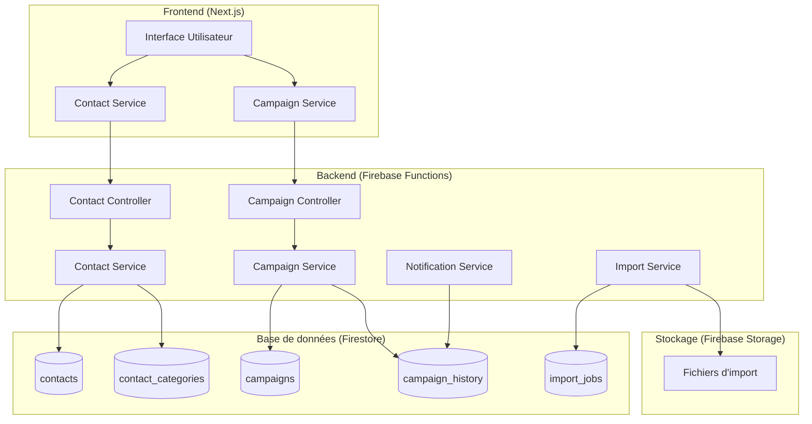

# Document de Conception - Gestion des Contacts

## Vue d'ensemble

Le système de gestion des contacts permet aux organisations de maintenir une base de données centralisée de contacts avec des attributs détaillés, d'importer des contacts en masse, et de cibler des communications lors de campagnes. Le système s'intègre dans l'architecture existante basée sur Firebase/Firestore et suit les patterns établis du projet.

## Architecture

### Architecture générale


### Intégration avec l'architecture existante
- Utilisation de la configuration Firestore existante (`database.ts`)
- Respect des patterns de contrôleurs existants (comme `event.controller.ts`)
- Intégration avec le système de notifications existant
- Utilisation du système d'authentification et de permissions en place

## Composants et Interfaces

### 1. Modèles de données

#### Contact
```typescript
interface Contact {
  id: string
  tenantId: string
  firstName: string
  lastName: string
  businessDomain: string
  gender: 'male' | 'female' | 'other' | 'not_specified'
  age: number
  category: string
  description?: string
  createdAt: Date
  updatedAt: Date
  createdBy: string
  isActive: boolean
  metadata: {
    source: 'manual' | 'import'
    importJobId?: string
    lastCampaignDate?: Date
    campaignCount: number
  }
}
```

#### ContactCategory
```typescript
interface ContactCategory {
  id: string
  tenantId: string
  name: string
  description?: string
  color?: string
  isDefault: boolean
  createdAt: Date
  createdBy: string
}
```

#### Campaign (Unifié pour tous les canaux)
```typescript
// Type de canal de communication
enum CampaignChannel {
  EMAIL = 'email',
  SMS = 'sms',
  PUSH = 'push',
  IN_APP = 'in_app'
}

// Statut de campagne (aligné avec EmailCampaign existant)
enum CampaignStatus {
  DRAFT = 'draft',
  SCHEDULED = 'scheduled',
  SENDING = 'sending',
  SENT = 'sent',
  PAUSED = 'paused',
  CANCELLED = 'cancelled',
  FAILED = 'failed'
}

// Interface de base pour toutes les campagnes
interface BaseCampaign {
  id: string
  tenantId: string
  name: string
  description?: string
  channel: CampaignChannel
  status: CampaignStatus
  
  // Ciblage des contacts
  targetFilters: ContactFilter[]
  targetContactIds?: string[] // IDs spécifiques si pas de filtres
  
  // Planification
  scheduledAt?: Date
  createdAt: Date
  updatedAt: Date
  createdBy: string
  lastModifiedBy?: string
  
  // Statistiques communes
  stats: CampaignStats
  
  // Métadonnées
  tags?: string[]
  notes?: string
}

// Statistiques de campagne
interface CampaignStats {
  totalTargeted: number
  totalSent: number
  totalDelivered: number
  totalFailed: number
  totalOpened?: number // Pour email/push
  totalClicked?: number // Pour email/push avec liens
  totalBounced?: number
  totalUnsubscribed?: number
  
  // Taux calculés
  deliveryRate: number
  openRate?: number
  clickRate?: number
  bounceRate?: number
  unsubscribeRate?: number
  engagementScore: number
}

// Campagne Email (étend BaseCampaign)
interface EmailCampaign extends BaseCampaign {
  channel: CampaignChannel.EMAIL
  emailContent: {
    subject: string
    htmlContent?: string
    textContent?: string
    templateId?: string
    templateData?: Record<string, any>
    attachments?: EmailAttachment[]
  }
  providerConfig?: {
    preferredProvider?: string
    fallbackProviders?: string[]
  }
}

// Campagne SMS (nouvelle)
interface SMSCampaign extends BaseCampaign {
  channel: CampaignChannel.SMS
  smsContent: {
    message: string
    templateId?: string
    templateData?: Record<string, any>
    sender?: string // Nom ou numéro de l'expéditeur
  }
  providerConfig?: {
    preferredProvider?: string
    fallbackProviders?: string[]
  }
}

// Campagne Push (nouvelle)
interface PushCampaign extends BaseCampaign {
  channel: CampaignChannel.PUSH
  pushContent: {
    title: string
    body: string
    icon?: string
    image?: string
    data?: Record<string, any>
    actions?: PushAction[]
  }
}

// Union type pour toutes les campagnes
type Campaign = EmailCampaign | SMSCampaign | PushCampaign
```

#### ContactFilter
```typescript
interface ContactFilter {
  field: 'firstName' | 'lastName' | 'businessDomain' | 'gender' | 'age' | 'category'
  operator: 'equals' | 'contains' | 'startsWith' | 'endsWith' | 'greaterThan' | 'lessThan' | 'between' | 'in'
  value: string | number | string[] | { min: number, max: number }
  logicalOperator?: 'AND' | 'OR'
}
```

### 2. Services

#### ContactService
```typescript
class ContactService {
  async createContact(contactData: CreateContactRequest, createdBy: string): Promise<Contact>
  async updateContact(id: string, updates: UpdateContactRequest, updatedBy: string): Promise<Contact>
  async deleteContact(id: string, deletedBy: string): Promise<void>
  async getContact(id: string, tenantId: string): Promise<Contact>
  async searchContacts(filters: ContactSearchFilters, tenantId: string): Promise<PaginatedResult<Contact>>
  async bulkCreateContacts(contacts: CreateContactRequest[], createdBy: string): Promise<BulkOperationResult>
  async exportContacts(filters: ContactSearchFilters, format: 'csv' | 'excel', tenantId: string): Promise<ExportResult>
}
```

#### ImportService
```typescript
class ImportService {
  async processImportFile(file: File, tenantId: string, userId: string): Promise<ImportJob>
  async getImportStatus(jobId: string): Promise<ImportJob>
  async validateImportData(data: any[]): Promise<ValidationResult>
  async previewImport(file: File): Promise<ImportPreview>
}
```

#### UnifiedCampaignService (Intégration avec le système existant)
```typescript
// Service principal qui orchestre tous les types de campagnes
class UnifiedCampaignService {
  // Intégration avec le système EmailCampaign existant
  private emailCampaignService: ExistingEmailCampaignService
  private smsCampaignService: SMSCampaignService
  private pushCampaignService: PushCampaignService
  
  // Conversion entre systèmes de contacts et campagnes existantes
  async convertContactFiltersToRecipientCriteria(filters: ContactFilter[]): Promise<RecipientCriteria>
  async convertContactsToEmailRecipients(contacts: Contact[]): Promise<EmailRecipient[]>
  
  // Ciblage unifié des contacts
  async getTargetedContacts(filters: ContactFilter[], tenantId: string): Promise<Contact[]>
  async previewTargetedContacts(filters: ContactFilter[], tenantId: string): Promise<ContactPreview>
  
  // Création de campagnes par canal
  async createEmailCampaign(campaignData: CreateEmailCampaignFromContactsRequest, createdBy: string): Promise<EmailCampaign>
  async createSMSCampaign(campaignData: CreateSMSCampaignRequest, createdBy: string): Promise<SMSCampaign>
  async createPushCampaign(campaignData: CreatePushCampaignRequest, createdBy: string): Promise<PushCampaign>
  
  // Historique unifié
  async getCampaignHistory(contactId: string): Promise<UnifiedCampaignHistory[]>
  async getCampaignsByContact(contactId: string): Promise<Campaign[]>
  async getContactEngagementStats(contactId: string): Promise<ContactEngagementStats>
}

// Extension du service EmailCampaign existant pour intégration avec les contacts
class ContactAwareEmailCampaignService {
  private existingEmailService: ExistingEmailCampaignService
  private contactService: ContactService
  
  // Méthodes qui étendent le système existant
  async createCampaignFromContacts(
    contactFilters: ContactFilter[], 
    campaignData: CreateCampaignRequest, 
    createdBy: string
  ): Promise<EmailCampaign>
  
  async syncCampaignHistoryToContacts(campaignId: string): Promise<void>
  async updateContactEngagementFromCampaign(campaignId: string): Promise<void>
}

// Nouveaux services pour SMS et Push (suivent le pattern EmailCampaign)
class SMSCampaignService {
  // Structure similaire à EmailCampaignService existant
  async createSMSCampaign(campaignData: CreateSMSCampaignRequest, createdBy: string): Promise<SMSCampaign>
  async sendSMSCampaign(campaignId: string): Promise<SMSCampaignExecution>
  async getSMSCampaignAnalytics(campaignId: string): Promise<SMSCampaignAnalytics>
  async handleSMSDeliveryStatus(deliveryId: string, status: SMSDeliveryStatus): Promise<void>
  
  // Méthodes spécifiques SMS
  async validatePhoneNumbers(phoneNumbers: string[]): Promise<ValidationResult[]>
  async handleSMSReply(phoneNumber: string, message: string): Promise<void>
  async sendTestSMS(campaignId: string, testRecipients: string[]): Promise<void>
}

class PushCampaignService {
  // Structure similaire à EmailCampaignService existant
  async createPushCampaign(campaignData: CreatePushCampaignRequest, createdBy: string): Promise<PushCampaign>
  async sendPushCampaign(campaignId: string): Promise<PushCampaignExecution>
  async getPushCampaignAnalytics(campaignId: string): Promise<PushCampaignAnalytics>
  async handlePushDeliveryStatus(deliveryId: string, status: PushDeliveryStatus): Promise<void>
  
  // Méthodes spécifiques Push
  async validateDeviceTokens(tokens: string[]): Promise<ValidationResult[]>
  async handlePushInteraction(deviceId: string, action: string): Promise<void>
  async sendTestPush(campaignId: string, testDevices: string[]): Promise<void>
}
```

### 3. Contrôleurs API

#### ContactController
- `POST /contacts` - Créer un contact
- `GET /contacts` - Lister les contacts avec filtres
- `GET /contacts/:id` - Obtenir un contact
- `PUT /contacts/:id` - Mettre à jour un contact
- `DELETE /contacts/:id` - Supprimer un contact
- `POST /contacts/import` - Importer des contacts
- `GET /contacts/export` - Exporter des contacts
- `POST /contacts/bulk` - Opérations en masse

#### CampaignController
- `POST /campaigns` - Créer une campagne
- `GET /campaigns` - Lister les campagnes
- `POST /campaigns/:id/execute` - Exécuter une campagne
- `GET /campaigns/:id/preview` - Prévisualiser les contacts ciblés
- `GET /contacts/:id/campaigns` - Historique des campagnes d'un contact

## Modèles de données

### Structure Firestore

#### Collection `contacts`
```json
{
  "id": "contact_123",
  "tenantId": "tenant_456",
  "firstName": "Jean",
  "lastName": "Dupont",
  "businessDomain": "Technologie",
  "gender": "male",
  "age": 35,
  "category": "client_premium",
  "description": "Directeur technique chez TechCorp",
  "createdAt": "2024-01-15T10:00:00Z",
  "updatedAt": "2024-01-15T10:00:00Z",
  "createdBy": "user_789",
  "isActive": true,
  "metadata": {
    "source": "manual",
    "campaignCount": 3,
    "lastCampaignDate": "2024-01-10T14:30:00Z"
  }
}
```

#### Collection `contact_categories`
```json
{
  "id": "category_123",
  "tenantId": "tenant_456",
  "name": "Client Premium",
  "description": "Clients avec abonnement premium",
  "color": "#4F46E5",
  "isDefault": false,
  "createdAt": "2024-01-01T00:00:00Z",
  "createdBy": "user_789"
}
```

#### Collection `campaigns` (Unifiée pour tous les canaux)
```json
{
  "id": "campaign_123",
  "tenantId": "tenant_456",
  "name": "Promotion Janvier 2024",
  "description": "Campagne promotionnelle pour les clients premium",
  "channel": "email",
  "status": "sent",
  "targetFilters": [
    {
      "field": "category",
      "operator": "equals",
      "value": "client_premium"
    },
    {
      "field": "age",
      "operator": "between",
      "value": { "min": 25, "max": 45 },
      "logicalOperator": "AND"
    }
  ],
  "emailContent": {
    "subject": "Offre spéciale janvier",
    "htmlContent": "<html>...</html>",
    "textContent": "Découvrez nos nouvelles fonctionnalités...",
    "templateId": "template_456"
  },
  "scheduledAt": "2024-01-15T10:00:00Z",
  "createdAt": "2024-01-15T09:00:00Z",
  "updatedAt": "2024-01-15T11:30:00Z",
  "createdBy": "user_789",
  "stats": {
    "totalTargeted": 150,
    "totalSent": 148,
    "totalDelivered": 145,
    "totalOpened": 89,
    "totalClicked": 23,
    "totalFailed": 2,
    "deliveryRate": 97.3,
    "openRate": 61.4,
    "clickRate": 25.8,
    "engagementScore": 78.5
  },
  "tags": ["promotion", "premium"],
  "notes": "Campagne de lancement des nouvelles fonctionnalités"
}
```

#### Collection `sms_campaigns` (Nouvelle)
```json
{
  "id": "sms_campaign_123",
  "tenantId": "tenant_456",
  "name": "Rappel Événement",
  "channel": "sms",
  "status": "sent",
  "targetFilters": [
    {
      "field": "category",
      "operator": "equals",
      "value": "participant_event"
    }
  ],
  "smsContent": {
    "message": "Rappel: Votre événement commence dans 1h. Lieu: {{event.location}}",
    "templateId": "sms_template_123",
    "templateData": {
      "event": {
        "location": "Salle de conférence A"
      }
    },
    "sender": "EventApp"
  },
  "createdAt": "2024-01-15T09:00:00Z",
  "createdBy": "user_789",
  "stats": {
    "totalTargeted": 50,
    "totalSent": 48,
    "totalDelivered": 47,
    "totalFailed": 2,
    "deliveryRate": 97.9,
    "engagementScore": 85.2
  }
}
```

#### Collection `push_campaigns` (Nouvelle)
```json
{
  "id": "push_campaign_123",
  "tenantId": "tenant_456",
  "name": "Notification Urgente",
  "channel": "push",
  "status": "sent",
  "targetFilters": [
    {
      "field": "category",
      "operator": "in",
      "value": ["employee", "manager"]
    }
  ],
  "pushContent": {
    "title": "Réunion d'urgence",
    "body": "Réunion d'équipe dans 15 minutes en salle de conférence",
    "icon": "/icons/meeting.png",
    "data": {
      "meetingId": "meeting_456",
      "location": "Salle A"
    },
    "actions": [
      {
        "action": "accept",
        "title": "J'y serai"
      },
      {
        "action": "decline", 
        "title": "Indisponible"
      }
    ]
  },
  "createdAt": "2024-01-15T14:45:00Z",
  "createdBy": "user_789",
  "stats": {
    "totalTargeted": 25,
    "totalSent": 25,
    "totalDelivered": 24,
    "totalOpened": 22,
    "totalClicked": 18,
    "totalFailed": 1,
    "deliveryRate": 96.0,
    "openRate": 91.7,
    "clickRate": 81.8,
    "engagementScore": 92.3
  }
}
```

### Index Firestore requis
```javascript
// Index composites pour les requêtes de contacts
contacts: [
  { tenantId: 'asc', isActive: 'asc', createdAt: 'desc' },
  { tenantId: 'asc', category: 'asc', createdAt: 'desc' },
  { tenantId: 'asc', businessDomain: 'asc', createdAt: 'desc' },
  { tenantId: 'asc', gender: 'asc', age: 'asc' }
]

// Index pour les campagnes
campaigns: [
  { tenantId: 'asc', status: 'asc', createdAt: 'desc' },
  { tenantId: 'asc', createdBy: 'asc', createdAt: 'desc' }
]
```

## Correctness Properties

*Une propriété est une caractéristique ou un comportement qui doit être vrai dans toutes les exécutions valides d'un système - essentiellement, une déclaration formelle sur ce que le système doit faire. Les propriétés servent de pont entre les spécifications lisibles par l'homme et les garanties de correction vérifiables par machine.*

### Propriétés de Correction

Basées sur l'analyse des critères d'acceptation, voici les propriétés universelles que le système doit respecter :

**Propriété 1: Création de contact avec champs obligatoires**
*Pour tout* ensemble de données de contact valides, la création d'un contact doit résulter en un contact stocké contenant tous les champs obligatoires (nom, prénom, identifiant unique)
**Valide: Exigences 1.1, 1.3**

**Propriété 2: Validation des champs obligatoires**
*Pour toute* chaîne vide ou composée uniquement d'espaces utilisée comme nom ou prénom, le système doit rejeter la création du contact
**Valide: Exigences 1.2**

**Propriété 3: Unicité des identifiants**
*Pour tout* ensemble de contacts créés, chaque contact doit avoir un identifiant unique différent de tous les autres
**Valide: Exigences 1.3**

**Propriété 4: Rejet des données invalides**
*Pour toute* donnée de contact invalide (âge négatif, sexe non reconnu, etc.), le système doit rejeter la création et retourner des erreurs de validation spécifiques
**Valide: Exigences 1.4, 3.2, 3.3**

**Propriété 5: Validation des formats de fichier d'import**
*Pour tout* fichier téléchargé, seuls les fichiers avec des formats valides (CSV, Excel) doivent être acceptés pour traitement
**Valide: Exigences 2.1**

**Propriété 6: Import de données valides**
*Pour tout* fichier d'import contenant uniquement des données valides, tous les contacts doivent être créés avec succès
**Valide: Exigences 2.2**

**Propriété 7: Gestion partielle des erreurs d'import**
*Pour tout* fichier d'import contenant un mélange de données valides et invalides, les contacts valides doivent être créés et les erreurs rapportées sans interrompre le processus
**Valide: Exigences 2.3**

**Propriété 8: Exactitude du rapport d'import**
*Pour tout* processus d'import terminé, le rapport doit refléter exactement le nombre de contacts créés avec succès et le nombre d'erreurs rencontrées
**Valide: Exigences 2.4**

**Propriété 9: Stockage complet des attributs**
*Pour tout* contact créé avec des attributs spécifiés, tous les attributs fournis (nom, prénom, domaine, sexe, âge, catégorie, description) doivent être stockés et récupérables
**Valide: Exigences 3.1**

**Propriété 10: Validation de l'âge**
*Pour toute* valeur d'âge fournie, seules les valeurs numériques positives inférieures à 150 doivent être acceptées
**Valide: Exigences 3.2**

**Propriété 11: Validation des valeurs énumérées**
*Pour toute* valeur de sexe fournie, seules les valeurs prédéfinies ('male', 'female', 'other', 'not_specified') doivent être acceptées
**Valide: Exigences 3.3**

**Propriété 12: Acceptation des champs optionnels vides**
*Pour tout* contact créé avec des champs optionnels (description) vides ou non fournis, la création doit réussir
**Valide: Exigences 3.5**

**Propriété 13: Filtrage par attributs**
*Pour tout* ensemble de contacts et tout critère de filtrage (nom, prénom, domaine, sexe, âge, catégorie), seuls les contacts correspondant exactement au critère doivent être retournés
**Valide: Exigences 4.1**

**Propriété 14: Combinaison logique des filtres**
*Pour tout* ensemble de filtres avec des opérateurs logiques (ET/OU), les résultats doivent respecter la logique booléenne spécifiée
**Valide: Exigences 4.2**

**Propriété 15: Exactitude du comptage de contacts**
*Pour tout* ensemble de filtres appliqués, le nombre de contacts dans l'aperçu doit correspondre exactement au nombre de contacts qui seraient effectivement ciblés
**Valide: Exigences 4.3**

**Propriété 16: Enregistrement de l'historique des communications**
*Pour toute* notification envoyée à un contact, un enregistrement doit être créé dans l'historique des communications de ce contact
**Valide: Exigences 4.4**

**Propriété 17: Recherche par attributs**
*Pour tout* contact existant et toute recherche par nom, prénom ou autres attributs, le contact doit être trouvé si la recherche correspond à ses attributs
**Valide: Exigences 5.1**

**Propriété 18: Modification complète des attributs**
*Pour tout* contact existant, tous ses attributs modifiables doivent pouvoir être mis à jour et les changements doivent être persistés
**Valide: Exigences 5.2**

**Propriété 19: Cohérence de la validation**
*Pour toute* modification de contact, les mêmes règles de validation que lors de la création doivent être appliquées
**Valide: Exigences 5.3**

**Propriété 20: Archivage lors de la suppression**
*Pour tout* contact supprimé, les données doivent être archivées (marquées comme inactives) plutôt que supprimées définitivement
**Valide: Exigences 5.4**

**Propriété 21: Complétude de l'historique**
*Pour tout* contact, l'historique affiché doit contenir toutes les campagnes auxquelles le contact a participé
**Valide: Exigences 5.5**

**Propriété 22: Contrôle d'accès**
*Pour tout* utilisateur tentant d'accéder aux contacts, l'accès ne doit être accordé que si l'utilisateur a les permissions appropriées pour le tenant
**Valide: Exigences 6.2**

**Propriété 23: Audit des exports**
*Pour toute* opération d'export de contacts, un enregistrement d'audit doit être créé avec les détails de l'opération
**Valide: Exigences 6.3**

**Propriété 24: Anonymisation complète**
*Pour toute* demande d'anonymisation d'un contact, toutes les données personnelles identifiables doivent être supprimées ou remplacées par des valeurs anonymes
**Valide: Exigences 6.4**

## Gestion des erreurs

### Stratégies de gestion d'erreurs

1. **Validation des entrées**
   - Validation côté client et serveur
   - Messages d'erreur spécifiques et localisés
   - Validation en temps réel pour l'expérience utilisateur

2. **Gestion des imports**
   - Validation du format de fichier avant traitement
   - Traitement par lots avec gestion des erreurs partielles
   - Rapports détaillés des succès et échecs

3. **Gestion des campagnes**
   - Retry automatique pour les échecs temporaires
   - Quarantaine des contacts en erreur
   - Logs détaillés pour le debugging

4. **Gestion des accès**
   - Vérification des permissions à chaque opération
   - Logs de sécurité pour les tentatives non autorisées
   - Rate limiting pour prévenir les abus

### Codes d'erreur standardisés

```typescript
enum ContactErrorCodes {
  INVALID_CONTACT_DATA = 'CONTACT_001',
  DUPLICATE_CONTACT = 'CONTACT_002',
  CONTACT_NOT_FOUND = 'CONTACT_003',
  INVALID_FILE_FORMAT = 'IMPORT_001',
  IMPORT_PROCESSING_ERROR = 'IMPORT_002',
  CAMPAIGN_EXECUTION_ERROR = 'CAMPAIGN_001',
  INSUFFICIENT_PERMISSIONS = 'AUTH_001',
  RATE_LIMIT_EXCEEDED = 'RATE_001'
}
```

## Stratégie de test

### Approche de test double

Le système utilisera une approche de test complémentaire combinant tests unitaires et tests basés sur les propriétés :

#### Tests unitaires
- Tests d'exemples spécifiques et de cas limites
- Tests d'intégration entre composants
- Tests de validation des formats de données
- Tests des points d'intégration avec les services externes

#### Tests basés sur les propriétés (Property-Based Testing)
- **Bibliothèque utilisée** : fast-check pour TypeScript/JavaScript
- **Configuration** : Minimum 100 itérations par test de propriété
- **Format des commentaires** : Chaque test de propriété doit être tagué avec le format exact : `**Feature: contact-management, Property {number}: {property_text}**`
- **Correspondance** : Chaque propriété de correction doit être implémentée par UN SEUL test basé sur les propriétés

#### Générateurs de données pour les tests
```typescript
// Générateur de contacts valides
const validContactGenerator = fc.record({
  firstName: fc.string({ minLength: 1, maxLength: 50 }),
  lastName: fc.string({ minLength: 1, maxLength: 50 }),
  businessDomain: fc.string({ minLength: 1, maxLength: 100 }),
  gender: fc.constantFrom('male', 'female', 'other', 'not_specified'),
  age: fc.integer({ min: 1, max: 149 }),
  category: fc.string({ minLength: 1, maxLength: 50 }),
  description: fc.option(fc.string({ maxLength: 500 }))
})

// Générateur de filtres de contacts
const contactFilterGenerator = fc.record({
  field: fc.constantFrom('firstName', 'lastName', 'businessDomain', 'gender', 'age', 'category'),
  operator: fc.constantFrom('equals', 'contains', 'startsWith', 'endsWith', 'greaterThan', 'lessThan'),
  value: fc.oneof(fc.string(), fc.integer(), fc.array(fc.string()))
})
```

#### Couverture de test
- Tests unitaires : Cas spécifiques, intégrations, erreurs connues
- Tests de propriétés : Validation universelle des règles métier
- Tests d'intégration : Flux complets utilisateur
- Tests de performance : Import de gros volumes, requêtes complexes

Les tests de propriétés se concentrent sur la logique métier principale à travers de nombreuses entrées générées, tandis que les tests unitaires capturent des bugs spécifiques et valident des comportements précis.