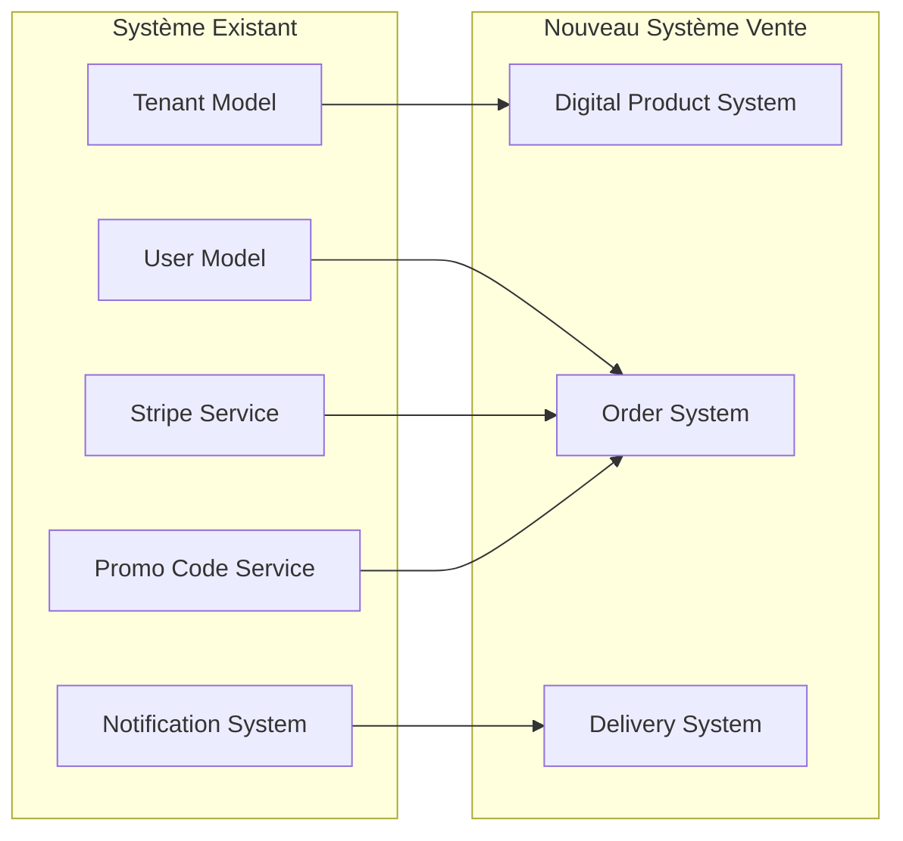

# Design Document - Système de Vente de Produits Numériques

## Overview

Ce document présente la conception technique pour créer un système complet de vente de produits numériques dans le backend existant. L'architecture proposée s'intègre parfaitement avec l'infrastructure Stripe existante et les modèles de données actuels, tout en ajoutant les fonctionnalités nécessaires pour la vente, le stockage sécurisé et la livraison automatique de contenus numériques.

## Architecture

### Architecture Globale du Système de Vente

```mermaid
graph TB
    subgraph "APIs Frontend"
        ProductAPI[Products API]
        OrderAPI[Orders API]
        DownloadAPI[Download API]
        AnalyticsAPI[Analytics API]
    end
    
    subgraph "Services Métier"
        ProductService[Product Service]
        OrderService[Order Service]
        PaymentService[Payment Service - Stripe]
        DeliveryService[Digital Delivery Service]
        LicenseService[License Service]
        AnalyticsService[Analytics Service]
    end
    
    subgraph "Modèles de Données"
        ProductModel[Digital Product Model]
        OrderModel[Order Model]
        LicenseModel[License Model]
        DownloadModel[Download Model]
        CategoryModel[Category Model]
    end
    
    subgraph "Stockage et Sécurité"
        FirebaseStorage[Firebase Storage]
        URLSigner[URL Signer Service]
        AccessControl[Access Control Service]
        FileValidator[File Validator]
    end
    
    subgraph "Intégrations Externes"
        StripePayment[Stripe Payment]
        EmailService[Email Service]
        NotificationService[Notification Service]
    end
    
    ProductAPI --> ProductService
    OrderAPI --> OrderService
    DownloadAPI --> DeliveryService
    AnalyticsAPI --> AnalyticsService
    
    ProductService --> ProductModel
    OrderService --> OrderModel
    OrderService --> PaymentService
    DeliveryService --> LicenseModel
    DeliveryService --> DownloadModel
    
    ProductService --> FirebaseStorage
    DeliveryService --> URLSigner
    DeliveryService --> AccessControl
    ProductService --> FileValidator
    
    PaymentService --> StripePayment
    DeliveryService --> EmailService
    OrderService --> NotificationService
```



### Intégration avec l'Architecture Existante



## Components and Interfaces

### 1. Modèles de Données

#### DigitalProduct Model

```typescript
interface DigitalProduct {
  id: string;
  tenantId: string;
  sellerId: string; // ID du vendeur (user)
  title: string;
  description: string;
  shortDescription?: string;
  price: number; // en centimes
  currency: string;
  categoryId?: string;
  tags: string[];
  status: ProductStatus;
  files: ProductFile[];
  metadata: ProductMetadata;
  seo: SEOData;
  sales: SalesData;
  createdAt: Date;
  updatedAt: Date;
  publishedAt?: Date;
}

enum ProductStatus {
  DRAFT = 'draft',
  PUBLISHED = 'published',
  ARCHIVED = 'archived',
  SUSPENDED = 'suspended'
}

interface ProductFile {
  id: string;
  filename: string;
  originalName: string;
  mimeType: string;
  size: number;
  storagePath: string;
  downloadCount: number;
  checksum: string;
  uploadedAt: Date;
}

interface ProductMetadata {
  downloadLimit?: number;
  accessDuration?: number; // en jours
  licenseType: LicenseType;
  allowedDownloads: number;
  fileFormats: string[];
  totalSize: number;
}

interface SEOData {
  slug: string;
  metaTitle?: string;
  metaDescription?: string;
  keywords: string[];
}

interface SalesData {
  totalSales: number;
  totalRevenue: number;
  averageRating?: number;
  reviewCount: number;
  lastSaleAt?: Date;
}

enum LicenseType {
  PERSONAL = 'personal',
  COMMERCIAL = 'commercial',
  EXTENDED = 'extended',
  CUSTOM = 'custom'
}
```

#### Order Model

```typescript
interface Order {
  id: string;
  tenantId: string;
  buyerId: string;
  sellerIds: string[]; // Peut avoir plusieurs vendeurs
  orderNumber: string;
  status: OrderStatus;
  items: OrderItem[];
  totals: OrderTotals;
  payment: PaymentInfo;
  delivery: DeliveryInfo;
  promoCode?: string;
  customerInfo: CustomerInfo;
  createdAt: Date;
  updatedAt: Date;
  completedAt?: Date;
}

enum OrderStatus {
  PENDING = 'pending',
  PROCESSING = 'processing',
  PAID = 'paid',
  DELIVERED = 'delivered',
  FAILED = 'failed',
  REFUNDED = 'refunded',
  CANCELLED = 'cancelled'
}

interface OrderItem {
  productId: string;
  productTitle: string;
  quantity: number;
  unitPrice: number;
  totalPrice: number;
  licenseType: LicenseType;
  sellerId: string;
}

interface OrderTotals {
  subtotal: number;
  discount: number;
  tax: number;
  total: number;
  currency: string;
}

interface PaymentInfo {
  stripePaymentIntentId?: string;
  stripeChargeId?: string;
  paymentMethod: string;
  paidAt?: Date;
  refundedAt?: Date;
  refundAmount?: number;
}

interface DeliveryInfo {
  deliveredAt?: Date;
  downloadLinks: DownloadLink[];
  expiresAt?: Date;
  accessGranted: boolean;
}

interface DownloadLink {
  productId: string;
  fileId: string;
  url: string;
  expiresAt: Date;
  downloadCount: number;
}

interface CustomerInfo {
  email: string;
  firstName?: string;
  lastName?: string;
  company?: string;
  country?: string;
}
```

#### License Model

```typescript
interface License {
  id: string;
  tenantId: string;
  orderId: string;
  productId: string;
  buyerId: string;
  licenseKey: string;
  licenseType: LicenseType;
  status: LicenseStatus;
  permissions: LicensePermissions;
  usage: LicenseUsage;
  validFrom: Date;
  validUntil?: Date;
  createdAt: Date;
  updatedAt: Date;
  activatedAt?: Date;
  revokedAt?: Date;
}

enum LicenseStatus {
  ACTIVE = 'active',
  EXPIRED = 'expired',
  REVOKED = 'revoked',
  SUSPENDED = 'suspended'
}

interface LicensePermissions {
  canDownload: boolean;
  canShare: boolean;
  canModify: boolean;
  canResell: boolean;
  maxDownloads: number;
  maxDevices?: number;
}

interface LicenseUsage {
  downloadCount: number;
  lastDownloadAt?: Date;
  deviceIds: string[];
  ipAddresses: string[];
}
```

#### Download Model

```typescript
interface Download {
  id: string;
  tenantId: string;
  licenseId: string;
  productId: string;
  fileId: string;
  buyerId: string;
  downloadUrl: string;
  ipAddress: string;
  userAgent: string;
  deviceFingerprint?: string;
  downloadedAt: Date;
  fileSize: number;
  success: boolean;
  errorMessage?: string;
}
```

#### Category Model

```typescript
interface Category {
  id: string;
  tenantId: string;
  name: string;
  slug: string;
  description?: string;
  parentId?: string;
  level: number;
  path: string;
  productCount: number;
  isActive: boolean;
  sortOrder: number;
  createdAt: Date;
  updatedAt: Date;
}
```

### 2. Services Métier

#### ProductService

```typescript
class ProductService {
  // Gestion des produits
  async createProduct(sellerId: string, productData: CreateProductInput): Promise<DigitalProduct>
  async updateProduct(productId: string, updates: UpdateProductInput): Promise<DigitalProduct>
  async getProductById(productId: string): Promise<DigitalProduct | null>
  async listProducts(filters: ProductFilters): Promise<PaginatedResponse<DigitalProduct>>
  async publishProduct(productId: string): Promise<DigitalProduct>
  async archiveProduct(productId: string): Promise<DigitalProduct>
  
  // Gestion des fichiers
  async uploadProductFile(productId: string, file: FileUpload): Promise<ProductFile>
  async deleteProductFile(productId: string, fileId: string): Promise<void>
  async validateFile(file: FileUpload): Promise<FileValidationResult>
  
  // Recherche et filtrage
  async searchProducts(query: string, filters?: ProductFilters): Promise<PaginatedResponse<DigitalProduct>>
  async getProductsByCategory(categoryId: string): Promise<DigitalProduct[]>
  async getSellerProducts(sellerId: string): Promise<DigitalProduct[]>
  
  // Analytics
  async getProductAnalytics(productId: string, period?: DateRange): Promise<ProductAnalytics>
  async updateSalesData(productId: string, saleAmount: number): Promise<void>
}
```

#### OrderService

```typescript
class OrderService {
  // Gestion des commandes
  async createOrder(buyerId: string, items: OrderItemInput[]): Promise<Order>
  async updateOrderStatus(orderId: string, status: OrderStatus): Promise<Order>
  async getOrderById(orderId: string): Promise<Order | null>
  async getUserOrders(userId: string): Promise<Order[]>
  async getSellerOrders(sellerId: string): Promise<Order[]>
  
  // Processus de paiement
  async processPayment(orderId: string, paymentMethodId: string): Promise<PaymentResult>
  async handlePaymentSuccess(orderId: string, paymentIntentId: string): Promise<Order>
  async handlePaymentFailure(orderId: string, error: string): Promise<Order>
  async processRefund(orderId: string, amount?: number): Promise<RefundResult>
  
  // Codes promo
  async applyPromoCode(orderId: string, promoCode: string): Promise<Order>
  async removePromoCode(orderId: string): Promise<Order>
  
  // Calculs
  async calculateOrderTotals(items: OrderItemInput[], promoCode?: string): Promise<OrderTotals>
  async validateOrderItems(items: OrderItemInput[]): Promise<ValidationResult>
}
```

#### DigitalDeliveryService

```typescript
class DigitalDeliveryService {
  // Livraison automatique
  async deliverOrder(orderId: string): Promise<DeliveryResult>
  async createLicenses(orderId: string): Promise<License[]>
  async generateDownloadLinks(licenseId: string): Promise<DownloadLink[]>
  async refreshDownloadLinks(licenseId: string): Promise<DownloadLink[]>
  
  // Gestion des accès
  async validateAccess(userId: string, productId: string): Promise<AccessValidationResult>
  async getSecureDownloadUrl(licenseId: string, fileId: string): Promise<string>
  async trackDownload(licenseId: string, fileId: string, metadata: DownloadMetadata): Promise<Download>
  
  // Notifications
  async sendDeliveryEmail(orderId: string): Promise<void>
  async sendDownloadInstructions(licenseId: string): Promise<void>
  
  // Gestion des licences
  async revokeLicense(licenseId: string, reason: string): Promise<License>
  async extendLicense(licenseId: string, additionalDays: number): Promise<License>
}
```

#### FileSecurityService

```typescript
class FileSecurityService {
  // Stockage sécurisé
  async uploadFile(file: FileUpload, productId: string): Promise<StorageResult>
  async deleteFile(storagePath: string): Promise<void>
  async generateSignedUrl(storagePath: string, expirationMinutes: number): Promise<string>
  
  // Validation et sécurité
  async validateFileType(file: FileUpload): Promise<boolean>
  async scanForMalware(file: FileUpload): Promise<ScanResult>
  async calculateChecksum(file: FileUpload): Promise<string>
  
  // Contrôle d'accès
  async verifyDownloadPermission(userId: string, fileId: string): Promise<boolean>
  async logFileAccess(userId: string, fileId: string, action: string): Promise<void>
  async detectSuspiciousActivity(userId: string, fileId: string): Promise<SecurityAlert[]>
}
```

#### AnalyticsService

```typescript
class AnalyticsService {
  // Analytics des ventes
  async getSalesAnalytics(sellerId: string, period: DateRange): Promise<SalesAnalytics>
  async getProductPerformance(productId: string): Promise<ProductPerformance>
  async getRevenueReport(tenantId: string, period: DateRange): Promise<RevenueReport>
  
  // Analytics des téléchargements
  async getDownloadStatistics(productId: string): Promise<DownloadStats>
  async getUserEngagement(userId: string): Promise<EngagementMetrics>
  
  // Rapports
  async generateSalesReport(filters: ReportFilters): Promise<SalesReport>
  async generatePopularProductsReport(tenantId: string): Promise<PopularProductsReport>
  async generateCustomerReport(tenantId: string): Promise<CustomerReport>
}
```

### 3. Intégrations et Sécurité

#### Intégration Stripe

```typescript
class DigitalProductPaymentService extends StripePaymentService {
  // Paiements produits numériques
  async createProductPaymentIntent(orderId: string): Promise<Stripe.PaymentIntent>
  async handleDigitalProductWebhook(event: Stripe.Event): Promise<boolean>
  
  // Gestion des vendeurs
  async createSellerAccount(sellerId: string): Promise<Stripe.Account>
  async processSellerPayout(sellerId: string, amount: number): Promise<Stripe.Transfer>
  
  // Marketplace
  async calculateMarketplaceFees(orderTotal: number): Promise<MarketplaceFees>
  async splitPayment(orderId: string): Promise<PaymentSplit[]>
}
```

#### Sécurité et Protection

```typescript
class AntiPiracyService {
  // Protection contre le piratage
  async watermarkFile(fileId: string, buyerId: string): Promise<string>
  async trackFileDistribution(fileId: string): Promise<DistributionReport>
  async detectUnauthorizedSharing(fileId: string): Promise<PiracyAlert[]>
  
  // DRM (Digital Rights Management)
  async applyDRM(fileId: string, licenseType: LicenseType): Promise<string>
  async validateDRMAccess(fileId: string, deviceId: string): Promise<boolean>
  async revokeDRMAccess(licenseId: string): Promise<void>
}
```

## Data Models

### Schémas de Base de Données Firestore

#### Collection: digital_products

```typescript
interface DigitalProductDocument {
  id: string;
  tenantId: string;
  sellerId: string;
  title: string;
  description: string;
  shortDescription?: string;
  price: number;
  currency: string;
  categoryId?: string;
  tags: string[];
  status: ProductStatus;
  files: ProductFile[];
  metadata: ProductMetadata;
  seo: SEOData;
  sales: SalesData;
  createdAt: FirebaseFirestore.Timestamp;
  updatedAt: FirebaseFirestore.Timestamp;
  publishedAt?: FirebaseFirestore.Timestamp;
}
```

#### Collection: orders

```typescript
interface OrderDocument {
  id: string;
  tenantId: string;
  buyerId: string;
  sellerIds: string[];
  orderNumber: string;
  status: OrderStatus;
  items: OrderItem[];
  totals: OrderTotals;
  payment: PaymentInfo;
  delivery: DeliveryInfo;
  promoCode?: string;
  customerInfo: CustomerInfo;
  createdAt: FirebaseFirestore.Timestamp;
  updatedAt: FirebaseFirestore.Timestamp;
  completedAt?: FirebaseFirestore.Timestamp;
}
```

#### Collection: licenses

```typescript
interface LicenseDocument {
  id: string;
  tenantId: string;
  orderId: string;
  productId: string;
  buyerId: string;
  licenseKey: string;
  licenseType: LicenseType;
  status: LicenseStatus;
  permissions: LicensePermissions;
  usage: LicenseUsage;
  validFrom: FirebaseFirestore.Timestamp;
  validUntil?: FirebaseFirestore.Timestamp;
  createdAt: FirebaseFirestore.Timestamp;
  updatedAt: FirebaseFirestore.Timestamp;
  activatedAt?: FirebaseFirestore.Timestamp;
  revokedAt?: FirebaseFirestore.Timestamp;
}
```

#### Collection: downloads

```typescript
interface DownloadDocument {
  id: string;
  tenantId: string;
  licenseId: string;
  productId: string;
  fileId: string;
  buyerId: string;
  downloadUrl: string;
  ipAddress: string;
  userAgent: string;
  deviceFingerprint?: string;
  downloadedAt: FirebaseFirestore.Timestamp;
  fileSize: number;
  success: boolean;
  errorMessage?: string;
}
```

#### Collection: categories

```typescript
interface CategoryDocument {
  id: string;
  tenantId: string;
  name: string;
  slug: string;
  description?: string;
  parentId?: string;
  level: number;
  path: string;
  productCount: number;
  isActive: boolean;
  sortOrder: number;
  createdAt: FirebaseFirestore.Timestamp;
  updatedAt: FirebaseFirestore.Timestamp;
}
```

### Index Strategy

```typescript
const indexes = {
  digital_products: [
    ['tenantId', 'status', 'publishedAt'],
    ['sellerId', 'status', 'createdAt'],
    ['categoryId', 'status', 'sales.totalSales'],
    ['tenantId', 'tags', 'status'],
    ['seo.slug']
  ],
  orders: [
    ['tenantId', 'buyerId', 'createdAt'],
    ['tenantId', 'sellerIds', 'status'],
    ['orderNumber'],
    ['status', 'createdAt'],
    ['payment.stripePaymentIntentId']
  ],
  licenses: [
    ['tenantId', 'buyerId', 'status'],
    ['productId', 'status', 'createdAt'],
    ['licenseKey'],
    ['orderId'],
    ['status', 'validUntil']
  ],
  downloads: [
    ['tenantId', 'buyerId', 'downloadedAt'],
    ['licenseId', 'downloadedAt'],
    ['productId', 'success', 'downloadedAt'],
    ['buyerId', 'productId', 'downloadedAt']
  ],
  categories: [
    ['tenantId', 'isActive', 'sortOrder'],
    ['tenantId', 'parentId', 'sortOrder'],
    ['slug']
  ]
};
```

## Error Handling

### Types d'Erreurs Spécialisées

```typescript
enum DigitalProductErrorCode {
  // Erreurs de produit
  PRODUCT_NOT_FOUND = 'PRODUCT_NOT_FOUND',
  PRODUCT_NOT_PUBLISHED = 'PRODUCT_NOT_PUBLISHED',
  INVALID_FILE_TYPE = 'INVALID_FILE_TYPE',
  FILE_TOO_LARGE = 'FILE_TOO_LARGE',
  
  // Erreurs de commande
  ORDER_NOT_FOUND = 'ORDER_NOT_FOUND',
  PAYMENT_FAILED = 'PAYMENT_FAILED',
  INVALID_PROMO_CODE = 'INVALID_PROMO_CODE',
  
  // Erreurs de licence
  LICENSE_EXPIRED = 'LICENSE_EXPIRED',
  LICENSE_REVOKED = 'LICENSE_REVOKED',
  DOWNLOAD_LIMIT_EXCEEDED = 'DOWNLOAD_LIMIT_EXCEEDED',
  UNAUTHORIZED_ACCESS = 'UNAUTHORIZED_ACCESS',
  
  // Erreurs de sécurité
  SUSPICIOUS_ACTIVITY = 'SUSPICIOUS_ACTIVITY',
  FILE_CORRUPTED = 'FILE_CORRUPTED',
  MALWARE_DETECTED = 'MALWARE_DETECTED'
}

class DigitalProductError extends Error {
  constructor(
    public code: DigitalProductErrorCode,
    message: string,
    public context?: Record<string, any>
  ) {
    super(message);
    this.name = 'DigitalProductError';
  }
}
```

## Testing Strategy

### Tests Unitaires

```typescript
describe('ProductService', () => {
  describe('createProduct', () => {
    it('should create product with valid data', async () => {
      const product = await productService.createProduct(sellerId, validProductData);
      expect(product.status).toBe(ProductStatus.DRAFT);
      expect(product.sellerId).toBe(sellerId);
    });
    
    it('should validate file types', async () => {
      await expect(
        productService.uploadProductFile(productId, invalidFile)
      ).rejects.toThrow(DigitalProductError);
    });
  });
});

describe('OrderService', () => {
  describe('processPayment', () => {
    it('should process payment and deliver products', async () => {
      const order = await orderService.processPayment(orderId, paymentMethodId);
      expect(order.status).toBe(OrderStatus.PAID);
      
      // Vérifier que la livraison a été déclenchée
      const licenses = await licenseService.getOrderLicenses(orderId);
      expect(licenses.length).toBeGreaterThan(0);
    });
  });
});
```

### Tests d'Intégration

```typescript
describe('Digital Product Sales Integration', () => {
  it('should complete full purchase flow', async () => {
    // Créer produit
    const product = await productService.createProduct(sellerId, productData);
    await productService.publishProduct(product.id);
    
    // Créer commande
    const order = await orderService.createOrder(buyerId, [{ productId: product.id, quantity: 1 }]);
    
    // Traiter paiement
    const paymentResult = await orderService.processPayment(order.id, paymentMethodId);
    expect(paymentResult.success).toBe(true);
    
    // Vérifier livraison
    const licenses = await licenseService.getOrderLicenses(order.id);
    expect(licenses[0].status).toBe(LicenseStatus.ACTIVE);
    
    // Tester téléchargement
    const downloadUrl = await deliveryService.getSecureDownloadUrl(licenses[0].id, product.files[0].id);
    expect(downloadUrl).toBeDefined();
  });
});
```

## Implementation Roadmap

### Phase 1: Modèles et Services de Base (3-4 semaines)

**Objectifs:**
- Créer les modèles de données fondamentaux
- Implémenter les services de base
- Intégrer avec Stripe existant

**Livrables:**
- DigitalProduct, Order, License models
- ProductService et OrderService de base
- Intégration paiement Stripe
- APIs REST fondamentales

### Phase 2: Stockage et Sécurité (2-3 semaines)

**Objectifs:**
- Implémenter le stockage sécurisé des fichiers
- Créer le système de licences
- Développer la livraison automatique

**Livrables:**
- FileSecurityService complet
- DigitalDeliveryService
- Système de génération d'URLs signées
- Protection anti-piratage de base

### Phase 3: Analytics et Rapports (2 semaines)

**Objectifs:**
- Créer les analytics de vente
- Implémenter les rapports
- Développer les métriques de performance

**Livrables:**
- AnalyticsService complet
- Rapports de vente et performance
- Métriques de téléchargement
- Tableaux de bord vendeur

### Phase 4: Fonctionnalités Avancées (2-3 semaines)

**Objectifs:**
- Système de catégories
- Promotions et codes de réduction
- Fonctionnalités marketplace

**Livrables:**
- Gestion des catégories
- Intégration codes promo existants
- Système de commissions marketplace
- APIs avancées

### Phase 5: Optimisation et Finalisation (1-2 semaines)

**Objectifs:**
- Optimiser les performances
- Finaliser la sécurité
- Documentation complète

**Livrables:**
- Optimisations de performance
- Tests complets
- Documentation API Swagger
- Guide de déploiement

## Budget et ROI Estimés

### Investissement par Phase

**Phase 1 (3-4 semaines) : $50k-65k**
- 2 développeurs backend senior
- 1 architecte système
- Modèles et services de base

**Phase 2 (2-3 semaines) : $35k-45k**
- 2 développeurs backend
- 1 expert sécurité
- Stockage et livraison

**Phase 3 (2 semaines) : $20k-25k**
- 1 développeur backend
- 1 data analyst
- Analytics et rapports

**Phase 4 (2-3 semaines) : $30k-40k**
- 2 développeurs backend
- Fonctionnalités avancées

**Phase 5 (1-2 semaines) : $15k-20k**
- 1 développeur senior
- Optimisation et documentation

**Total Investissement : $150k-195k sur 10-14 semaines**

### ROI Projeté

**Revenus Potentiels:**
- Commission marketplace : 5-15% par transaction
- Frais de traitement : 2-3% par vente
- Abonnements vendeurs : $29-99/mois
- Services premium : $199-499/mois

**ROI Break-even : 8-12 mois**
**ROI 2 ans : 300-500%**

Cette conception complète permettra à votre plateforme de devenir une marketplace de produits numériques complète, générant de nouveaux revenus tout en s'intégrant parfaitement à votre infrastructure existante.