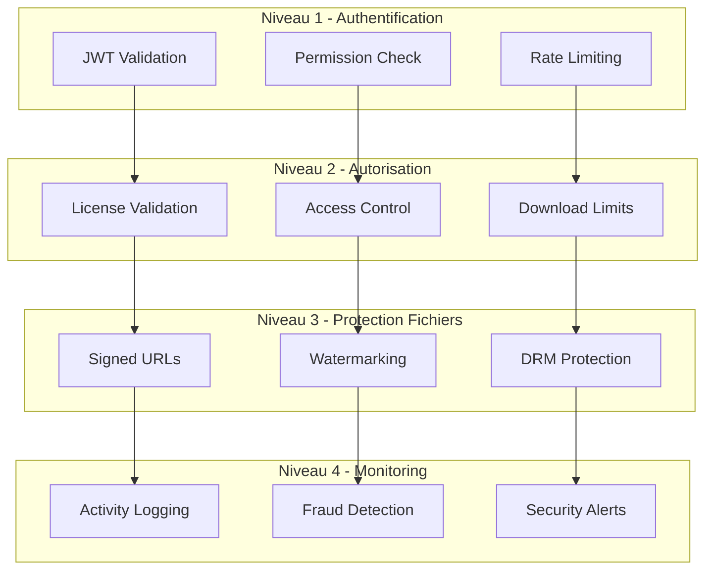

# Implementation Plan - Système de Vente de Produits Numériques

## Phase 1: Modèles et Services de Base (3-4 semaines)

### 1. Création des Modèles de Données Fondamentaux

- [ ] 1.1 Créer le modèle DigitalProduct
  - Implémenter la classe DigitalProductModel avec validation complète
  - Ajouter la gestion des fichiers et métadonnées
  - Créer les méthodes de calcul de prix et promotions
  - Implémenter la gestion des statuts et publication
  - _Requirements: 1.1, 1.2, 1.4_

- [ ] 1.2 Créer le modèle Order
  - Développer la classe OrderModel avec gestion des items
  - Implémenter les calculs de totaux et taxes
  - Ajouter la gestion des statuts de commande
  - Créer les méthodes de validation des items
  - _Requirements: 3.1, 3.2, 3.5_

- [ ] 1.3 Créer le modèle License
  - Implémenter la classe LicenseModel avec permissions
  - Ajouter la gestion des types de licence
  - Créer les méthodes de validation d'accès
  - Implémenter le suivi d'usage et limitations
  - _Requirements: 6.1, 6.2, 6.3_

- [ ] 1.4 Créer le modèle Category
  - Développer la classe CategoryModel avec hiérarchie
  - Implémenter la gestion des slugs et SEO
  - Ajouter les méthodes de tri et organisation
  - Créer la validation des noms uniques
  - _Requirements: 1.4_

- [ ]* 1.5 Tests unitaires des modèles
  - Tester toutes les validations métier
  - Valider les calculs de prix et totaux
  - Tester les conversions Firestore
  - _Requirements: 1.1, 3.1, 6.1_

### 2. Implémentation du ProductService

- [ ] 2.1 Créer le ProductService de base
  - Implémenter les opérations CRUD pour les produits
  - Ajouter la gestion des statuts et publication
  - Créer les méthodes de recherche et filtrage
  - Implémenter la validation des données produit
  - _Requirements: 1.1, 1.2, 1.5_

- [ ] 2.2 Développer la gestion des fichiers
  - Créer les méthodes d'upload vers Firebase Storage
  - Implémenter la validation des types de fichiers
  - Ajouter le calcul de checksum et intégrité
  - Créer la gestion des versions de fichiers
  - _Requirements: 2.1, 2.2, 2.5_

- [ ] 2.3 Implémenter la gestion des catégories
  - Créer le CategoryService avec hiérarchie
  - Ajouter l'assignation des produits aux catégories
  - Implémenter la recherche par catégorie
  - Créer les méthodes de statistiques par catégorie
  - _Requirements: 1.4_

- [ ] 2.4 Développer les fonctionnalités SEO
  - Créer la génération automatique de slugs
  - Implémenter la gestion des métadonnées SEO
  - Ajouter la validation des URLs uniques
  - Créer les méthodes d'optimisation de contenu
  - _Requirements: 1.1, 8.1_

- [ ]* 2.5 Tests du ProductService
  - Tester toutes les opérations CRUD
  - Valider l'upload et validation des fichiers
  - Tester la gestion des catégories
  - _Requirements: 1.1, 2.1, 1.4_

### 3. Intégration avec Stripe pour Paiements

- [ ] 3.1 Étendre le StripePaymentService existant
  - Créer la classe DigitalProductPaymentService
  - Implémenter les PaymentIntents pour produits uniques
  - Ajouter la gestion des métadonnées de commande
  - Intégrer avec le système de webhooks existant
  - _Requirements: 3.2, 3.3, 3.4_

- [ ] 3.2 Développer la gestion des vendeurs
  - Créer les comptes Stripe Connect pour vendeurs
  - Implémenter la gestion des payouts automatiques
  - Ajouter le calcul des commissions marketplace
  - Créer la répartition des paiements multi-vendeurs
  - _Requirements: 5.2_

- [ ] 3.3 Implémenter les webhooks spécialisés
  - Créer les gestionnaires pour payment_intent.succeeded
  - Ajouter les gestionnaires pour payment_intent.payment_failed
  - Implémenter la gestion des remboursements
  - Créer les notifications de statut de paiement
  - _Requirements: 3.3, 3.4, 3.5_

- [ ]* 3.4 Tests d'intégration Stripe
  - Tester tous les scénarios de paiement
  - Valider les webhooks et callbacks
  - Tester les remboursements et échecs
  - _Requirements: 3.2, 3.3, 3.4_

### 4. Création des APIs REST

- [ ] 4.1 Développer les endpoints Product
  - Créer les APIs CRUD pour les produits numériques
  - Ajouter les endpoints de recherche et filtrage
  - Implémenter les APIs de gestion des fichiers
  - Créer les endpoints de publication/archivage
  - _Requirements: 8.1, 8.2, 1.1_

- [ ] 4.2 Créer les endpoints Order
  - Implémenter les APIs de création de commande
  - Ajouter les endpoints de traitement de paiement
  - Créer les APIs de suivi de commande
  - Implémenter les endpoints de gestion des remboursements
  - _Requirements: 8.1, 3.1, 3.2_

- [ ] 4.3 Développer les endpoints de téléchargement
  - Créer les APIs de génération d'URLs sécurisées
  - Implémenter la validation d'accès avant téléchargement
  - Ajouter les endpoints de suivi des téléchargements
  - Créer les APIs de gestion des licences
  - _Requirements: 8.1, 4.1, 4.4, 6.3_

- [ ] 4.4 Implémenter la documentation Swagger
  - Créer la documentation complète des APIs
  - Ajouter les exemples et schémas de données
  - Implémenter les codes d'erreur documentés
  - Créer les guides d'intégration
  - _Requirements: 8.5_

- [ ]* 4.5 Tests des APIs REST
  - Tester tous les endpoints avec différents scénarios
  - Valider l'authentification et autorisation
  - Tester les performances et limites de taux
  - _Requirements: 8.1, 8.2, 8.3_

## Phase 2: Stockage et Sécurité (2-3 semaines)

### 5. Implémentation du Stockage Sécurisé

- [ ] 5.1 Créer le FileSecurityService
  - Implémenter l'upload sécurisé vers Firebase Storage
  - Ajouter la validation des types MIME et extensions
  - Créer la génération de checksums pour intégrité
  - Implémenter la détection de malware basique
  - _Requirements: 2.1, 2.2, 10.1_

- [ ] 5.2 Développer la génération d'URLs signées
  - Créer le service de génération d'URLs temporaires
  - Implémenter la validation des permissions d'accès
  - Ajouter la gestion des expirations d'URLs
  - Créer les mécanismes de renouvellement d'accès
  - _Requirements: 2.4, 2.5, 4.4_

- [ ] 5.3 Implémenter le contrôle d'accès
  - Créer l'AccessControlService avec validation de licence
  - Ajouter la vérification des droits de téléchargement
  - Implémenter les limitations par utilisateur et produit
  - Créer les logs d'accès détaillés
  - _Requirements: 2.3, 6.3, 10.4_

- [ ] 5.4 Développer la protection anti-piratage
  - Créer les mécanismes de watermarking des fichiers
  - Implémenter la détection d'activité suspecte
  - Ajouter les alertes de sécurité automatiques
  - Créer les mécanismes de révocation d'accès
  - _Requirements: 6.4, 10.5_

- [ ]* 5.5 Tests de sécurité et stockage
  - Tester tous les mécanismes de sécurité
  - Valider les contrôles d'accès
  - Tester la génération d'URLs signées
  - _Requirements: 2.1, 2.3, 6.3_

### 6. Création du Système de Livraison Automatique

- [ ] 6.1 Implémenter le DigitalDeliveryService
  - Créer les méthodes de livraison automatique post-paiement
  - Ajouter la génération automatique de licences
  - Implémenter la création des liens de téléchargement
  - Créer les mécanismes de notification de livraison
  - _Requirements: 4.1, 4.2, 4.5_

- [ ] 6.2 Développer la gestion des licences
  - Créer le LicenseService avec gestion du cycle de vie
  - Implémenter les différents types de licences
  - Ajouter la gestion des permissions granulaires
  - Créer les mécanismes d'expiration et renouvellement
  - _Requirements: 6.1, 6.2, 6.5_

- [ ] 6.3 Implémenter le suivi des téléchargements
  - Créer le DownloadService avec tracking complet
  - Ajouter les métriques de téléchargement par produit
  - Implémenter les limitations de téléchargement
  - Créer les rapports d'usage détaillés
  - _Requirements: 4.3, 4.4, 5.5_

- [ ] 6.4 Développer les notifications de livraison
  - Intégrer avec le système de notifications existant
  - Créer les templates d'email de livraison
  - Implémenter les notifications de statut de commande
  - Ajouter les rappels et notifications de suivi
  - _Requirements: 9.1, 9.2, 9.3, 9.5_

- [ ]* 6.5 Tests de livraison automatique
  - Tester tous les scénarios de livraison
  - Valider les notifications et emails
  - Tester les mécanismes de licence
  - _Requirements: 4.1, 4.2, 6.1_

### 7. Intégration avec les Systèmes Existants

- [ ] 7.1 Intégrer avec le système de codes promo
  - Étendre le PromoCodeService pour les produits numériques
  - Ajouter la validation des codes pour les commandes
  - Implémenter les réductions sur les produits numériques
  - Créer les métriques d'utilisation des codes promo
  - _Requirements: 7.1, 7.2, 7.4_

- [ ] 7.2 Intégrer avec le système de notifications
  - Utiliser le NotificationService existant
  - Créer les templates spécifiques aux ventes
  - Ajouter les notifications multi-canal (email, SMS)
  - Implémenter les préférences de notification
  - _Requirements: 9.1, 9.4, 9.5_

- [ ] 7.3 Intégrer avec le système d'authentification
  - Utiliser les User et Tenant existants
  - Créer les rôles spécifiques aux vendeurs
  - Implémenter les permissions de vente par tenant
  - Ajouter la validation des accès aux produits
  - _Requirements: 8.2, 10.1_

- [ ]* 7.4 Tests d'intégration système
  - Tester l'intégration avec tous les systèmes existants
  - Valider les permissions et rôles
  - Tester les notifications et codes promo
  - _Requirements: 7.1, 9.1, 8.2_

## Phase 3: Analytics et Rapports (2 semaines)

### 8. Développement des Analytics de Vente

- [ ] 8.1 Créer l'AnalyticsService pour produits numériques
  - Implémenter les métriques de vente par produit
  - Ajouter les analyses de revenus par période
  - Créer les statistiques de conversion
  - Implémenter les métriques de performance vendeur
  - _Requirements: 5.1, 5.2, 5.3_

- [ ] 8.2 Développer les rapports de téléchargement
  - Créer les statistiques de téléchargement par produit
  - Implémenter les analyses d'engagement utilisateur
  - Ajouter les métriques de rétention
  - Créer les rapports d'usage des licences
  - _Requirements: 4.5, 5.5_

- [ ] 8.3 Implémenter les tableaux de bord vendeur
  - Créer les KPIs temps réel pour vendeurs
  - Ajouter les graphiques de performance
  - Implémenter les alertes de vente
  - Créer les résumés de revenus
  - _Requirements: 5.1, 5.4_

- [ ]* 8.4 Tests des analytics
  - Tester tous les calculs et métriques
  - Valider les performances avec gros volumes
  - Tester la génération de rapports
  - _Requirements: 5.1, 5.2, 5.5_

### 9. Création des Rapports Avancés

- [ ] 9.1 Développer les rapports de vente
  - Créer les rapports détaillés par produit et vendeur
  - Implémenter les analyses de tendances
  - Ajouter les comparaisons période sur période
  - Créer les rapports de top produits
  - _Requirements: 5.1, 5.4_

- [ ] 9.2 Implémenter les rapports financiers
  - Créer les rapports de revenus et commissions
  - Ajouter les analyses de rentabilité
  - Implémenter les rapports de taxes et comptabilité
  - Créer les réconciliations de paiement
  - _Requirements: 5.2, 5.3_

- [ ] 9.3 Développer les exports de données
  - Créer les exports CSV, Excel pour comptabilité
  - Implémenter les formats d'export personnalisables
  - Ajouter les exports automatiques programmés
  - Créer les APIs d'export pour intégrations
  - _Requirements: 5.4, 8.4_

- [ ]* 9.4 Tests des rapports
  - Tester tous les formats de rapport
  - Valider les calculs financiers
  - Tester les exports de données
  - _Requirements: 5.1, 5.2, 5.4_

## Phase 4: Fonctionnalités Avancées (2-3 semaines)

### 10. Système de Promotions et Marketing

- [ ] 10.1 Étendre le système de codes promo
  - Adapter les PromoCode existants pour produits numériques
  - Créer les promotions spécifiques aux produits
  - Implémenter les réductions en cascade
  - Ajouter les promotions par catégorie
  - _Requirements: 7.1, 7.2, 7.3_

- [ ] 10.2 Développer les bundles et packages
  - Créer les produits groupés avec réductions
  - Implémenter les offres spéciales temporaires
  - Ajouter la gestion des prix dégressifs
  - Créer les mécanismes de vente croisée
  - _Requirements: 7.5_

- [ ] 10.3 Implémenter les programmes de fidélité
  - Créer les points de fidélité pour achats
  - Ajouter les récompenses et cashback
  - Implémenter les niveaux de fidélité
  - Créer les offres exclusives membres
  - _Requirements: 7.4_

- [ ]* 10.4 Tests des promotions
  - Tester tous les types de promotions
  - Valider les calculs de réductions
  - Tester les programmes de fidélité
  - _Requirements: 7.1, 7.2, 7.3_

### 11. Fonctionnalités Marketplace

- [ ] 11.1 Créer le système multi-vendeurs
  - Implémenter la gestion des vendeurs par tenant
  - Ajouter les profils vendeur avec ratings
  - Créer les mécanismes de validation vendeur
  - Implémenter les politiques de vente
  - _Requirements: 5.2_

- [ ] 11.2 Développer la gestion des commissions
  - Créer les règles de commission configurables
  - Implémenter le calcul automatique des commissions
  - Ajouter la gestion des payouts vendeurs
  - Créer les rapports de commissions
  - _Requirements: 5.2, 5.3_

- [ ] 11.3 Implémenter les reviews et ratings
  - Créer le système d'évaluation des produits
  - Ajouter la modération des commentaires
  - Implémenter les métriques de satisfaction
  - Créer les notifications de nouveaux avis
  - _Requirements: 5.5_

- [ ]* 11.4 Tests marketplace
  - Tester tous les scénarios multi-vendeurs
  - Valider les calculs de commissions
  - Tester les systèmes de review
  - _Requirements: 5.2, 5.3, 5.5_

### 12. Sécurité et Protection Avancées

- [ ] 12.1 Implémenter la protection DRM
  - Créer les mécanismes de protection des fichiers
  - Ajouter le watermarking automatique
  - Implémenter la limitation par device
  - Créer les mécanismes de révocation d'accès
  - _Requirements: 6.4, 10.5_

- [ ] 12.2 Développer la détection de fraude
  - Créer les algorithmes de détection d'activité suspecte
  - Implémenter les alertes de sécurité automatiques
  - Ajouter les mécanismes de blocage temporaire
  - Créer les rapports de sécurité
  - _Requirements: 10.5, 6.4_

- [ ] 12.3 Implémenter l'audit et conformité
  - Créer les logs détaillés de toutes les transactions
  - Ajouter les mécanismes de conformité RGPD
  - Implémenter les rapports d'audit
  - Créer les mécanismes de suppression de données
  - _Requirements: 10.3, 10.4_

- [ ]* 12.4 Tests de sécurité
  - Tester tous les mécanismes de protection
  - Valider la détection de fraude
  - Tester la conformité RGPD
  - _Requirements: 6.4, 10.3, 10.5_

## Phase 5: Optimisation et Finalisation (1-2 semaines)

### 13. Optimisation des Performances

- [ ] 13.1 Optimiser les requêtes de base de données
  - Créer les index optimaux pour toutes les collections
  - Implémenter la pagination efficace
  - Ajouter le cache pour les données fréquentes
  - Optimiser les requêtes d'analytics
  - _Requirements: 8.3, 5.1_

- [ ] 13.2 Implémenter le cache et CDN
  - Créer le cache des produits populaires
  - Ajouter le cache des métadonnées de fichiers
  - Implémenter la distribution CDN pour les téléchargements
  - Créer l'invalidation intelligente du cache
  - _Requirements: 2.4, 8.3_

- [ ] 13.3 Optimiser les téléchargements
  - Implémenter la compression automatique des fichiers
  - Ajouter les téléchargements en chunks pour gros fichiers
  - Créer les mécanismes de reprise de téléchargement
  - Implémenter la distribution géographique
  - _Requirements: 4.4, 2.4_

- [ ]* 13.4 Tests de performance
  - Tester avec des volumes importants de produits
  - Valider les temps de téléchargement
  - Tester la génération de rapports volumineux
  - _Requirements: 2.4, 4.4, 5.1_

### 14. Finalisation et Documentation

- [ ] 14.1 Compléter la documentation technique
  - Finaliser la documentation Swagger
  - Créer les guides d'intégration détaillés
  - Ajouter les exemples de code complets
  - Documenter tous les webhooks et callbacks
  - _Requirements: 8.5_

- [ ] 14.2 Créer les guides de déploiement
  - Documenter la configuration Firebase Storage
  - Créer les guides de configuration Stripe
  - Ajouter les procédures de migration
  - Documenter les bonnes pratiques de sécurité
  - _Requirements: 10.1, 10.4_

- [ ] 14.3 Implémenter les mécanismes de monitoring
  - Créer les métriques de performance système
  - Ajouter les alertes de santé du système
  - Implémenter les dashboards opérationnels
  - Créer les rapports de disponibilité
  - _Requirements: 8.3, 10.4_

- [ ]* 14.4 Tests de bout en bout
  - Effectuer les tests complets de tous les workflows
  - Valider l'intégration avec les systèmes existants
  - Tester les scénarios de charge et stress
  - _Requirements: Toutes_

### 15. Déploiement et Mise en Production

- [ ] 15.1 Préparer l'environnement de production
  - Configurer les nouvelles collections Firestore
  - Créer les index de production optimisés
  - Configurer Firebase Storage avec sécurité
  - Mettre en place le monitoring et alertes
  - _Requirements: 10.1, 10.4_

- [ ] 15.2 Configurer les intégrations Stripe
  - Configurer Stripe Connect pour multi-vendeurs
  - Créer les webhooks de production
  - Tester les paiements en mode live
  - Configurer les mécanismes de réconciliation
  - _Requirements: 3.2, 3.3, 5.2_

- [ ] 15.3 Effectuer les tests de production
  - Tester en environnement de production
  - Valider les performances réelles
  - Effectuer les tests de sécurité
  - Valider les sauvegardes et restaurations
  - _Requirements: Toutes_

- [ ]* 15.4 Formation et documentation utilisateur
  - Créer les guides pour vendeurs
  - Documenter les procédures d'administration
  - Former les équipes de support
  - _Requirements: 8.5_

## Métriques de Succès

### Métriques Techniques
- **Performance API** : <300ms pour 95% des requêtes
- **Disponibilité** : 99.9% uptime
- **Sécurité** : 0 incident de sécurité majeur
- **Téléchargements** : 99% de succès de téléchargement

### Métriques Fonctionnelles
- **Conversion** : >5% taux de conversion visiteur → acheteur
- **Satisfaction** : >4.5/5 rating moyen des produits
- **Livraison** : <5 minutes délai de livraison automatique
- **Support** : <2h temps de résolution des problèmes

### Métriques Business
- **Revenus** : $10k+ revenus mensuels après 6 mois
- **Vendeurs** : 50+ vendeurs actifs après 1 an
- **Produits** : 500+ produits en catalogue
- **Commissions** : 10-15% commission moyenne

## Architecture de Sécurité

### Niveaux de Protection

Cette conception complète transformera votre plateforme en une marketplace de produits numériques sécurisée et performante, générant de nouveaux revenus tout en s'intégrant parfaitement à votre infrastructure existante.