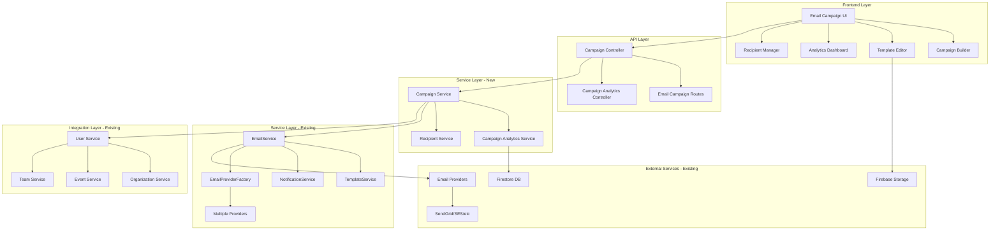

# Email Campaign System Design Document

## Overview

The Email Campaign System is a comprehensive module integrated into Attendance-X that enables organizations to create, manage, and send targeted email communications to their members. The system leverages existing Attendance-X infrastructure (users, organizations, teams, events) while providing advanced email marketing capabilities with delivery tracking and analytics.

## Architecture

### High-Level Architecture



### System Integration with Existing Attendance-X Infrastructure

The email campaign system leverages and extends existing Attendance-X components:

- **EmailService**: Utilise le service email existant avec ses providers configurés
- **TemplateService**: Étend le système de templates existant pour les campagnes
- **NotificationService**: S'intègre au système de notifications existant
- **Authentication**: Utilise l'authentification JWT et les permissions existantes
- **User/Organization Data**: Exploite les données utilisateurs et organisations existantes
- **Provider Management**: Utilise EmailProviderFactory et les providers configurés

## Components and Interfaces

### 1. Campaign Management Component

**Purpose**: Core component for creating and managing email campaigns, extending existing email infrastructure

**Key Classes** (extending existing types):
```typescript
import { EmailTemplate, EmailTemplateCategory, SendEmailRequest } from "@attendance-x/shared";

interface EmailCampaign extends BaseEntity {
  organizationId: string;
  name: string;
  type: CampaignType;
  subject: string;
  templateId?: string;
  content: CampaignContent;
  recipients: CampaignRecipientList;
  scheduledAt?: Date;
  status: CampaignStatus;
  createdBy: string;
  deliveryStats: CampaignDeliveryStats;
  
  // Integration with existing email system
  emailRequests: SendEmailRequest[]; // Batch of email requests
  providerConfig?: {
    preferredProvider?: EmailProviderType;
    fallbackProviders?: EmailProviderType[];
  };
}

enum CampaignType {
  ORGANIZATION_ANNOUNCEMENT = 'organization_announcement',
  NEWSLETTER = 'newsletter', 
  EVENT_REMINDER = 'event_reminder',
  HR_COMMUNICATION = 'hr_communication',
  ATTENDANCE_REMINDER = 'attendance_reminder',
  CUSTOM = 'custom'
}

enum CampaignStatus {
  DRAFT = 'draft',
  SCHEDULED = 'scheduled',
  SENDING = 'sending',
  SENT = 'sent',
  PAUSED = 'paused',
  CANCELLED = 'cancelled',
  FAILED = 'failed'
}

interface CampaignContent {
  htmlContent?: string;
  textContent?: string;
  templateId?: string;
  templateData?: Record<string, any>;
  attachments?: EmailAttachment[];
}
```

**API Endpoints** (integrating with existing route structure):
- `POST /api/email-campaigns` - Create new campaign
- `GET /api/email-campaigns` - List organization campaigns with filters
- `GET /api/email-campaigns/:id` - Get campaign details
- `PUT /api/email-campaigns/:id` - Update campaign
- `POST /api/email-campaigns/:id/send` - Send campaign (uses existing EmailService)
- `POST /api/email-campaigns/:id/schedule` - Schedule campaign
- `POST /api/email-campaigns/:id/pause` - Pause sending
- `POST /api/email-campaigns/:id/resume` - Resume sending
- `DELETE /api/email-campaigns/:id` - Delete campaign
- `GET /api/email-campaigns/:id/preview` - Preview campaign with sample data

### 2. Template Management Component

**Purpose**: Extends existing TemplateService for campaign-specific templates

**Key Classes** (extending existing EmailTemplate):
```typescript
import { EmailTemplate, EmailTemplateCategory } from "@attendance-x/shared";

// Extend existing EmailTemplate for campaigns
interface CampaignTemplate extends EmailTemplate {
  // Existing fields from shared types:
  // - name, description, category, subject, htmlContent, textContent
  // - variables, language, isActive, isDefault, settings, etc.
  
  // Campaign-specific extensions
  campaignType: CampaignType;
  organizationId?: string; // null for system templates
  isSystemTemplate: boolean;
  isPublicTemplate: boolean; // Can be shared across organizations
  
  // Enhanced template features
  previewImages?: string[]; // Screenshots of template
  designMetadata?: {
    colorScheme: string;
    fontFamily: string;
    layout: 'single-column' | 'two-column' | 'newsletter';
    responsive: boolean;
  };
  
  // Campaign-specific variables
  campaignVariables: CampaignVariable[];
  
  // Usage analytics
  campaignUsage: {
    timesUsed: number;
    lastUsedInCampaign?: string;
    avgDeliveryRate?: number;
    avgOpenRate?: number;
    avgClickRate?: number;
  };
}

interface CampaignVariable {
  name: string;
  type: 'text' | 'image' | 'url' | 'date' | 'user_data' | 'organization_data';
  source?: 'user' | 'organization' | 'event' | 'custom'; // Data source
  defaultValue?: string;
  required: boolean;
  description?: string;
}

// Extend existing EmailTemplateCategory for campaigns
enum CampaignTemplateCategory {
  // Existing categories from shared types
  NEWSLETTER = EmailTemplateCategory.NEWSLETTER,
  EVENT_INVITATION = EmailTemplateCategory.EVENT_INVITATION,
  EVENT_REMINDER = EmailTemplateCategory.EVENT_REMINDER,
  
  // New campaign-specific categories
  ORGANIZATION_ANNOUNCEMENT = 'organization_announcement',
  HR_COMMUNICATION = 'hr_communication',
  ATTENDANCE_CAMPAIGN = 'attendance_campaign',
  MARKETING_CAMPAIGN = 'marketing_campaign'
}
```

**API Endpoints** (extending existing template system):
- `GET /api/email-campaigns/templates` - List campaign templates (extends existing TemplateService)
- `GET /api/email-campaigns/templates/system` - Get system campaign templates
- `GET /api/email-campaigns/templates/organization` - Get organization templates
- `POST /api/email-campaigns/templates` - Create custom campaign template
- `PUT /api/email-campaigns/templates/:id` - Update template
- `POST /api/email-campaigns/templates/:id/duplicate` - Duplicate template
- `DELETE /api/email-campaigns/templates/:id` - Delete template
- `POST /api/email-campaigns/templates/:id/preview` - Preview template with sample data

### 3. Recipient Management Component

**Purpose**: Manages recipient selection and list creation using Attendance-X data

**Key Classes**:
```typescript
interface RecipientList {
  id: string;
  name: string;
  organizationId: string;
  criteria: RecipientCriteria;
  recipients: EmailRecipient[];
  totalCount: number;
  createdBy: string;
  createdAt: Date;
}

interface RecipientCriteria {
  teams?: string[];
  roles?: UserRole[];
  departments?: string[];
  eventParticipants?: string[];
  customFilters?: CustomFilter[];
  excludeUnsubscribed: boolean;
}

interface EmailRecipient {
  userId: string;
  email: string;
  firstName: string;
  lastName: string;
  personalizations: Record<string, any>;
  unsubscribed: boolean;
  bounced: boolean;
}
```

**API Endpoints** (leveraging existing user/organization data):
- `POST /api/email-campaigns/recipients/lists` - Create recipient list
- `GET /api/email-campaigns/recipients/lists` - Get organization recipient lists
- `POST /api/email-campaigns/recipients/preview` - Preview recipients based on criteria
- `GET /api/email-campaigns/recipients/users` - Get organization users (uses existing UserService)
- `GET /api/email-campaigns/recipients/teams` - Get organization teams (uses existing TeamService)
- `GET /api/email-campaigns/recipients/events/:eventId/participants` - Get event participants
- `POST /api/email-campaigns/recipients/import` - Import external recipients
- `GET /api/email-campaigns/recipients/unsubscribed` - Get unsubscribed users

### 4. Email Delivery Component

**Purpose**: Leverages existing EmailService for campaign delivery with enhanced tracking

**Key Classes** (extending existing email infrastructure):
```typescript
import { SendEmailRequest, SendEmailResponse, EmailDeliveryStatus, EmailDeliveryStatusType } from "@attendance-x/shared";

// Extend existing EmailDeliveryStatus for campaigns
interface CampaignDelivery extends EmailDeliveryStatus {
  // Existing fields: messageId, status, providerId, recipient, timestamps, etc.
  
  // Campaign-specific extensions
  campaignId: string;
  recipientUserId?: string; // Link to Attendance-X user
  personalizations: Record<string, any>; // Template variables used
  
  // Enhanced tracking
  trackingData: {
    pixelId: string;
    unsubscribeToken: string;
    clickTokens: Record<string, string>; // URL -> tracking token
  };
  
  // Campaign context
  campaignContext: {
    campaignName: string;
    campaignType: CampaignType;
    organizationId: string;
  };
}

// Extend existing delivery status types
enum CampaignDeliveryStatus {
  // Use existing EmailDeliveryStatusType values
  QUEUED = EmailDeliveryStatusType.QUEUED,
  SENT = EmailDeliveryStatusType.SENT,
  DELIVERED = EmailDeliveryStatusType.DELIVERED,
  BOUNCED = EmailDeliveryStatusType.BOUNCED,
  OPENED = EmailDeliveryStatusType.OPENED,
  CLICKED = EmailDeliveryStatusType.CLICKED,
  UNSUBSCRIBED = EmailDeliveryStatusType.UNSUBSCRIBED,
  FAILED = EmailDeliveryStatusType.FAILED,
  
  // Campaign-specific statuses
  SCHEDULED = 'scheduled',
  PAUSED = 'paused',
  CANCELLED = 'cancelled'
}

interface CampaignDeliveryQueue {
  campaignId: string;
  organizationId: string;
  priority: number;
  scheduledAt: Date;
  batchSize: number;
  
  // Use existing provider rate limits
  providerConfig: {
    preferredProvider?: EmailProviderType;
    respectRateLimits: boolean;
  };
  
  // Batch processing
  batches: CampaignBatch[];
  currentBatchIndex: number;
  totalRecipients: number;
}

interface CampaignBatch {
  batchId: string;
  recipients: string[]; // User IDs or email addresses
  emailRequests: SendEmailRequest[];
  status: 'pending' | 'processing' | 'completed' | 'failed';
  processedAt?: Date;
  errors?: string[];
}
```

**API Endpoints** (integrating with existing EmailService):
- `POST /api/email-campaigns/:id/delivery/send` - Send campaign batch (uses EmailService)
- `GET /api/email-campaigns/:id/delivery/status` - Get campaign delivery status
- `POST /api/email-campaigns/:id/delivery/retry` - Retry failed deliveries
- `GET /api/email-campaigns/:id/delivery/queue` - Get campaign queue status
- `GET /api/email-campaigns/delivery/providers` - Get available email providers status
- `POST /api/email-campaigns/delivery/test` - Test email delivery with sample

### 5. Tracking and Analytics Component

**Purpose**: Tracks email engagement and provides analytics

**Key Classes**:
```typescript
interface EmailTracking {
  deliveryId: string;
  trackingPixelId: string;
  events: TrackingEvent[];
  ipAddress?: string;
  userAgent?: string;
  location?: GeoLocation;
}

interface TrackingEvent {
  type: TrackingEventType;
  timestamp: Date;
  metadata?: Record<string, any>;
}

enum TrackingEventType {
  SENT = 'sent',
  DELIVERED = 'delivered',
  OPENED = 'opened',
  CLICKED = 'clicked',
  BOUNCED = 'bounced',
  UNSUBSCRIBED = 'unsubscribed',
  SPAM_COMPLAINT = 'spam_complaint'
}

interface CampaignAnalytics {
  campaignId: string;
  totalSent: number;
  totalDelivered: number;
  totalOpened: number;
  totalClicked: number;
  totalBounced: number;
  totalUnsubscribed: number;
  openRate: number;
  clickRate: number;
  bounceRate: number;
  unsubscribeRate: number;
  engagementScore: number;
}
```

**API Endpoints** (extending existing tracking infrastructure):
- `GET /api/email-campaigns/tracking/pixel/:pixelId` - Tracking pixel endpoint
- `GET /api/email-campaigns/tracking/click/:linkId` - Link click tracking and redirect
- `GET /api/email-campaigns/tracking/unsubscribe/:token` - Unsubscribe page
- `POST /api/email-campaigns/tracking/unsubscribe/:token` - Process unsubscribe
- `GET /api/email-campaigns/:id/analytics` - Get campaign analytics
- `GET /api/email-campaigns/analytics/overview` - Get organization campaigns overview
- `GET /api/email-campaigns/analytics/compare` - Compare multiple campaigns
- `POST /api/email-campaigns/analytics/export` - Export analytics data

## Data Models

### Database Schema

```sql
-- Campaigns table
CREATE TABLE email_campaigns (
  id VARCHAR(255) PRIMARY KEY,
  organization_id VARCHAR(255) NOT NULL,
  name VARCHAR(255) NOT NULL,
  type VARCHAR(50) NOT NULL,
  subject VARCHAR(500) NOT NULL,
  template_id VARCHAR(255),
  content JSON NOT NULL,
  recipients JSON NOT NULL,
  scheduled_at TIMESTAMP,
  status VARCHAR(50) NOT NULL DEFAULT 'draft',
  created_by VARCHAR(255) NOT NULL,
  created_at TIMESTAMP DEFAULT CURRENT_TIMESTAMP,
  updated_at TIMESTAMP DEFAULT CURRENT_TIMESTAMP ON UPDATE CURRENT_TIMESTAMP,
  INDEX idx_organization_id (organization_id),
  INDEX idx_status (status),
  INDEX idx_created_by (created_by)
);

-- Templates table
CREATE TABLE email_templates (
  id VARCHAR(255) PRIMARY KEY,
  organization_id VARCHAR(255),
  name VARCHAR(255) NOT NULL,
  description TEXT,
  category VARCHAR(50) NOT NULL,
  type VARCHAR(50) NOT NULL,
  content JSON NOT NULL,
  variables JSON,
  is_system BOOLEAN DEFAULT FALSE,
  is_public BOOLEAN DEFAULT FALSE,
  created_by VARCHAR(255) NOT NULL,
  created_at TIMESTAMP DEFAULT CURRENT_TIMESTAMP,
  updated_at TIMESTAMP DEFAULT CURRENT_TIMESTAMP ON UPDATE CURRENT_TIMESTAMP,
  usage_count INT DEFAULT 0,
  INDEX idx_organization_id (organization_id),
  INDEX idx_type (type),
  INDEX idx_category (category)
);

-- Deliveries table
CREATE TABLE email_deliveries (
  id VARCHAR(255) PRIMARY KEY,
  campaign_id VARCHAR(255) NOT NULL,
  recipient_id VARCHAR(255) NOT NULL,
  email VARCHAR(255) NOT NULL,
  status VARCHAR(50) NOT NULL DEFAULT 'queued',
  sent_at TIMESTAMP,
  delivered_at TIMESTAMP,
  opened_at TIMESTAMP,
  clicked_at TIMESTAMP,
  bounced_at TIMESTAMP,
  unsubscribed_at TIMESTAMP,
  error_message TEXT,
  tracking_pixel_id VARCHAR(255) NOT NULL,
  unsubscribe_token VARCHAR(255) NOT NULL,
  created_at TIMESTAMP DEFAULT CURRENT_TIMESTAMP,
  updated_at TIMESTAMP DEFAULT CURRENT_TIMESTAMP ON UPDATE CURRENT_TIMESTAMP,
  INDEX idx_campaign_id (campaign_id),
  INDEX idx_status (status),
  INDEX idx_tracking_pixel_id (tracking_pixel_id),
  INDEX idx_unsubscribe_token (unsubscribe_token)
);

-- Tracking events table
CREATE TABLE email_tracking_events (
  id VARCHAR(255) PRIMARY KEY,
  delivery_id VARCHAR(255) NOT NULL,
  event_type VARCHAR(50) NOT NULL,
  timestamp TIMESTAMP DEFAULT CURRENT_TIMESTAMP,
  ip_address VARCHAR(45),
  user_agent TEXT,
  metadata JSON,
  INDEX idx_delivery_id (delivery_id),
  INDEX idx_event_type (event_type),
  INDEX idx_timestamp (timestamp)
);

-- Unsubscribes table
CREATE TABLE email_unsubscribes (
  id VARCHAR(255) PRIMARY KEY,
  organization_id VARCHAR(255) NOT NULL,
  email VARCHAR(255) NOT NULL,
  user_id VARCHAR(255),
  reason VARCHAR(500),
  unsubscribed_at TIMESTAMP DEFAULT CURRENT_TIMESTAMP,
  UNIQUE KEY unique_org_email (organization_id, email),
  INDEX idx_organization_id (organization_id),
  INDEX idx_email (email)
);
```

## Error Handling

### Error Categories

1. **Validation Errors**
   - Invalid email addresses
   - Missing required fields
   - Template validation failures

2. **Permission Errors**
   - Insufficient organization permissions
   - Template access restrictions
   - Recipient privacy violations

3. **Delivery Errors**
   - Email provider API failures
   - Rate limiting exceeded
   - Bounce handling

4. **System Errors**
   - Database connection issues
   - External service unavailability
   - Queue processing failures

### Error Response Format

```typescript
interface EmailSystemError {
  code: string;
  message: string;
  details?: Record<string, any>;
  timestamp: Date;
  requestId: string;
}

// Example error codes
enum EmailErrorCodes {
  INVALID_TEMPLATE = 'EMAIL_INVALID_TEMPLATE',
  RECIPIENT_NOT_FOUND = 'EMAIL_RECIPIENT_NOT_FOUND',
  DELIVERY_FAILED = 'EMAIL_DELIVERY_FAILED',
  RATE_LIMIT_EXCEEDED = 'EMAIL_RATE_LIMIT_EXCEEDED',
  PERMISSION_DENIED = 'EMAIL_PERMISSION_DENIED'
}
```

## Testing Strategy

### Unit Testing
- Service layer methods
- Template rendering logic
- Recipient filtering algorithms
- Analytics calculations

### Integration Testing
- Email provider API integration
- Attendance-X data integration
- Database operations
- Queue processing

### End-to-End Testing
- Complete campaign creation workflow
- Email delivery and tracking
- Unsubscribe process
- Analytics reporting

### Performance Testing
- Large recipient list handling
- Concurrent campaign sending
- Database query optimization
- Memory usage during template rendering

## Security Considerations

### Data Protection
- Email addresses encrypted at rest
- Personal data anonymization for analytics
- GDPR compliance for data export/deletion
- Secure token generation for unsubscribe links

### Access Control
- Organization-level data isolation
- Role-based campaign permissions
- Template sharing restrictions
- Audit logging for all actions

### Email Security
- SPF/DKIM/DMARC configuration
- Bounce and complaint handling
- Spam prevention measures
- Rate limiting and throttling

## Performance Optimization

### Caching Strategy
- Template caching with Redis
- Recipient list caching
- Analytics data caching
- Image and asset CDN

### Queue Management
- Priority-based email queuing
- Batch processing optimization
- Failed delivery retry logic
- Dead letter queue handling

### Database Optimization
- Proper indexing strategy
- Query optimization
- Connection pooling
- Read replica usage for analytics

## Monitoring and Observability

### Metrics to Track
- Email delivery rates
- Open and click rates
- System performance metrics
- Error rates and types
- Queue processing times

### Logging Strategy
- Structured logging with correlation IDs
- Email delivery audit trail
- Error logging with context
- Performance monitoring

### Alerting
- Failed delivery alerts
- System error notifications
- Performance degradation alerts
- Security incident notifications