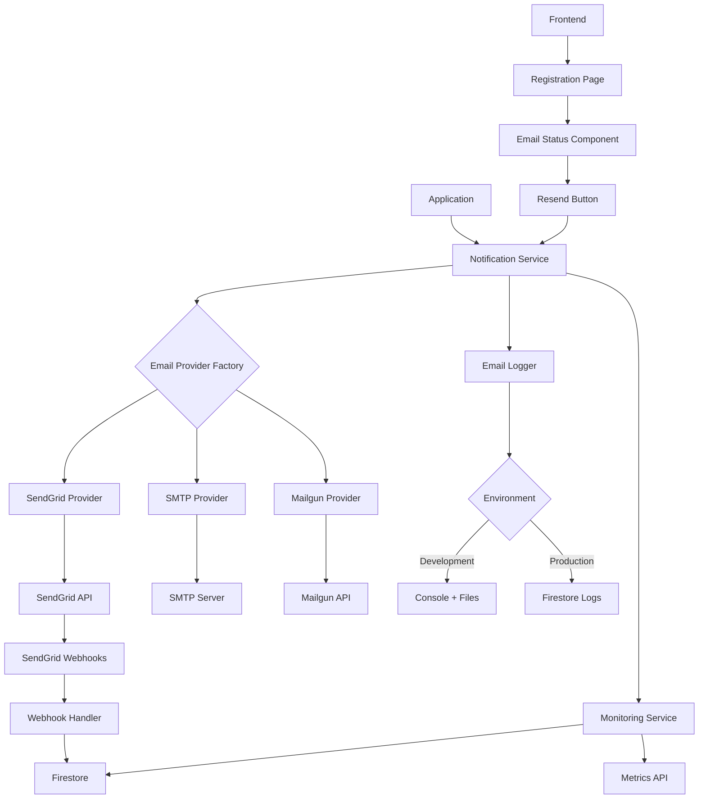

# Design Document - Email System Enhancements

## Overview

This design document outlines the architecture and implementation details for enhancing the email system with SendGrid integration, development mode logging, provider monitoring, and improved error recovery UI. The design builds upon the existing notification service while adding new capabilities for observability and reliability.

## Architecture

### High-Level System Diagram



### Component Architecture

```
backend/functions/src/
├── services/
│   ├── notification/
│   │   ├── email-providers/
│   │   │   ├── SendGridProvider.ts          # NEW
│   │   │   ├── SMTPProvider.ts              # EXISTING
│   │   │   ├── MailgunProvider.ts           # EXISTING
│   │   │   └── EmailProviderFactory.ts      # ENHANCED
│   │   ├── email-logger/
│   │   │   ├── DevelopmentEmailLogger.ts    # NEW
│   │   │   ├── ProductionEmailLogger.ts     # NEW
│   │   │   └── EmailLoggerFactory.ts        # NEW
│   │   ├── email-monitoring/
│   │   │   ├── EmailMonitoringService.ts    # NEW
│   │   │   ├── EmailMetricsCollector.ts     # NEW
│   │   │   └── ProviderHealthChecker.ts     # NEW
│   │   └── notification.service.ts          # ENHANCED
│   └── webhooks/
│       └── sendgrid-webhook.service.ts      # NEW
├── controllers/
│   ├── admin/
│   │   └── email-monitoring.controller.ts   # NEW
│   └── webhooks/
│       └── sendgrid-webhook.controller.ts   # NEW
├── routes/
│   ├── admin/
│   │   └── email-monitoring.routes.ts       # NEW
│   └── webhooks/
│       └── sendgrid-webhook.routes.ts       # NEW
└── types/
    └── email-monitoring.types.ts            # NEW

frontend/src/
├── components/
│   └── auth/
│       ├── EmailStatusIndicator.tsx         # NEW
│       ├── ResendEmailButton.tsx            # NEW
│       └── EmailTroubleshooting.tsx         # NEW
├── hooks/
│   └── useEmailStatus.ts                    # NEW
└── services/
    └── emailMonitoringService.ts            # NEW
```

## Component Details

### 1. SendGrid Provider

```typescript
// services/notification/email-providers/SendGridProvider.ts
import sgMail from '@sendgrid/mail';

export class SendGridProvider implements EmailProvider {
  private client: typeof sgMail;
  private isConfigured: boolean = false;

  constructor() {
    const apiKey = process.env.SENDGRID_API_KEY;
    if (apiKey) {
      sgMail.setApiKey(apiKey);
      this.client = sgMail;
      this.isConfigured = true;
    }
  }

  async send(options: EmailOptions): Promise<EmailResult> {
    if (!this.isConfigured) {
      throw new Error('SendGrid not configured');
    }

    const msg = {
      to: options.to,
      from: {
        email: process.env.SENDGRID_FROM_EMAIL || 'noreply@attendancex.com',
        name: process.env.SENDGRID_FROM_NAME || 'AttendanceX'
      },
      subject: options.subject,
      text: options.text,
      html: options.html,
      trackingSettings: {
        clickTracking: { enable: true },
        openTracking: { enable: true }
      },
      customArgs: {
        notificationId: options.notificationId,
        userId: options.userId
      }
    };

    try {
      const [response] = await this.client.send(msg);
      
      return {
        success: true,
        messageId: response.headers['x-message-id'],
        provider: 'sendgrid',
        timestamp: new Date()
      };
    } catch (error: any) {
      return {
        success: false,
        error: error.message,
        provider: 'sendgrid',
        timestamp: new Date()
      };
    }
  }

  async validateConfiguration(): Promise<boolean> {
    if (!this.isConfigured) return false;
    
    try {
      // Test API key validity
      await this.client.request({
        method: 'GET',
        url: '/v3/user/profile'
      });
      return true;
    } catch {
      return false;
    }
  }

  getStatus(): ProviderStatus {
    return {
      name: 'SendGrid',
      configured: this.isConfigured,
      healthy: this.isConfigured,
      lastCheck: new Date()
    };
  }
}
```

### 2. Development Email Logger

```typescript
// services/notification/email-logger/DevelopmentEmailLogger.ts
import * as fs from 'fs';
import * as path from 'path';
import { logger } from '../../../utils/logger';

export class DevelopmentEmailLogger {
  private outputDir: string;

  constructor() {
    this.outputDir = path.join(process.cwd(), 'dev-emails');
    this.ensureOutputDirectory();
  }

  async logEmail(email: EmailData): Promise<void> {
    // Log to console with colors
    logger.info('📧 [DEV MODE] Email would be sent:', {
      to: email.to,
      subject: email.subject,
      verificationUrl: this.extractVerificationUrl(email.html),
      timestamp: new Date().toISOString()
    });

    // Save HTML to file
    const filename = this.generateFilename(email);
    const filepath = path.join(this.outputDir, filename);
    
    const htmlContent = this.wrapInDevTemplate(email);
    fs.writeFileSync(filepath, htmlContent, 'utf-8');

    logger.info(`📄 Email HTML saved to: ${filepath}`);
    logger.info(`🌐 Preview URL: file://${filepath}`);
  }

  private wrapInDevTemplate(email: EmailData): string {
    return `
<!DOCTYPE html>
<html>
<head>
  <meta charset="UTF-8">
  <title>DEV MODE - ${email.subject}</title>
  <style>
    body { font-family: Arial, sans-serif; margin: 20px; background: #f5f5f5; }
    .dev-banner { background: #ff9800; color: white; padding: 15px; margin-bottom: 20px; border-radius: 5px; }
    .email-meta { background: white; padding: 15px; margin-bottom: 20px; border-radius: 5px; }
    .email-content { background: white; padding: 20px; border-radius: 5px; }
    .meta-label { font-weight: bold; color: #666; }
  </style>
</head>
<body>
  <div class="dev-banner">
    <h2>🚧 DEVELOPMENT MODE - Email Preview</h2>
    <p>This email was NOT sent. This is a local preview only.</p>
  </div>
  
  <div class="email-meta">
    <p><span class="meta-label">To:</span> ${email.to}</p>
    <p><span class="meta-label">Subject:</span> ${email.subject}</p>
    <p><span class="meta-label">Timestamp:</span> ${new Date().toISOString()}</p>
    <p><span class="meta-label">Notification ID:</span> ${email.notificationId || 'N/A'}</p>
  </div>
  
  <div class="email-content">
    ${email.html}
  </div>
</body>
</html>
    `;
  }

  private generateFilename(email: EmailData): string {
    const timestamp = Date.now();
    const sanitizedSubject = email.subject
      .toLowerCase()
      .replace(/[^a-z0-9]/g, '-')
      .substring(0, 50);
    return `${timestamp}-${sanitizedSubject}.html`;
  }

  private extractVerificationUrl(html: string): string | null {
    const match = html.match(/href="([^"]*verify[^"]*)"/i);
    return match ? match[1] : null;
  }

  private ensureOutputDirectory(): void {
    if (!fs.existsSync(this.outputDir)) {
      fs.mkdirSync(this.outputDir, { recursive: true });
    }
  }
}
```

### 3. Email Monitoring Service

```typescript
// services/notification/email-monitoring/EmailMonitoringService.ts
import { getFirestore } from 'firebase-admin/firestore';

export interface EmailMetrics {
  totalSent: number;
  totalDelivered: number;
  totalFailed: number;
  totalBounced: number;
  totalOpened: number;
  totalClicked: number;
  deliveryRate: number;
  openRate: number;
  clickRate: number;
  byProvider: Record<string, ProviderMetrics>;
  byType: Record<string, number>;
  averageDeliveryTime: number;
}

export interface ProviderMetrics {
  sent: number;
  delivered: number;
  failed: number;
  averageResponseTime: number;
  lastFailure?: Date;
  healthScore: number;
}

export class EmailMonitoringService {
  private readonly db = getFirestore();

  async getMetrics(options: MetricsOptions): Promise<EmailMetrics> {
    const { startDate, endDate, tenantId } = options;

    let query = this.db.collection('email_logs')
      .where('timestamp', '>=', startDate)
      .where('timestamp', '<=', endDate);

    if (tenantId) {
      query = query.where('tenantId', '==', tenantId);
    }

    const snapshot = await query.get();
    const logs = snapshot.docs.map(doc => doc.data());

    return this.calculateMetrics(logs);
  }

  async getProviderStatus(): Promise<ProviderStatus[]> {
    const providers = ['sendgrid', 'smtp', 'mailgun'];
    const statuses: ProviderStatus[] = [];

    for (const provider of providers) {
      const recentLogs = await this.getRecentLogs(provider, 100);
      const status = this.calculateProviderHealth(provider, recentLogs);
      statuses.push(status);
    }

    return statuses;
  }

  async getFailedEmails(options: FailedEmailsOptions): Promise<FailedEmail[]> {
    const { page = 1, limit = 20, startDate, endDate } = options;

    let query = this.db.collection('email_logs')
      .where('status', '==', 'failed')
      .orderBy('timestamp', 'desc')
      .limit(limit)
      .offset((page - 1) * limit);

    if (startDate && endDate) {
      query = query
        .where('timestamp', '>=', startDate)
        .where('timestamp', '<=', endDate);
    }

    const snapshot = await query.get();
    return snapshot.docs.map(doc => ({
      id: doc.id,
      ...doc.data()
    } as FailedEmail));
  }

  async logEmailSent(log: EmailLog): Promise<void> {
    await this.db.collection('email_logs').add({
      ...log,
      timestamp: new Date()
    });
  }

  async updateEmailStatus(
    messageId: string, 
    status: EmailStatus, 
    metadata?: any
  ): Promise<void> {
    const query = await this.db.collection('email_logs')
      .where('messageId', '==', messageId)
      .limit(1)
      .get();

    if (!query.empty) {
      const doc = query.docs[0];
      await doc.ref.update({
        status,
        updatedAt: new Date(),
        ...metadata
      });
    }
  }

  private calculateMetrics(logs: any[]): EmailMetrics {
    const metrics: EmailMetrics = {
      totalSent: logs.length,
      totalDelivered: logs.filter(l => l.status === 'delivered').length,
      totalFailed: logs.filter(l => l.status === 'failed').length,
      totalBounced: logs.filter(l => l.status === 'bounced').length,
      totalOpened: logs.filter(l => l.opened).length,
      totalClicked: logs.filter(l => l.clicked).length,
      deliveryRate: 0,
      openRate: 0,
      clickRate: 0,
      byProvider: {},
      byType: {},
      averageDeliveryTime: 0
    };

    // Calculate rates
    if (metrics.totalSent > 0) {
      metrics.deliveryRate = (metrics.totalDelivered / metrics.totalSent) * 100;
      metrics.openRate = (metrics.totalOpened / metrics.totalDelivered) * 100;
      metrics.clickRate = (metrics.totalClicked / metrics.totalDelivered) * 100;
    }

    // Group by provider
    logs.forEach(log => {
      const provider = log.provider || 'unknown';
      if (!metrics.byProvider[provider]) {
        metrics.byProvider[provider] = {
          sent: 0,
          delivered: 0,
          failed: 0,
          averageResponseTime: 0,
          healthScore: 100
        };
      }
      metrics.byProvider[provider].sent++;
      if (log.status === 'delivered') {
        metrics.byProvider[provider].delivered++;
      }
      if (log.status === 'failed') {
        metrics.byProvider[provider].failed++;
      }
    });

    // Calculate health scores
    Object.keys(metrics.byProvider).forEach(provider => {
      const pm = metrics.byProvider[provider];
      pm.healthScore = pm.sent > 0 
        ? (pm.delivered / pm.sent) * 100 
        : 0;
    });

    return metrics;
  }

  private calculateProviderHealth(
    provider: string, 
    recentLogs: any[]
  ): ProviderStatus {
    const failed = recentLogs.filter(l => l.status === 'failed').length;
    const total = recentLogs.length;
    const failureRate = total > 0 ? (failed / total) * 100 : 0;

    return {
      name: provider,
      configured: true,
      healthy: failureRate < 10,
      failureRate,
      lastCheck: new Date(),
      recentFailures: failed
    };
  }

  private async getRecentLogs(provider: string, limit: number): Promise<any[]> {
    const snapshot = await this.db.collection('email_logs')
      .where('provider', '==', provider)
      .orderBy('timestamp', 'desc')
      .limit(limit)
      .get();

    return snapshot.docs.map(doc => doc.data());
  }
}

export const emailMonitoringService = new EmailMonitoringService();
```

### 4. SendGrid Webhook Handler

```typescript
// services/webhooks/sendgrid-webhook.service.ts
import * as crypto from 'crypto';
import { emailMonitoringService } from '../notification/email-monitoring/EmailMonitoringService';

export class SendGridWebhookService {
  private readonly webhookSecret = process.env.SENDGRID_WEBHOOK_VERIFY_KEY;

  async processWebhook(events: SendGridEvent[]): Promise<void> {
    for (const event of events) {
      await this.processEvent(event);
    }
  }

  validateSignature(payload: string, signature: string, timestamp: string): boolean {
    if (!this.webhookSecret) {
      throw new Error('Webhook secret not configured');
    }

    const expectedSignature = crypto
      .createHmac('sha256', this.webhookSecret)
      .update(timestamp + payload)
      .digest('base64');

    return signature === expectedSignature;
  }

  private async processEvent(event: SendGridEvent): Promise<void> {
    const { event: eventType, sg_message_id, email, timestamp } = event;

    switch (eventType) {
      case 'delivered':
        await emailMonitoringService.updateEmailStatus(
          sg_message_id,
          'delivered',
          { deliveredAt: new Date(timestamp * 1000) }
        );
        break;

      case 'bounce':
      case 'dropped':
        await emailMonitoringService.updateEmailStatus(
          sg_message_id,
          'failed',
          { 
            failedAt: new Date(timestamp * 1000),
            reason: event.reason || 'Bounced'
          }
        );
        break;

      case 'open':
        await emailMonitoringService.updateEmailStatus(
          sg_message_id,
          'opened',
          { openedAt: new Date(timestamp * 1000) }
        );
        break;

      case 'click':
        await emailMonitoringService.updateEmailStatus(
          sg_message_id,
          'clicked',
          { 
            clickedAt: new Date(timestamp * 1000),
            clickedUrl: event.url
          }
        );
        break;
    }
  }
}

export const sendGridWebhookService = new SendGridWebhookService();
```

### 5. Frontend Email Status Component

```typescript
// components/auth/EmailStatusIndicator.tsx
import React, { useEffect, useState } from 'react';
import { Loader2, CheckCircle, XCircle, Mail, AlertTriangle } from 'lucide-react';
import { Alert, AlertDescription } from '@/components/ui/alert';
import { Button } from '@/components/ui/button';
import { useEmailStatus } from '@/hooks/useEmailStatus';

interface EmailStatusIndicatorProps {
  email: string;
  notificationId?: string;
  onResend?: () => void;
}

export const EmailStatusIndicator: React.FC<EmailStatusIndicatorProps> = ({
  email,
  notificationId,
  onResend
}) => {
  const { status, loading, error, checkStatus } = useEmailStatus(notificationId);
  const [countdown, setCountdown] = useState(0);

  useEffect(() => {
    if (notificationId) {
      checkStatus();
      const interval = setInterval(checkStatus, 5000); // Poll every 5 seconds
      return () => clearInterval(interval);
    }
  }, [notificationId]);

  const getStatusDisplay = () => {
    switch (status) {
      case 'sending':
        return {
          icon: <Loader2 className="h-5 w-5 animate-spin text-blue-600" />,
          title: 'Envoi en cours...',
          description: 'Nous envoyons votre email de vérification.',
          variant: 'default' as const
        };

      case 'sent':
        return {
          icon: <Mail className="h-5 w-5 text-blue-600" />,
          title: 'Email envoyé',
          description: `Un email de vérification a été envoyé à ${email}. Vérifiez votre boîte de réception.`,
          variant: 'default' as const
        };

      case 'delivered':
        return {
          icon: <CheckCircle className="h-5 w-5 text-green-600" />,
          title: 'Email délivré',
          description: 'L\'email a été délivré avec succès. Vérifiez votre boîte de réception.',
          variant: 'default' as const
        };

      case 'failed':
        return {
          icon: <XCircle className="h-5 w-5 text-red-600" />,
          title: 'Échec de l\'envoi',
          description: 'L\'email n\'a pas pu être envoyé. Veuillez réessayer.',
          variant: 'destructive' as const
        };

      default:
        return {
          icon: <AlertTriangle className="h-5 w-5 text-yellow-600" />,
          title: 'Statut inconnu',
          description: 'Impossible de déterminer le statut de l\'email.',
          variant: 'default' as const
        };
    }
  };

  const statusDisplay = getStatusDisplay();

  return (
    <div className="space-y-4">
      <Alert variant={statusDisplay.variant}>
        <div className="flex items-start gap-3">
          {statusDisplay.icon}
          <div className="flex-1">
            <h4 className="font-semibold mb-1">{statusDisplay.title}</h4>
            <AlertDescription>{statusDisplay.description}</AlertDescription>
          </div>
        </div>
      </Alert>

      {(status === 'failed' || status === 'sent') && onResend && (
        <div className="flex items-center justify-between">
          <Button
            onClick={onResend}
            disabled={countdown > 0 || loading}
            variant="outline"
            className="w-full"
          >
            {loading ? (
              <>
                <Loader2 className="h-4 w-4 mr-2 animate-spin" />
                Envoi en cours...
              </>
            ) : countdown > 0 ? (
              `Réessayer dans ${countdown}s`
            ) : (
              <>
                <Mail className="h-4 w-4 mr-2" />
                Renvoyer l'email
              </>
            )}
          </Button>
        </div>
      )}

      {status === 'sent' && (
        <div className="text-sm text-slate-600 dark:text-slate-400 space-y-2">
          <p className="font-medium">Vous ne voyez pas l'email ?</p>
          <ul className="list-disc list-inside space-y-1 text-xs">
            <li>Vérifiez votre dossier spam ou courrier indésirable</li>
            <li>Assurez-vous que l'adresse {email} est correcte</li>
            <li>L'email peut prendre quelques minutes à arriver</li>
            <li>Ajoutez noreply@attendancex.com à vos contacts</li>
          </ul>
        </div>
      )}
    </div>
  );
};
```

## API Endpoints

### Admin Email Monitoring API

```typescript
// GET /api/admin/email/stats
{
  "success": true,
  "data": {
    "totalSent": 15420,
    "totalDelivered": 14890,
    "totalFailed": 530,
    "deliveryRate": 96.56,
    "openRate": 45.2,
    "clickRate": 12.8,
    "byProvider": {
      "sendgrid": {
        "sent": 12000,
        "delivered": 11800,
        "failed": 200,
        "healthScore": 98.3
      },
      "smtp": {
        "sent": 3420,
        "delivered": 3090,
        "failed": 330,
        "healthScore": 90.4
      }
    }
  }
}

// GET /api/admin/email/providers
{
  "success": true,
  "data": [
    {
      "name": "sendgrid",
      "configured": true,
      "healthy": true,
      "failureRate": 1.67,
      "lastCheck": "2026-01-31T10:30:00Z"
    },
    {
      "name": "smtp",
      "configured": true,
      "healthy": true,
      "failureRate": 9.65,
      "lastCheck": "2026-01-31T10:30:00Z"
    }
  ]
}

// POST /api/admin/email/test
{
  "to": "admin@example.com",
  "provider": "sendgrid"
}
// Response:
{
  "success": true,
  "data": {
    "sent": true,
    "provider": "sendgrid",
    "messageId": "abc123",
    "timestamp": "2026-01-31T10:30:00Z"
  }
}
```

## Database Schema

### email_logs Collection

```typescript
{
  id: string;
  notificationId: string;
  userId: string;
  tenantId?: string;
  to: string;
  subject: string;
  provider: 'sendgrid' | 'smtp' | 'mailgun';
  status: 'sending' | 'sent' | 'delivered' | 'failed' | 'bounced';
  messageId: string;
  timestamp: Timestamp;
  deliveredAt?: Timestamp;
  openedAt?: Timestamp;
  clickedAt?: Timestamp;
  failedAt?: Timestamp;
  failureReason?: string;
  responseTime: number; // milliseconds
  metadata?: {
    clickedUrl?: string;
    bounceType?: string;
    userAgent?: string;
  };
}
```

### Firestore Indexes

```json
{
  "indexes": [
    {
      "collectionGroup": "email_logs",
      "queryScope": "COLLECTION",
      "fields": [
        { "fieldPath": "timestamp", "order": "DESCENDING" },
        { "fieldPath": "status", "order": "ASCENDING" }
      ]
    },
    {
      "collectionGroup": "email_logs",
      "queryScope": "COLLECTION",
      "fields": [
        { "fieldPath": "provider", "order": "ASCENDING" },
        { "fieldPath": "timestamp", "order": "DESCENDING" }
      ]
    },
    {
      "collectionGroup": "email_logs",
      "queryScope": "COLLECTION",
      "fields": [
        { "fieldPath": "tenantId", "order": "ASCENDING" },
        { "fieldPath": "timestamp", "order": "DESCENDING" }
      ]
    }
  ]
}
```

## Environment Variables

```bash
# SendGrid Configuration
SENDGRID_API_KEY=SG.xxxxxxxxxxxxxxxxxxxxx
SENDGRID_FROM_EMAIL=noreply@attendancex.com
SENDGRID_FROM_NAME=AttendanceX
SENDGRID_WEBHOOK_VERIFY_KEY=xxxxxxxxxxxxxxxxxxxxx
SENDGRID_ENABLED=true

# Email Provider Priority
DEFAULT_EMAIL_PROVIDER=sendgrid
EMAIL_FAILOVER_ENABLED=true
EMAIL_FALLBACK_PROVIDERS=smtp,mailgun

# Development Mode
NODE_ENV=development|production
DEV_EMAIL_OUTPUT_DIR=./dev-emails

# Monitoring
EMAIL_MONITORING_ENABLED=true
EMAIL_METRICS_RETENTION_DAYS=90
```

## Security Considerations

1. **API Key Protection**: SendGrid API key stored in environment variables only
2. **Webhook Signature Validation**: All webhooks validated before processing
3. **Admin Endpoint Protection**: Monitoring APIs require admin role
4. **Rate Limiting**: All endpoints protected by rate limiting
5. **Data Privacy**: Email logs exclude sensitive content, only metadata stored
6. **CORS Configuration**: Webhook endpoint allows only SendGrid IPs

## Performance Optimization

1. **Async Email Sending**: Non-blocking email operations
2. **Batch Webhook Processing**: Process multiple events in single transaction
3. **Metrics Caching**: Cache frequently accessed metrics for 5 minutes
4. **Index Optimization**: Firestore indexes for all query patterns
5. **Connection Pooling**: Reuse SendGrid client connections

## Monitoring and Alerting

1. **Email Delivery Rate**: Alert if < 90%
2. **Provider Health**: Alert if provider fails > 10% of requests
3. **Webhook Processing**: Alert if processing time > 3 seconds
4. **API Response Time**: Alert if monitoring API > 1 second
5. **Failed Email Queue**: Alert if > 100 failed emails in 1 hour

## Testing Strategy

1. **Unit Tests**: All services and utilities
2. **Integration Tests**: End-to-end email flows
3. **Webhook Tests**: Simulate SendGrid webhook events
4. **Load Tests**: 10,000 emails per hour
5. **Failover Tests**: Verify automatic provider switching
6. **Development Mode Tests**: Verify logging and file generation

## Deployment Plan

1. **Phase 1**: Deploy SendGrid provider and monitoring (backend only)
2. **Phase 2**: Deploy webhook handler and test with SendGrid
3. **Phase 3**: Deploy development mode logging
4. **Phase 4**: Deploy frontend email status components
5. **Phase 5**: Enable monitoring dashboard for ops team

## Rollback Plan

1. Keep SMTP as fallback (already configured)
2. Feature flags for SendGrid and monitoring
3. Ability to disable webhooks without deployment
4. Revert to previous notification service if critical issues
