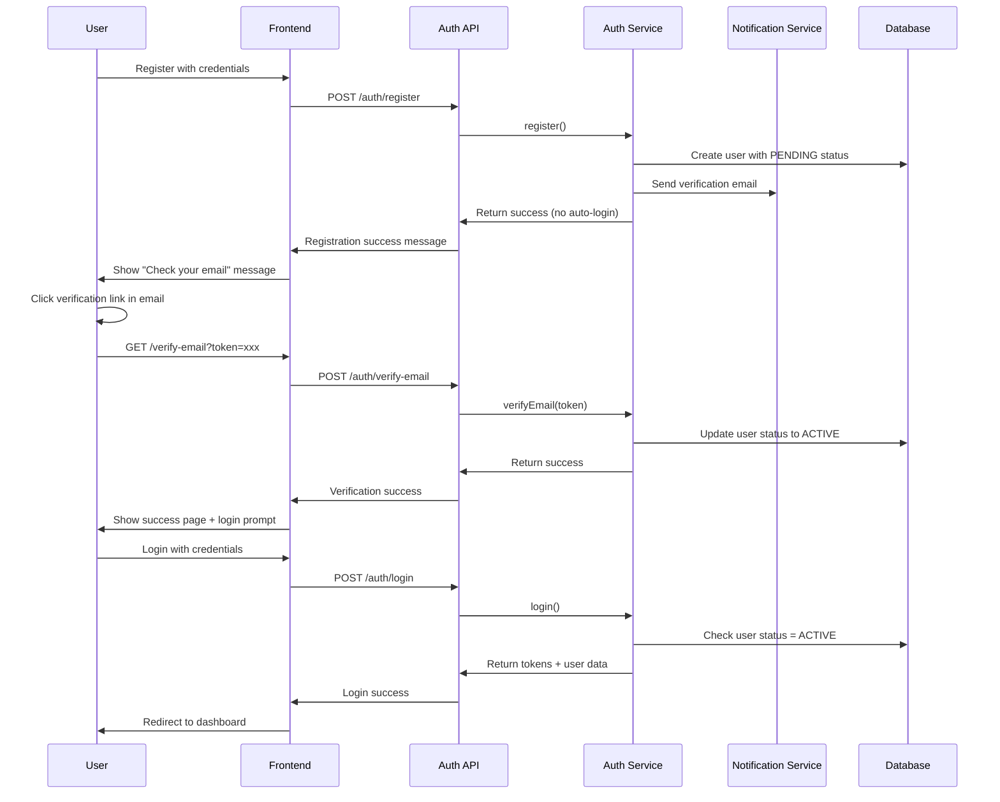

# Design Document - Email Verification Flow

## Overview

This design document outlines the implementation of a mandatory email verification flow for the attendance management system. The system will be modified to require email verification before users can log in, replacing the current automatic login behavior after registration.

The design leverages the existing authentication infrastructure while adding new verification token management, email sending capabilities, and login flow modifications.

## Architecture

### High-Level Flow



### System Components

1. **Authentication Controller** - Modified to handle verification flow
2. **Authentication Service** - Enhanced with email verification logic
3. **User Model** - Extended with verification status tracking
4. **Notification Service** - Email sending for verification
5. **Token Management** - Secure token generation and validation
6. **Database Collections** - Storage for verification tokens

## Components and Interfaces

### 1. Email Verification Token Model

```typescript
interface EmailVerificationToken {
  id: string;
  userId: string;
  token: string; // Hashed version stored in DB
  expiresAt: Date;
  isUsed: boolean;
  createdAt: Date;
  ipAddress?: string;
  userAgent?: string;
}
```

### 2. Modified User Model Extensions

```typescript
// Additional fields for User model
interface UserVerificationFields {
  emailVerified: boolean; // Already exists
  emailVerificationSentAt?: Date;
  emailVerificationAttempts: number;
  lastVerificationRequestAt?: Date;
}
```

### 3. Authentication Service Extensions

```typescript
interface AuthServiceVerificationMethods {
  // Generate and send verification email
  sendEmailVerification(userId: string, ipAddress?: string): Promise<void>;
  
  // Verify email with token
  verifyEmail(token: string, ipAddress?: string): Promise<void>;
  
  // Resend verification email
  resendEmailVerification(email: string, ipAddress?: string): Promise<void>;
  
  // Check if user can request new verification
  canRequestVerification(userId: string): Promise<boolean>;
  
  // Clean up expired tokens
  cleanupExpiredTokens(): Promise<void>;
}
```

### 4. API Endpoints

#### Modified Endpoints

- `POST /auth/register` - No longer auto-logs in user
- `POST /auth/login` - Checks email verification status

#### New/Enhanced Endpoints

- `POST /auth/verify-email` - Verify email with token
- `POST /auth/send-email-verification` - Resend verification email
- `GET /auth/verify-email/:token` - Direct link verification (optional)

### 5. Email Templates

```typescript
interface VerificationEmailTemplate {
  subject: string;
  htmlContent: string;
  textContent: string;
  variables: {
    userName: string;
    verificationUrl: string;
    expirationTime: string;
    supportEmail: string;
  };
}
```

## Data Models

### Database Collections

#### 1. email_verification_tokens Collection

```typescript
{
  id: string; // Document ID
  userId: string; // Reference to users collection
  hashedToken: string; // SHA-256 hash of the actual token
  expiresAt: Timestamp;
  isUsed: boolean;
  createdAt: Timestamp;
  usedAt?: Timestamp;
  ipAddress?: string;
  userAgent?: string;
  metadata?: {
    resendCount: number;
    originalRequestIp: string;
  };
}
```

#### 2. Modified users Collection

```typescript
// Additional fields added to existing User document
{
  // ... existing fields
  emailVerified: boolean; // Already exists
  emailVerificationSentAt?: Timestamp;
  emailVerificationAttempts: number;
  lastVerificationRequestAt?: Timestamp;
  verificationHistory?: Array<{
    sentAt: Timestamp;
    verifiedAt?: Timestamp;
    ipAddress: string;
  }>;
}
```

### Token Security

- **Token Generation**: 32-byte cryptographically secure random token
- **Storage**: Only SHA-256 hash stored in database
- **Transmission**: Full token sent via email link
- **Expiration**: 24 hours from generation
- **Single Use**: Token invalidated after successful verification

## Error Handling

### Error Scenarios and Responses

#### Registration Flow

```typescript
// Registration success (no auto-login)
{
  success: true,
  message: "Inscription réussie. Vérifiez votre email pour activer votre compte.",
  data: {
    email: "user@example.com",
    verificationSent: true,
    expiresIn: "24 heures"
  }
}

// Email sending failure (registration still succeeds)
{
  success: true,
  message: "Inscription réussie. Erreur lors de l'envoi de l'email de vérification.",
  data: {
    email: "user@example.com",
    verificationSent: false,
    canResend: true
  },
  warning: "Vous pouvez demander un nouveau lien de vérification."
}
```

#### Login Flow

```typescript
// Email not verified
{
  success: false,
  error: "EMAIL_NOT_VERIFIED",
  message: "Votre email n'est pas encore vérifié. Vérifiez votre boîte mail.",
  data: {
    email: "user@example.com",
    canResendVerification: true,
    lastVerificationSent: "2024-01-15T10:30:00Z"
  }
}
```

#### Verification Flow

```typescript
// Token expired
{
  success: false,
  error: "VERIFICATION_TOKEN_EXPIRED",
  message: "Le lien de vérification a expiré. Demandez un nouveau lien.",
  data: {
    canResend: true,
    email: "user@example.com"
  }
}

// Token already used
{
  success: false,
  error: "VERIFICATION_TOKEN_USED",
  message: "Ce lien de vérification a déjà été utilisé.",
  data: {
    emailAlreadyVerified: true
  }
}

// Invalid token
{
  success: false,
  error: "INVALID_VERIFICATION_TOKEN",
  message: "Lien de vérification invalide.",
  data: {
    canResend: true
  }
}
```

### Rate Limiting

- **Verification Email Sending**: 3 requests per hour per email
- **Verification Attempts**: 10 attempts per hour per IP
- **Registration**: Existing rate limits maintained

## Testing Strategy

### Unit Tests

#### Authentication Service Tests

```typescript
describe('Email Verification Flow', () => {
  describe('sendEmailVerification', () => {
    it('should generate secure token and send email');
    it('should invalidate previous tokens');
    it('should respect rate limits');
    it('should handle email service failures gracefully');
  });

  describe('verifyEmail', () => {
    it('should verify valid token and activate user');
    it('should reject expired tokens');
    it('should reject already used tokens');
    it('should reject invalid tokens');
    it('should update user status to ACTIVE');
  });

  describe('modified register', () => {
    it('should create user with PENDING status');
    it('should send verification email');
    it('should not auto-login user');
    it('should handle email sending failures');
  });

  describe('modified login', () => {
    it('should reject login for unverified users');
    it('should allow login for verified users');
    it('should provide helpful error messages');
  });
});
```

#### Integration Tests

```typescript
describe('Email Verification Integration', () => {
  it('should complete full registration -> verification -> login flow');
  it('should handle token expiration correctly');
  it('should allow resending verification emails');
  it('should prevent multiple verifications of same token');
  it('should clean up expired tokens');
});
```

### API Tests

```typescript
describe('Email Verification API', () => {
  describe('POST /auth/register', () => {
    it('should return success without auto-login');
    it('should indicate verification email sent');
  });

  describe('POST /auth/verify-email', () => {
    it('should verify valid token');
    it('should return appropriate errors for invalid tokens');
  });

  describe('POST /auth/login', () => {
    it('should reject unverified users');
    it('should accept verified users');
  });

  describe('POST /auth/send-email-verification', () => {
    it('should resend verification email');
    it('should respect rate limits');
  });
});
```

### Email Testing

- **Template Rendering**: Verify all variables are populated
- **Link Generation**: Ensure verification URLs are correct
- **Delivery Testing**: Mock email service for automated tests
- **Content Validation**: Check both HTML and text versions

### Security Testing

- **Token Security**: Verify tokens are cryptographically secure
- **Hash Verification**: Ensure only hashes are stored
- **Rate Limit Testing**: Verify all rate limits are enforced
- **Injection Testing**: Test for potential security vulnerabilities

## Implementation Notes

### Database Indexes

```typescript
// email_verification_tokens collection
{
  "userId": 1,
  "expiresAt": 1
}

{
  "hashedToken": 1
}

{
  "expiresAt": 1 // For cleanup operations
}
```

### Environment Variables

```typescript
// Required environment variables
EMAIL_VERIFICATION_EXPIRES_HOURS=24
EMAIL_VERIFICATION_RATE_LIMIT_PER_HOUR=3
FRONTEND_URL=https://app.attendance-x.com
SUPPORT_EMAIL=support@attendance-x.com
```

### Email Template Configuration

The system will use the existing notification service with a new template:

```typescript
const EMAIL_VERIFICATION_TEMPLATE = {
  id: 'email_verification',
  type: NotificationType.EMAIL_VERIFICATION,
  title: 'Vérifiez votre adresse email - Attendance-X',
  content: `
    Bonjour {{userName}},
    
    Merci de vous être inscrit sur Attendance-X. 
    Pour activer votre compte, cliquez sur le lien ci-dessous :
    
    {{verificationUrl}}
    
    Ce lien expire dans {{expirationTime}}.
    
    Si vous n'avez pas créé de compte, ignorez cet email.
  `,
  channels: [NotificationChannel.EMAIL],
  priority: NotificationPriority.HIGH
};
```

### Migration Strategy

1. **Phase 1**: Deploy new verification logic without enforcing it
2. **Phase 2**: Enable verification requirement for new registrations
3. **Phase 3**: Handle existing users (optional verification prompt)
4. **Phase 4**: Full enforcement for all users

### Monitoring and Metrics

- **Verification Success Rate**: Track successful verifications vs sent emails
- **Token Expiration Rate**: Monitor how many tokens expire unused
- **Email Delivery Rate**: Track email service success/failure rates
- **User Conversion Rate**: Registration to first login completion
- **Support Requests**: Monitor verification-related support tickets