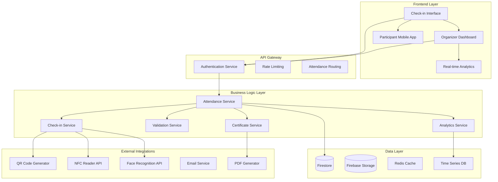
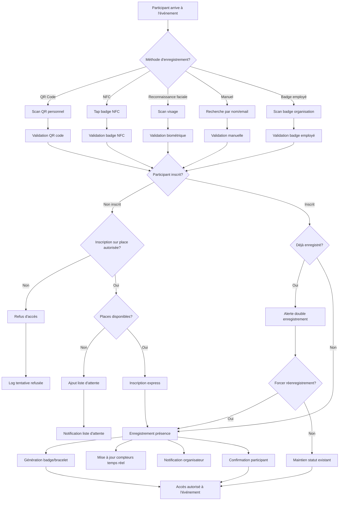
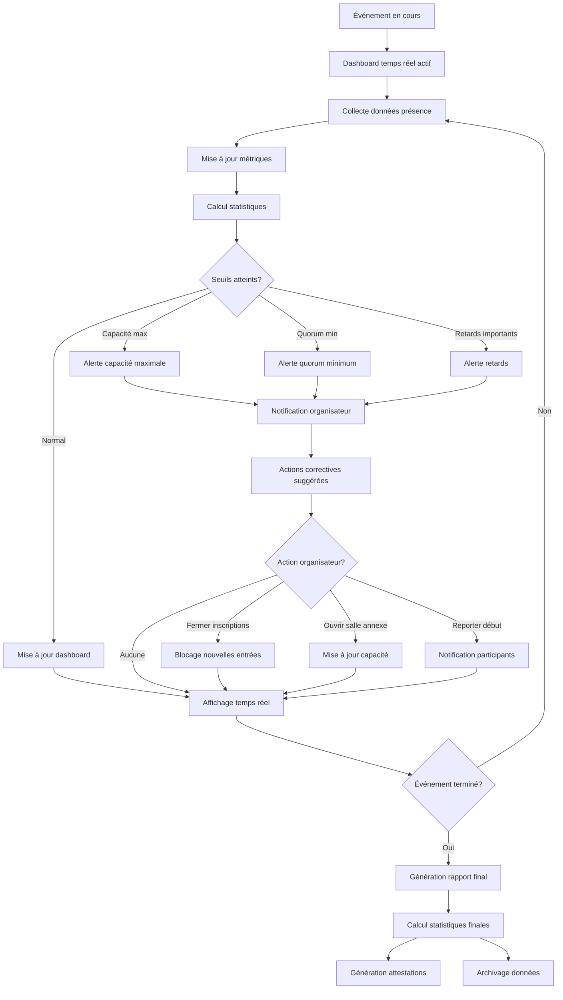
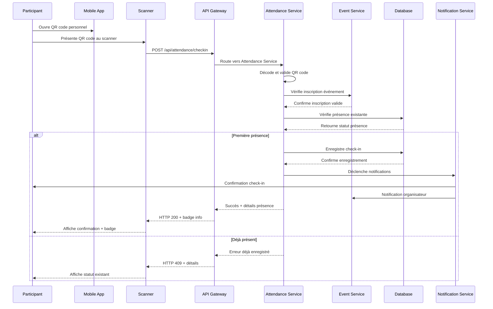
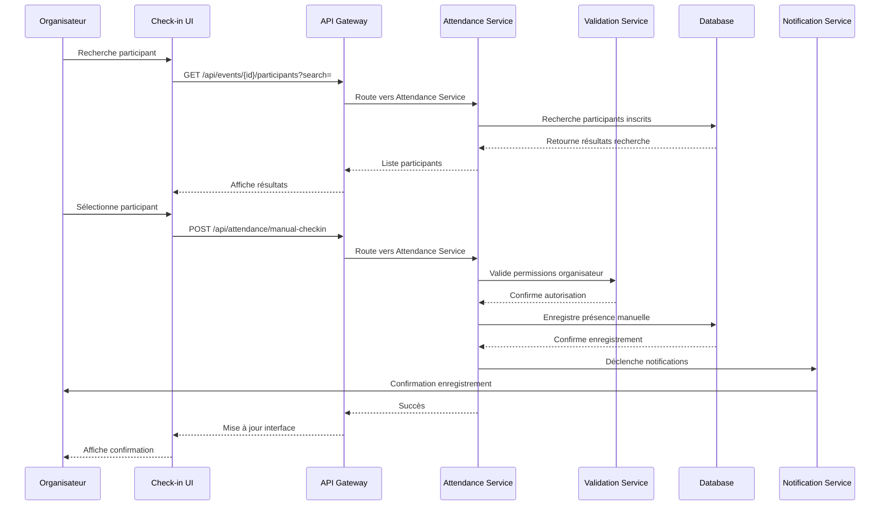

# Design Document - Gestion des présences aux événements

## Overview

Le système de gestion des présences aux événements permet de tracer précisément qui assiste aux événements, avec des méthodes d'enregistrement multiples (QR codes, NFC, reconnaissance faciale), suivi temps réel, et génération d'attestations. Il fait le pont entre la gestion d'événements et la gestion de présence générale.

## Architecture

### Architecture Générale



### Diagramme de Flow - Processus d'Enregistrement



### Diagramme de Flow - Suivi Temps Réel



### Diagrammes de Séquence

#### Séquence d'Enregistrement QR Code



#### Séquence de Validation Manuelle



## Components and Interfaces

### Services Backend

#### AttendanceService
```typescript
interface AttendanceService {
  checkIn(eventId: string, method: CheckInMethod, data: CheckInData): Promise<AttendanceRecord>
  checkOut(eventId: string, participantId: string): Promise<AttendanceRecord>
  getAttendanceStatus(eventId: string, participantId: string): Promise<AttendanceStatus>
  getRealTimeStats(eventId: string): Promise<RealTimeStats>
  getAttendanceHistory(eventId: string): Promise<AttendanceRecord[]>
  bulkCheckIn(eventId: string, participants: BulkCheckInData[]): Promise<BulkCheckInResult>
}
```

#### ValidationService
```typescript
interface ValidationService {
  validateQRCode(qrCode: string, eventId: string): Promise<ValidationResult>
  validateNFC(nfcData: string, eventId: string): Promise<ValidationResult>
  validateBiometric(biometricData: BiometricData, eventId: string): Promise<ValidationResult>
  validateManualEntry(participantId: string, eventId: string, organizerId: string): Promise<ValidationResult>
}
```

#### CertificateService
```typescript
interface CertificateService {
  generateAttendanceCertificate(attendanceId: string): Promise<Certificate>
  bulkGenerateCertificates(eventId: string): Promise<Certificate[]>
  validateCertificate(certificateId: string): Promise<CertificateValidation>
  customizeCertificateTemplate(organizationId: string, template: CertificateTemplate): Promise<void>
}
```

### Composants Frontend

#### CheckInInterface
```typescript
interface CheckInInterfaceProps {
  eventId: string
  methods: CheckInMethod[]
  onCheckIn: (result: CheckInResult) => void
  onError: (error: CheckInError) => void
  realTimeMode: boolean
}
```

#### AttendanceDashboard
```typescript
interface AttendanceDashboardProps {
  eventId: string
  realTimeStats: RealTimeStats
  attendanceRecords: AttendanceRecord[]
  onExportData: (format: ExportFormat) => void
  onGenerateCertificates: () => void
}
```

#### QRCodeScanner
```typescript
interface QRCodeScannerProps {
  eventId: string
  onScanSuccess: (qrData: string) => void
  onScanError: (error: ScanError) => void
  continuousMode: boolean
  soundEnabled: boolean
}
```

## Data Models

### Core Entities

```typescript
interface AttendanceRecord {
  id: string
  eventId: string
  participantId: string
  organizationId: string
  
  // Check-in Details
  checkInTime: Date
  checkInMethod: CheckInMethod
  checkInLocation?: GeoLocation
  checkInDevice?: DeviceInfo
  checkInBy?: string // ID of person who performed manual check-in
  
  // Check-out Details (optional)
  checkOutTime?: Date
  checkOutMethod?: CheckInMethod
  checkOutLocation?: GeoLocation
  
  // Duration
  duration?: number // minutes
  
  // Validation
  validated: boolean
  validatedBy?: string
  validatedAt?: Date
  validationNotes?: string
  
  // Status
  status: AttendanceStatus
  
  // Additional Data
  customData?: Record<string, any>
  notes?: string
  
  // Metadata
  source: 'QR_CODE' | 'NFC' | 'BIOMETRIC' | 'MANUAL' | 'BULK_IMPORT'
  
  createdAt: Date
  updatedAt: Date
}

interface CheckInMethod {
  type: 'QR_CODE' | 'NFC' | 'BIOMETRIC' | 'MANUAL' | 'BADGE'
  enabled: boolean
  configuration?: {
    // QR Code settings
    qrCodeExpiry?: number // minutes
    qrCodeRefreshInterval?: number // minutes
    
    // NFC settings
    nfcTimeout?: number // seconds
    nfcRetryAttempts?: number
    
    // Biometric settings
    biometricThreshold?: number // confidence level 0-1
    biometricFallback?: boolean
    
    // Manual settings
    requiresApproval?: boolean
    allowedRoles?: string[]
    
    // Badge settings
    badgeTypes?: string[]
    badgeValidation?: 'STRICT' | 'LENIENT'
  }
}

interface RealTimeStats {
  eventId: string
  timestamp: Date
  
  // Capacity
  totalCapacity: number
  currentAttendance: number
  availableSpots: number
  waitlistCount: number
  
  // Registration vs Attendance
  totalRegistered: number
  checkedIn: number
  noShows: number
  attendanceRate: number // percentage
  
  // Timing
  eventStartTime: Date
  eventEndTime?: Date
  averageCheckInTime: number // minutes from event start
  lateArrivals: number
  
  // Methods
  checkInMethodStats: {
    method: CheckInMethod['type']
    count: number
    percentage: number
  }[]
  
  // Trends
  checkInTrend: {
    timestamp: Date
    cumulativeCount: number
  }[]
  
  // Alerts
  activeAlerts: Alert[]
}

interface Certificate {
  id: string
  attendanceRecordId: string
  eventId: string
  participantId: string
  organizationId: string
  
  // Certificate Details
  certificateNumber: string
  issueDate: Date
  validUntil?: Date
  
  // Content
  title: string
  description: string
  participantName: string
  eventTitle: string
  eventDate: Date
  duration?: number // minutes
  
  // Validation
  verificationCode: string
  digitalSignature: string
  
  // Files
  pdfUrl: string
  thumbnailUrl?: string
  
  // Template
  templateId: string
  templateVersion: string
  
  // Status
  status: 'ACTIVE' | 'REVOKED' | 'EXPIRED'
  
  createdAt: Date
  updatedAt: Date
}
```

### Supporting Types

```typescript
interface CheckInData {
  // Common
  participantId?: string
  eventId: string
  timestamp: Date
  location?: GeoLocation
  deviceInfo?: DeviceInfo
  
  // Method-specific data
  qrCode?: string
  nfcData?: string
  biometricData?: BiometricData
  manualEntry?: {
    searchTerm: string
    selectedParticipant: string
    performedBy: string
    reason?: string
  }
  badgeData?: {
    badgeId: string
    badgeType: string
    employeeId?: string
  }
}

interface BiometricData {
  type: 'FACE' | 'FINGERPRINT' | 'IRIS'
  data: string // base64 encoded
  confidence: number
  deviceId: string
  timestamp: Date
}

interface ValidationResult {
  valid: boolean
  participantId?: string
  participantInfo?: ParticipantInfo
  errorCode?: ValidationErrorCode
  errorMessage?: string
  warnings?: string[]
  metadata?: Record<string, any>
}

interface Alert {
  id: string
  type: 'CAPACITY_WARNING' | 'CAPACITY_FULL' | 'LOW_ATTENDANCE' | 'TECHNICAL_ISSUE'
  severity: 'LOW' | 'MEDIUM' | 'HIGH' | 'CRITICAL'
  message: string
  timestamp: Date
  acknowledged: boolean
  acknowledgedBy?: string
  acknowledgedAt?: Date
  actions?: AlertAction[]
}

interface AlertAction {
  id: string
  label: string
  action: string
  parameters?: Record<string, any>
  requiresConfirmation: boolean
}

enum AttendanceStatus {
  CHECKED_IN = 'CHECKED_IN',
  CHECKED_OUT = 'CHECKED_OUT',
  PRESENT = 'PRESENT',
  ABSENT = 'ABSENT',
  LATE = 'LATE',
  LEFT_EARLY = 'LEFT_EARLY',
  PENDING_VALIDATION = 'PENDING_VALIDATION'
}

enum ValidationErrorCode {
  INVALID_QR_CODE = 'INVALID_QR_CODE',
  EXPIRED_QR_CODE = 'EXPIRED_QR_CODE',
  PARTICIPANT_NOT_REGISTERED = 'PARTICIPANT_NOT_REGISTERED',
  ALREADY_CHECKED_IN = 'ALREADY_CHECKED_IN',
  EVENT_NOT_STARTED = 'EVENT_NOT_STARTED',
  EVENT_ENDED = 'EVENT_ENDED',
  CAPACITY_EXCEEDED = 'CAPACITY_EXCEEDED',
  BIOMETRIC_MATCH_FAILED = 'BIOMETRIC_MATCH_FAILED',
  NFC_READ_ERROR = 'NFC_READ_ERROR',
  INSUFFICIENT_PERMISSIONS = 'INSUFFICIENT_PERMISSIONS'
}
```

## Error Handling

### Stratégie de Gestion d'Erreurs

```typescript
interface AttendanceError {
  code: ValidationErrorCode
  message: string
  details?: any
  timestamp: Date
  eventId?: string
  participantId?: string
  method?: CheckInMethod['type']
  recoverable: boolean
  suggestedActions?: string[]
}
```

### Gestion des Cas d'Erreur

1. **Erreurs de Lecture**
   - Retry automatique pour QR/NFC
   - Fallback sur méthodes alternatives
   - Mode dégradé manuel

2. **Erreurs de Validation**
   - Messages contextuels
   - Suggestions de correction
   - Escalade vers organisateur

3. **Erreurs de Connectivité**
   - Mode hors-ligne avec synchronisation
   - Queue des enregistrements
   - Résolution des conflits

## Testing Strategy

### Tests Unitaires
- Services de validation
- Logique de génération de certificats
- Calculs statistiques temps réel

### Tests d'Intégration
- Intégrations biométriques
- Génération PDF
- Synchronisation temps réel

### Tests End-to-End
- Parcours complet check-in
- Tests multi-méthodes
- Tests de charge sur événements

### Tests de Performance
- Gestion d'affluence massive
- Optimisation temps de réponse
- Scalabilité temps réel