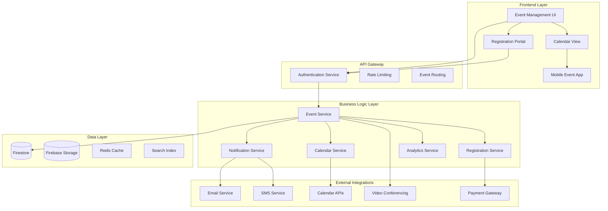
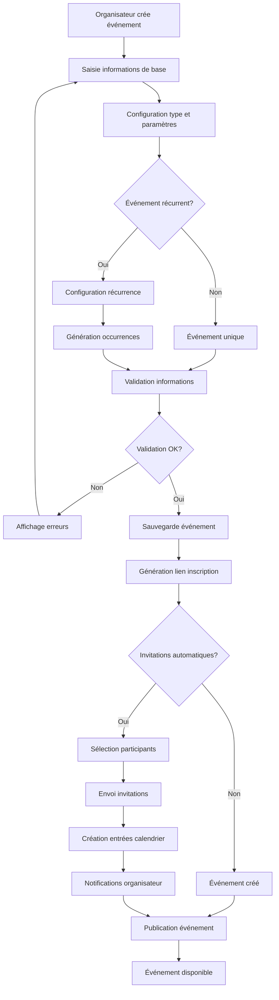
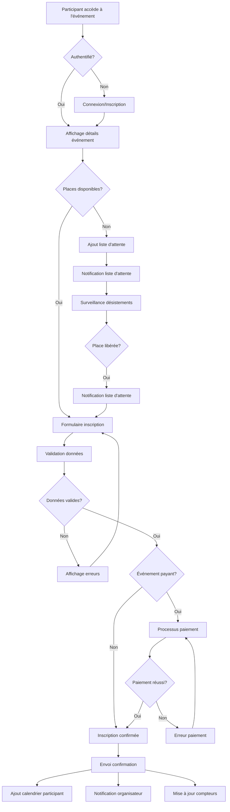
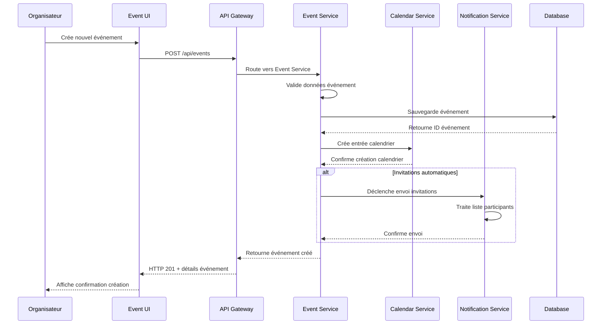
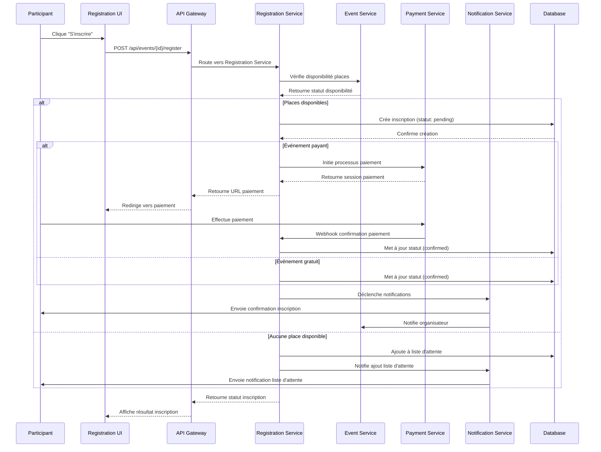

# Design Document - Gestion d'événements

## Overview

Le système de gestion d'événements permet aux organisations de créer, planifier et gérer des événements internes ou externes, avec gestion complète des invitations, inscriptions, et suivi des participations. L'architecture est conçue pour supporter des événements de toutes tailles avec notifications temps réel et intégrations calendaires.

## Architecture

### Architecture Générale



### Diagramme de Flow - Création d'Événement



### Diagramme de Flow - Processus d'Inscription



### Diagrammes de Séquence

#### Séquence de Création d'Événement



#### Séquence d'Inscription à un Événement



## Components and Interfaces

### Services Backend

#### EventService
```typescript
interface EventService {
  createEvent(event: CreateEventRequest): Promise<Event>
  updateEvent(eventId: string, updates: UpdateEventRequest): Promise<Event>
  deleteEvent(eventId: string, organizerId: string): Promise<void>
  getEvent(eventId: string): Promise<Event>
  getEvents(filters: EventFilters): Promise<PaginatedEvents>
  duplicateEvent(eventId: string, newDate: Date): Promise<Event>
  cancelEvent(eventId: string, reason: string): Promise<void>
}
```

#### RegistrationService
```typescript
interface RegistrationService {
  registerParticipant(eventId: string, participant: ParticipantInfo): Promise<Registration>
  cancelRegistration(registrationId: string): Promise<void>
  getRegistrations(eventId: string): Promise<Registration[]>
  getParticipantRegistrations(participantId: string): Promise<Registration[]>
  moveFromWaitlist(eventId: string, participantId: string): Promise<Registration>
  bulkRegister(eventId: string, participants: ParticipantInfo[]): Promise<Registration[]>
}
```

#### CalendarService
```typescript
interface CalendarService {
  createCalendarEvent(event: Event): Promise<CalendarEntry>
  updateCalendarEvent(eventId: string, updates: CalendarUpdate): Promise<void>
  deleteCalendarEvent(eventId: string): Promise<void>
  generateICSFile(event: Event): Promise<string>
  syncWithExternalCalendar(eventId: string, calendarType: CalendarType): Promise<void>
}
```

### Composants Frontend

#### EventCreationWizard
```typescript
interface EventCreationWizardProps {
  organizationId: string
  onEventCreated: (event: Event) => void
  onCancel: () => void
  defaultValues?: Partial<CreateEventRequest>
}
```

#### EventCalendar
```typescript
interface EventCalendarProps {
  events: Event[]
  view: 'month' | 'week' | 'day' | 'agenda'
  onEventClick: (event: Event) => void
  onDateSelect: (date: Date) => void
  onViewChange: (view: CalendarView) => void
  filters: EventFilters
}
```

#### RegistrationForm
```typescript
interface RegistrationFormProps {
  event: Event
  participant?: ParticipantInfo
  onSubmit: (registration: RegistrationData) => void
  onCancel: () => void
  paymentRequired: boolean
}
```

#### EventDashboard
```typescript
interface EventDashboardProps {
  event: Event
  registrations: Registration[]
  analytics: EventAnalytics
  onUpdateEvent: (updates: UpdateEventRequest) => void
  onSendReminder: (recipients: string[]) => void
}
```

## Data Models

### Core Entities

```typescript
interface Event {
  id: string
  organizationId: string
  organizerId: string
  title: string
  description: string
  type: EventType
  category: string
  
  // Timing
  startDate: Date
  endDate: Date
  timezone: string
  allDay: boolean
  
  // Location
  location: EventLocation
  
  // Capacity
  maxParticipants?: number
  currentParticipants: number
  waitlistEnabled: boolean
  waitlistCount: number
  
  // Registration
  registrationRequired: boolean
  registrationDeadline?: Date
  registrationFields: CustomField[]
  
  // Pricing
  pricing: EventPricing
  
  // Recurrence
  recurrence?: RecurrenceRule
  parentEventId?: string
  
  // Settings
  visibility: 'PUBLIC' | 'PRIVATE' | 'ORGANIZATION'
  autoApproval: boolean
  allowCancellation: boolean
  cancellationDeadline?: Date
  
  // Media
  coverImage?: string
  attachments: string[]
  
  // Status
  status: 'DRAFT' | 'PUBLISHED' | 'CANCELLED' | 'COMPLETED'
  
  // Metadata
  tags: string[]
  customFields: Record<string, any>
  
  createdAt: Date
  updatedAt: Date
}

interface Registration {
  id: string
  eventId: string
  participantId: string
  organizationId: string
  
  // Participant Info
  participantInfo: ParticipantInfo
  
  // Registration Details
  registrationDate: Date
  status: 'PENDING' | 'CONFIRMED' | 'CANCELLED' | 'WAITLIST' | 'NO_SHOW'
  
  // Payment
  paymentStatus?: 'PENDING' | 'COMPLETED' | 'FAILED' | 'REFUNDED'
  paymentId?: string
  amount?: number
  
  // Custom Data
  customResponses: Record<string, any>
  
  // Attendance
  checkedIn: boolean
  checkedInAt?: Date
  checkedInBy?: string
  
  // Communication
  remindersSent: Date[]
  lastNotificationSent?: Date
  
  // Metadata
  source: 'DIRECT' | 'INVITATION' | 'BULK_IMPORT' | 'API'
  notes?: string
  
  createdAt: Date
  updatedAt: Date
}

interface EventType {
  id: string
  name: string
  organizationId: string
  
  // Configuration
  defaultDuration: number // minutes
  defaultCapacity?: number
  requiresApproval: boolean
  allowsWaitlist: boolean
  
  // Fields
  requiredFields: string[]
  customFields: CustomField[]
  
  // Templates
  emailTemplates: {
    invitation?: string
    confirmation?: string
    reminder?: string
    cancellation?: string
  }
  
  // Settings
  color: string
  icon?: string
  
  createdAt: Date
  updatedAt: Date
}
```

### Supporting Types

```typescript
interface EventLocation {
  type: 'PHYSICAL' | 'VIRTUAL' | 'HYBRID'
  
  // Physical location
  venue?: {
    name: string
    address: string
    city: string
    country: string
    coordinates?: {
      latitude: number
      longitude: number
    }
    capacity?: number
    amenities?: string[]
  }
  
  // Virtual location
  virtual?: {
    platform: 'ZOOM' | 'TEAMS' | 'MEET' | 'WEBEX' | 'CUSTOM'
    meetingUrl?: string
    meetingId?: string
    password?: string
    dialInNumbers?: string[]
  }
  
  // Instructions
  instructions?: string
  accessRequirements?: string[]
}

interface EventPricing {
  type: 'FREE' | 'PAID' | 'TIERED'
  
  // Simple pricing
  price?: number
  currency?: string
  
  // Tiered pricing
  tiers?: {
    name: string
    price: number
    description?: string
    maxQuantity?: number
    availableUntil?: Date
  }[]
  
  // Discounts
  discounts?: {
    code: string
    type: 'PERCENTAGE' | 'FIXED'
    value: number
    validUntil?: Date
    maxUses?: number
    currentUses: number
  }[]
}

interface RecurrenceRule {
  frequency: 'DAILY' | 'WEEKLY' | 'MONTHLY' | 'YEARLY'
  interval: number
  daysOfWeek?: number[] // 0=Sunday, 1=Monday, etc.
  dayOfMonth?: number
  weekOfMonth?: number
  monthOfYear?: number
  endDate?: Date
  occurrences?: number
  exceptions?: Date[]
}

interface ParticipantInfo {
  id?: string
  email: string
  firstName: string
  lastName: string
  phone?: string
  organization?: string
  title?: string
  dietaryRestrictions?: string[]
  accessibilityNeeds?: string[]
  customFields?: Record<string, any>
}

interface CustomField {
  id: string
  name: string
  type: 'TEXT' | 'EMAIL' | 'PHONE' | 'SELECT' | 'MULTISELECT' | 'CHECKBOX' | 'DATE' | 'FILE'
  required: boolean
  options?: string[] // for SELECT/MULTISELECT
  validation?: {
    minLength?: number
    maxLength?: number
    pattern?: string
    fileTypes?: string[]
    maxFileSize?: number
  }
  placeholder?: string
  helpText?: string
}
```

## Error Handling

### Stratégie de Gestion d'Erreurs

```typescript
enum EventErrorCode {
  EVENT_NOT_FOUND = 'EVENT_NOT_FOUND',
  REGISTRATION_CLOSED = 'REGISTRATION_CLOSED',
  EVENT_FULL = 'EVENT_FULL',
  ALREADY_REGISTERED = 'ALREADY_REGISTERED',
  PAYMENT_REQUIRED = 'PAYMENT_REQUIRED',
  PAYMENT_FAILED = 'PAYMENT_FAILED',
  INVALID_REGISTRATION_DATA = 'INVALID_REGISTRATION_DATA',
  CANCELLATION_NOT_ALLOWED = 'CANCELLATION_NOT_ALLOWED',
  INSUFFICIENT_PERMISSIONS = 'INSUFFICIENT_PERMISSIONS'
}

interface EventError {
  code: EventErrorCode
  message: string
  details?: any
  timestamp: Date
  eventId?: string
  participantId?: string
}
```

### Gestion des Cas d'Erreur

1. **Erreurs de Capacité**
   - Gestion des inscriptions simultanées
   - Liste d'attente automatique
   - Notifications de places libérées

2. **Erreurs de Paiement**
   - Retry automatique
   - Gestion des timeouts
   - Réconciliation des paiements

3. **Erreurs de Communication**
   - Queue de retry pour emails/SMS
   - Fallback sur différents canaux
   - Logs détaillés des échecs

## Testing Strategy

### Tests Unitaires
- Services métier (EventService, RegistrationService)
- Logique de récurrence
- Calculs de capacité et pricing

### Tests d'Intégration
- API endpoints complets
- Intégrations paiement
- Synchronisation calendaires

### Tests End-to-End
- Parcours complet création/inscription
- Tests multi-utilisateurs
- Tests de charge sur inscriptions

### Tests de Performance
- Gestion d'événements à forte affluence
- Optimisation des requêtes
- Cache et indexation