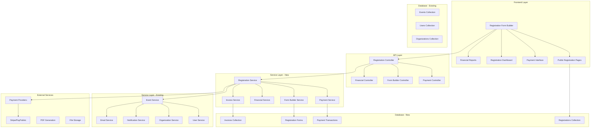

# Event Registration and Payment System Design Document

## Overview

The Event Registration and Payment System is a comprehensive module that extends Attendance-X events with customizable registration forms and integrated payment processing. The system leverages existing Attendance-X infrastructure (events, users, organizations, notifications) while adding new capabilities for form building, payment processing, and financial management.

## Architecture

### High-Level Architecture



### Integration with Existing Attendance-X Infrastructure

The registration and payment system seamlessly integrates with existing components:

- **Event Service**: Extends existing events with registration capabilities
- **User Service**: Links registrations to existing users or creates new ones
- **Organization Service**: Applies organization branding and settings
- **Notification Service**: Sends registration confirmations and updates
- **Email Service**: Handles registration-related communications
- **Authentication**: Uses existing JWT and permission system

## Components and Interfaces

### 1. Registration Form Builder Component

**Purpose**: Creates and manages customizable registration forms for events

**Key Classes**:
```typescript
import { BaseEntity } from "@attendance-x/shared";

interface RegistrationForm extends BaseEntity {
  eventId: string;
  organizationId: string;
  name: string;
  description?: string;
  
  // Form configuration
  fields: FormField[];
  settings: FormSettings;
  branding: FormBranding;
  
  // Status and lifecycle
  status: FormStatus;
  isPublic: boolean;
  publicUrl: string;
  
  // Integration with existing event
  requiresPayment: boolean;
  pricingConfig?: PricingConfiguration;
  
  // Analytics
  stats: FormStatistics;
}

interface FormField {
  id: string;
  type: FieldType;
  label: string;
  placeholder?: string;
  required: boolean;
  validation?: FieldValidation;
  options?: string[]; // For select/radio/checkbox fields
  defaultValue?: any;
  order: number;
  
  // Integration with Attendance-X user fields
  mapToUserField?: keyof User; // Maps to existing user properties
}

enum FieldType {
  TEXT = 'text',
  EMAIL = 'email',
  PHONE = 'phone',
  NUMBER = 'number',
  SELECT = 'select',
  RADIO = 'radio',
  CHECKBOX = 'checkbox',
  TEXTAREA = 'textarea',
  FILE = 'file',
  DATE = 'date',
  TIME = 'time',
  URL = 'url'
}

interface FormSettings {
  maxRegistrations?: number;
  registrationDeadline?: Date;
  allowWaitlist: boolean;
  requireApproval: boolean;
  allowEditing: boolean;
  editDeadline?: Date;
  
  // Integration with existing event settings
  syncWithEventParticipants: boolean;
  autoCreateAttendanceRecords: boolean;
}

interface FormBranding {
  // Uses existing organization branding
  useOrganizationBranding: boolean;
  customLogo?: string;
  primaryColor?: string;
  backgroundColor?: string;
  customCSS?: string;
  
  // Content customization
  welcomeMessage?: string;
  successMessage?: string;
  termsAndConditions?: string;
}

enum FormStatus {
  DRAFT = 'draft',
  PUBLISHED = 'published',
  CLOSED = 'closed',
  ARCHIVED = 'archived'
}
```

**API Endpoints**:
- `POST /api/events/:eventId/registration-form` - Create registration form
- `GET /api/events/:eventId/registration-form` - Get form configuration
- `PUT /api/events/:eventId/registration-form` - Update form
- `POST /api/events/:eventId/registration-form/publish` - Publish form
- `GET /api/registration/:formId/public` - Get public form (no auth required)

### 2. Registration Management Component

**Purpose**: Handles participant registrations and integrates with existing event participants

**Key Classes**:
```typescript
import { User, Event } from "@attendance-x/shared";

interface EventRegistration extends BaseEntity {
  eventId: string;
  formId: string;
  organizationId: string;
  
  // Participant information
  participantId?: string; // Links to existing User if registered user
  participantData: RegistrationData;
  
  // Registration status
  status: RegistrationStatus;
  registrationDate: Date;
  confirmationDate?: Date;
  
  // Payment information
  requiresPayment: boolean;
  paymentStatus?: PaymentStatus;
  paymentId?: string;
  amountPaid?: number;
  
  // Waitlist management
  waitlistPosition?: number;
  waitlistNotifiedAt?: Date;
  
  // Integration with existing systems
  attendanceRecordId?: string; // Links to attendance tracking
  certificateId?: string; // Links to certificate generation
}

interface RegistrationData {
  // Standard fields that map to User model
  firstName: string;
  lastName: string;
  email: string;
  phone?: string;
  organization?: string;
  
  // Custom form fields
  customFields: Record<string, any>;
  
  // Consent and agreements
  termsAccepted: boolean;
  marketingConsent?: boolean;
  dataProcessingConsent: boolean;
}

enum RegistrationStatus {
  PENDING = 'pending',
  CONFIRMED = 'confirmed',
  WAITLISTED = 'waitlisted',
  CANCELLED = 'cancelled',
  REJECTED = 'rejected',
  EXPIRED = 'expired'
}

enum PaymentStatus {
  PENDING = 'pending',
  PROCESSING = 'processing',
  COMPLETED = 'completed',
  FAILED = 'failed',
  REFUNDED = 'refunded',
  PARTIALLY_REFUNDED = 'partially_refunded'
}
```

**API Endpoints**:
- `POST /api/registration/:formId/submit` - Submit registration (public)
- `GET /api/events/:eventId/registrations` - List event registrations
- `GET /api/registrations/:registrationId` - Get registration details
- `PUT /api/registrations/:registrationId/status` - Update registration status
- `POST /api/registrations/:registrationId/approve` - Approve registration
- `POST /api/registrations/:registrationId/cancel` - Cancel registration

### 3. Payment Processing Component

**Purpose**: Handles payment processing, pricing, and financial transactions

**Key Classes**:
```typescript
interface PricingConfiguration {
  eventId: string;
  organizationId: string;
  
  // Pricing structure
  pricingTiers: PricingTier[];
  currency: string;
  taxRate?: number;
  
  // Promotional codes
  promoCodes: PromoCode[];
  
  // Payment settings
  paymentMethods: PaymentMethod[];
  paymentDeadline?: Date;
  
  // Regional payment configuration
  regionalPaymentConfig: RegionalPaymentConfig;
  
  // Integration with existing organization billing
  useOrganizationPaymentConfig: boolean;
}

interface RegionalPaymentConfig {
  // Auto-detect based on organization location or manual override
  targetCountry?: string;
  targetRegion?: 'africa' | 'asia' | 'europe' | 'americas' | 'oceania';
  
  // Mobile money configuration by country
  mobileMoneyProviders: MobileMoneyProvider[];
  
  // Currency and localization
  supportedCurrencies: string[];
  defaultCurrency: string;
  
  // Regional compliance
  taxConfiguration?: RegionalTaxConfig;
  complianceRequirements?: string[];
}

interface MobileMoneyProvider {
  method: PaymentMethod;
  displayName: string;
  countries: string[]; // ISO country codes
  currencies: string[]; // Supported currencies
  isActive: boolean;
  
  // Provider-specific configuration
  providerConfig: {
    apiEndpoint?: string;
    merchantId?: string;
    publicKey?: string;
    // Sensitive data stored securely
  };
  
  // Transaction limits and fees
  limits: {
    minAmount?: number;
    maxAmount?: number;
    dailyLimit?: number;
  };
  
  // User experience
  instructions?: string; // Localized instructions for users
  logoUrl?: string;
}

interface PricingTier {
  id: string;
  name: string;
  description?: string;
  price: number;
  
  // Availability
  availableFrom?: Date;
  availableUntil?: Date;
  maxQuantity?: number;
  currentQuantity: number;
  
  // Conditions
  conditions?: PricingCondition[];
  
  // Early bird, student discounts, etc.
  discountType?: 'early_bird' | 'student' | 'member' | 'group' | 'custom';
}

interface PaymentTransaction extends BaseEntity {
  registrationId: string;
  eventId: string;
  organizationId: string;
  
  // Transaction details
  amount: number;
  currency: string;
  taxAmount?: number;
  
  // Payment method and provider
  paymentMethod: PaymentMethod;
  providerId: string;
  providerTransactionId: string;
  
  // Status tracking
  status: PaymentStatus;
  processedAt?: Date;
  
  // Mobile money specific fields
  mobileMoneyData?: MobileMoneyTransactionData;
  
  // Integration with existing systems
  invoiceId?: string;
  refundTransactions?: string[]; // IDs of refund transactions
  
  // Provider-specific data
  providerData: Record<string, any>;
}

interface MobileMoneyTransactionData {
  // Customer mobile money details
  phoneNumber: string;
  countryCode: string;
  operatorCode: string; // MTN, Orange, Airtel, etc.
  
  // Transaction flow
  paymentRequestId?: string; // For USSD/STK push
  confirmationCode?: string;
  
  // Status tracking specific to mobile money
  ussdCode?: string; // Generated USSD code for manual dial
  stkPushSent?: boolean; // For M-Pesa STK push
  customerPrompted?: boolean;
  
  // Reconciliation
  operatorTransactionId?: string;
  operatorReference?: string;
  
  // Fees and charges
  operatorFee?: number;
  platformFee?: number;
}

enum PaymentMethod {
  CREDIT_CARD = 'credit_card',
  DEBIT_CARD = 'debit_card',
  PAYPAL = 'paypal',
  BANK_TRANSFER = 'bank_transfer',
  APPLE_PAY = 'apple_pay',
  GOOGLE_PAY = 'google_pay',
  
  // Mobile Money Solutions by Region
  // Africa
  ORANGE_MONEY = 'orange_money',
  MTN_MOBILE_MONEY = 'mtn_mobile_money',
  AIRTEL_MONEY = 'airtel_money',
  MPESA = 'mpesa', // Kenya, Tanzania
  WAVE = 'wave', // Senegal, Ivory Coast
  MOOV_MONEY = 'moov_money',
  
  // Asia
  GCASH = 'gcash', // Philippines
  PAYMAYA = 'paymaya', // Philippines
  DANA = 'dana', // Indonesia
  OVO = 'ovo', // Indonesia
  GOPAY = 'gopay', // Indonesia
  TRUEMONEY = 'truemoney', // Thailand
  PROMPTPAY = 'promptpay', // Thailand
  
  // Other regions
  BKASH = 'bkash', // Bangladesh
  NAGAD = 'nagad', // Bangladesh
  EASYPAISA = 'easypaisa', // Pakistan
  JAZZCASH = 'jazzcash', // Pakistan
}

interface PromoCode {
  code: string;
  description?: string;
  discountType: 'percentage' | 'fixed_amount';
  discountValue: number;
  
  // Usage limits
  maxUses?: number;
  currentUses: number;
  validFrom?: Date;
  validUntil?: Date;
  
  // Conditions
  minAmount?: number;
  applicableTiers?: string[];
}
```

**API Endpoints**:
- `GET /api/events/:eventId/pricing` - Get event pricing configuration
- `POST /api/events/:eventId/pricing` - Configure event pricing
- `POST /api/registration/:registrationId/payment/initiate` - Initiate payment
- `POST /api/registration/:registrationId/payment/confirm` - Confirm payment
- `GET /api/payments/:paymentId/status` - Get payment status
- `POST /api/payments/:paymentId/refund` - Process refund

**Mobile Money Specific Endpoints**:
- `GET /api/payment/mobile-money/providers/:country` - Get available mobile money providers by country
- `POST /api/registration/:registrationId/payment/mobile-money/initiate` - Initiate mobile money payment
- `POST /api/registration/:registrationId/payment/mobile-money/ussd` - Generate USSD code for payment
- `POST /api/registration/:registrationId/payment/mobile-money/stk-push` - Send STK push (M-Pesa style)
- `POST /api/webhooks/mobile-money/:provider` - Webhook for mobile money provider callbacks
- `GET /api/payment/mobile-money/status/:transactionId` - Check mobile money transaction status

### 4. Mobile Money Payment Component

**Purpose**: Handles mobile money payments with regional provider integration and localized user experience

**Key Classes**:
```typescript
interface MobileMoneyPaymentService {
  // Provider management
  getAvailableProviders(country: string): Promise<MobileMoneyProvider[]>;
  validatePhoneNumber(phoneNumber: string, countryCode: string, operator: string): Promise<boolean>;
  
  // Payment initiation
  initiatePayment(request: MobileMoneyPaymentRequest): Promise<MobileMoneyPaymentResponse>;
  generateUSSDCode(request: MobileMoneyPaymentRequest): Promise<string>;
  sendSTKPush(request: MobileMoneyPaymentRequest): Promise<STKPushResponse>;
  
  // Status and confirmation
  checkPaymentStatus(transactionId: string): Promise<PaymentStatus>;
  handleProviderCallback(provider: string, payload: any): Promise<void>;
  
  // Reconciliation
  reconcileTransactions(provider: string, date: Date): Promise<ReconciliationReport>;
}

interface MobileMoneyPaymentRequest {
  registrationId: string;
  amount: number;
  currency: string;
  phoneNumber: string;
  countryCode: string;
  provider: PaymentMethod;
  
  // Customer information
  customerName?: string;
  customerEmail?: string;
  
  // Transaction metadata
  description: string;
  eventId: string;
  organizationId: string;
}

interface MobileMoneyPaymentResponse {
  success: boolean;
  transactionId: string;
  paymentRequestId?: string;
  
  // User instructions
  instructions: LocalizedInstructions;
  ussdCode?: string;
  stkPushSent?: boolean;
  
  // Status tracking
  status: PaymentStatus;
  expiresAt?: Date;
  
  // Error handling
  error?: {
    code: string;
    message: string;
    localizedMessage: string;
  };
}

interface LocalizedInstructions {
  language: string;
  title: string;
  steps: string[];
  ussdInstructions?: string;
  troubleshooting?: string[];
  supportContact?: string;
}

interface STKPushResponse {
  success: boolean;
  requestId: string;
  message: string;
  localizedMessage: string;
}

// Regional provider configurations
const MOBILE_MONEY_PROVIDERS: Record<string, MobileMoneyProvider[]> = {
  'KE': [ // Kenya
    {
      method: PaymentMethod.MPESA,
      displayName: 'M-Pesa',
      countries: ['KE', 'TZ', 'UG'],
      currencies: ['KES', 'TZS', 'UGX'],
      isActive: true,
      providerConfig: {
        apiEndpoint: 'https://sandbox.safaricom.co.ke',
        // Configuration managed securely
      },
      limits: {
        minAmount: 1,
        maxAmount: 300000, // KES
        dailyLimit: 500000
      },
      instructions: 'Vous recevrez une notification M-Pesa sur votre téléphone. Entrez votre code PIN M-Pesa pour confirmer le paiement.',
      logoUrl: '/assets/payment-logos/mpesa.png'
    }
  ],
  'SN': [ // Senegal
    {
      method: PaymentMethod.ORANGE_MONEY,
      displayName: 'Orange Money',
      countries: ['SN', 'CI', 'ML', 'BF'],
      currencies: ['XOF'],
      isActive: true,
      providerConfig: {
        apiEndpoint: 'https://api.orange.com/orange-money-webpay',
      },
      limits: {
        minAmount: 100,
        maxAmount: 1000000, // XOF
        dailyLimit: 2000000
      },
      instructions: 'Composez le code USSD affiché ou confirmez le paiement via l\'application Orange Money.',
      logoUrl: '/assets/payment-logos/orange-money.png'
    },
    {
      method: PaymentMethod.WAVE,
      displayName: 'Wave',
      countries: ['SN', 'CI'],
      currencies: ['XOF'],
      isActive: true,
      providerConfig: {
        apiEndpoint: 'https://api.wave.com',
      },
      limits: {
        minAmount: 50,
        maxAmount: 500000,
        dailyLimit: 1000000
      },
      instructions: 'Ouvrez votre application Wave et confirmez le paiement avec votre code PIN.',
      logoUrl: '/assets/payment-logos/wave.png'
    }
  ],
  'PH': [ // Philippines
    {
      method: PaymentMethod.GCASH,
      displayName: 'GCash',
      countries: ['PH'],
      currencies: ['PHP'],
      isActive: true,
      providerConfig: {
        apiEndpoint: 'https://api.gcash.com',
      },
      limits: {
        minAmount: 1,
        maxAmount: 500000, // PHP
        dailyLimit: 500000
      },
      instructions: 'You will receive a GCash notification. Open the GCash app and confirm the payment with your MPIN.',
      logoUrl: '/assets/payment-logos/gcash.png'
    }
  ]
  // Additional countries and providers...
};
```

**API Endpoints**:
- `GET /api/mobile-money/providers` - Get all available providers
- `GET /api/mobile-money/providers/:country` - Get providers by country
- `POST /api/mobile-money/validate-phone` - Validate phone number for provider
- `POST /api/mobile-money/payment/initiate` - Initiate mobile money payment
- `GET /api/mobile-money/payment/:id/instructions` - Get localized payment instructions
- `POST /api/mobile-money/payment/:id/resend` - Resend payment notification
- `POST /api/webhooks/mobile-money/:provider/:country` - Provider-specific webhooks

### 5. Invoice and Financial Management Component

**Purpose**: Generates invoices, manages financial records, and provides reporting

**Key Classes**:
```typescript
interface Invoice extends BaseEntity {
  // Invoice identification
  invoiceNumber: string;
  organizationId: string;
  eventId: string;
  registrationId: string;
  
  // Invoice details
  issueDate: Date;
  dueDate?: Date;
  
  // Billing information
  billTo: BillingAddress;
  billFrom: OrganizationBilling; // Uses existing organization data
  
  // Line items
  lineItems: InvoiceLineItem[];
  
  // Totals
  subtotal: number;
  taxAmount: number;
  totalAmount: number;
  currency: string;
  
  // Status
  status: InvoiceStatus;
  paidDate?: Date;
  
  // Integration
  paymentTransactionId?: string;
  pdfUrl?: string; // Generated PDF stored in existing file storage
}

interface InvoiceLineItem {
  description: string;
  quantity: number;
  unitPrice: number;
  totalPrice: number;
  taxRate?: number;
}

enum InvoiceStatus {
  DRAFT = 'draft',
  SENT = 'sent',
  PAID = 'paid',
  OVERDUE = 'overdue',
  CANCELLED = 'cancelled',
  REFUNDED = 'refunded'
}

interface FinancialReport {
  organizationId: string;
  eventId?: string;
  period: ReportPeriod;
  
  // Revenue metrics
  totalRevenue: number;
  totalTransactions: number;
  averageTransactionValue: number;
  
  // Payment method breakdown
  paymentMethodBreakdown: Record<PaymentMethod, number>;
  
  // Refunds and cancellations
  totalRefunds: number;
  refundRate: number;
  
  // Integration with existing analytics
  attendanceCorrelation?: AttendanceFinancialCorrelation;
}
```

**API Endpoints**:
- `GET /api/invoices/:invoiceId` - Get invoice details
- `GET /api/invoices/:invoiceId/pdf` - Download invoice PDF
- `GET /api/events/:eventId/financial-report` - Get event financial report
- `GET /api/organizations/:orgId/financial-summary` - Get organization financial summary
- `POST /api/invoices/:invoiceId/send` - Send invoice via email

## Data Models

### Database Schema Extensions

```sql
-- Registration forms table
CREATE TABLE registration_forms (
  id VARCHAR(255) PRIMARY KEY,
  event_id VARCHAR(255) NOT NULL,
  organization_id VARCHAR(255) NOT NULL,
  name VARCHAR(255) NOT NULL,
  description TEXT,
  fields JSON NOT NULL,
  settings JSON NOT NULL,
  branding JSON NOT NULL,
  status VARCHAR(50) NOT NULL DEFAULT 'draft',
  is_public BOOLEAN DEFAULT FALSE,
  public_url VARCHAR(500),
  requires_payment BOOLEAN DEFAULT FALSE,
  pricing_config JSON,
  stats JSON,
  created_at TIMESTAMP DEFAULT CURRENT_TIMESTAMP,
  updated_at TIMESTAMP DEFAULT CURRENT_TIMESTAMP ON UPDATE CURRENT_TIMESTAMP,
  created_by VARCHAR(255) NOT NULL,
  INDEX idx_event_id (event_id),
  INDEX idx_organization_id (organization_id),
  INDEX idx_status (status),
  FOREIGN KEY (event_id) REFERENCES events(id) ON DELETE CASCADE
);

-- Event registrations table
CREATE TABLE event_registrations (
  id VARCHAR(255) PRIMARY KEY,
  event_id VARCHAR(255) NOT NULL,
  form_id VARCHAR(255) NOT NULL,
  organization_id VARCHAR(255) NOT NULL,
  participant_id VARCHAR(255), -- Links to users table if registered user
  participant_data JSON NOT NULL,
  status VARCHAR(50) NOT NULL DEFAULT 'pending',
  registration_date TIMESTAMP DEFAULT CURRENT_TIMESTAMP,
  confirmation_date TIMESTAMP,
  requires_payment BOOLEAN DEFAULT FALSE,
  payment_status VARCHAR(50),
  payment_id VARCHAR(255),
  amount_paid DECIMAL(10,2),
  waitlist_position INT,
  waitlist_notified_at TIMESTAMP,
  attendance_record_id VARCHAR(255),
  certificate_id VARCHAR(255),
  created_at TIMESTAMP DEFAULT CURRENT_TIMESTAMP,
  updated_at TIMESTAMP DEFAULT CURRENT_TIMESTAMP ON UPDATE CURRENT_TIMESTAMP,
  INDEX idx_event_id (event_id),
  INDEX idx_form_id (form_id),
  INDEX idx_participant_id (participant_id),
  INDEX idx_status (status),
  INDEX idx_payment_status (payment_status),
  FOREIGN KEY (event_id) REFERENCES events(id) ON DELETE CASCADE,
  FOREIGN KEY (form_id) REFERENCES registration_forms(id) ON DELETE CASCADE,
  FOREIGN KEY (participant_id) REFERENCES users(id) ON DELETE SET NULL
);

-- Payment transactions table
CREATE TABLE payment_transactions (
  id VARCHAR(255) PRIMARY KEY,
  registration_id VARCHAR(255) NOT NULL,
  event_id VARCHAR(255) NOT NULL,
  organization_id VARCHAR(255) NOT NULL,
  amount DECIMAL(10,2) NOT NULL,
  currency VARCHAR(3) NOT NULL DEFAULT 'EUR',
  tax_amount DECIMAL(10,2),
  payment_method VARCHAR(50) NOT NULL,
  provider_id VARCHAR(100) NOT NULL,
  provider_transaction_id VARCHAR(255),
  status VARCHAR(50) NOT NULL DEFAULT 'pending',
  processed_at TIMESTAMP,
  invoice_id VARCHAR(255),
  refund_transactions JSON,
  provider_data JSON,
  created_at TIMESTAMP DEFAULT CURRENT_TIMESTAMP,
  updated_at TIMESTAMP DEFAULT CURRENT_TIMESTAMP ON UPDATE CURRENT_TIMESTAMP,
  INDEX idx_registration_id (registration_id),
  INDEX idx_event_id (event_id),
  INDEX idx_status (status),
  INDEX idx_provider_transaction_id (provider_transaction_id),
  FOREIGN KEY (registration_id) REFERENCES event_registrations(id) ON DELETE CASCADE
);

-- Invoices table
CREATE TABLE invoices (
  id VARCHAR(255) PRIMARY KEY,
  invoice_number VARCHAR(100) NOT NULL UNIQUE,
  organization_id VARCHAR(255) NOT NULL,
  event_id VARCHAR(255) NOT NULL,
  registration_id VARCHAR(255) NOT NULL,
  issue_date DATE NOT NULL,
  due_date DATE,
  bill_to JSON NOT NULL,
  bill_from JSON NOT NULL,
  line_items JSON NOT NULL,
  subtotal DECIMAL(10,2) NOT NULL,
  tax_amount DECIMAL(10,2) NOT NULL DEFAULT 0,
  total_amount DECIMAL(10,2) NOT NULL,
  currency VARCHAR(3) NOT NULL DEFAULT 'EUR',
  status VARCHAR(50) NOT NULL DEFAULT 'draft',
  paid_date TIMESTAMP,
  payment_transaction_id VARCHAR(255),
  pdf_url VARCHAR(500),
  created_at TIMESTAMP DEFAULT CURRENT_TIMESTAMP,
  updated_at TIMESTAMP DEFAULT CURRENT_TIMESTAMP ON UPDATE CURRENT_TIMESTAMP,
  INDEX idx_organization_id (organization_id),
  INDEX idx_event_id (event_id),
  INDEX idx_registration_id (registration_id),
  INDEX idx_invoice_number (invoice_number),
  INDEX idx_status (status),
  FOREIGN KEY (registration_id) REFERENCES event_registrations(id) ON DELETE CASCADE
);

-- Promo codes table
CREATE TABLE promo_codes (
  id VARCHAR(255) PRIMARY KEY,
  event_id VARCHAR(255) NOT NULL,
  organization_id VARCHAR(255) NOT NULL,
  code VARCHAR(50) NOT NULL,
  description TEXT,
  discount_type VARCHAR(20) NOT NULL,
  discount_value DECIMAL(10,2) NOT NULL,
  max_uses INT,
  current_uses INT DEFAULT 0,
  valid_from TIMESTAMP,
  valid_until TIMESTAMP,
  min_amount DECIMAL(10,2),
  applicable_tiers JSON,
  created_at TIMESTAMP DEFAULT CURRENT_TIMESTAMP,
  updated_at TIMESTAMP DEFAULT CURRENT_TIMESTAMP ON UPDATE CURRENT_TIMESTAMP,
  UNIQUE KEY unique_event_code (event_id, code),
  INDEX idx_event_id (event_id),
  INDEX idx_code (code),
  FOREIGN KEY (event_id) REFERENCES events(id) ON DELETE CASCADE
);
```

## Error Handling

### Error Categories

1. **Form Validation Errors**
   - Invalid field configurations
   - Missing required fields
   - Data type mismatches

2. **Registration Errors**
   - Event capacity exceeded
   - Registration deadline passed
   - Duplicate registrations

3. **Payment Processing Errors**
   - Payment provider failures
   - Insufficient funds
   - Invalid payment methods

4. **Integration Errors**
   - Event service unavailable
   - User creation failures
   - Notification delivery issues

### Error Response Format

```typescript
interface RegistrationSystemError {
  code: string;
  message: string;
  details?: Record<string, any>;
  timestamp: Date;
  requestId: string;
  eventId?: string;
  registrationId?: string;
}

enum RegistrationErrorCodes {
  FORM_VALIDATION_FAILED = 'FORM_VALIDATION_FAILED',
  EVENT_CAPACITY_EXCEEDED = 'EVENT_CAPACITY_EXCEEDED',
  REGISTRATION_DEADLINE_PASSED = 'REGISTRATION_DEADLINE_PASSED',
  PAYMENT_PROCESSING_FAILED = 'PAYMENT_PROCESSING_FAILED',
  DUPLICATE_REGISTRATION = 'DUPLICATE_REGISTRATION',
  INVALID_PROMO_CODE = 'INVALID_PROMO_CODE'
}
```

## Testing Strategy

### Unit Testing
- Form builder validation logic
- Payment calculation algorithms
- Registration status workflows
- Integration with existing services

### Integration Testing
- Payment provider integrations
- Event service integration
- User service integration
- Email notification flows

### End-to-End Testing
- Complete registration workflow
- Payment processing flows
- Waitlist management
- Invoice generation

### Performance Testing
- High-volume registration handling
- Concurrent payment processing
- Form rendering performance
- Database query optimization

## Security Considerations

### Payment Security
- PCI DSS compliance through certified providers
- No storage of sensitive payment data
- Secure tokenization of payment methods
- Encrypted transmission of all financial data

### Mobile Money Security
- Compliance with regional mobile money regulations (e.g., Central Bank requirements)
- Secure API integration with telecom operators
- Phone number validation and verification
- Transaction reconciliation with operator systems
- Fraud detection for mobile money transactions
- Secure webhook signature verification
- Rate limiting for mobile money API calls

### Data Protection
- GDPR compliance for registration data
- Consent management for marketing communications
- Data anonymization capabilities
- Secure file storage for invoices and documents

### Access Control
- Integration with existing Attendance-X authentication
- Role-based permissions for financial data
- Organization-level data isolation
- Audit logging for all financial operations

## Performance Optimization

### Caching Strategy
- Form configuration caching
- Payment provider status caching
- Registration statistics caching
- Invoice PDF caching

### Database Optimization
- Proper indexing for registration queries
- Partitioning for large transaction tables
- Read replicas for reporting queries
- Connection pooling optimization

### Scalability Considerations
- Horizontal scaling for payment processing
- Queue-based invoice generation
- CDN for form assets and PDFs
- Load balancing for high-traffic events

## Monitoring and Observability

### Key Metrics
- Registration conversion rates
- Payment success rates by method and region
- Form abandonment rates
- System performance metrics
- Financial transaction volumes

### Mobile Money Specific Metrics
- Mobile money adoption rates by country
- STK push success rates vs USSD completion rates
- Average payment completion time by provider
- Mobile money transaction failure reasons
- Regional payment method preferences
- Operator-specific performance metrics
- Cross-border transaction success rates

### Alerting
- Payment processing failures
- High registration volumes
- System performance degradation
- Security incident detection

### Logging
- Comprehensive audit trail for all operations
- Payment transaction logging
- Registration workflow tracking
- Integration with existing Attendance-X logging