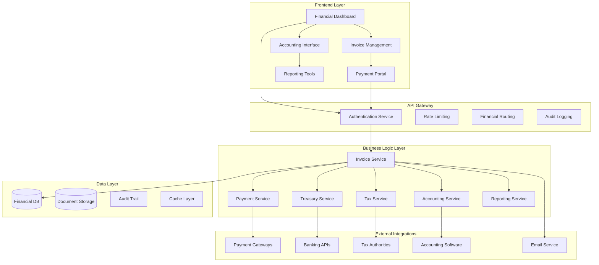
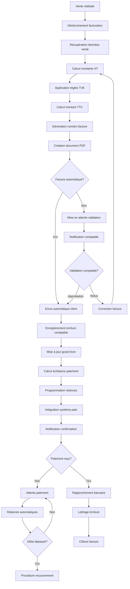
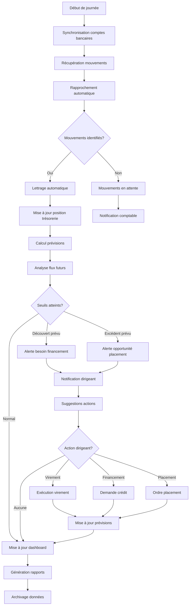
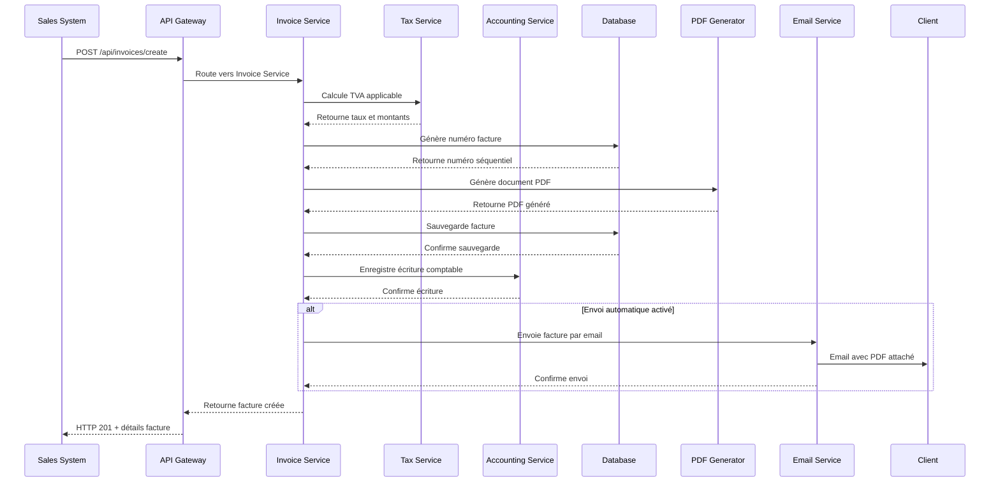
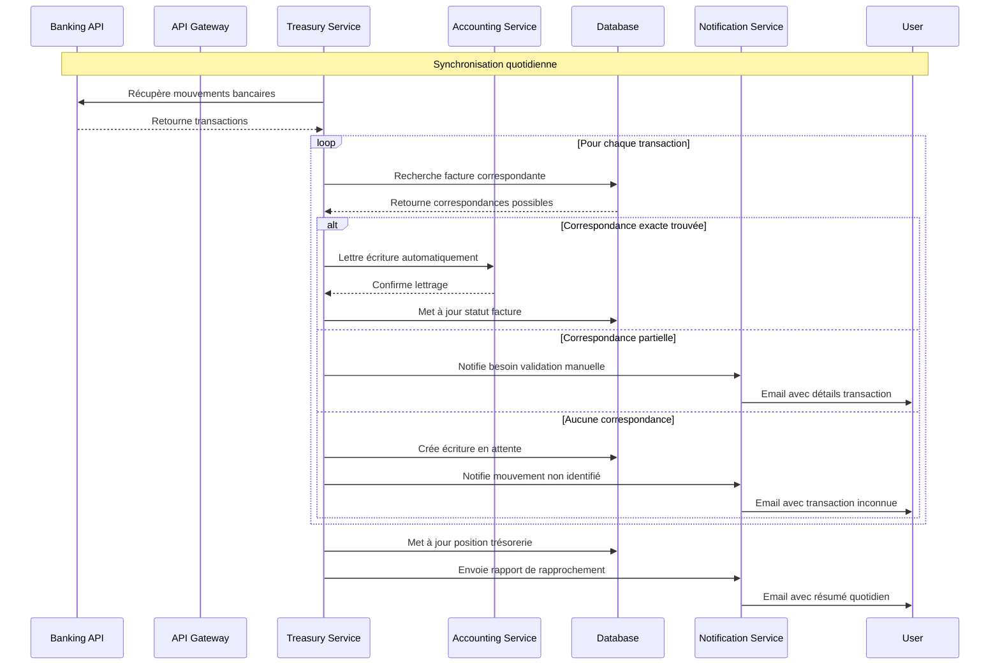

# Design Document - Gestion financière

## Overview

Le système de gestion financière fournit une solution comptable complète avec facturation automatique, gestion de trésorerie, conformité fiscale, et reporting financier. L'architecture est conçue pour s'intégrer avec les systèmes existants tout en maintenant la conformité réglementaire et la sécurité des données financières.

## Architecture

### Architecture Générale



### Diagramme de Flow - Processus de Facturation



### Diagramme de Flow - Gestion de Trésorerie



### Diagrammes de Séquence

#### Séquence de Création de Facture



#### Séquence de Rapprochement Bancaire



## Components and Interfaces

### Services Backend

#### InvoiceService
```typescript
interface InvoiceService {
  createInvoice(invoiceData: CreateInvoiceRequest): Promise<Invoice>
  updateInvoice(invoiceId: string, updates: UpdateInvoiceRequest): Promise<Invoice>
  cancelInvoice(invoiceId: string, reason: string): Promise<void>
  getInvoice(invoiceId: string): Promise<Invoice>
  getInvoices(filters: InvoiceFilters): Promise<PaginatedInvoices>
  sendInvoice(invoiceId: string, method: DeliveryMethod): Promise<void>
  generatePDF(invoiceId: string): Promise<Buffer>
}
```

#### AccountingService
```typescript
interface AccountingService {
  createJournalEntry(entry: JournalEntryRequest): Promise<JournalEntry>
  getGeneralLedger(filters: LedgerFilters): Promise<GeneralLedger>
  getTrialBalance(date: Date): Promise<TrialBalance>
  generateBalanceSheet(date: Date): Promise<BalanceSheet>
  generateIncomeStatement(period: DateRange): Promise<IncomeStatement>
  closeAccountingPeriod(period: AccountingPeriod): Promise<void>
}
```

#### TreasuryService
```typescript
interface TreasuryService {
  getCurrentCashPosition(): Promise<CashPosition>
  getCashFlowForecast(period: DateRange): Promise<CashFlowForecast>
  syncBankAccounts(): Promise<BankSyncResult>
  reconcileTransactions(accountId: string, date: Date): Promise<ReconciliationResult>
  createPaymentOrder(order: PaymentOrderRequest): Promise<PaymentOrder>
  getCashFlowAnalysis(period: DateRange): Promise<CashFlowAnalysis>
}
```

### Composants Frontend

#### FinancialDashboard
```typescript
interface FinancialDashboardProps {
  organizationId: string
  period: DateRange
  metrics: FinancialMetrics
  onPeriodChange: (period: DateRange) => void
  onDrillDown: (metric: string) => void
}
```

#### InvoiceEditor
```typescript
interface InvoiceEditorProps {
  invoice?: Invoice
  client: Client
  products: Product[]
  onSave: (invoice: InvoiceData) => void
  onCancel: () => void
  templates: InvoiceTemplate[]
}
```

#### CashFlowChart
```typescript
interface CashFlowChartProps {
  data: CashFlowData[]
  period: DateRange
  showForecast: boolean
  onDataPointClick: (point: CashFlowPoint) => void
}
```

## Data Models

### Core Entities

```typescript
interface Invoice {
  id: string
  organizationId: string
  
  // Numbering
  number: string
  series: string
  
  // Parties
  client: {
    id: string
    name: string
    address: Address
    taxId?: string
    email: string
  }
  supplier: {
    name: string
    address: Address
    taxId: string
    email: string
  }
  
  // Dates
  issueDate: Date
  dueDate: Date
  serviceDate?: Date
  
  // Items
  items: InvoiceItem[]
  
  // Amounts
  subtotal: number
  taxAmount: number
  total: number
  currency: string
  
  // Tax Details
  taxBreakdown: TaxBreakdown[]
  
  // Payment
  paymentTerms: string
  paymentMethods: PaymentMethod[]
  paymentStatus: PaymentStatus
  paidAmount: number
  paidDate?: Date
  
  // Status
  status: InvoiceStatus
  
  // Documents
  pdfUrl?: string
  attachments: string[]
  
  // Accounting
  journalEntryId?: string
  accountingDate?: Date
  
  // Metadata
  notes?: string
  internalNotes?: string
  tags: string[]
  
  createdAt: Date
  updatedAt: Date
}

interface JournalEntry {
  id: string
  organizationId: string
  
  // Reference
  reference: string
  description: string
  
  // Timing
  date: Date
  period: string // YYYY-MM
  
  // Lines
  lines: JournalLine[]
  
  // Validation
  balanced: boolean
  totalDebit: number
  totalCredit: number
  
  // Source
  sourceType: 'MANUAL' | 'INVOICE' | 'PAYMENT' | 'BANK_SYNC' | 'SYSTEM'
  sourceId?: string
  
  // Status
  status: 'DRAFT' | 'POSTED' | 'REVERSED'
  postedBy?: string
  postedAt?: Date
  
  // Reversal
  reversalOf?: string
  reversedBy?: string
  reversalReason?: string
  
  createdAt: Date
  updatedAt: Date
}

interface BankAccount {
  id: string
  organizationId: string
  
  // Bank Details
  bankName: string
  accountNumber: string
  iban?: string
  bic?: string
  
  // Configuration
  name: string
  currency: string
  accountType: 'CHECKING' | 'SAVINGS' | 'CREDIT_LINE'
  
  // Balance
  currentBalance: number
  availableBalance: number
  lastSyncDate?: Date
  
  // Integration
  bankConnectionId?: string
  autoSync: boolean
  syncFrequency: 'DAILY' | 'HOURLY' | 'MANUAL'
  
  // Accounting
  accountingCode: string
  
  // Status
  active: boolean
  
  createdAt: Date
  updatedAt: Date
}
```

### Supporting Types

```typescript
interface InvoiceItem {
  id: string
  productId?: string
  description: string
  quantity: number
  unitPrice: number
  discount?: {
    type: 'PERCENTAGE' | 'FIXED'
    value: number
  }
  taxRate: number
  taxAmount: number
  totalAmount: number
  accountingCode?: string
}

interface TaxBreakdown {
  taxRate: number
  taxableAmount: number
  taxAmount: number
  taxType: string
  taxCode?: string
}

interface JournalLine {
  id: string
  accountCode: string
  accountName: string
  description: string
  debitAmount: number
  creditAmount: number
  taxCode?: string
  costCenter?: string
  project?: string
  analyticalCode?: string
}

interface CashPosition {
  date: Date
  accounts: {
    accountId: string
    accountName: string
    balance: number
    currency: string
  }[]
  totalBalance: number
  availableBalance: number
  pendingInflows: number
  pendingOutflows: number
  netPosition: number
}

interface CashFlowForecast {
  period: DateRange
  openingBalance: number
  projectedInflows: CashFlowItem[]
  projectedOutflows: CashFlowItem[]
  netCashFlow: number
  closingBalance: number
  confidence: number // 0-1
  scenarios: {
    optimistic: number
    realistic: number
    pessimistic: number
  }
}

interface CashFlowItem {
  date: Date
  description: string
  amount: number
  category: string
  confidence: number
  sourceType: 'INVOICE' | 'RECURRING' | 'FORECAST' | 'MANUAL'
  sourceId?: string
}

enum InvoiceStatus {
  DRAFT = 'DRAFT',
  SENT = 'SENT',
  VIEWED = 'VIEWED',
  PAID = 'PAID',
  OVERDUE = 'OVERDUE',
  CANCELLED = 'CANCELLED',
  REFUNDED = 'REFUNDED'
}

enum PaymentStatus {
  PENDING = 'PENDING',
  PARTIAL = 'PARTIAL',
  PAID = 'PAID',
  OVERDUE = 'OVERDUE',
  FAILED = 'FAILED'
}
```

## Error Handling

### Stratégie de Gestion d'Erreurs

```typescript
enum FinancialErrorCode {
  INVALID_TAX_CALCULATION = 'INVALID_TAX_CALCULATION',
  UNBALANCED_JOURNAL_ENTRY = 'UNBALANCED_JOURNAL_ENTRY',
  DUPLICATE_INVOICE_NUMBER = 'DUPLICATE_INVOICE_NUMBER',
  PAYMENT_PROCESSING_FAILED = 'PAYMENT_PROCESSING_FAILED',
  BANK_SYNC_FAILED = 'BANK_SYNC_FAILED',
  ACCOUNTING_PERIOD_CLOSED = 'ACCOUNTING_PERIOD_CLOSED',
  INSUFFICIENT_PERMISSIONS = 'INSUFFICIENT_PERMISSIONS',
  REGULATORY_COMPLIANCE_ERROR = 'REGULATORY_COMPLIANCE_ERROR'
}

interface FinancialError {
  code: FinancialErrorCode
  message: string
  details?: any
  timestamp: Date
  organizationId?: string
  userId?: string
  transactionId?: string
  recoverable: boolean
  complianceImpact: boolean
}
```

### Gestion des Cas d'Erreur

1. **Erreurs de Conformité**
   - Validation stricte des règles fiscales
   - Blocage des opérations non conformes
   - Audit trail complet

2. **Erreurs de Calcul**
   - Validation croisée des montants
   - Recalcul automatique
   - Alertes sur incohérences

3. **Erreurs d'Intégration**
   - Retry avec backoff exponentiel
   - Mode dégradé
   - Synchronisation différée

## Testing Strategy

### Tests Unitaires
- Calculs fiscaux et comptables
- Logique de rapprochement
- Génération de documents

### Tests d'Intégration
- Intégrations bancaires
- Systèmes de paiement
- APIs fiscales

### Tests de Conformité
- Validation réglementaire
- Audit trails
- Sécurité des données

### Tests de Performance
- Traitement de volumes importants
- Génération de rapports
- Synchronisations bancaires