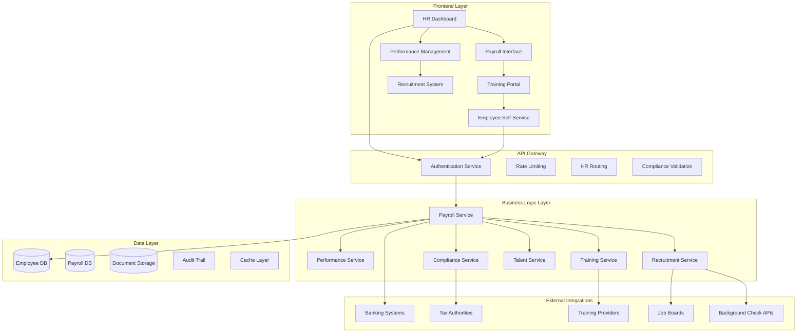
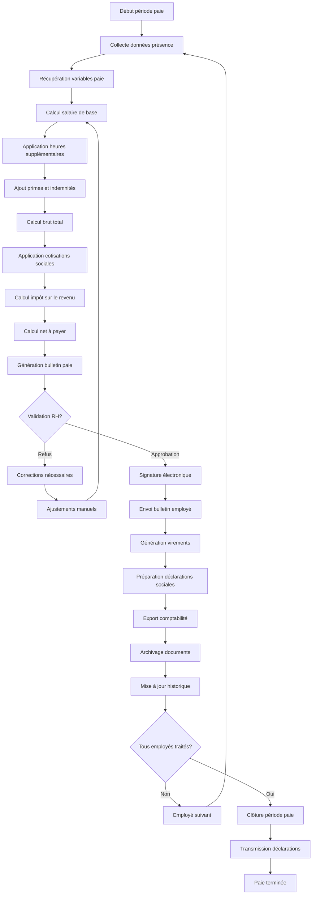
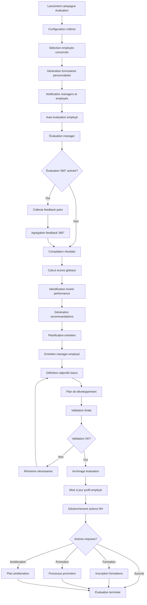
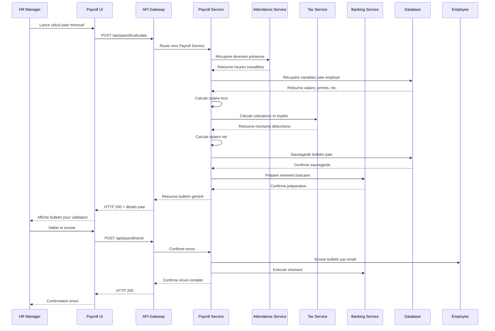
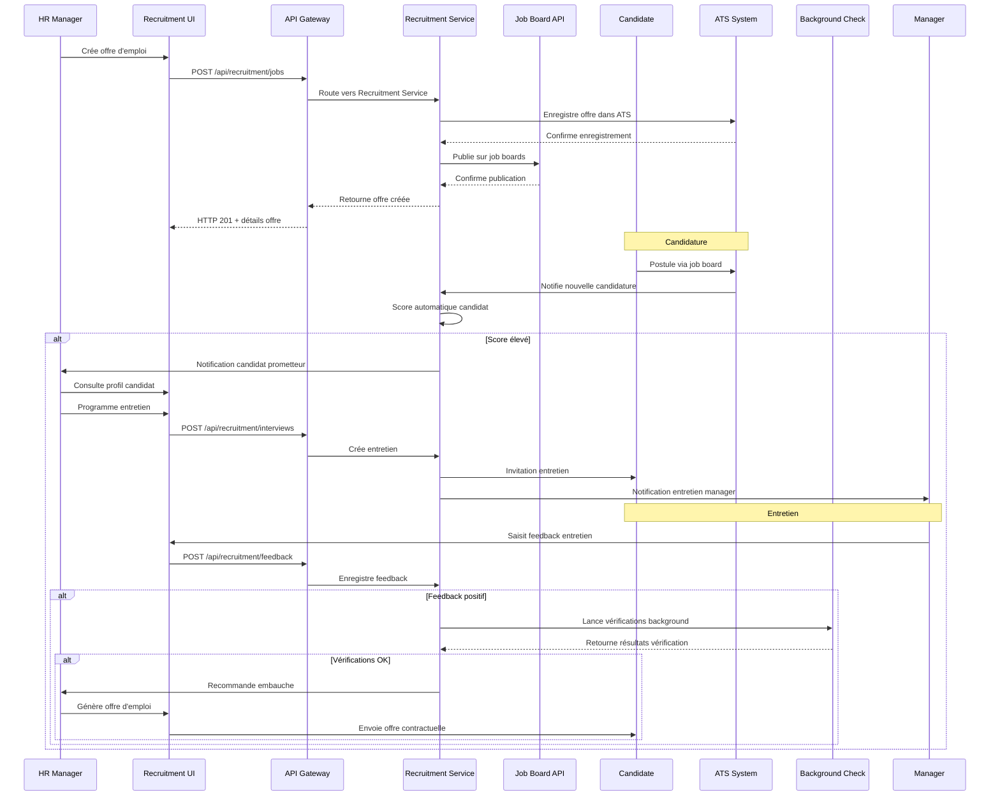

# Design Document - Ressources Humaines Avancées

## Overview

Le système de RH avancées étend les fonctionnalités de base avec la gestion des paies, évaluations de performance, formation et développement, recrutement, et gestion des talents. L'architecture est conçue pour s'intégrer avec les systèmes existants tout en respectant les réglementations sociales et fiscales.

## Architecture

### Architecture Générale



### Diagramme de Flow - Processus de Paie



### Diagramme de Flow - Processus d'Évaluation



### Diagrammes de Séquence

#### Séquence de Calcul de Paie



#### Séquence de Processus de Recrutement



## Components and Interfaces

### Services Backend

#### PayrollService
```typescript
interface PayrollService {
  calculatePayroll(employeeId: string, period: PayrollPeriod): Promise<PayrollCalculation>
  generatePayslip(calculationId: string): Promise<Payslip>
  processPayrollBatch(organizationId: string, period: PayrollPeriod): Promise<BatchResult>
  getPayrollHistory(employeeId: string, period?: DateRange): Promise<PayrollHistory[]>
  exportPayrollData(organizationId: string, period: PayrollPeriod, format: ExportFormat): Promise<Buffer>
  validatePayrollData(data: PayrollData): Promise<ValidationResult>
}
```

#### PerformanceService
```typescript
interface PerformanceService {
  createEvaluationCampaign(campaign: EvaluationCampaign): Promise<Campaign>
  startEvaluation(employeeId: string, campaignId: string): Promise<Evaluation>
  submitEvaluation(evaluationId: string, responses: EvaluationResponse[]): Promise<void>
  calculatePerformanceScore(evaluationId: string): Promise<PerformanceScore>
  generatePerformanceReport(employeeId: string, period: DateRange): Promise<PerformanceReport>
  getPerformanceTrends(organizationId: string, period: DateRange): Promise<PerformanceTrends>
}
```

#### TrainingService
```typescript
interface TrainingService {
  createTrainingProgram(program: TrainingProgram): Promise<Program>
  enrollEmployee(employeeId: string, programId: string): Promise<Enrollment>
  trackProgress(enrollmentId: string): Promise<TrainingProgress>
  generateCertificate(enrollmentId: string): Promise<Certificate>
  getTrainingCatalog(filters?: TrainingFilters): Promise<TrainingCatalog>
  getSkillsMatrix(organizationId: string): Promise<SkillsMatrix>
}
```

### Composants Frontend

#### PayrollDashboard
```typescript
interface PayrollDashboardProps {
  organizationId: string
  period: PayrollPeriod
  employees: Employee[]
  onCalculatePayroll: (employeeIds: string[]) => void
  onExportPayroll: (format: ExportFormat) => void
  onValidatePayroll: (calculationId: string) => void
}
```

#### PerformanceReview
```typescript
interface PerformanceReviewProps {
  evaluation: Evaluation
  employee: Employee
  manager: Employee
  onSubmitReview: (responses: EvaluationResponse[]) => void
  onSaveDraft: (responses: EvaluationResponse[]) => void
  readonly?: boolean
}
```

#### TrainingPortal
```typescript
interface TrainingPortalProps {
  employeeId: string
  availablePrograms: TrainingProgram[]
  enrolledPrograms: Enrollment[]
  onEnroll: (programId: string) => void
  onContinueTraining: (enrollmentId: string) => void
  onRequestCertificate: (enrollmentId: string) => void
}
```

## Data Models

### Core Entities

```typescript
interface Employee {
  id: string
  organizationId: string
  
  // Personal Information
  personalInfo: {
    firstName: string
    lastName: string
    dateOfBirth: Date
    nationality: string
    maritalStatus: MaritalStatus
    dependents: number
    address: Address
    phone: string
    email: string
    emergencyContact: EmergencyContact
  }
  
  // Employment Information
  employment: {
    employeeNumber: string
    startDate: Date
    endDate?: Date
    department: string
    position: string
    level: string
    manager: string
    workLocation: string
    contractType: ContractType
    workingHours: number
    probationEndDate?: Date
  }
  
  // Compensation
  compensation: {
    baseSalary: number
    currency: string
    payFrequency: PayFrequency
    bankAccount: BankAccount
    taxInfo: TaxInformation
    benefits: Benefit[]
  }
  
  // Performance
  performance: {
    currentRating?: PerformanceRating
    lastEvaluationDate?: Date
    goals: Goal[]
    skills: Skill[]
    certifications: Certification[]
  }
  
  // Status
  status: EmployeeStatus
  
  createdAt: Date
  updatedAt: Date
}

interface PayrollCalculation {
  id: string
  employeeId: string
  organizationId: string
  period: PayrollPeriod
  
  // Earnings
  earnings: {
    baseSalary: number
    overtime: number
    bonuses: number
    commissions: number
    allowances: number
    totalGross: number
  }
  
  // Deductions
  deductions: {
    socialSecurity: number
    healthInsurance: number
    retirement: number
    incomeTax: number
    otherDeductions: number
    totalDeductions: number
  }
  
  // Net Pay
  netPay: number
  
  // Hours
  hoursWorked: {
    regular: number
    overtime: number
    vacation: number
    sick: number
    total: number
  }
  
  // Status
  status: PayrollStatus
  calculatedAt: Date
  approvedBy?: string
  approvedAt?: Date
  
  createdAt: Date
  updatedAt: Date
}

interface Evaluation {
  id: string
  employeeId: string
  managerId: string
  organizationId: string
  campaignId: string
  
  // Period
  evaluationPeriod: DateRange
  
  // Responses
  selfEvaluation?: EvaluationResponse[]
  managerEvaluation?: EvaluationResponse[]
  peerEvaluations?: PeerEvaluation[]
  
  // Scores
  overallScore?: number
  categoryScores: CategoryScore[]
  
  // Goals
  previousGoals: GoalReview[]
  newGoals: Goal[]
  
  // Development
  developmentPlan?: DevelopmentPlan
  trainingRecommendations: string[]
  
  // Status
  status: EvaluationStatus
  
  // Meetings
  meetingScheduled?: Date
  meetingCompleted?: Date
  meetingNotes?: string
  
  createdAt: Date
  updatedAt: Date
}

interface TrainingProgram {
  id: string
  organizationId: string
  
  // Basic Info
  title: string
  description: string
  category: string
  level: TrainingLevel
  
  // Content
  modules: TrainingModule[]
  duration: number // hours
  format: TrainingFormat
  
  // Requirements
  prerequisites: string[]
  targetAudience: string[]
  maxParticipants?: number
  
  // Certification
  certificateAwarded: boolean
  certificateTemplate?: string
  validityPeriod?: number // months
  
  // Delivery
  instructor?: Instructor
  schedule?: TrainingSchedule[]
  location?: string
  virtualMeetingUrl?: string
  
  // Status
  status: ProgramStatus
  
  // Metadata
  tags: string[]
  createdBy: string
  
  createdAt: Date
  updatedAt: Date
}
```

### Supporting Types

```typescript
interface PayrollPeriod {
  year: number
  month: number
  startDate: Date
  endDate: Date
  payDate: Date
}

interface EvaluationResponse {
  questionId: string
  question: string
  response: any
  score?: number
  comments?: string
}

interface Goal {
  id: string
  title: string
  description: string
  category: GoalCategory
  priority: Priority
  targetDate: Date
  status: GoalStatus
  progress: number // 0-100
  metrics: GoalMetric[]
}

interface Skill {
  id: string
  name: string
  category: string
  level: SkillLevel
  assessedDate?: Date
  certificationRequired: boolean
  expiryDate?: Date
}

interface TrainingModule {
  id: string
  title: string
  description: string
  content: ModuleContent
  duration: number // minutes
  order: number
  mandatory: boolean
  assessmentRequired: boolean
}

interface Benefit {
  type: BenefitType
  name: string
  value: number
  currency?: string
  startDate: Date
  endDate?: Date
  eligibilityRules: string[]
}

enum ContractType {
  PERMANENT = 'PERMANENT',
  TEMPORARY = 'TEMPORARY',
  CONTRACTOR = 'CONTRACTOR',
  INTERN = 'INTERN',
  PART_TIME = 'PART_TIME'
}

enum PayFrequency {
  WEEKLY = 'WEEKLY',
  BIWEEKLY = 'BIWEEKLY',
  MONTHLY = 'MONTHLY',
  QUARTERLY = 'QUARTERLY',
  ANNUALLY = 'ANNUALLY'
}

enum PayrollStatus {
  DRAFT = 'DRAFT',
  CALCULATED = 'CALCULATED',
  APPROVED = 'APPROVED',
  PAID = 'PAID',
  CANCELLED = 'CANCELLED'
}

enum EvaluationStatus {
  NOT_STARTED = 'NOT_STARTED',
  IN_PROGRESS = 'IN_PROGRESS',
  PENDING_MANAGER = 'PENDING_MANAGER',
  PENDING_MEETING = 'PENDING_MEETING',
  COMPLETED = 'COMPLETED',
  OVERDUE = 'OVERDUE'
}

enum TrainingLevel {
  BEGINNER = 'BEGINNER',
  INTERMEDIATE = 'INTERMEDIATE',
  ADVANCED = 'ADVANCED',
  EXPERT = 'EXPERT'
}

enum TrainingFormat {
  ONLINE = 'ONLINE',
  CLASSROOM = 'CLASSROOM',
  BLENDED = 'BLENDED',
  WORKSHOP = 'WORKSHOP',
  CONFERENCE = 'CONFERENCE'
}

enum SkillLevel {
  NOVICE = 'NOVICE',
  COMPETENT = 'COMPETENT',
  PROFICIENT = 'PROFICIENT',
  EXPERT = 'EXPERT',
  MASTER = 'MASTER'
}
```

## Error Handling

### Stratégie de Gestion d'Erreurs

```typescript
enum HRErrorCode {
  PAYROLL_CALCULATION_ERROR = 'PAYROLL_CALCULATION_ERROR',
  INVALID_TAX_CONFIGURATION = 'INVALID_TAX_CONFIGURATION',
  EVALUATION_DEADLINE_PASSED = 'EVALUATION_DEADLINE_PASSED',
  TRAINING_CAPACITY_EXCEEDED = 'TRAINING_CAPACITY_EXCEEDED',
  COMPLIANCE_VIOLATION = 'COMPLIANCE_VIOLATION',
  INSUFFICIENT_PERMISSIONS = 'INSUFFICIENT_PERMISSIONS',
  EMPLOYEE_NOT_ELIGIBLE = 'EMPLOYEE_NOT_ELIGIBLE',
  DOCUMENT_GENERATION_FAILED = 'DOCUMENT_GENERATION_FAILED'
}

interface HRError {
  code: HRErrorCode
  message: string
  details?: any
  timestamp: Date
  employeeId?: string
  organizationId?: string
  complianceImpact: boolean
  recoverable: boolean
}
```

### Gestion des Cas d'Erreur

1. **Erreurs de Conformité**
   - Validation stricte des règles légales
   - Blocage des opérations non conformes
   - Audit trail complet

2. **Erreurs de Calcul**
   - Validation croisée des montants
   - Recalcul automatique
   - Alertes sur incohérences

3. **Erreurs de Processus**
   - Workflow de validation
   - Escalade automatique
   - Notifications appropriées

## Testing Strategy

### Tests Unitaires
- Calculs de paie
- Logique d'évaluation
- Algorithmes de matching

### Tests d'Intégration
- Systèmes bancaires
- APIs gouvernementales
- Plateformes de formation

### Tests de Conformité
- Validation réglementaire
- Calculs fiscaux
- Protection des données

### Tests de Performance
- Traitement de paie en masse
- Génération de rapports
- Synchronisations externes