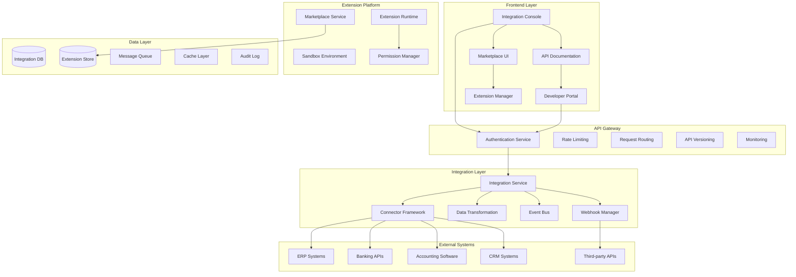
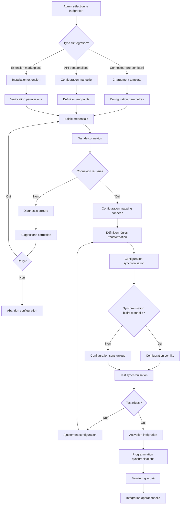
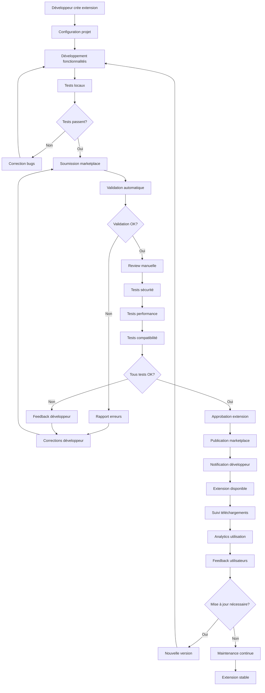
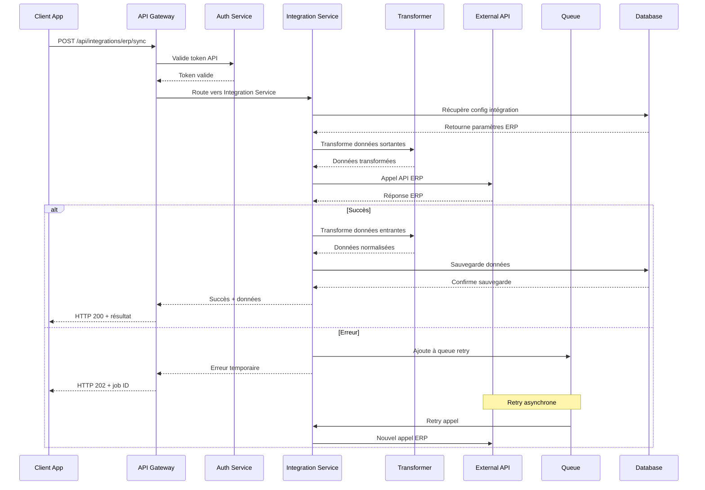
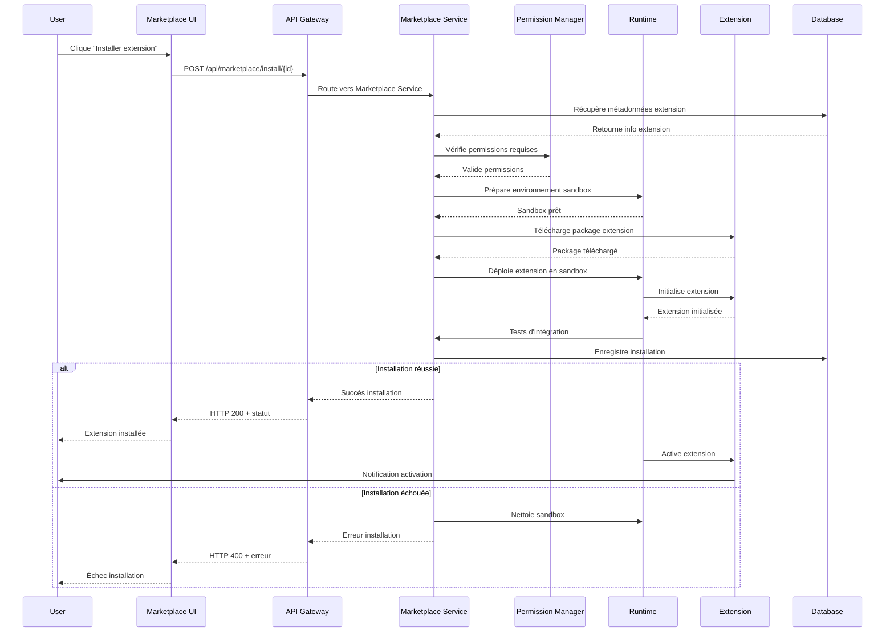

# Design Document - Écosystème d'intégrations

## Overview

L'écosystème d'intégrations permet aux organisations de connecter leur système avec l'ensemble des outils métier existants via une architecture d'intégration robuste, une API publique complète, et un marketplace d'extensions. Le système est conçu pour être extensible, sécurisé, et facilement maintenable.

## Architecture

### Architecture Générale



### Diagramme de Flow - Configuration d'Intégration



### Diagramme de Flow - Développement d'Extension



### Diagrammes de Séquence

#### Séquence d'Appel API Externe



#### Séquence d'Installation d'Extension



## Components and Interfaces

### Services Backend

#### IntegrationService
```typescript
interface IntegrationService {
  createIntegration(integration: CreateIntegrationRequest): Promise<Integration>
  updateIntegration(integrationId: string, updates: UpdateIntegrationRequest): Promise<Integration>
  testConnection(integrationId: string): Promise<ConnectionTestResult>
  syncData(integrationId: string, options?: SyncOptions): Promise<SyncResult>
  getIntegrationStatus(integrationId: string): Promise<IntegrationStatus>
  getIntegrationLogs(integrationId: string, filters?: LogFilters): Promise<IntegrationLog[]>
}
```

#### ConnectorFramework
```typescript
interface ConnectorFramework {
  registerConnector(connector: ConnectorDefinition): Promise<void>
  getAvailableConnectors(): Promise<ConnectorInfo[]>
  createConnectorInstance(connectorType: string, config: ConnectorConfig): Promise<ConnectorInstance>
  executeConnectorAction(instanceId: string, action: string, params: any): Promise<any>
  validateConnectorConfig(connectorType: string, config: ConnectorConfig): Promise<ValidationResult>
}
```

#### MarketplaceService
```typescript
interface MarketplaceService {
  publishExtension(extension: ExtensionPackage): Promise<PublishResult>
  installExtension(extensionId: string, organizationId: string): Promise<InstallResult>
  updateExtension(extensionId: string, version: string): Promise<UpdateResult>
  uninstallExtension(extensionId: string, organizationId: string): Promise<void>
  getExtensionCatalog(filters?: ExtensionFilters): Promise<ExtensionCatalog>
  getExtensionAnalytics(extensionId: string): Promise<ExtensionAnalytics>
}
```

### Composants Frontend

#### IntegrationConsole
```typescript
interface IntegrationConsoleProps {
  organizationId: string
  integrations: Integration[]
  availableConnectors: ConnectorInfo[]
  onCreateIntegration: (connector: ConnectorInfo) => void
  onTestIntegration: (integrationId: string) => void
  onSyncIntegration: (integrationId: string) => void
}
```

#### APIDocumentation
```typescript
interface APIDocumentationProps {
  apiSpec: OpenAPISpec
  examples: APIExample[]
  sdks: SDK[]
  onTryAPI: (endpoint: string, params: any) => void
  onGenerateKey: () => void
}
```

#### ExtensionManager
```typescript
interface ExtensionManagerProps {
  installedExtensions: InstalledExtension[]
  availableExtensions: Extension[]
  onInstall: (extensionId: string) => void
  onUninstall: (extensionId: string) => void
  onConfigure: (extensionId: string) => void
  onUpdate: (extensionId: string) => void
}
```

## Data Models

### Core Entities

```typescript
interface Integration {
  id: string
  organizationId: string
  
  // Basic Info
  name: string
  description?: string
  type: IntegrationType
  connectorId: string
  
  // Configuration
  config: IntegrationConfig
  credentials: EncryptedCredentials
  
  // Data Mapping
  fieldMappings: FieldMapping[]
  transformationRules: TransformationRule[]
  
  // Synchronization
  syncSettings: SyncSettings
  lastSyncAt?: Date
  nextSyncAt?: Date
  
  // Status
  status: IntegrationStatus
  healthStatus: HealthStatus
  
  // Monitoring
  metrics: IntegrationMetrics
  
  // Metadata
  tags: string[]
  createdBy: string
  
  createdAt: Date
  updatedAt: Date
}

interface Extension {
  id: string
  developerId: string
  
  // Basic Info
  name: string
  description: string
  version: string
  category: ExtensionCategory
  
  // Package
  packageUrl: string
  packageSize: number
  packageHash: string
  
  // Compatibility
  minPlatformVersion: string
  maxPlatformVersion?: string
  dependencies: ExtensionDependency[]
  
  // Permissions
  requiredPermissions: Permission[]
  optionalPermissions: Permission[]
  
  // Marketplace
  pricing: ExtensionPricing
  ratings: ExtensionRating[]
  downloads: number
  
  // Documentation
  documentation: string
  screenshots: string[]
  changelog: ChangelogEntry[]
  
  // Status
  status: ExtensionStatus
  reviewStatus: ReviewStatus
  
  // Metadata
  tags: string[]
  
  createdAt: Date
  updatedAt: Date
}

interface Connector {
  id: string
  name: string
  description: string
  type: ConnectorType
  
  // Configuration Schema
  configSchema: JSONSchema
  credentialsSchema: JSONSchema
  
  // Capabilities
  capabilities: ConnectorCapability[]
  supportedOperations: Operation[]
  
  // Data Model
  dataModel: DataModelDefinition
  
  // Implementation
  implementation: ConnectorImplementation
  
  // Versioning
  version: string
  compatibility: CompatibilityInfo
  
  // Status
  status: ConnectorStatus
  
  createdAt: Date
  updatedAt: Date
}

interface APIKey {
  id: string
  organizationId: string
  userId: string
  
  // Key Info
  name: string
  key: string // hashed
  keyPrefix: string // visible part
  
  // Permissions
  scopes: APIScope[]
  permissions: APIPermission[]
  
  // Usage Limits
  rateLimit: RateLimit
  quotaLimit: QuotaLimit
  
  // Status
  status: APIKeyStatus
  lastUsedAt?: Date
  
  // Expiration
  expiresAt?: Date
  
  // Metadata
  description?: string
  tags: string[]
  
  createdAt: Date
  updatedAt: Date
}
```

### Supporting Types

```typescript
interface IntegrationConfig {
  // Connection
  endpoint: string
  timeout: number
  retryPolicy: RetryPolicy
  
  // Authentication
  authType: AuthenticationType
  authConfig: AuthenticationConfig
  
  // Data
  batchSize: number
  compressionEnabled: boolean
  encryptionEnabled: boolean
  
  // Monitoring
  loggingLevel: LogLevel
  metricsEnabled: boolean
  alertsEnabled: boolean
}

interface FieldMapping {
  sourceField: string
  targetField: string
  transformation?: FieldTransformation
  required: boolean
  defaultValue?: any
}

interface TransformationRule {
  id: string
  name: string
  condition: string // JavaScript expression
  transformation: string // JavaScript function
  order: number
  enabled: boolean
}

interface SyncSettings {
  direction: SyncDirection
  frequency: SyncFrequency
  schedule?: CronExpression
  conflictResolution: ConflictResolution
  filterRules: FilterRule[]
  batchSize: number
  parallelism: number
}

interface ExtensionPricing {
  model: PricingModel
  price?: number
  currency?: string
  trialPeriod?: number // days
  freeTier?: FreeTierLimits
}

interface Permission {
  resource: string
  actions: string[]
  conditions?: PermissionCondition[]
}

interface RateLimit {
  requestsPerSecond: number
  requestsPerMinute: number
  requestsPerHour: number
  requestsPerDay: number
  burstLimit: number
}

enum IntegrationType {
  ERP = 'ERP',
  CRM = 'CRM',
  ACCOUNTING = 'ACCOUNTING',
  BANKING = 'BANKING',
  ECOMMERCE = 'ECOMMERCE',
  MARKETING = 'MARKETING',
  HR = 'HR',
  CUSTOM = 'CUSTOM'
}

enum IntegrationStatus {
  DRAFT = 'DRAFT',
  ACTIVE = 'ACTIVE',
  PAUSED = 'PAUSED',
  ERROR = 'ERROR',
  DISABLED = 'DISABLED'
}

enum SyncDirection {
  INBOUND = 'INBOUND',
  OUTBOUND = 'OUTBOUND',
  BIDIRECTIONAL = 'BIDIRECTIONAL'
}

enum ExtensionCategory {
  PRODUCTIVITY = 'PRODUCTIVITY',
  ANALYTICS = 'ANALYTICS',
  COMMUNICATION = 'COMMUNICATION',
  FINANCE = 'FINANCE',
  MARKETING = 'MARKETING',
  SALES = 'SALES',
  HR = 'HR',
  OPERATIONS = 'OPERATIONS'
}

enum ExtensionStatus {
  DRAFT = 'DRAFT',
  SUBMITTED = 'SUBMITTED',
  APPROVED = 'APPROVED',
  PUBLISHED = 'PUBLISHED',
  DEPRECATED = 'DEPRECATED',
  REMOVED = 'REMOVED'
}

enum AuthenticationType {
  API_KEY = 'API_KEY',
  OAUTH2 = 'OAUTH2',
  BASIC_AUTH = 'BASIC_AUTH',
  JWT = 'JWT',
  CERTIFICATE = 'CERTIFICATE'
}
```

## Error Handling

### Stratégie de Gestion d'Erreurs

```typescript
enum IntegrationErrorCode {
  CONNECTION_FAILED = 'CONNECTION_FAILED',
  AUTHENTICATION_FAILED = 'AUTHENTICATION_FAILED',
  RATE_LIMIT_EXCEEDED = 'RATE_LIMIT_EXCEEDED',
  DATA_TRANSFORMATION_ERROR = 'DATA_TRANSFORMATION_ERROR',
  SYNC_CONFLICT = 'SYNC_CONFLICT',
  EXTENSION_LOAD_FAILED = 'EXTENSION_LOAD_FAILED',
  PERMISSION_DENIED = 'PERMISSION_DENIED',
  QUOTA_EXCEEDED = 'QUOTA_EXCEEDED'
}

interface IntegrationError {
  code: IntegrationErrorCode
  message: string
  details?: any
  timestamp: Date
  integrationId?: string
  extensionId?: string
  retryable: boolean
  retryAfter?: number
}
```

### Gestion des Cas d'Erreur

1. **Erreurs de Connectivité**
   - Retry avec backoff exponentiel
   - Circuit breaker pattern
   - Fallback sur cache

2. **Erreurs d'Authentification**
   - Refresh automatique des tokens
   - Notification pour renouvellement
   - Mode dégradé

3. **Erreurs de Données**
   - Validation stricte
   - Transformation avec fallback
   - Quarantaine des données invalides

## Testing Strategy

### Tests Unitaires
- Logique de transformation
- Validation des configurations
- Algorithmes de synchronisation

### Tests d'Intégration
- Connecteurs externes
- APIs tierces
- Extensions marketplace

### Tests de Sécurité
- Validation des permissions
- Chiffrement des données
- Audit des accès

### Tests de Performance
- Charge sur les APIs
- Synchronisations massives
- Scalabilité des extensions