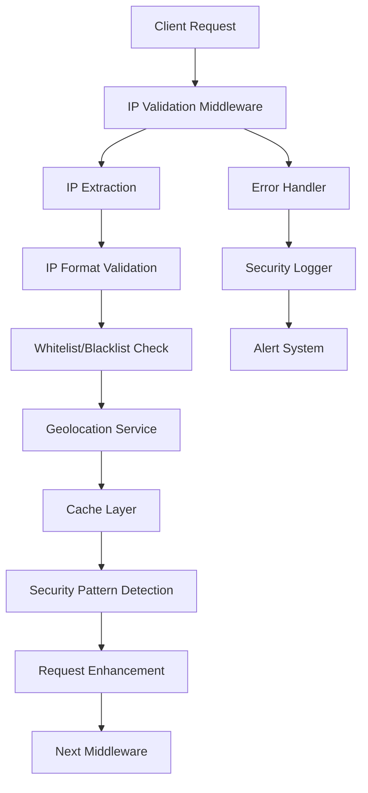
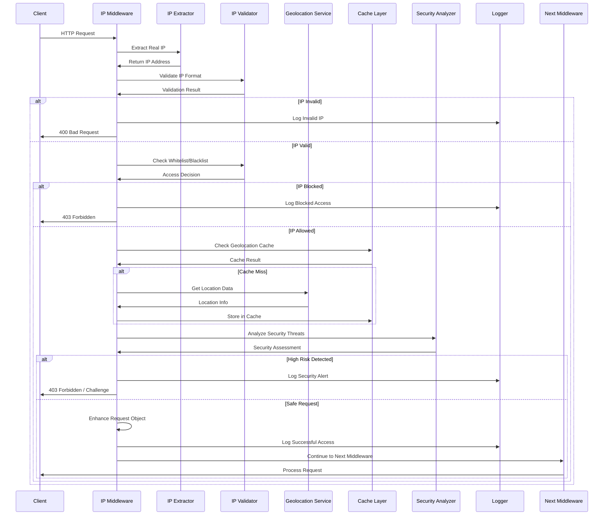
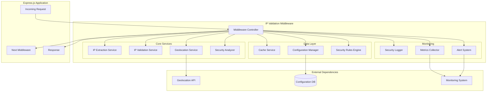

# Design Document - IP Validation Middleware

## Overview

Le middleware de validation d'adresse IP est un composant de sécurité qui s'intègre dans l'architecture Express.js existante pour valider, tracer et contrôler l'accès basé sur les adresses IP des clients. Il combine la validation d'IP, la géolocalisation, et la détection de patterns suspects pour renforcer la sécurité de l'API.

### Design Principles

- **Performance First**: Traitement en moins de 5ms par requête
- **Sécurité par défaut**: Rejet des requêtes suspectes avec logging approprié
- **Flexibilité**: Configuration par environnement et règles dynamiques
- **Intégration transparente**: Compatible avec l'écosystème Express existant

## Architecture

### High-Level Architecture



### Sequence Diagram



### Component Diagram



### Component Interaction Flow

1. **Request Interception**: Le middleware intercepte toutes les requêtes entrantes
2. **IP Extraction**: Extraction de l'IP réelle via headers de proxy
3. **Validation**: Vérification du format et des listes de contrôle
4. **Geolocation**: Enrichissement avec données géographiques (avec cache)
5. **Security Analysis**: Détection de patterns suspects
6. **Request Enhancement**: Ajout des données à l'objet request
7. **Logging & Monitoring**: Enregistrement des événements de sécurité

## Components and Interfaces

### Core Middleware Component

```typescript
interface IPValidationMiddleware {
  validate(req: Request, res: Response, next: NextFunction): Promise<void>;
  configure(options: IPValidationOptions): void;
  updateRules(rules: SecurityRules): void;
}

interface IPValidationOptions {
  enabled: boolean;
  environment: 'development' | 'staging' | 'production';
  whitelist?: string[];
  blacklist?: string[];
  allowedCountries?: string[];
  geolocationEnabled: boolean;
  cacheEnabled: boolean;
  cacheTTL: number; // 24 hours default
}
```

### IP Extraction Service

```typescript
interface IPExtractionService {
  extractRealIP(req: Request): string | null;
  validateIPFormat(ip: string): boolean;
  isPrivateIP(ip: string): boolean;
}
```

**Design Decision**: Priorité des headers pour l'extraction d'IP :
1. `X-Forwarded-For` (première IP publique)
2. `X-Real-IP`
3. `X-Client-IP`
4. `req.connection.remoteAddress`

**Rationale**: Cette hiérarchie gère correctement les proxies multiples et load balancers.

### Geolocation Service

```typescript
interface GeolocationService {
  getLocationData(ip: string): Promise<LocationData>;
  isVPNOrProxy(ip: string): Promise<boolean>;
}

interface LocationData {
  country: string;
  region: string;
  city: string;
  isp: string;
  isVPN: boolean;
  isProxy: boolean;
  isDatacenter: boolean;
}
```

**Design Decision**: Utilisation d'un service de géolocalisation externe (ex: MaxMind GeoIP2)
**Rationale**: Précision et fiabilité supérieures aux solutions internes, avec support VPN/Proxy detection.

### Cache Layer

```typescript
interface CacheService {
  get(key: string): Promise<LocationData | null>;
  set(key: string, data: LocationData, ttl: number): Promise<void>;
  clear(): Promise<void>;
}
```

**Design Decision**: Cache LRU en mémoire avec TTL de 24h
**Rationale**: Balance entre performance et fraîcheur des données, réduction des coûts d'API externe.

### Security Pattern Detection

```typescript
interface SecurityAnalyzer {
  analyzeAccess(ip: string, location: LocationData, userContext?: any): SecurityThreat[];
  detectSuspiciousPatterns(accessHistory: AccessLog[]): SecurityAlert[];
}

interface SecurityThreat {
  level: 'LOW' | 'MEDIUM' | 'HIGH' | 'CRITICAL';
  type: 'NEW_COUNTRY' | 'MULTIPLE_COUNTRIES' | 'VPN_DETECTED' | 'DATACENTER_ACCESS';
  description: string;
  action: 'ALLOW' | 'WARN' | 'BLOCK' | 'CHALLENGE';
}
```

### Enhanced Request Object

```typescript
interface EnhancedRequest extends Request {
  clientIP: string;
  geoLocation?: LocationData;
  securityContext: {
    threats: SecurityThreat[];
    riskScore: number;
    isBlocked: boolean;
  };
}
```

## Data Models

### Configuration Model

```typescript
interface SecurityRules {
  ipWhitelist: string[];
  ipBlacklist: string[];
  countryWhitelist: string[];
  countryBlacklist: string[];
  userSpecificRules: Map<string, UserSecurityRules>;
  vpnPolicy: 'ALLOW' | 'WARN' | 'BLOCK';
  datacenterPolicy: 'ALLOW' | 'WARN' | 'BLOCK';
}

interface UserSecurityRules {
  allowedCountries: string[];
  trustedIPs: string[];
  riskTolerance: 'LOW' | 'MEDIUM' | 'HIGH';
}
```

### Logging Model

```typescript
interface SecurityLog {
  timestamp: Date;
  sourceIP: string;
  endpoint: string;
  userAgent: string;
  geoLocation?: LocationData;
  action: 'ALLOWED' | 'BLOCKED' | 'WARNING';
  reason: string;
  riskScore: number;
  headers: Record<string, string>;
}
```

## Error Handling

### Error Types and Responses

1. **Invalid IP Format (400)**
   ```json
   {
     "error": "INVALID_IP_FORMAT",
     "message": "L'adresse IP fournie n'est pas dans un format valide",
     "code": 400
   }
   ```

2. **IP Blocked (403)**
   ```json
   {
     "error": "IP_BLOCKED",
     "message": "Accès refusé depuis cette adresse IP",
     "code": 403
   }
   ```

3. **Country Blocked (403)**
   ```json
   {
     "error": "COUNTRY_BLOCKED",
     "message": "Accès refusé depuis ce pays",
     "code": 403,
     "details": {
       "country": "XX",
       "reason": "Country not in whitelist"
     }
   }
   ```

### Error Handling Strategy

**Design Decision**: Fail-safe approach - en cas d'erreur du service de géolocalisation, permettre l'accès avec logging
**Rationale**: Éviter les interruptions de service dues aux dépendances externes.

## Testing Strategy

### Unit Testing

- **IP Extraction**: Tests avec différents headers de proxy
- **Validation**: Tests de formats IPv4/IPv6 valides et invalides
- **Geolocation**: Tests avec mocks du service externe
- **Cache**: Tests de TTL et stratégie LRU
- **Security Analysis**: Tests de détection de patterns

### Integration Testing

- **Middleware Integration**: Tests avec Express.js
- **Database Integration**: Tests de persistance des règles
- **External Services**: Tests avec services de géolocalisation réels
- **Performance**: Tests de charge pour valider le SLA de 5ms

### Security Testing

- **Bypass Attempts**: Tests de contournement via headers forgés
- **Rate Limiting**: Tests d'intégration avec le système existant
- **Attack Simulation**: Tests avec patterns d'attaque connus

### Performance Testing

- **Latency**: Mesure du temps de traitement par requête
- **Memory Usage**: Monitoring de l'utilisation mémoire du cache
- **Throughput**: Tests de charge avec différents volumes de requêtes

## Implementation Considerations

### Performance Optimizations

1. **Cache Strategy**: Cache LRU avec éviction intelligente
2. **Async Processing**: Géolocalisation asynchrone avec fallback
3. **Connection Pooling**: Pool de connexions pour services externes
4. **Memory Management**: Limitation de la taille du cache

### Security Considerations

1. **Header Validation**: Validation stricte des headers de proxy
2. **Rate Limiting Integration**: Coordination avec le système existant
3. **Audit Trail**: Logging complet pour conformité
4. **Configuration Security**: Chiffrement des règles sensibles

### Monitoring and Alerting

1. **Metrics Collection**: Métriques de performance et sécurité
2. **Real-time Alerts**: Notifications pour menaces critiques
3. **Dashboard Integration**: Intégration avec outils de monitoring existants
4. **Compliance Reporting**: Rapports automatisés pour audits

### Deployment Strategy

1. **Feature Flags**: Activation progressive par environnement
2. **Blue-Green Deployment**: Déploiement sans interruption
3. **Rollback Strategy**: Procédure de retour en arrière rapide
4. **Configuration Management**: Gestion centralisée des règles