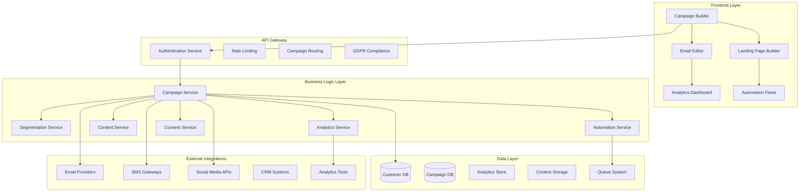
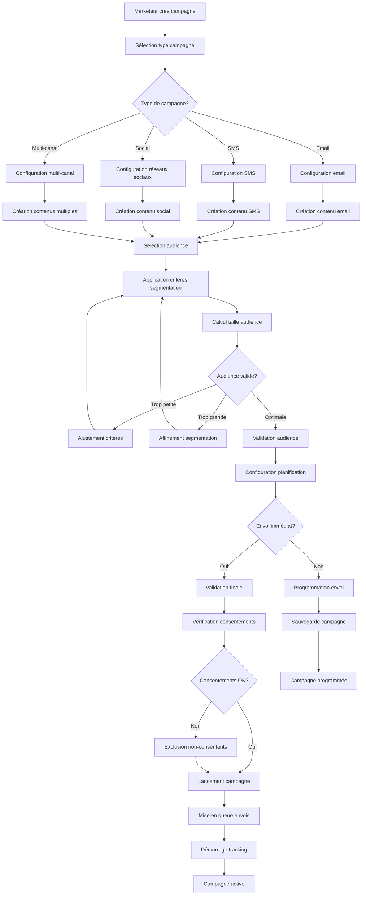
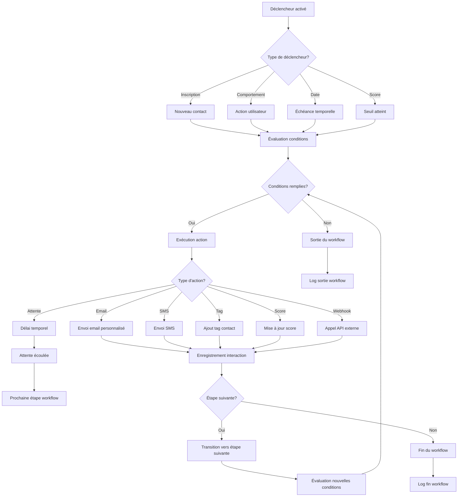
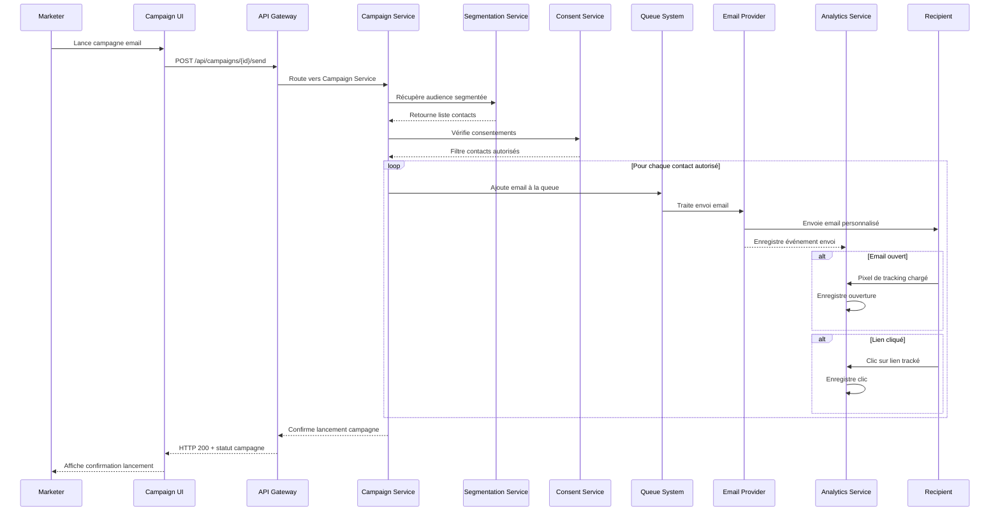
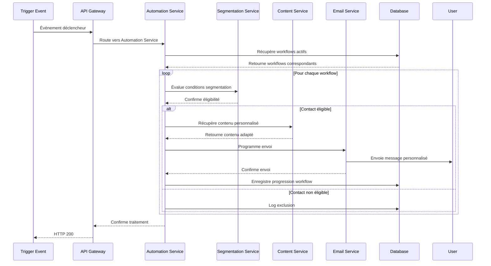

# Design Document - Marketing Automation

## Overview

Le système de marketing automation permet aux organisations de créer, gérer et automatiser leurs campagnes marketing multi-canaux avec personnalisation avancée, segmentation intelligente, et mesure de performance. L'architecture est conçue pour supporter des volumes importants tout en respectant les réglementations RGPD.

## Architecture

### Architecture Générale



### Diagramme de Flow - Création de Campagne



### Diagramme de Flow - Automation Workflow



### Diagrammes de Séquence

#### Séquence d'Envoi de Campagne Email



#### Séquence d'Automation Trigger



## Components and Interfaces

### Services Backend

#### CampaignService
```typescript
interface CampaignService {
  createCampaign(campaign: CreateCampaignRequest): Promise<Campaign>
  updateCampaign(campaignId: string, updates: UpdateCampaignRequest): Promise<Campaign>
  sendCampaign(campaignId: string, options: SendOptions): Promise<CampaignExecution>
  scheduleCampaign(campaignId: string, schedule: CampaignSchedule): Promise<void>
  getCampaignAnalytics(campaignId: string): Promise<CampaignAnalytics>
  duplicateCampaign(campaignId: string): Promise<Campaign>
  pauseCampaign(campaignId: string): Promise<void>
}
```

#### SegmentationService
```typescript
interface SegmentationService {
  createSegment(segment: CreateSegmentRequest): Promise<Segment>
  updateSegment(segmentId: string, updates: UpdateSegmentRequest): Promise<Segment>
  getSegmentContacts(segmentId: string): Promise<Contact[]>
  evaluateSegmentSize(criteria: SegmentCriteria): Promise<number>
  getSegmentAnalytics(segmentId: string): Promise<SegmentAnalytics>
  exportSegment(segmentId: string, format: ExportFormat): Promise<string>
}
```

#### AutomationService
```typescript
interface AutomationService {
  createWorkflow(workflow: CreateWorkflowRequest): Promise<Workflow>
  updateWorkflow(workflowId: string, updates: UpdateWorkflowRequest): Promise<Workflow>
  activateWorkflow(workflowId: string): Promise<void>
  pauseWorkflow(workflowId: string): Promise<void>
  getWorkflowAnalytics(workflowId: string): Promise<WorkflowAnalytics>
  testWorkflow(workflowId: string, testData: TestData): Promise<TestResult>
}
```

### Composants Frontend

#### CampaignBuilder
```typescript
interface CampaignBuilderProps {
  campaignType: CampaignType
  onSave: (campaign: CampaignData) => void
  onPreview: (campaign: CampaignData) => void
  templates: CampaignTemplate[]
  segments: Segment[]
}
```

#### EmailEditor
```typescript
interface EmailEditorProps {
  content?: EmailContent
  templates: EmailTemplate[]
  personalizations: PersonalizationField[]
  onSave: (content: EmailContent) => void
  onPreview: (content: EmailContent) => void
}
```

#### AutomationFlowBuilder
```typescript
interface AutomationFlowBuilderProps {
  workflow?: Workflow
  triggers: TriggerType[]
  actions: ActionType[]
  conditions: ConditionType[]
  onSave: (workflow: WorkflowData) => void
  onTest: (workflow: WorkflowData) => void
}
```

## Data Models

### Core Entities

```typescript
interface Campaign {
  id: string
  organizationId: string
  
  // Basic Info
  name: string
  description?: string
  type: CampaignType
  status: CampaignStatus
  
  // Content
  subject?: string // for email campaigns
  content: CampaignContent
  
  // Audience
  segments: string[]
  totalRecipients: number
  
  // Scheduling
  sendDate?: Date
  timezone: string
  
  // Settings
  settings: CampaignSettings
  
  // Tracking
  trackingEnabled: boolean
  utmParameters?: UTMParameters
  
  // Performance
  stats: CampaignStats
  
  // Metadata
  tags: string[]
  createdBy: string
  
  createdAt: Date
  updatedAt: Date
}

interface Segment {
  id: string
  organizationId: string
  
  // Basic Info
  name: string
  description?: string
  
  // Criteria
  criteria: SegmentCriteria
  
  // Dynamic vs Static
  dynamic: boolean
  lastUpdated?: Date
  
  // Size
  contactCount: number
  estimatedSize?: number
  
  // Performance
  averageEngagement?: number
  conversionRate?: number
  
  // Metadata
  tags: string[]
  createdBy: string
  
  createdAt: Date
  updatedAt: Date
}

interface Workflow {
  id: string
  organizationId: string
  
  // Basic Info
  name: string
  description?: string
  
  // Configuration
  trigger: WorkflowTrigger
  steps: WorkflowStep[]
  
  // Status
  status: WorkflowStatus
  
  // Performance
  stats: WorkflowStats
  
  // Settings
  settings: WorkflowSettings
  
  // Metadata
  tags: string[]
  createdBy: string
  
  createdAt: Date
  updatedAt: Date
}

interface Contact {
  id: string
  organizationId: string
  
  // Personal Info
  email: string
  firstName?: string
  lastName?: string
  phone?: string
  
  // Consent
  consents: ConsentRecord[]
  
  // Engagement
  engagementScore: number
  lastActivity?: Date
  
  // Segmentation
  tags: string[]
  customFields: Record<string, any>
  
  // Lifecycle
  lifecycleStage: LifecycleStage
  leadScore?: number
  
  // Communication Preferences
  preferences: CommunicationPreferences
  
  // Tracking
  source: string
  utmSource?: string
  utmMedium?: string
  utmCampaign?: string
  
  createdAt: Date
  updatedAt: Date
}
```

### Supporting Types

```typescript
interface CampaignContent {
  // Email specific
  htmlContent?: string
  textContent?: string
  preheader?: string
  
  // SMS specific
  message?: string
  
  // Social specific
  posts?: SocialPost[]
  
  // Landing page specific
  pageContent?: LandingPageContent
  
  // Personalization
  personalizations: PersonalizationRule[]
  
  // Assets
  images: string[]
  attachments?: string[]
}

interface SegmentCriteria {
  conditions: SegmentCondition[]
  logic: 'AND' | 'OR'
  
  // Quick filters
  tags?: string[]
  excludeTags?: string[]
  
  // Behavioral
  engagementLevel?: 'HIGH' | 'MEDIUM' | 'LOW'
  lastActivityDays?: number
  
  // Demographic
  location?: LocationCriteria
  ageRange?: AgeRange
  
  // Transactional
  purchaseHistory?: PurchaseCriteria
  totalSpent?: AmountRange
}

interface SegmentCondition {
  field: string
  operator: ConditionOperator
  value: any
  dataType: 'STRING' | 'NUMBER' | 'DATE' | 'BOOLEAN' | 'ARRAY'
}

interface WorkflowTrigger {
  type: TriggerType
  configuration: TriggerConfiguration
  
  // Timing
  delay?: number // minutes
  
  // Conditions
  conditions?: WorkflowCondition[]
}

interface WorkflowStep {
  id: string
  type: StepType
  configuration: StepConfiguration
  
  // Flow control
  nextSteps: string[]
  conditions?: WorkflowCondition[]
  
  // Timing
  delay?: number // minutes
  
  // Performance
  stats?: StepStats
}

interface ConsentRecord {
  type: ConsentType
  granted: boolean
  grantedAt?: Date
  revokedAt?: Date
  source: string
  ipAddress?: string
  userAgent?: string
  doubleOptIn?: boolean
}

enum CampaignType {
  EMAIL = 'EMAIL',
  SMS = 'SMS',
  SOCIAL = 'SOCIAL',
  PUSH = 'PUSH',
  MULTICHANNEL = 'MULTICHANNEL'
}

enum CampaignStatus {
  DRAFT = 'DRAFT',
  SCHEDULED = 'SCHEDULED',
  SENDING = 'SENDING',
  SENT = 'SENT',
  PAUSED = 'PAUSED',
  CANCELLED = 'CANCELLED'
}

enum WorkflowStatus {
  DRAFT = 'DRAFT',
  ACTIVE = 'ACTIVE',
  PAUSED = 'PAUSED',
  ARCHIVED = 'ARCHIVED'
}

enum TriggerType {
  CONTACT_CREATED = 'CONTACT_CREATED',
  CONTACT_UPDATED = 'CONTACT_UPDATED',
  EMAIL_OPENED = 'EMAIL_OPENED',
  LINK_CLICKED = 'LINK_CLICKED',
  FORM_SUBMITTED = 'FORM_SUBMITTED',
  PURCHASE_MADE = 'PURCHASE_MADE',
  DATE_BASED = 'DATE_BASED',
  SCORE_CHANGED = 'SCORE_CHANGED'
}

enum StepType {
  SEND_EMAIL = 'SEND_EMAIL',
  SEND_SMS = 'SEND_SMS',
  ADD_TAG = 'ADD_TAG',
  REMOVE_TAG = 'REMOVE_TAG',
  UPDATE_FIELD = 'UPDATE_FIELD',
  WAIT = 'WAIT',
  CONDITION = 'CONDITION',
  WEBHOOK = 'WEBHOOK'
}

enum ConsentType {
  EMAIL_MARKETING = 'EMAIL_MARKETING',
  SMS_MARKETING = 'SMS_MARKETING',
  PHONE_MARKETING = 'PHONE_MARKETING',
  PROFILING = 'PROFILING',
  THIRD_PARTY_SHARING = 'THIRD_PARTY_SHARING'
}
```

## Error Handling

### Stratégie de Gestion d'Erreurs

```typescript
enum MarketingErrorCode {
  INVALID_EMAIL_CONTENT = 'INVALID_EMAIL_CONTENT',
  SEGMENT_TOO_LARGE = 'SEGMENT_TOO_LARGE',
  INSUFFICIENT_CONSENT = 'INSUFFICIENT_CONSENT',
  DELIVERY_FAILED = 'DELIVERY_FAILED',
  RATE_LIMIT_EXCEEDED = 'RATE_LIMIT_EXCEEDED',
  TEMPLATE_NOT_FOUND = 'TEMPLATE_NOT_FOUND',
  PERSONALIZATION_ERROR = 'PERSONALIZATION_ERROR',
  WORKFLOW_EXECUTION_FAILED = 'WORKFLOW_EXECUTION_FAILED'
}

interface MarketingError {
  code: MarketingErrorCode
  message: string
  details?: any
  timestamp: Date
  campaignId?: string
  contactId?: string
  workflowId?: string
  recoverable: boolean
  gdprImpact: boolean
}
```

### Gestion des Cas d'Erreur

1. **Erreurs de Conformité RGPD**
   - Validation stricte des consentements
   - Blocage automatique des envois non conformes
   - Audit trail complet

2. **Erreurs de Livraison**
   - Retry avec backoff exponentiel
   - Fallback sur canaux alternatifs
   - Gestion des bounces et suppressions

3. **Erreurs de Personnalisation**
   - Fallback sur contenu générique
   - Validation des données avant envoi
   - Logs détaillés des échecs

## Testing Strategy

### Tests Unitaires
- Logique de segmentation
- Moteur de personnalisation
- Calculs d'engagement

### Tests d'Intégration
- Intégrations email/SMS
- APIs réseaux sociaux
- Webhooks externes

### Tests de Conformité
- Validation RGPD
- Gestion des consentements
- Audit trails

### Tests de Performance
- Envois en masse
- Traitement des workflows
- Optimisation des requêtes