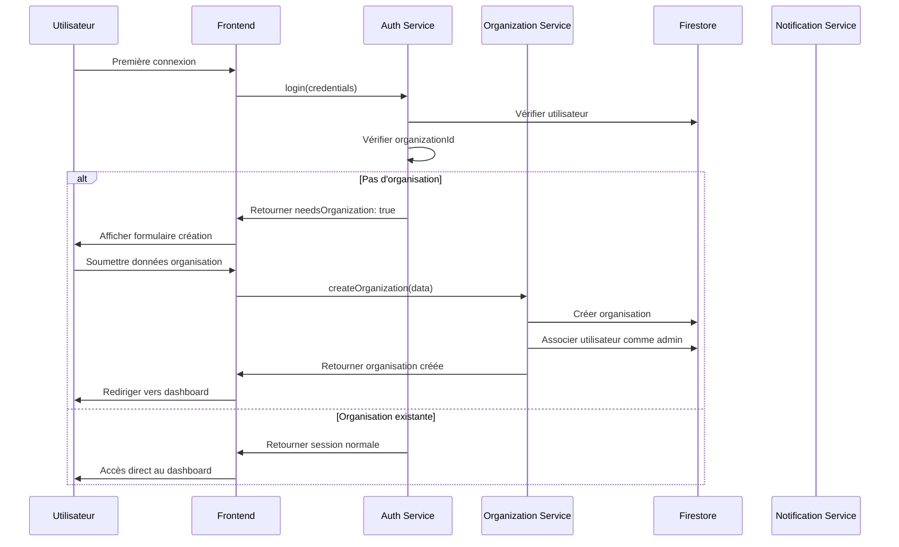
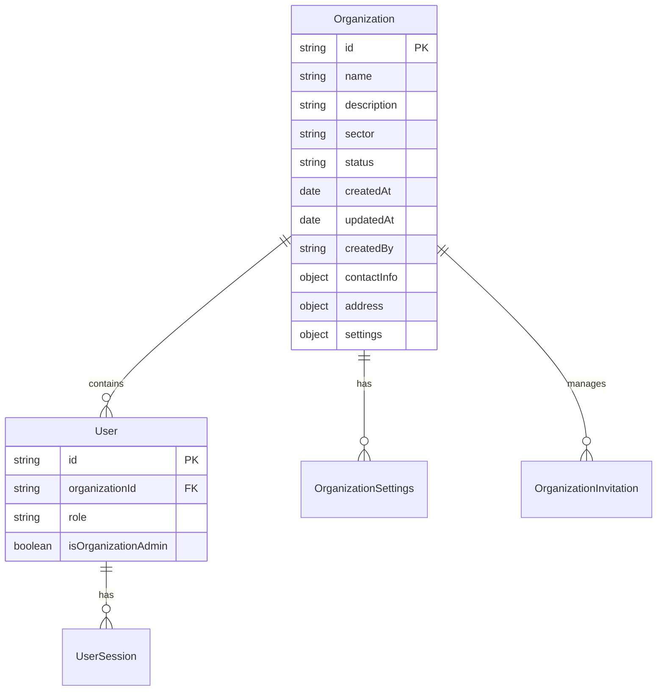

# Design Document - Création d'organisation à la première connexion

## Overview

Cette fonctionnalité implémente un système d'onboarding organisationnel qui permet aux nouveaux utilisateurs de créer leur organisation lors de leur première connexion. Le système établit le contexte organisationnel comme fondement de tous les services de la plateforme, garantissant l'isolation des données et la personnalisation de l'expérience utilisateur selon le secteur d'activité.

Le design s'appuie sur l'architecture Firebase existante et intègre les patterns de sécurité déjà établis dans le système d'authentification.

## Architecture

### Vue d'ensemble du flux



### Architecture des données

Le système introduit une nouvelle entité `Organization` qui devient le contexte principal pour tous les services :



## Components and Interfaces

### 1. Organization Model

```typescript
interface Organization extends BaseEntity {
  name: string;
  description?: string;
  sector: OrganizationSector;
  status: OrganizationStatus;
  contactInfo: {
    email?: string;
    phone?: string;
    website?: string;
  };
  address?: Address;
  settings: OrganizationSettings;
  createdBy: string;
  adminIds: string[];
  memberCount: number;
  subscriptionPlan?: string;
  subscriptionStatus?: string;
}

enum OrganizationSector {
  SERVICES = 'services',
  RETAIL = 'retail',
  HEALTHCARE = 'healthcare',
  BEAUTY = 'beauty',
  EDUCATION = 'education',
  CONSULTING = 'consulting',
  ASSOCIATION = 'association',
  OTHER = 'other'
}

enum OrganizationStatus {
  ACTIVE = 'active',
  SUSPENDED = 'suspended',
  TRIAL = 'trial',
  EXPIRED = 'expired'
}

interface OrganizationSettings {
  features: {
    appointments: boolean;
    attendance: boolean;
    sales: boolean;
    clients: boolean;
    products: boolean;
    events: boolean;
  };
  branding: {
    logo?: string;
    primaryColor?: string;
    secondaryColor?: string;
  };
  notifications: {
    emailEnabled: boolean;
    smsEnabled: boolean;
  };
  security: {
    twoFactorRequired: boolean;
    passwordPolicy: PasswordPolicy;
  };
}
```

### 2. Organization Service

Le service d'organisation gère toutes les opérations liées aux organisations :

```typescript
class OrganizationService {
  async createOrganization(data: CreateOrganizationRequest, createdBy: string): Promise<Organization>
  async getOrganization(id: string): Promise<Organization | null>
  async updateOrganization(id: string, updates: UpdateOrganizationRequest): Promise<void>
  async deleteOrganization(id: string): Promise<void>
  async addMember(organizationId: string, userId: string, role: UserRole): Promise<void>
  async removeMember(organizationId: string, userId: string): Promise<void>
  async inviteUser(organizationId: string, email: string, role: UserRole): Promise<OrganizationInvitation>
  async acceptInvitation(token: string, userId: string): Promise<void>
  async getSectorTemplates(sector: OrganizationSector): Promise<OrganizationTemplate>
}
```

### 3. Organization Context Middleware

Un middleware garantit que toutes les requêtes sont contextualisées par organisation :

```typescript
interface OrganizationContext {
  organizationId: string;
  organization: Organization;
  userRole: UserRole;
  permissions: OrganizationPermissions;
}

class OrganizationContextMiddleware {
  async validateContext(userId: string): Promise<OrganizationContext>
  async enforceOrganizationAccess(organizationId: string, userId: string): Promise<boolean>
  async filterDataByOrganization<T>(data: T[], organizationId: string): Promise<T[]>
}
```

### 4. Frontend Components

#### OrganizationOnboardingFlow
Composant principal gérant le flux d'onboarding :

```typescript
interface OrganizationOnboardingFlowProps {
  user: User;
  onComplete: (organization: Organization) => void;
  onSkip?: () => void;
}

const OrganizationOnboardingFlow: React.FC<OrganizationOnboardingFlowProps>
```

#### OrganizationCreationForm
Formulaire de création d'organisation avec validation :

```typescript
interface OrganizationFormData {
  name: string;
  description?: string;
  sector: OrganizationSector;
  contactInfo: ContactInfo;
  address?: Address;
}

const OrganizationCreationForm: React.FC<{
  onSubmit: (data: OrganizationFormData) => Promise<void>;
  loading: boolean;
}>
```

#### SectorTemplateSelector
Sélecteur de templates basés sur le secteur d'activité :

```typescript
const SectorTemplateSelector: React.FC<{
  sector: OrganizationSector;
  onTemplateSelect: (template: OrganizationTemplate) => void;
}>
```

## Data Models

### Organization Collection Structure

```javascript
// Collection: organizations
{
  id: "org_123456789",
  name: "Salon Belle Époque",
  description: "Salon de coiffure et esthétique",
  sector: "beauty",
  status: "active",
  contactInfo: {
    email: "contact@belle-epoque.fr",
    phone: "+33123456789",
    website: "https://belle-epoque.fr"
  },
  address: {
    street: "123 Rue de la Paix",
    city: "Paris",
    postalCode: "75001",
    country: "France"
  },
  settings: {
    features: {
      appointments: true,
      attendance: false,
      sales: true,
      clients: true,
      products: true,
      events: false
    },
    branding: {
      logo: "gs://bucket/logos/org_123456789.png",
      primaryColor: "#8B4513",
      secondaryColor: "#DEB887"
    },
    notifications: {
      emailEnabled: true,
      smsEnabled: true
    },
    security: {
      twoFactorRequired: false,
      passwordPolicy: {
        minLength: 12,
        requireSpecialChars: true,
        requireNumbers: true
      }
    }
  },
  createdBy: "user_987654321",
  adminIds: ["user_987654321"],
  memberCount: 1,
  subscriptionPlan: "starter",
  subscriptionStatus: "trial",
  createdAt: "2024-01-15T10:00:00Z",
  updatedAt: "2024-01-15T10:00:00Z"
}
```

### Organization Invitations Collection

```javascript
// Collection: organization_invitations
{
  id: "inv_123456789",
  organizationId: "org_123456789",
  email: "employe@example.com",
  role: "employee",
  invitedBy: "user_987654321",
  token: "secure_invitation_token_hash",
  status: "pending",
  expiresAt: "2024-01-22T10:00:00Z",
  createdAt: "2024-01-15T10:00:00Z",
  acceptedAt: null,
  message: "Rejoignez notre équipe !"
}
```

### Updated User Model

Le modèle utilisateur existant est étendu pour inclure le contexte organisationnel :

```typescript
// Ajouts au User interface existant
interface User extends BaseEntity {
  // ... champs existants
  organizationId?: string;
  isOrganizationAdmin: boolean;
  organizationRole: OrganizationRole;
  joinedOrganizationAt?: Date;
}

enum OrganizationRole {
  OWNER = 'owner',
  ADMIN = 'admin',
  MANAGER = 'manager',
  EMPLOYEE = 'employee',
  GUEST = 'guest'
}
```

## Error Handling

### Codes d'erreur spécifiques

```typescript
const ORGANIZATION_ERROR_CODES = {
  ORGANIZATION_NOT_FOUND: 'ORGANIZATION_NOT_FOUND',
  ORGANIZATION_NAME_TAKEN: 'ORGANIZATION_NAME_TAKEN',
  INVALID_SECTOR: 'INVALID_SECTOR',
  INSUFFICIENT_PERMISSIONS: 'INSUFFICIENT_PERMISSIONS',
  INVITATION_EXPIRED: 'INVITATION_EXPIRED',
  INVITATION_ALREADY_ACCEPTED: 'INVITATION_ALREADY_ACCEPTED',
  MAX_MEMBERS_REACHED: 'MAX_MEMBERS_REACHED',
  ORGANIZATION_SUSPENDED: 'ORGANIZATION_SUSPENDED'
} as const;
```

### Gestion des erreurs par couche

#### Service Layer
- Validation des données d'entrée
- Vérification des permissions
- Gestion des contraintes métier
- Logging des erreurs critiques

#### API Layer
- Transformation des erreurs en réponses HTTP appropriées
- Sanitisation des messages d'erreur
- Rate limiting et protection contre les abus

#### Frontend Layer
- Affichage d'erreurs utilisateur-friendly
- Retry automatique pour les erreurs temporaires
- Fallback vers des états dégradés

## Testing Strategy

### Tests Unitaires

#### Organization Service Tests
```typescript
describe('OrganizationService', () => {
  describe('createOrganization', () => {
    it('should create organization with valid data')
    it('should reject duplicate organization names')
    it('should apply sector-specific templates')
    it('should set creator as admin')
  })
  
  describe('inviteUser', () => {
    it('should create invitation with expiration')
    it('should send notification email')
    it('should prevent duplicate invitations')
  })
})
```

#### Organization Model Tests
```typescript
describe('OrganizationModel', () => {
  it('should validate required fields')
  it('should sanitize input data')
  it('should apply default settings')
  it('should handle sector-specific configurations')
})
```

### Tests d'Intégration

#### Onboarding Flow Tests
```typescript
describe('Organization Onboarding Flow', () => {
  it('should complete full onboarding process')
  it('should handle authentication errors')
  it('should redirect after successful creation')
  it('should preserve form data on errors')
})
```

#### Context Middleware Tests
```typescript
describe('OrganizationContextMiddleware', () => {
  it('should enforce organization access')
  it('should filter data by organization')
  it('should handle missing organization context')
})
```

### Tests End-to-End

#### User Journey Tests
- Inscription → Création d'organisation → Accès au dashboard
- Invitation d'utilisateur → Acceptation → Accès aux fonctionnalités
- Changement de contexte organisationnel
- Gestion des permissions par rôle

## Security Considerations

### Isolation des données
- **Principe :** Toutes les requêtes doivent être filtrées par `organizationId`
- **Implémentation :** Middleware de contexte obligatoire sur toutes les routes protégées
- **Validation :** Tests automatisés pour vérifier l'isolation

### Gestion des permissions
- **Modèle RBAC :** Rôles organisationnels avec permissions granulaires
- **Héritage :** Les permissions système complètent les permissions organisationnelles
- **Audit :** Logging de tous les changements de permissions

### Sécurité des invitations
- **Tokens :** Génération cryptographiquement sécurisée avec expiration
- **Rate limiting :** Limitation du nombre d'invitations par organisation/jour
- **Validation :** Vérification de l'email et du domaine avant envoi

### Protection contre les abus
- **Création d'organisations :** Limitation par utilisateur et par période
- **Noms d'organisations :** Validation contre les noms réservés/offensants
- **Monitoring :** Alertes sur les patterns suspects

## Performance Considerations

### Optimisations de requêtes
- **Index Firestore :** Index composites sur `organizationId` + autres champs fréquents
- **Pagination :** Implémentation systématique pour les listes
- **Cache :** Mise en cache des données d'organisation fréquemment accédées

### Scalabilité
- **Sharding :** Préparation pour le partitionnement par organisation
- **CDN :** Mise en cache des assets statiques (logos, templates)
- **Lazy loading :** Chargement différé des fonctionnalités non critiques

## Migration Strategy

### Phase 1 : Préparation
- Ajout des champs `organizationId` aux collections existantes
- Création des nouvelles collections (organizations, invitations)
- Mise à jour des modèles de données

### Phase 2 : Déploiement
- Déploiement du middleware de contexte
- Activation du flux d'onboarding pour les nouveaux utilisateurs
- Migration progressive des utilisateurs existants

### Phase 3 : Nettoyage
- Suppression des anciens patterns d'accès aux données
- Optimisation des index
- Monitoring et ajustements de performance

## Monitoring and Analytics

### Métriques clés
- Taux de completion de l'onboarding
- Temps moyen de création d'organisation
- Taux d'acceptation des invitations
- Distribution par secteur d'activité

### Alertes
- Échecs de création d'organisation
- Invitations expirées non acceptées
- Tentatives d'accès non autorisées
- Erreurs de contexte organisationnel

### Dashboards
- Vue d'ensemble des organisations actives
- Statistiques d'adoption par fonctionnalité
- Performance des templates par secteur
- Santé du système d'invitations