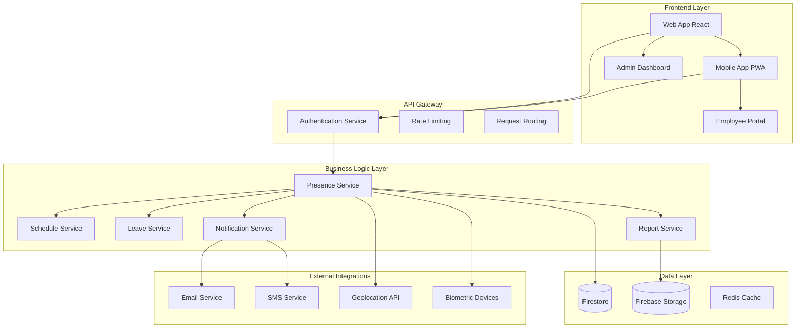
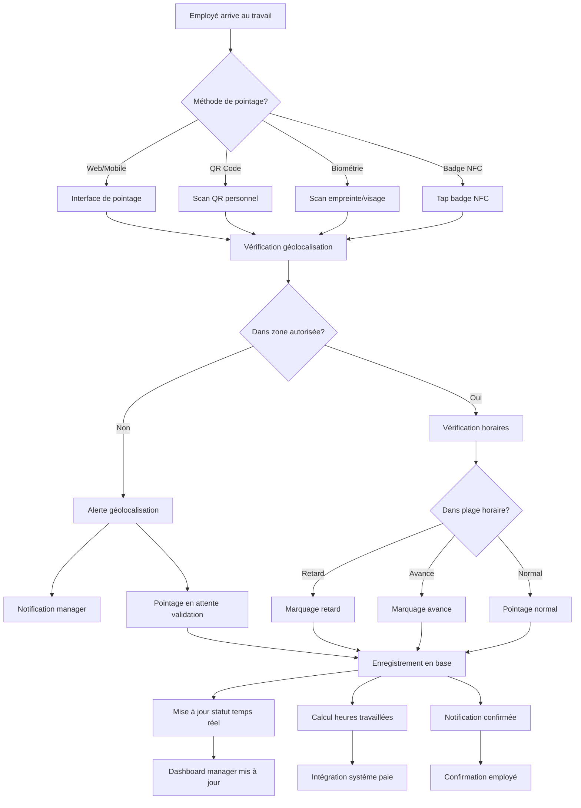
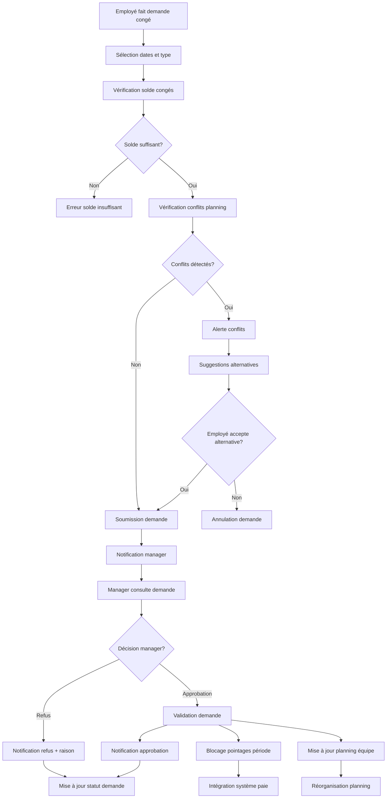
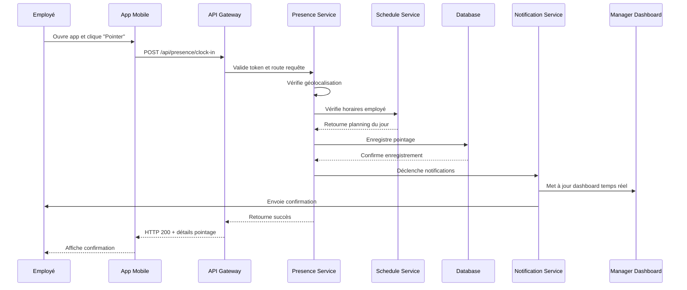
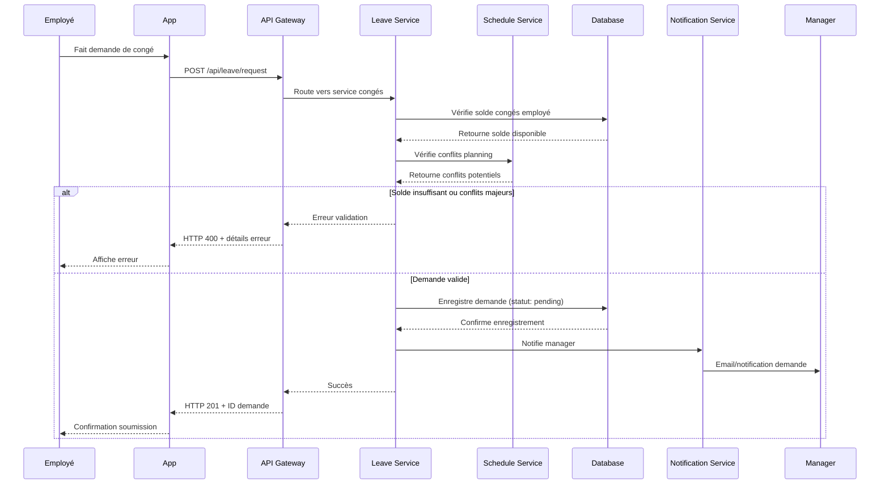

# Design Document - Gestion de présence

## Overview

Le système de gestion de présence permet aux organisations de tracer précisément les heures de travail de leurs employés, gérer les congés et absences, et générer des rapports conformes aux obligations légales. L'architecture est conçue pour être scalable, sécurisée, et intégrée avec les systèmes RH et de paie existants.

## Architecture

### Architecture Générale



### Diagramme de Flow - Processus de Pointage



### Diagramme de Flow - Gestion des Congés



### Diagrammes de Séquence

#### Séquence de Pointage Standard



#### Séquence de Demande de Congé



## Components and Interfaces

### Services Backend

#### PresenceService
```typescript
interface PresenceService {
  clockIn(employeeId: string, location?: GeoLocation): Promise<ClockEntry>
  clockOut(employeeId: string, location?: GeoLocation): Promise<ClockEntry>
  getCurrentStatus(employeeId: string): Promise<PresenceStatus>
  getPresenceHistory(employeeId: string, period: DateRange): Promise<PresenceEntry[]>
  validatePresence(entryId: string, managerId: string): Promise<void>
}
```

#### LeaveService
```typescript
interface LeaveService {
  requestLeave(request: LeaveRequest): Promise<LeaveRequestResult>
  approveLeave(requestId: string, managerId: string): Promise<void>
  rejectLeave(requestId: string, managerId: string, reason: string): Promise<void>
  getLeaveBalance(employeeId: string): Promise<LeaveBalance>
  getLeaveHistory(employeeId: string): Promise<LeaveEntry[]>
}
```

#### ScheduleService
```typescript
interface ScheduleService {
  getEmployeeSchedule(employeeId: string, date: Date): Promise<WorkSchedule>
  updateSchedule(employeeId: string, schedule: WorkSchedule): Promise<void>
  checkScheduleConflicts(employeeId: string, period: DateRange): Promise<Conflict[]>
  getTeamSchedule(teamId: string, period: DateRange): Promise<TeamSchedule>
}
```

### Composants Frontend

#### PresenceTracker
```typescript
interface PresenceTrackerProps {
  employeeId: string
  currentStatus: PresenceStatus
  onClockIn: () => void
  onClockOut: () => void
  geolocationEnabled: boolean
}
```

#### LeaveRequestForm
```typescript
interface LeaveRequestFormProps {
  employeeId: string
  availableBalance: LeaveBalance
  onSubmit: (request: LeaveRequest) => void
  onCancel: () => void
}
```

#### PresenceDashboard
```typescript
interface PresenceDashboardProps {
  teamId: string
  employees: Employee[]
  presenceData: PresenceData[]
  onEmployeeSelect: (employeeId: string) => void
  filters: DashboardFilters
}
```

## Data Models

### Core Entities

```typescript
interface Employee {
  id: string
  organizationId: string
  personalInfo: {
    firstName: string
    lastName: string
    email: string
    phone: string
  }
  workInfo: {
    employeeNumber: string
    department: string
    position: string
    manager: string
    startDate: Date
    contractType: 'CDI' | 'CDD' | 'STAGE' | 'FREELANCE'
  }
  schedule: WorkSchedule
  leaveEntitlements: LeaveEntitlement[]
  settings: EmployeeSettings
  createdAt: Date
  updatedAt: Date
}

interface PresenceEntry {
  id: string
  employeeId: string
  organizationId: string
  date: Date
  clockIn?: {
    timestamp: Date
    location?: GeoLocation
    method: 'WEB' | 'MOBILE' | 'QR' | 'NFC' | 'BIOMETRIC'
    deviceInfo?: DeviceInfo
  }
  clockOut?: {
    timestamp: Date
    location?: GeoLocation
    method: 'WEB' | 'MOBILE' | 'QR' | 'NFC' | 'BIOMETRIC'
    deviceInfo?: DeviceInfo
  }
  totalHours?: number
  status: 'PRESENT' | 'ABSENT' | 'LATE' | 'EARLY_LEAVE' | 'PENDING_VALIDATION'
  breaks: BreakEntry[]
  notes?: string
  validatedBy?: string
  validatedAt?: Date
  createdAt: Date
  updatedAt: Date
}

interface LeaveRequest {
  id: string
  employeeId: string
  organizationId: string
  type: 'VACATION' | 'SICK' | 'PERSONAL' | 'MATERNITY' | 'PATERNITY' | 'OTHER'
  startDate: Date
  endDate: Date
  totalDays: number
  reason?: string
  status: 'PENDING' | 'APPROVED' | 'REJECTED' | 'CANCELLED'
  approvedBy?: string
  approvedAt?: Date
  rejectionReason?: string
  documents?: string[]
  createdAt: Date
  updatedAt: Date
}

interface WorkSchedule {
  id: string
  employeeId: string
  organizationId: string
  name: string
  weeklySchedule: {
    monday?: DaySchedule
    tuesday?: DaySchedule
    wednesday?: DaySchedule
    thursday?: DaySchedule
    friday?: DaySchedule
    saturday?: DaySchedule
    sunday?: DaySchedule
  }
  exceptions: ScheduleException[]
  effectiveFrom: Date
  effectiveTo?: Date
  createdAt: Date
  updatedAt: Date
}

interface DaySchedule {
  workingDay: boolean
  startTime: string // "09:00"
  endTime: string   // "17:00"
  breaks: {
    startTime: string
    endTime: string
    paid: boolean
  }[]
  flexibilityMinutes?: number
}
```

### Supporting Types

```typescript
interface GeoLocation {
  latitude: number
  longitude: number
  accuracy: number
  timestamp: Date
}

interface DeviceInfo {
  userAgent: string
  platform: string
  deviceId?: string
  ipAddress: string
}

interface BreakEntry {
  startTime: Date
  endTime?: Date
  type: 'LUNCH' | 'COFFEE' | 'PERSONAL' | 'OTHER'
  paid: boolean
}

interface LeaveBalance {
  employeeId: string
  year: number
  entitlements: {
    type: string
    totalDays: number
    usedDays: number
    remainingDays: number
    expiryDate?: Date
  }[]
  updatedAt: Date
}

interface PresenceStatus {
  employeeId: string
  currentStatus: 'CLOCKED_IN' | 'CLOCKED_OUT' | 'ON_BREAK'
  lastActivity?: {
    type: 'CLOCK_IN' | 'CLOCK_OUT' | 'BREAK_START' | 'BREAK_END'
    timestamp: Date
    location?: GeoLocation
  }
  todayHours: number
  weekHours: number
  monthHours: number
}
```

## Error Handling

### Stratégie de Gestion d'Erreurs

```typescript
enum PresenceErrorCode {
  INVALID_GEOLOCATION = 'INVALID_GEOLOCATION',
  ALREADY_CLOCKED_IN = 'ALREADY_CLOCKED_IN',
  NOT_CLOCKED_IN = 'NOT_CLOCKED_IN',
  OUTSIDE_WORK_HOURS = 'OUTSIDE_WORK_HOURS',
  INSUFFICIENT_LEAVE_BALANCE = 'INSUFFICIENT_LEAVE_BALANCE',
  SCHEDULE_CONFLICT = 'SCHEDULE_CONFLICT',
  DEVICE_NOT_AUTHORIZED = 'DEVICE_NOT_AUTHORIZED'
}

interface PresenceError {
  code: PresenceErrorCode
  message: string
  details?: any
  timestamp: Date
  employeeId?: string
}
```

### Gestion des Cas d'Erreur

1. **Erreurs de Géolocalisation**
   - Validation des coordonnées GPS
   - Tolérance configurable par organisation
   - Mode dégradé sans géolocalisation

2. **Erreurs de Connectivité**
   - Mode hors-ligne avec synchronisation
   - Queue des actions en attente
   - Résolution des conflits

3. **Erreurs de Validation**
   - Validation côté client et serveur
   - Messages d'erreur contextuels
   - Suggestions de correction

## Testing Strategy

### Tests Unitaires
- Services métier (PresenceService, LeaveService)
- Utilitaires de calcul (heures, congés)
- Validateurs de données

### Tests d'Intégration
- API endpoints avec base de données
- Intégrations externes (géolocalisation, notifications)
- Workflows complets (pointage, demande congé)

### Tests End-to-End
- Parcours utilisateur complets
- Tests multi-devices
- Tests de performance et charge

### Tests de Sécurité
- Authentification et autorisation
- Validation des données sensibles
- Protection contre les attaques courantes