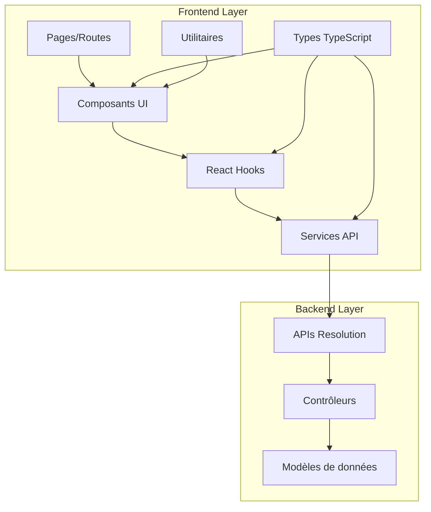

# Design Document - Intégration Frontend des APIs de Résolution

## Overview

Ce document décrit l'architecture et la conception technique pour l'intégration complète des APIs de résolution de réunion dans le frontend de l'application AttendanceX. L'objectif est de créer une interface utilisateur moderne, réactive et intuitive qui permet aux utilisateurs de gérer efficacement les résolutions de leurs réunions.

### Objectifs de conception

1. **Cohérence architecturale** : Suivre les patterns existants du frontend
2. **Performance optimisée** : Gestion efficace des données et du cache
3. **Expérience utilisateur fluide** : Interface intuitive et responsive
4. **Maintenabilité** : Code modulaire et bien structuré
5. **Accessibilité** : Respect des standards WCAG 2.1

## Architecture

### Vue d'ensemble de l'architecture



### Patterns architecturaux utilisés

1. **Service Layer Pattern** : Séparation de la logique API
2. **Custom Hooks Pattern** : Gestion d'état réutilisable
3. **Component Composition** : Composants modulaires et réutilisables
4. **Type-First Development** : Types TypeScript complets
5. **Error Boundary Pattern** : Gestion d'erreurs robuste

## Components and Interfaces

### Structure des dossiers

```
frontend/src/
├── shared/types/
│   └── resolution.types.ts          # Types et interfaces
├── services/
│   └── resolutionService.ts         # Service API
├── hooks/
│   └── useResolutions.ts            # Hooks React
├── components/
│   └── resolutions/
│       ├── ResolutionList.tsx       # Liste des résolutions
│       ├── ResolutionForm.tsx       # Formulaire création/édition
│       ├── ResolutionDetail.tsx     # Vue détaillée
│       ├── ResolutionCard.tsx       # Carte résolution
│       ├── ResolutionFilters.tsx    # Filtres et recherche
│       ├── ResolutionStats.tsx      # Statistiques
│       ├── CommentSection.tsx       # Section commentaires
│       ├── ProgressTracker.tsx      # Suivi du progrès
│       └── index.ts                 # Exports
├── pages/
│   ├── Events/
│   │   └── EventResolutions.tsx     # Page résolutions d'événement
│   └── Dashboard/
│       └── MyTasks.tsx              # Dashboard tâches personnelles
└── utils/
    └── resolutionUtils.ts           # Utilitaires spécifiques
```

### Composants principaux

#### 1. ResolutionList
**Responsabilité** : Affichage de la liste des résolutions avec filtrage et tri
**Props** :
```typescript
interface ResolutionListProps {
  eventId: string;
  showFilters?: boolean;
  showCreateButton?: boolean;
  compact?: boolean;
  onResolutionSelect?: (resolution: Resolution) => void;
}
```

#### 2. ResolutionForm
**Responsabilité** : Création et modification de résolutions
**Props** :
```typescript
interface ResolutionFormProps {
  eventId: string;
  resolution?: Resolution;
  mode: 'create' | 'edit';
  onSuccess: (resolution: Resolution) => void;
  onCancel: () => void;
}
```

#### 3. ResolutionDetail
**Responsabilité** : Vue détaillée d'une résolution avec commentaires et historique
**Props** :
```typescript
interface ResolutionDetailProps {
  resolution: Resolution;
  canEdit: boolean;
  onUpdate: (resolution: Resolution) => void;
  onDelete: () => void;
}
```

#### 4. MyTasksDashboard
**Responsabilité** : Dashboard personnel des tâches assignées
**Props** :
```typescript
interface MyTasksDashboardProps {
  userId: string;
  showStats?: boolean;
  showFilters?: boolean;
}
```

### Interfaces de service

#### ResolutionService
```typescript
class ResolutionService {
  // CRUD operations
  createResolution(eventId: string, data: CreateResolutionRequest): Promise<ApiResponse<Resolution>>
  getEventResolutions(eventId: string, filters?: ResolutionFilters, options?: QueryOptions): Promise<ApiResponse<PaginatedResolutions>>
  getResolution(resolutionId: string): Promise<ApiResponse<Resolution>>
  updateResolution(resolutionId: string, data: UpdateResolutionRequest): Promise<ApiResponse<Resolution>>
  deleteResolution(resolutionId: string): Promise<ApiResponse<void>>
  
  // Status and progress
  updateStatus(resolutionId: string, status: ResolutionStatus): Promise<ApiResponse<Resolution>>
  updateProgress(resolutionId: string, progress: number): Promise<ApiResponse<Resolution>>
  
  // Comments
  addComment(resolutionId: string, content: string): Promise<ApiResponse<Resolution>>
  
  // User tasks
  getMyTasks(filters?: ResolutionFilters, options?: QueryOptions): Promise<ApiResponse<PaginatedResolutions>>
  
  // Statistics and analytics
  getResolutionStats(eventId?: string, period?: string): Promise<ApiResponse<ResolutionStats>>
  
  // Search and export
  searchResolutions(query: string, filters?: ResolutionFilters): Promise<ApiResponse<PaginatedResolutions>>
  exportResolutions(format: 'csv' | 'excel' | 'pdf', filters?: ResolutionFilters): Promise<Blob>
}
```

### Hooks personnalisés

#### useResolutions
```typescript
const useResolutions = (eventId: string) => {
  return {
    // State
    resolutions: Resolution[],
    loading: boolean,
    error: string | null,
    pagination: PaginationInfo,
    
    // Actions
    createResolution: (data: CreateResolutionRequest) => Promise<Resolution | null>,
    updateResolution: (id: string, data: UpdateResolutionRequest) => Promise<Resolution | null>,
    deleteResolution: (id: string) => Promise<boolean>,
    updateStatus: (id: string, status: ResolutionStatus) => Promise<boolean>,
    updateProgress: (id: string, progress: number) => Promise<boolean>,
    addComment: (id: string, content: string) => Promise<boolean>,
    
    // Utilities
    loadMore: () => void,
    refresh: () => void,
    canEdit: (resolution: Resolution) => boolean,
    canDelete: (resolution: Resolution) => boolean,
  }
}
```

#### useMyTasks
```typescript
const useMyTasks = () => {
  return {
    // State
    tasks: Resolution[],
    stats: ResolutionStats | null,
    loading: boolean,
    error: string | null,
    
    // Actions
    loadTasks: (filters?: ResolutionFilters) => Promise<void>,
    loadStats: (period?: string) => Promise<void>,
    refresh: () => void,
  }
}
```

## Data Models

### Types principaux

#### Resolution
```typescript
interface Resolution {
  id?: string;
  eventId: string;
  title: string;
  description: string;
  assignedTo: string[];
  assignedToNames?: string[];
  createdBy: string;
  createdByName?: string;
  dueDate?: Date;
  status: ResolutionStatus;
  priority: ResolutionPriority;
  tags?: string[];
  attachments?: string[];
  comments?: ResolutionComment[];
  progress?: number;
  estimatedHours?: number;
  actualHours?: number;
  tenantId: string;
  createdAt: Date;
  updatedAt: Date;
}
```

#### Énumérations
```typescript
enum ResolutionStatus {
  PENDING = 'pending',
  IN_PROGRESS = 'in_progress',
  COMPLETED = 'completed',
  CANCELLED = 'cancelled'
}

enum ResolutionPriority {
  LOW = 'low',
  MEDIUM = 'medium',
  HIGH = 'high',
  URGENT = 'urgent'
}
```

#### Interfaces de requête
```typescript
interface CreateResolutionRequest {
  eventId: string;
  title: string;
  description: string;
  assignedTo: string[];
  dueDate?: Date;
  priority?: ResolutionPriority;
  tags?: string[];
  estimatedHours?: number;
}

interface UpdateResolutionRequest {
  title?: string;
  description?: string;
  assignedTo?: string[];
  dueDate?: Date;
  status?: ResolutionStatus;
  priority?: ResolutionPriority;
  tags?: string[];
  progress?: number;
  actualHours?: number;
}

interface ResolutionFilters {
  status?: ResolutionStatus;
  assignedTo?: string;
  priority?: ResolutionPriority;
  overdue?: boolean;
  eventId?: string;
}
```

### Gestion du cache et de l'état

#### Stratégie de cache
1. **Cache local** : Utilisation de React Query pour le cache des données
2. **Invalidation intelligente** : Mise à jour automatique lors des modifications
3. **Optimistic updates** : Mise à jour immédiate de l'UI avant confirmation serveur
4. **Pagination efficace** : Cache des pages précédentes

#### État global vs local
- **État global** : Statistiques utilisateur, préférences de filtrage
- **État local** : Données de formulaire, état de chargement des composants
- **État partagé** : Résolutions actives, notifications

## Error Handling

### Stratégie de gestion d'erreurs

#### Types d'erreurs
1. **Erreurs réseau** : Perte de connexion, timeout
2. **Erreurs de validation** : Données invalides côté client
3. **Erreurs d'autorisation** : Permissions insuffisantes
4. **Erreurs serveur** : Erreurs 500, indisponibilité du service

#### Mécanismes de gestion
```typescript
// Error Boundary pour les erreurs React
class ResolutionErrorBoundary extends React.Component {
  // Capture et affichage des erreurs de composants
}

// Service d'erreur centralisé
class ErrorService {
  handleApiError(error: ApiError): void
  showUserFriendlyMessage(error: Error): void
  logError(error: Error, context: string): void
}

// Hook pour la gestion d'erreurs
const useErrorHandler = () => {
  return {
    handleError: (error: Error, context?: string) => void,
    clearError: () => void,
    error: string | null,
  }
}
```

#### Messages d'erreur utilisateur
```typescript
const ERROR_MESSAGES = {
  NETWORK_ERROR: "Problème de connexion. Veuillez réessayer.",
  PERMISSION_DENIED: "Vous n'avez pas les permissions nécessaires.",
  VALIDATION_ERROR: "Veuillez vérifier les informations saisies.",
  NOT_FOUND: "La résolution demandée n'existe pas.",
  SERVER_ERROR: "Une erreur est survenue. Notre équipe a été notifiée.",
}
```

## Testing Strategy

### Types de tests

#### 1. Tests unitaires
- **Composants** : Rendu, props, interactions utilisateur
- **Hooks** : Logique métier, gestion d'état
- **Services** : Appels API, transformation de données
- **Utilitaires** : Fonctions pures, calculs

#### 2. Tests d'intégration
- **Flux utilisateur** : Création, modification, suppression de résolutions
- **Navigation** : Transitions entre pages et états
- **API** : Intégration avec le backend

#### 3. Tests end-to-end
- **Scénarios complets** : Workflow complet de gestion des résolutions
- **Cross-browser** : Compatibilité navigateurs
- **Responsive** : Tests sur différentes tailles d'écran

### Outils de test
```typescript
// Jest + React Testing Library
describe('ResolutionList', () => {
  it('should display resolutions correctly', () => {
    // Test de rendu
  });
  
  it('should handle filtering', () => {
    // Test de filtrage
  });
});

// MSW pour les mocks API
const handlers = [
  rest.get('/api/v1/events/:eventId/resolutions', (req, res, ctx) => {
    return res(ctx.json(mockResolutions));
  }),
];
```

### Couverture de tests
- **Objectif** : 80% de couverture minimum
- **Priorité** : Logique métier critique, flux utilisateur principaux
- **Exclusions** : Types, interfaces, fichiers de configuration

## Performance Considerations

### Optimisations de performance

#### 1. Rendu optimisé
```typescript
// Mémorisation des composants
const ResolutionCard = React.memo(({ resolution, onUpdate }) => {
  // Composant optimisé
});

// Virtualisation pour les grandes listes
import { FixedSizeList as List } from 'react-window';

const VirtualizedResolutionList = ({ resolutions }) => {
  return (
    <List
      height={600}
      itemCount={resolutions.length}
      itemSize={120}
    >
      {ResolutionRow}
    </List>
  );
};
```

#### 2. Gestion des données
```typescript
// Pagination efficace
const ITEMS_PER_PAGE = 20;

// Debouncing pour la recherche
const useDebounce = (value: string, delay: number) => {
  const [debouncedValue, setDebouncedValue] = useState(value);
  
  useEffect(() => {
    const handler = setTimeout(() => {
      setDebouncedValue(value);
    }, delay);
    
    return () => clearTimeout(handler);
  }, [value, delay]);
  
  return debouncedValue;
};
```

#### 3. Chargement asynchrone
```typescript
// Lazy loading des composants
const ResolutionDetail = React.lazy(() => import('./ResolutionDetail'));

// Suspense pour le chargement
<Suspense fallback={<LoadingSpinner />}>
  <ResolutionDetail />
</Suspense>
```

### Métriques de performance
- **First Contentful Paint** : < 1.5s
- **Largest Contentful Paint** : < 2.5s
- **Time to Interactive** : < 3s
- **Cumulative Layout Shift** : < 0.1

## Security Considerations

### Sécurité côté client

#### 1. Validation des données
```typescript
// Validation avec Zod
const resolutionSchema = z.object({
  title: z.string().min(3).max(200),
  description: z.string().min(10).max(2000),
  assignedTo: z.array(z.string()).min(1),
  dueDate: z.date().optional(),
});
```

#### 2. Sanitisation
```typescript
// Sanitisation des entrées utilisateur
import DOMPurify from 'dompurify';

const sanitizeContent = (content: string): string => {
  return DOMPurify.sanitize(content);
};
```

#### 3. Gestion des tokens
```typescript
// Gestion sécurisée des tokens d'authentification
class AuthService {
  private getAuthHeader(): Record<string, string> {
    const token = this.getValidToken();
    return token ? { Authorization: `Bearer ${token}` } : {};
  }
}
```

### Permissions et autorisations
```typescript
// Vérification des permissions
const usePermissions = (resolution: Resolution) => {
  const { user } = useAuth();
  
  return {
    canView: resolution.assignedTo.includes(user.id) || resolution.createdBy === user.id,
    canEdit: resolution.assignedTo.includes(user.id) || resolution.createdBy === user.id,
    canDelete: resolution.createdBy === user.id,
    canComment: resolution.assignedTo.includes(user.id) || resolution.createdBy === user.id,
  };
};
```

## Accessibility

### Standards d'accessibilité

#### 1. WCAG 2.1 AA
- **Contraste** : Ratio minimum 4.5:1 pour le texte normal
- **Navigation clavier** : Tous les éléments interactifs accessibles
- **Lecteurs d'écran** : Labels et descriptions appropriés
- **Focus visible** : Indicateurs de focus clairs

#### 2. Implémentation
```typescript
// Composants accessibles
const ResolutionCard = ({ resolution }) => {
  return (
    <div
      role="article"
      aria-labelledby={`resolution-title-${resolution.id}`}
      aria-describedby={`resolution-desc-${resolution.id}`}
    >
      <h3 id={`resolution-title-${resolution.id}`}>
        {resolution.title}
      </h3>
      <p id={`resolution-desc-${resolution.id}`}>
        {resolution.description}
      </p>
    </div>
  );
};

// Navigation clavier
const useKeyboardNavigation = () => {
  useEffect(() => {
    const handleKeyDown = (event: KeyboardEvent) => {
      if (event.key === 'Escape') {
        // Fermer les modales
      }
    };
    
    document.addEventListener('keydown', handleKeyDown);
    return () => document.removeEventListener('keydown', handleKeyDown);
  }, []);
};
```

#### 3. Tests d'accessibilité
```typescript
// Tests automatisés avec axe-core
import { axe, toHaveNoViolations } from 'jest-axe';

expect.extend(toHaveNoViolations);

test('should not have accessibility violations', async () => {
  const { container } = render(<ResolutionList eventId="test" />);
  const results = await axe(container);
  expect(results).toHaveNoViolations();
});
```

## Integration Points

### Intégration avec les pages existantes

#### 1. Pages d'événements
```typescript
// EventDetails.tsx - Ajout d'un onglet résolutions
const EventDetails = ({ eventId }) => {
  const [activeTab, setActiveTab] = useState('overview');
  
  return (
    <Tabs value={activeTab} onValueChange={setActiveTab}>
      <TabsList>
        <TabsTrigger value="overview">Aperçu</TabsTrigger>
        <TabsTrigger value="participants">Participants</TabsTrigger>
        <TabsTrigger value="resolutions">Résolutions</TabsTrigger>
      </TabsList>
      
      <TabsContent value="resolutions">
        <ResolutionList eventId={eventId} />
      </TabsContent>
    </Tabs>
  );
};
```

#### 2. Dashboard principal
```typescript
// Dashboard.tsx - Widget des tâches
const Dashboard = () => {
  return (
    <div className="grid grid-cols-1 md:grid-cols-2 lg:grid-cols-3 gap-6">
      <MyTasksWidget />
      <UpcomingEventsWidget />
      <RecentActivityWidget />
    </div>
  );
};
```

### Intégration avec les services existants

#### 1. Service de notifications
```typescript
// Notifications pour les résolutions
const useResolutionNotifications = () => {
  const { showNotification } = useNotifications();
  
  const notifyAssignment = (resolution: Resolution) => {
    showNotification({
      type: 'info',
      title: 'Nouvelle tâche assignée',
      message: `Vous avez été assigné à: ${resolution.title}`,
      action: {
        label: 'Voir',
        onClick: () => navigateToResolution(resolution.id),
      },
    });
  };
};
```

#### 2. Service d'export
```typescript
// Intégration avec le système d'export existant
const exportResolutions = async (resolutions: Resolution[], format: 'csv' | 'excel') => {
  const exportService = new ExportService();
  return exportService.export(resolutions, format, {
    filename: `resolutions-${new Date().toISOString().split('T')[0]}`,
    columns: ['title', 'status', 'priority', 'assignedTo', 'dueDate'],
  });
};
```

## Deployment Strategy

### Stratégie de déploiement

#### 1. Déploiement progressif
1. **Phase 1** : Types et services (pas d'impact UI)
2. **Phase 2** : Composants de base et hooks
3. **Phase 3** : Intégration dans les pages existantes
4. **Phase 4** : Fonctionnalités avancées (export, statistiques)

#### 2. Feature flags
```typescript
// Contrôle des fonctionnalités
const useFeatureFlags = () => {
  return {
    resolutionsEnabled: process.env.REACT_APP_RESOLUTIONS_ENABLED === 'true',
    resolutionExportEnabled: process.env.REACT_APP_RESOLUTION_EXPORT_ENABLED === 'true',
    resolutionStatsEnabled: process.env.REACT_APP_RESOLUTION_STATS_ENABLED === 'true',
  };
};
```

#### 3. Monitoring et métriques
```typescript
// Tracking des performances et erreurs
const useAnalytics = () => {
  const trackResolutionCreated = (resolution: Resolution) => {
    analytics.track('resolution_created', {
      eventId: resolution.eventId,
      priority: resolution.priority,
      assigneeCount: resolution.assignedTo.length,
    });
  };
};
```

### Rollback et récupération
- **Rollback automatique** : En cas d'erreur critique
- **Monitoring continu** : Surveillance des métriques de performance
- **Alertes** : Notification en cas de problème
- **Fallback UI** : Interface de secours en cas d'échec