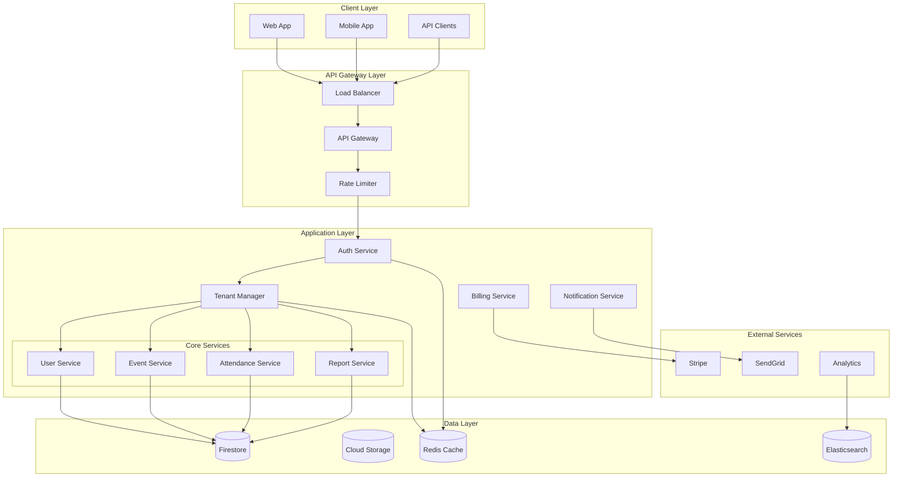

# Design Document - SaaS Multi-Tenant Architecture

## Overview

Ce document décrit l'architecture technique pour transformer l'Attendance Management System en une plateforme SaaS multi-tenant complète. L'approche privilégie l'isolation des données au niveau applicatif avec une base de données partagée, optimisée pour la scalabilité et la performance.

## Architecture

### Architecture Pattern: Shared Database, Shared Schema

Nous utilisons le pattern **"Shared Database, Shared Schema"** avec isolation au niveau applicatif pour optimiser les coûts et la performance tout en garantissant la sécurité des données.



### Tenant Isolation Strategy

#### 1. Data Isolation
- **Tenant ID Injection**: Chaque requête inclut automatiquement le `tenantId`
- **Query Filtering**: Tous les queries Firestore incluent le filtre tenant
- **Data Validation**: Validation côté serveur que les données appartiennent au bon tenant
- **Audit Trail**: Logging complet des accès aux données par tenant

#### 2. Resource Isolation
- **Rate Limiting**: Limites par tenant selon le plan d'abonnement
- **Storage Quotas**: Quotas de stockage par tenant
- **Compute Limits**: Limites de calcul pour éviter le "noisy neighbor"
- **Cache Isolation**: Clés de cache préfixées par tenant

## Components and Interfaces

### 1. Tenant Manager Service

```typescript
interface TenantManagerService {
  // Tenant lifecycle
  createTenant(request: CreateTenantRequest): Promise<Tenant>;
  updateTenant(tenantId: string, updates: UpdateTenantRequest): Promise<Tenant>;
  deleteTenant(tenantId: string): Promise<void>;
  
  // Tenant context
  getTenantContext(tenantId: string): Promise<TenantContext>;
  validateTenantAccess(userId: string, tenantId: string): Promise<boolean>;
  switchTenantContext(userId: string, tenantId: string): Promise<TenantContext>;
  
  // Tenant features
  getTenantFeatures(tenantId: string): Promise<TenantFeatures>;
  updateTenantFeatures(tenantId: string, features: TenantFeatures): Promise<void>;
  
  // Tenant metrics
  getTenantUsage(tenantId: string): Promise<TenantUsage>;
  getTenantMetrics(tenantId: string, period: TimePeriod): Promise<TenantMetrics>;
}
```

### 2. Subscription Management Service

```typescript
interface SubscriptionService {
  // Plan management
  getAvailablePlans(): Promise<SubscriptionPlan[]>;
  createSubscription(tenantId: string, planId: string): Promise<Subscription>;
  updateSubscription(subscriptionId: string, planId: string): Promise<Subscription>;
  cancelSubscription(subscriptionId: string): Promise<void>;
  
  // Billing
  generateInvoice(tenantId: string): Promise<Invoice>;
  processPayment(invoiceId: string): Promise<PaymentResult>;
  handlePaymentFailure(subscriptionId: string): Promise<void>;
  
  // Usage tracking
  trackUsage(tenantId: string, feature: string, quantity: number): Promise<void>;
  getUsageReport(tenantId: string, period: TimePeriod): Promise<UsageReport>;
  checkUsageLimits(tenantId: string, feature: string): Promise<UsageCheck>;
}
```

### 3. Multi-Tenant Middleware

```typescript
interface MultiTenantMiddleware {
  // Context injection
  injectTenantContext(): ExpressMiddleware;
  validateTenantAccess(): ExpressMiddleware;
  enforceTenantIsolation(): ExpressMiddleware;
  
  // Feature gating
  requireFeature(feature: string): ExpressMiddleware;
  checkUsageLimits(feature: string): ExpressMiddleware;
  
  // Rate limiting
  rateLimitByTenant(): ExpressMiddleware;
  rateLimitByPlan(): ExpressMiddleware;
}
```

### 4. Tenant Onboarding Service

```typescript
interface OnboardingService {
  // Registration
  registerTenant(request: TenantRegistrationRequest): Promise<OnboardingSession>;
  completeRegistration(sessionId: string, data: RegistrationData): Promise<Tenant>;
  
  // Setup wizard
  initializeSetupWizard(tenantId: string): Promise<SetupWizard>;
  completeSetupStep(sessionId: string, step: string, data: any): Promise<SetupProgress>;
  
  // Demo data
  generateDemoData(tenantId: string, template: string): Promise<void>;
  cleanupDemoData(tenantId: string): Promise<void>;
  
  // User invitations
  inviteUsers(tenantId: string, invitations: UserInvitation[]): Promise<void>;
  acceptInvitation(token: string): Promise<TenantMembership>;
}
```

## Data Models

### 1. Simplified Tenant Model

```typescript
interface Tenant {
  id: string;
  name: string;
  slug: string; // URL-friendly identifier
  
  // Subscription essentials
  planId: string;
  status: TenantStatus; // active, suspended, cancelled
  
  // Core settings (simplified)
  settings: {
    timezone: string;
    locale: string;
    currency: string;
  };
  
  // Usage tracking (simplified)
  usage: {
    users: number;
    events: number;
    storage: number; // in MB
  };
  
  // Metadata
  createdAt: Date;
  updatedAt: Date;
  createdBy: string;
}

// Separate model for plan-based features and limits
interface SubscriptionPlan {
  id: string;
  name: string;
  price: number;
  currency: string;
  
  // Limits (simplified)
  limits: {
    maxUsers: number;
    maxEvents: number;
    maxStorage: number; // in MB
    apiCallsPerMonth: number;
  };
  
  // Features (boolean flags only)
  features: {
    advancedReporting: boolean;
    apiAccess: boolean;
    customBranding: boolean;
    webhooks: boolean;
  };
}

// Optional branding (separate collection for performance)
interface TenantBranding {
  tenantId: string;
  logoUrl?: string;
  primaryColor: string;
  secondaryColor: string;
}
```

### 2. Subscription Model

```typescript
interface Subscription {
  id: string;
  tenantId: string;
  planId: string;
  status: SubscriptionStatus; // active, past_due, cancelled, unpaid
  
  // Billing cycle
  currentPeriodStart: Date;
  currentPeriodEnd: Date;
  billingCycle: BillingCycle; // monthly, yearly
  
  // Pricing
  basePrice: number;
  currency: string;
  discountPercent?: number;
  
  // Usage-based billing
  usageCharges: UsageCharge[];
  
  // Payment
  paymentMethodId: string;
  nextPaymentDate: Date;
  
  // Metadata
  createdAt: Date;
  updatedAt: Date;
  cancelledAt?: Date;
  cancelReason?: string;
}

interface SubscriptionPlan {
  id: string;
  name: string;
  description: string;
  price: number;
  currency: string;
  billingCycle: BillingCycle;
  
  // Features included
  features: TenantFeatures;
  
  // Usage limits
  limits: TenantLimits;
  
  // Overage pricing
  overageRates: OverageRate[];
  
  // Metadata
  isActive: boolean;
  sortOrder: number;
  createdAt: Date;
}
```

### 3. Multi-Tenant Data Pattern

Tous les modèles de données existants sont étendus avec le pattern multi-tenant :

```typescript
// Base interface for all tenant-scoped entities
interface TenantScopedEntity {
  tenantId: string; // Always required
  createdAt: Date;
  updatedAt: Date;
}

// Example: Extended User model
interface User extends TenantScopedEntity {
  id: string;
  email: string;
  firstName: string;
  lastName: string;
  
  // Multi-tenant specific
  tenantMemberships: TenantMembership[];
  activeTenantId: string;
  
  // ... existing fields
}

interface TenantMembership {
  tenantId: string;
  role: TenantRole;
  permissions: string[];
  joinedAt: Date;
  isActive: boolean;
  invitedBy?: string;
}

// Example: Extended Event model
interface Event extends TenantScopedEntity {
  id: string;
  tenantId: string; // Explicit tenant isolation
  title: string;
  description: string;
  
  // ... existing fields
}
```

## Error Handling

### Tenant-Specific Error Handling

```typescript
enum TenantErrorCode {
  TENANT_NOT_FOUND = 'TENANT_NOT_FOUND',
  TENANT_SUSPENDED = 'TENANT_SUSPENDED',
  TENANT_LIMIT_EXCEEDED = 'TENANT_LIMIT_EXCEEDED',
  FEATURE_NOT_AVAILABLE = 'FEATURE_NOT_AVAILABLE',
  SUBSCRIPTION_EXPIRED = 'SUBSCRIPTION_EXPIRED',
  PAYMENT_REQUIRED = 'PAYMENT_REQUIRED',
  TENANT_ACCESS_DENIED = 'TENANT_ACCESS_DENIED'
}

interface TenantError extends Error {
  code: TenantErrorCode;
  tenantId: string;
  details?: any;
  retryAfter?: number; // For rate limiting
}
```

### Error Response Format

```typescript
interface TenantErrorResponse {
  success: false;
  error: {
    code: TenantErrorCode;
    message: string;
    tenantId: string;
    details?: any;
  };
  timestamp: string;
  requestId: string;
  
  // Action suggestions
  actions?: {
    upgradeUrl?: string;
    paymentUrl?: string;
    contactSupport?: boolean;
  };
}
```

## Testing Strategy

### 1. Tenant Isolation Testing

```typescript
describe('Tenant Isolation', () => {
  it('should prevent cross-tenant data access', async () => {
    // Create two tenants with test data
    const tenant1 = await createTestTenant();
    const tenant2 = await createTestTenant();
    
    // Verify tenant1 cannot access tenant2 data
    const result = await getUsersForTenant(tenant1.id, tenant2.id);
    expect(result).toHaveLength(0);
  });
  
  it('should enforce tenant context in all queries', async () => {
    // Mock query without tenant context
    const query = mockFirestoreQuery();
    
    // Verify tenant filter is automatically added
    const filteredQuery = await applyTenantFilter(query, 'tenant-123');
    expect(filteredQuery.filters).toContain(['tenantId', '==', 'tenant-123']);
  });
});
```

### 2. Subscription Testing

```typescript
describe('Subscription Management', () => {
  it('should enforce feature limits based on plan', async () => {
    const tenant = await createTenantWithPlan('basic');
    
    // Try to exceed user limit
    const result = await createUser(tenant.id, { /* user data */ });
    
    if (tenant.usage.users >= tenant.limits.maxUsers) {
      expect(result.error.code).toBe('TENANT_LIMIT_EXCEEDED');
    }
  });
  
  it('should handle subscription expiration', async () => {
    const tenant = await createExpiredTenant();
    
    // Verify read-only mode
    const writeResult = await createEvent(tenant.id, { /* event data */ });
    expect(writeResult.error.code).toBe('SUBSCRIPTION_EXPIRED');
    
    // Verify read access still works
    const readResult = await getEvents(tenant.id);
    expect(readResult.success).toBe(true);
  });
});
```

### 3. Performance Testing

```typescript
describe('Multi-Tenant Performance', () => {
  it('should maintain performance with multiple tenants', async () => {
    // Create 100 tenants with data
    const tenants = await createMultipleTenants(100);
    
    // Measure query performance
    const startTime = Date.now();
    const results = await Promise.all(
      tenants.map(tenant => getEvents(tenant.id))
    );
    const duration = Date.now() - startTime;
    
    // Verify performance is acceptable
    expect(duration).toBeLessThan(5000); // 5 seconds max
    expect(results.every(r => r.success)).toBe(true);
  });
});
```

## Security Considerations

### 1. Data Encryption

- **At Rest**: Firestore encryption par défaut + chiffrement au niveau application pour les données sensibles
- **In Transit**: TLS 1.3 pour toutes les communications
- **Tenant Keys**: Clés de chiffrement séparées par tenant pour les données ultra-sensibles

### 2. Access Control

- **JWT Tokens**: Incluent le `tenantId` et les permissions
- **API Keys**: Scopées par tenant avec permissions granulaires
- **Role-Based Access**: Rôles définis par tenant avec héritage

### 3. Audit Logging

```typescript
interface TenantAuditLog {
  id: string;
  tenantId: string;
  userId: string;
  action: string;
  resource: string;
  resourceId: string;
  
  // Request context
  ipAddress: string;
  userAgent: string;
  requestId: string;
  
  // Data changes
  oldValues?: any;
  newValues?: any;
  
  // Metadata
  timestamp: Date;
  success: boolean;
  errorCode?: string;
}
```

## Monitoring and Observability

### 1. Tenant Metrics

```typescript
interface TenantMetrics {
  tenantId: string;
  period: TimePeriod;
  
  // Usage metrics
  activeUsers: number;
  totalEvents: number;
  totalAttendances: number;
  apiCalls: number;
  storageUsed: number;
  
  // Performance metrics
  averageResponseTime: number;
  errorRate: number;
  uptime: number;
  
  // Business metrics
  revenue: number;
  churnRisk: number;
  satisfactionScore: number;
}
```

### 2. Alerting

- **Tenant Health**: Alertes automatiques pour les problèmes par tenant
- **Usage Limits**: Notifications avant d'atteindre les limites
- **Payment Issues**: Alertes pour les problèmes de facturation
- **Security Events**: Alertes pour les activités suspectes

## Migration Strategy

### Phase 1: Foundation (Semaines 1-2)
1. Mise en place du Tenant Manager Service
2. Extension des modèles de données avec `tenantId`
3. Implémentation du middleware multi-tenant

### Phase 2: Core Features (Semaines 3-4)
1. Migration des services existants vers multi-tenant
2. Implémentation de l'isolation des données
3. Tests d'isolation et de performance

### Phase 3: Subscription & Billing (Semaines 5-6)
1. Intégration avec Stripe
2. Gestion des plans et limites
3. Facturation automatisée

### Phase 4: Advanced Features (Semaines 7-8)
1. Onboarding automatisé
2. Personnalisation par tenant
3. Analytics et monitoring

### Phase 5: Production Readiness (Semaines 9-10)
1. Tests de charge et sécurité
2. Documentation et formation
3. Déploiement progressif

Cette architecture garantit une scalabilité horizontale, une isolation complète des données, et une expérience utilisateur optimale pour chaque tenant.