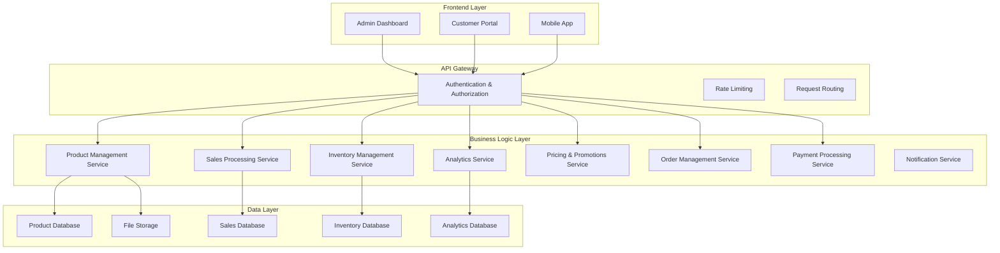

# Design Document - Gestion des ventes et produits

## Overview

The sales and product management system is a comprehensive e-commerce and inventory management solution that enables organizations to manage their product catalog, process sales, track performance, and handle inventory. The system supports both internal sales operations and customer-facing online purchasing.

The architecture follows a modular approach with clear separation between catalog management, sales processing, inventory tracking, analytics, and customer-facing interfaces. This design ensures scalability and maintainability while providing real-time synchronization across all modules.

## Architecture

### High-Level Architecture



### Service Architecture

The system is built using a microservices architecture with the following core services:

- **Product Management Service**: Handles catalog, categories, variants, and product lifecycle
- **Sales Processing Service**: Manages cart operations, order processing, and sales transactions
- **Inventory Management Service**: Tracks stock levels, movements, and alerts
- **Analytics Service**: Processes sales data and generates reports
- **Pricing & Promotions Service**: Manages pricing rules, discounts, and promotional campaigns
- **Order Management Service**: Handles order fulfillment, shipping, and tracking
- **Payment Processing Service**: Integrates with payment gateways and manages transactions
- **Notification Service**: Sends alerts, confirmations, and automated communications

## Components and Interfaces

### Product Management Component

**Responsibilities:**
- Product catalog management
- Category hierarchy management
- Product variants and attributes
- Product lifecycle (active/inactive status)
- Image and media management

**Key Interfaces:**
```typescript
interface Product {
  id: string;
  name: string;
  description: string;
  price: number;
  categoryId: string;
  variants: ProductVariant[];
  images: string[];
  status: 'active' | 'inactive';
  createdAt: Date;
  updatedAt: Date;
}

interface ProductVariant {
  id: string;
  name: string;
  attributes: { [key: string]: string }; // size, color, etc.
  price: number;
  sku: string;
  stockEnabled: boolean;
}

interface Category {
  id: string;
  name: string;
  parentId?: string;
  children: Category[];
  sortOrder: number;
}
```

### Sales Processing Component

**Responsibilities:**
- Shopping cart management
- Order creation and processing
- Discount application
- Tax calculation
- Payment integration

**Key Interfaces:**
```typescript
interface Cart {
  id: string;
  customerId?: string;
  items: CartItem[];
  discounts: Discount[];
  subtotal: number;
  taxAmount: number;
  total: number;
  createdAt: Date;
}

interface CartItem {
  productId: string;
  variantId?: string;
  quantity: number;
  unitPrice: number;
  totalPrice: number;
}

interface Sale {
  id: string;
  customerId?: string;
  items: SaleItem[];
  subtotal: number;
  discounts: number;
  taxAmount: number;
  total: number;
  paymentMethod: string;
  status: 'pending' | 'completed' | 'cancelled';
  createdAt: Date;
}
```

### Inventory Management Component

**Responsibilities:**
- Stock level tracking
- Inventory movements
- Low stock alerts
- Inventory adjustments
- Stock reservations

**Key Interfaces:**
```typescript
interface InventoryItem {
  productId: string;
  variantId?: string;
  currentStock: number;
  reservedStock: number;
  availableStock: number;
  minThreshold: number;
  maxThreshold?: number;
  trackingEnabled: boolean;
}

interface StockMovement {
  id: string;
  productId: string;
  variantId?: string;
  type: 'in' | 'out' | 'adjustment';
  quantity: number;
  reason: string;
  reference?: string; // sale ID, purchase ID, etc.
  createdAt: Date;
}
```

### Analytics Component

**Responsibilities:**
- Sales performance tracking
- Revenue analytics
- Product performance analysis
- Customer behavior analysis
- Report generation

**Key Interfaces:**
```typescript
interface SalesMetrics {
  period: DateRange;
  totalRevenue: number;
  totalOrders: number;
  averageOrderValue: number;
  topProducts: ProductPerformance[];
  revenueByCategory: CategoryRevenue[];
}

interface ProductPerformance {
  productId: string;
  productName: string;
  unitsSold: number;
  revenue: number;
  margin: number;
}
```

### Pricing & Promotions Component

**Responsibilities:**
- Price management
- Customer segment pricing
- Promotional campaigns
- Discount rules
- Price history tracking

**Key Interfaces:**
```typescript
interface PricingRule {
  id: string;
  productId: string;
  customerSegment?: string;
  minQuantity?: number;
  price: number;
  validFrom: Date;
  validTo?: Date;
  active: boolean;
}

interface Promotion {
  id: string;
  name: string;
  type: 'percentage' | 'fixed' | 'buy_x_get_y';
  value: number;
  conditions: PromotionCondition[];
  validFrom: Date;
  validTo: Date;
  active: boolean;
}
```

### Order Management Component

**Responsibilities:**
- Order fulfillment workflow
- Shipping management
- Order tracking
- Return processing
- Status updates

**Key Interfaces:**
```typescript
interface Order {
  id: string;
  saleId: string;
  customerId?: string;
  status: 'pending' | 'confirmed' | 'preparing' | 'shipped' | 'delivered' | 'cancelled';
  shippingAddress: Address;
  trackingNumber?: string;
  estimatedDelivery?: Date;
  createdAt: Date;
  updatedAt: Date;
}

interface OrderStatusHistory {
  orderId: string;
  status: string;
  timestamp: Date;
  notes?: string;
}
```

## Data Models

### Core Entities

**Product Entity:**
- Supports hierarchical categories
- Flexible attribute system for variants
- Media management for images and documents
- Audit trail for changes

**Sales Entity:**
- Links to customer management system
- Supports multiple payment methods
- Automatic tax calculation based on location
- Integration with accounting systems

**Inventory Entity:**
- Real-time stock tracking
- Configurable alert thresholds
- Movement history with full audit trail
- Support for multiple warehouses (future extension)

**Customer Entity:**
- Integration with existing user management
- Purchase history tracking
- Segmentation for pricing rules
- Communication preferences

### Database Schema Design

The system uses a relational database with the following key design decisions:

1. **Normalization**: Core entities are normalized to 3NF to ensure data integrity
2. **Denormalization**: Analytics tables are denormalized for performance
3. **Partitioning**: Large tables (sales, movements) are partitioned by date
4. **Indexing**: Strategic indexes on frequently queried fields

## Error Handling

### Error Categories

1. **Validation Errors**: Invalid input data, business rule violations
2. **Business Logic Errors**: Insufficient stock, invalid promotions, pricing conflicts
3. **Integration Errors**: Payment gateway failures, external service timeouts
4. **System Errors**: Database connectivity, file storage issues

### Error Handling Strategy

```typescript
interface ApiError {
  code: string;
  message: string;
  details?: any;
  timestamp: Date;
  requestId: string;
}

// Example error codes
const ErrorCodes = {
  INSUFFICIENT_STOCK: 'INVENTORY_001',
  INVALID_PROMOTION: 'PRICING_001',
  PAYMENT_FAILED: 'PAYMENT_001',
  PRODUCT_NOT_FOUND: 'CATALOG_001'
};
```

**Error Recovery Mechanisms:**
- Automatic retry for transient failures
- Circuit breaker pattern for external services
- Graceful degradation for non-critical features
- Comprehensive logging and monitoring

## Testing Strategy

### Unit Testing
- Service layer business logic
- Data validation and transformation
- Calculation engines (pricing, tax, discounts)
- Target coverage: 90%+

### Integration Testing
- API endpoint testing
- Database operations
- External service integrations
- Payment gateway integration

### End-to-End Testing
- Complete purchase workflows
- Admin management scenarios
- Customer journey testing
- Performance testing under load

### Test Data Management
- Automated test data generation
- Isolated test environments
- Data cleanup procedures
- Mock external services

## Security Considerations

### Authentication & Authorization
- Role-based access control (RBAC)
- API key management for integrations
- Session management and timeout
- Multi-factor authentication for admin users

### Data Protection
- PCI DSS compliance for payment data
- Encryption at rest and in transit
- Personal data anonymization
- GDPR compliance for customer data

### API Security
- Rate limiting and throttling
- Input validation and sanitization
- SQL injection prevention
- Cross-site scripting (XSS) protection

## Performance Optimization

### Caching Strategy
- Product catalog caching (Redis)
- Session-based cart caching
- Analytics data caching
- CDN for static assets

### Database Optimization
- Query optimization and indexing
- Connection pooling
- Read replicas for analytics
- Archiving strategy for historical data

### Scalability Considerations
- Horizontal scaling of services
- Load balancing strategies
- Database sharding (future consideration)
- Asynchronous processing for heavy operations

## Integration Points

### External Systems
- Payment gateways (Stripe, PayPal, etc.)
- Shipping providers (UPS, FedEx, etc.)
- Accounting systems (QuickBooks, SAP, etc.)
- Email service providers
- SMS notification services

### Internal Systems
- User management system
- CRM integration
- Marketing automation
- Business intelligence platform

## Deployment Architecture

### Environment Strategy
- Development: Local development with Docker
- Staging: Production-like environment for testing
- Production: High-availability deployment

### Infrastructure
- Containerized services (Docker/Kubernetes)
- Load balancers for high availability
- Database clustering and replication
- Monitoring and alerting systems

This design provides a robust foundation for the sales and product management system while maintaining flexibility for future enhancements and integrations.