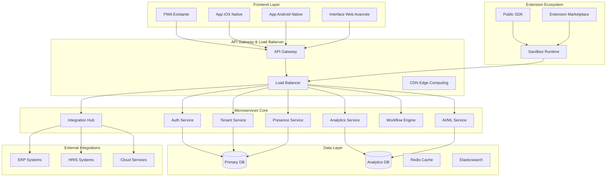
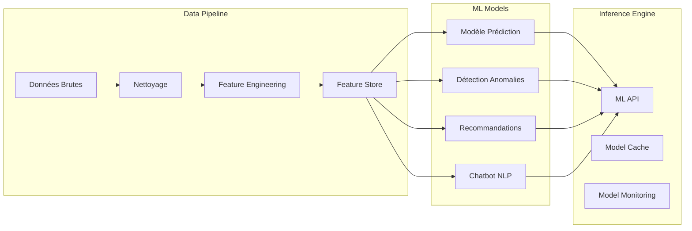
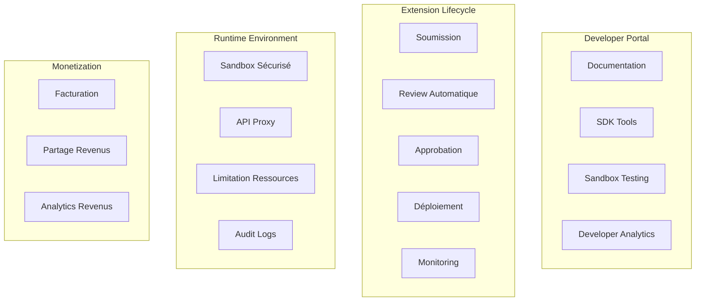
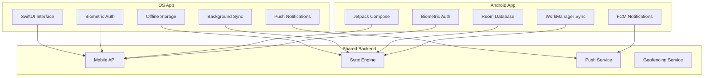
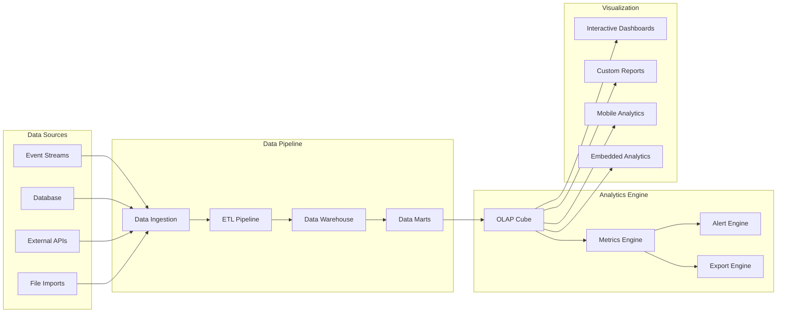
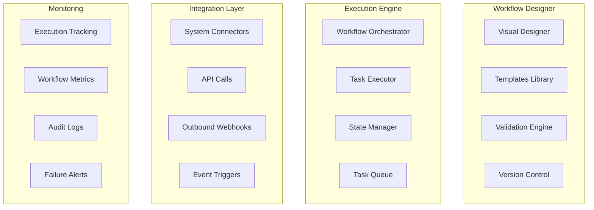

# Design Document - Opportunités d'Amélioration du Système

## Overview

Ce document présente la conception technique détaillée pour l'évolution du système de gestion de présence multi-tenant vers une plateforme enterprise complète. L'architecture proposée vise à transformer le système actuel en une solution concurrentielle face aux leaders du marché tout en conservant les avantages de flexibilité, innovation et coût.

## Architecture

### Architecture Globale Évolutive



### Migration Progressive vers Microservices

**Phase 1 : Extraction des Services Critiques**
- Service d'authentification autonome
- Service de gestion des tenants
- Service d'analytics séparé

**Phase 2 : Décomposition Fonctionnelle**
- Service de présence dédié
- Service de workflow indépendant
- Service d'intégrations

**Phase 3 : Services Avancés**
- Service IA/ML spécialisé
- Service de marketplace
- Services de conformité

## Components and Interfaces

### 1. Module Intelligence Artificielle

#### Architecture IA/ML



#### Composants IA

**Prédicteur de Présence**
- Algorithme : Random Forest + LSTM pour séries temporelles
- Features : Historique, météo, événements, patterns personnels
- Précision cible : 85%+ avec réentraînement hebdomadaire

**Détecteur d'Anomalies**
- Algorithme : Isolation Forest + règles métier
- Détection : Patterns inhabituels, fraudes potentielles
- Seuil : <5% faux positifs

**Moteur de Recommandations**
- Algorithme : Collaborative filtering + règles business
- Recommandations : Optimisation horaires, allocation ressources
- Mise à jour : Temps réel avec feedback loop

**Chatbot Intelligent**
- Framework : Rasa + modèles pré-entraînés
- Capacités : FAQ, assistance procédures, escalation
- Langues : Support multi-langue avec contexte métier

### 2. Marketplace et SDK

#### Architecture Marketplace



#### SDK Public

**Composants SDK**
- **Client Libraries** : JavaScript, Python, Java, .NET
- **Authentication** : OAuth 2.0 + API Keys
- **Rate Limiting** : Quotas par plan d'abonnement
- **Webhooks** : Événements temps réel
- **GraphQL Schema** : Requêtes flexibles

**Sécurité Extensions**
- Sandbox containerisé (Docker + restrictions réseau)
- Validation automatique du code (SAST/DAST)
- Permissions granulaires par extension
- Monitoring ressources et performance
- Kill switch automatique en cas d'anomalie

### 3. Applications Mobiles Natives

#### Architecture Mobile



#### Fonctionnalités Natives

**Authentification Biométrique**
- iOS : Touch ID / Face ID avec Keychain
- Android : Fingerprint / Face Unlock avec Keystore
- Fallback : PIN/Pattern sécurisé

**Géolocalisation Avancée**
- Geofencing avec zones configurables
- Détection automatique des sites
- Vérification de proximité (10m de précision)
- Mode économie batterie

**Synchronisation Offline**
- Base locale SQLite/Room
- Queue de synchronisation intelligente
- Résolution de conflits automatique
- Compression des données

### 4. Analytics et Business Intelligence

#### Architecture Analytics



#### Composants Analytics

**Data Pipeline**
- Ingestion temps réel (Apache Kafka/Pulsar)
- ETL avec Apache Airflow
- Data Warehouse (BigQuery/Snowflake)
- Data Lake pour données non-structurées

**Moteur de Métriques**
- Calcul KPIs en temps réel
- Métriques personnalisées par organisation
- Benchmarking industrie
- Alertes intelligentes

**Visualisations Interactives**
- Framework : D3.js + React
- Dashboards drag-and-drop
- Filtres dynamiques
- Export multi-formats

### 5. Moteur de Workflow

#### Architecture Workflow



#### Fonctionnalités Workflow

**Designer No-Code**
- Interface drag-and-drop intuitive
- Bibliothèque de templates pré-construits
- Validation en temps réel
- Versioning et rollback

**Moteur d'Exécution**
- Orchestration distribuée
- Gestion d'état persistante
- Retry automatique avec backoff
- Parallélisation des tâches

**Intégrations**
- Connecteurs pré-construits (email, SMS, webhooks)
- API calls avec authentification
- Déclencheurs d'événements
- Actions conditionnelles

## Data Models

### Modèles de Données Étendus

#### Extension du Modèle Utilisateur

```typescript
interface EnhancedUser extends BaseUser {
  // Profil IA
  aiProfile: {
    predictedPatterns: AttendancePattern[];
    riskScore: number;
    recommendations: string[];
    lastModelUpdate: Date;
  };
  
  // Préférences avancées
  preferences: {
    notifications: NotificationPreferences;
    privacy: PrivacySettings;
    accessibility: AccessibilitySettings;
    language: LanguageSettings;
  };
  
  // Données biométriques (hachées)
  biometricData?: {
    fingerprintHash?: string;
    faceTemplateHash?: string;
    voicePrintHash?: string;
  };
}
```

#### Modèle Analytics

```typescript
interface AnalyticsEvent {
  id: string;
  tenantId: string;
  userId?: string;
  eventType: string;
  timestamp: Date;
  properties: Record<string, any>;
  sessionId: string;
  deviceInfo: DeviceInfo;
  location?: GeoLocation;
  processed: boolean;
}

interface KPIDefinition {
  id: string;
  name: string;
  description: string;
  formula: string;
  aggregation: 'sum' | 'avg' | 'count' | 'max' | 'min';
  filters: FilterCriteria[];
  schedule: CalculationSchedule;
}
```

#### Modèle Workflow

```typescript
interface WorkflowDefinition {
  id: string;
  name: string;
  version: number;
  tenantId: string;
  trigger: WorkflowTrigger;
  steps: WorkflowStep[];
  variables: WorkflowVariable[];
  permissions: WorkflowPermissions;
  status: 'draft' | 'active' | 'deprecated';
}

interface WorkflowExecution {
  id: string;
  workflowId: string;
  status: 'running' | 'completed' | 'failed' | 'paused';
  startTime: Date;
  endTime?: Date;
  currentStep: number;
  variables: Record<string, any>;
  logs: ExecutionLog[];
}
```

#### Modèle Extension

```typescript
interface Extension {
  id: string;
  name: string;
  version: string;
  developerId: string;
  category: ExtensionCategory;
  permissions: Permission[];
  manifest: ExtensionManifest;
  pricing: PricingModel;
  status: 'pending' | 'approved' | 'rejected' | 'suspended';
  installations: number;
  rating: number;
}

interface ExtensionInstallation {
  id: string;
  extensionId: string;
  tenantId: string;
  configuration: Record<string, any>;
  status: 'active' | 'inactive' | 'error';
  installedAt: Date;
  lastUpdate: Date;
  usage: UsageMetrics;
}
```

## Error Handling

### Stratégie de Gestion d'Erreurs Avancée

#### Classification des Erreurs

```typescript
enum ErrorSeverity {
  LOW = 'low',
  MEDIUM = 'medium',
  HIGH = 'high',
  CRITICAL = 'critical'
}

enum ErrorCategory {
  AUTHENTICATION = 'auth',
  AUTHORIZATION = 'authz',
  VALIDATION = 'validation',
  BUSINESS_LOGIC = 'business',
  INTEGRATION = 'integration',
  PERFORMANCE = 'performance',
  SECURITY = 'security'
}

interface EnhancedError {
  code: string;
  message: string;
  category: ErrorCategory;
  severity: ErrorSeverity;
  context: Record<string, any>;
  timestamp: Date;
  userId?: string;
  tenantId?: string;
  correlationId: string;
  stackTrace?: string;
}
```

#### Mécanismes de Récupération

**Circuit Breaker Pattern**
- Protection contre les cascades de pannes
- Fallback automatique vers services dégradés
- Récupération progressive

**Retry avec Backoff Exponentiel**
- Retry intelligent pour erreurs transitoires
- Jitter pour éviter les thundering herds
- Dead letter queue pour échecs persistants

**Graceful Degradation**
- Mode dégradé pour fonctionnalités non-critiques
- Cache de secours pour données essentielles
- Notifications utilisateur transparentes

## Testing Strategy

### Stratégie de Tests Multi-Niveaux

#### Tests d'Intelligence Artificielle

**Tests de Modèles ML**
- Validation croisée avec datasets de test
- Tests de dérive de modèle (model drift)
- Tests de biais et équité
- Tests de performance en production

**Tests de Prédictions**
- Métriques de précision (accuracy, precision, recall)
- Tests A/B pour nouveaux modèles
- Validation sur données historiques
- Tests de robustesse aux données aberrantes

#### Tests d'Extensions

**Sandbox Testing**
- Environnement isolé pour chaque extension
- Tests de sécurité automatisés
- Validation des permissions
- Tests de performance et ressources

**Integration Testing**
- Tests d'intégration avec API principale
- Tests de compatibilité entre extensions
- Tests de montée en charge
- Tests de récupération d'erreurs

#### Tests Mobile

**Tests Cross-Platform**
- Tests automatisés iOS/Android
- Tests de synchronisation offline
- Tests de géolocalisation
- Tests de notifications push

**Tests de Performance Mobile**
- Tests de consommation batterie
- Tests de mémoire et CPU
- Tests de réseau (3G/4G/5G/WiFi)
- Tests d'accessibilité

#### Tests Analytics

**Tests de Pipeline de Données**
- Validation de l'intégrité des données
- Tests de performance ETL
- Tests de cohérence temporelle
- Tests de scalabilité

**Tests de Visualisations**
- Tests de rendu cross-browser
- Tests d'interactivité
- Tests de performance avec gros datasets
- Tests d'accessibilité des dashboards

### Automatisation des Tests

```yaml
# Pipeline CI/CD pour Tests Avancés
stages:
  - unit_tests
  - integration_tests
  - ml_model_validation
  - extension_security_scan
  - mobile_device_farm
  - analytics_pipeline_test
  - performance_benchmarks
  - security_penetration
  - accessibility_audit
  - deployment_canary
```

## Implementation Roadmap

### Phase 1 : Fondations Avancées (Q1 2025)

**Objectifs :**
- Migration vers architecture microservices
- Implémentation du SDK public
- Applications mobiles natives MVP

**Livrables :**
- Service d'authentification autonome
- SDK JavaScript/Python avec documentation
- Apps iOS/Android avec fonctionnalités de base
- API Gateway avec rate limiting

**Métriques de Succès :**
- 99.9% uptime des nouveaux services
- <100ms latence API Gateway
- >4.5 étoiles sur App Stores
- 10+ extensions tierces développées

### Phase 2 : Intelligence et Analytics (Q2 2025)

**Objectifs :**
- Déploiement du module IA/ML
- Analytics avancées avec dashboards interactifs
- Marketplace d'extensions opérationnelle

**Livrables :**
- Modèles de prédiction de présence
- Détecteur d'anomalies en production
- Dashboards personnalisables
- Marketplace avec 50+ extensions

**Métriques de Succès :**
- 85%+ précision des prédictions
- <5% faux positifs détection anomalies
- 100+ extensions disponibles
- $50k+ revenus marketplace mensuel

### Phase 3 : Automatisation et Intégrations (Q3 2025)

**Objectifs :**
- Moteur de workflow no-code
- Intégrations enterprise majeures
- Fonctionnalités mobiles avancées

**Livrables :**
- Workflow designer visuel
- Intégrations SAP, Workday, BambooHR
- Géolocalisation et biométrie mobile
- Synchronisation offline complète

**Métriques de Succès :**
- 1000+ workflows créés par les clients
- 20+ intégrations enterprise certifiées
- 99% succès synchronisation offline
- <3s temps de démarrage mobile

### Phase 4 : Enterprise et Scale (Q4 2025)

**Objectifs :**
- Certifications de sécurité enterprise
- Performance et scalabilité optimales
- Fonctionnalités avancées (Voice UI, AR)

**Livrables :**
- Certification SOC2 Type II
- Support 100k+ utilisateurs simultanés
- Interface vocale pour check-in
- Réalité augmentée pour navigation

**Métriques de Succès :**
- Certification SOC2 obtenue
- <50ms P95 latence API
- 100k+ utilisateurs simultanés supportés
- 10+ clients enterprise (>1000 employés)

### Phase 5 : Innovation et Expansion (Q1 2026)

**Objectifs :**
- IA conversationnelle avancée
- Écosystème partenaire mature
- Expansion géographique

**Livrables :**
- Chatbot multilingue avec NLP avancé
- Programme de certification partenaires
- Conformité réglementaire multi-pays
- White-label solutions

**Métriques de Succès :**
- 95% satisfaction chatbot
- 100+ partenaires certifiés
- Présence dans 10+ pays
- $1M+ revenus white-label annuel

## Budget et Ressources Estimés

### Investissement par Phase

**Phase 1 (Q1 2025) : $500k**
- 8 développeurs full-stack
- 2 architectes système
- 1 product manager
- Infrastructure cloud

**Phase 2 (Q2 2025) : $750k**
- 3 data scientists/ML engineers
- 2 développeurs mobile natifs
- 1 UX/UI designer
- Outils ML/Analytics

**Phase 3 (Q3 2025) : $600k**
- 2 spécialistes intégrations
- 1 expert sécurité
- 2 développeurs workflow
- Certifications et audits

**Phase 4 (Q4 2025) : $800k**
- 2 experts performance
- 1 spécialiste conformité
- 3 développeurs innovation
- Infrastructure enterprise

**Phase 5 (Q1 2026) : $400k**
- 2 business developers
- 1 expert localisation
- Marketing et expansion
- Support partenaires

**Total Investissement : $3.05M sur 15 mois**

### ROI Projeté

**Revenus Additionnels Estimés :**
- Extensions marketplace : $200k/mois (année 2)
- Abonnements premium : $500k/mois (année 2)
- Services professionnels : $100k/mois (année 2)
- White-label : $300k/mois (année 3)

**ROI Break-even : 18 mois**
**ROI 3 ans : 400%+**

Cette roadmap transformera le système actuel en une plateforme enterprise complète, capable de rivaliser avec les leaders du marché tout en maintenant les avantages concurrentiels de flexibilité, innovation et coût.