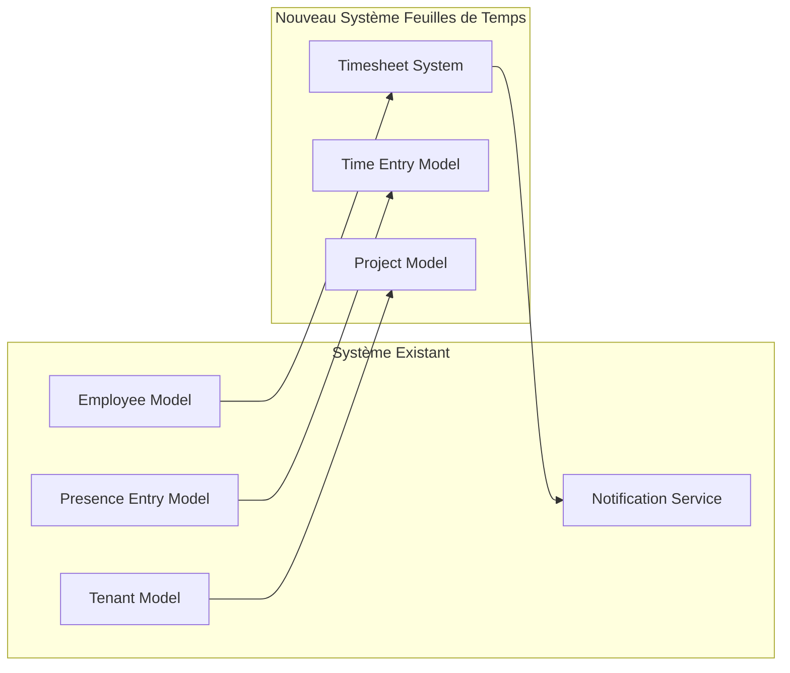

# Design Document - Gestion Complète des Feuilles de Temps

## Overview

Ce document présente la conception technique pour compléter le système de gestion des feuilles de temps. L'architecture proposée étend les fonctionnalités de présence existantes pour inclure la saisie manuelle, la gestion par projet, les workflows d'approbation et l'export comptable, tout en maintenant la cohérence avec l'architecture existante.

## Architecture

### Architecture Globale des Feuilles de Temps

```mermaid
graph TB
    subgraph "Couche Présentation API"
        TimesheetAPI[Timesheet API]
        ProjectAPI[Project API]
        ActivityAPI[Activity Code API]
        ApprovalAPI[Approval API]
        ExportAPI[Export API]
    end
    
    subgraph "Couche Services Métier"
        TimesheetService[Timesheet Service]
        ProjectService[Project Service]
        ActivityService[Activity Service]
        ApprovalService[Approval Service]
        ExportService[Export Service]
        ValidationService[Validation Service]
    end
    
    subgraph "Couche Modèles"
        TimesheetModel[Timesheet Model]
        TimeEntryModel[Time Entry Model]
        ProjectModel[Project Model]
        ActivityCodeModel[Activity Code Model]
        ApprovalWorkflowModel[Approval Workflow Model]
    end
    
    subgraph "Couche Données"
        TimesheetDB[(Timesheets)]
        TimeEntriesDB[(Time Entries)]
        ProjectsDB[(Projects)]
        ActivityCodesDB[(Activity Codes)]
        ApprovalsDB[(Approvals)]
    end
    
    subgraph "Intégrations Externes"
        PayrollSystem[Système de Paie]
        AccountingSystem[Système Comptable]
        BillingSystem[Système de Facturation]
    end
    
    TimesheetAPI --> TimesheetService
    ProjectAPI --> ProjectService
    ActivityAPI --> ActivityService
    ApprovalAPI --> ApprovalService
    ExportAPI --> ExportService
    
    TimesheetService --> TimesheetModel
    TimesheetService --> TimeEntryModel
    TimesheetService --> ValidationService
    
    ProjectService --> ProjectModel
    ActivityService --> ActivityCodeModel
    ApprovalService --> ApprovalWorkflowModel
    
    TimesheetModel --> TimesheetDB
    TimeEntryModel --> TimeEntriesDB
    ProjectModel --> ProjectsDB
    ActivityCodeModel --> ActivityCodesDB
    ApprovalWorkflowModel --> ApprovalsDB
    
    ExportService --> PayrollSystem
    ExportService --> AccountingSystem
    ExportService --> BillingSystem
```



### Intégration avec l'Architecture Existante



## Components and Interfaces

### 1. Modèles de Données

#### TimeEntry Model

```typescript
interface TimeEntry {
  id: string;
  employeeId: string;
  tenantId: string;
  timesheetId: string;
  projectId?: string;
  activityCodeId?: string;
  date: string; // YYYY-MM-DD
  startTime?: Date;
  endTime?: Date;
  duration: number; // en minutes
  description: string;
  billable: boolean;
  hourlyRate?: number;
  totalCost?: number;
  status: TimeEntryStatus;
  createdAt: Date;
  updatedAt: Date;
  createdBy: string;
  updatedBy?: string;
}

enum TimeEntryStatus {
  DRAFT = 'draft',
  SUBMITTED = 'submitted',
  APPROVED = 'approved',
  REJECTED = 'rejected'
}
```

#### Timesheet Model

```typescript
interface Timesheet {
  id: string;
  employeeId: string;
  tenantId: string;
  periodStart: string; // YYYY-MM-DD
  periodEnd: string; // YYYY-MM-DD
  status: TimesheetStatus;
  totalHours: number;
  totalBillableHours: number;
  totalCost: number;
  submittedAt?: Date;
  approvedAt?: Date;
  approvedBy?: string;
  rejectionReason?: string;
  timeEntries: string[]; // IDs des entrées de temps
  createdAt: Date;
  updatedAt: Date;
}

enum TimesheetStatus {
  DRAFT = 'draft',
  SUBMITTED = 'submitted',
  UNDER_REVIEW = 'under_review',
  APPROVED = 'approved',
  REJECTED = 'rejected',
  LOCKED = 'locked'
}
```

#### Project Model

```typescript
interface Project {
  id: string;
  tenantId: string;
  clientId?: string;
  name: string;
  code: string;
  description?: string;
  status: ProjectStatus;
  startDate?: Date;
  endDate?: Date;
  budget?: number;
  defaultHourlyRate?: number;
  billable: boolean;
  assignedEmployees: string[];
  activityCodes: string[];
  createdAt: Date;
  updatedAt: Date;
  createdBy: string;
}

enum ProjectStatus {
  ACTIVE = 'active',
  INACTIVE = 'inactive',
  COMPLETED = 'completed',
  ON_HOLD = 'on_hold'
}
```

#### ActivityCode Model

```typescript
interface ActivityCode {
  id: string;
  tenantId: string;
  code: string;
  name: string;
  description?: string;
  category: string;
  parentId?: string;
  billable: boolean;
  defaultRate?: number;
  isActive: boolean;
  projectSpecific: boolean;
  createdAt: Date;
  updatedAt: Date;
}
```

#### ApprovalWorkflow Model

```typescript
interface ApprovalWorkflow {
  id: string;
  tenantId: string;
  timesheetId: string;
  employeeId: string;
  approverId: string;
  status: ApprovalStatus;
  submittedAt: Date;
  reviewedAt?: Date;
  comments?: string;
  rejectionReason?: string;
  escalatedTo?: string;
  escalatedAt?: Date;
  createdAt: Date;
  updatedAt: Date;
}

enum ApprovalStatus {
  PENDING = 'pending',
  APPROVED = 'approved',
  REJECTED = 'rejected',
  ESCALATED = 'escalated'
}
```

### 2. Services Métier

#### TimesheetService

```typescript
class TimesheetService {
  // Gestion des feuilles de temps
  async createTimesheet(employeeId: string, period: TimePeriod): Promise<Timesheet>
  async getTimesheetById(id: string): Promise<Timesheet | null>
  async getEmployeeTimesheets(employeeId: string, filters?: TimesheetFilters): Promise<PaginatedResponse<Timesheet>>
  async submitTimesheet(timesheetId: string, submittedBy: string): Promise<Timesheet>
  async lockTimesheet(timesheetId: string, lockedBy: string): Promise<Timesheet>
  
  // Gestion des entrées de temps
  async addTimeEntry(timesheetId: string, entryData: TimeEntryInput): Promise<TimeEntry>
  async updateTimeEntry(entryId: string, updates: Partial<TimeEntryInput>): Promise<TimeEntry>
  async deleteTimeEntry(entryId: string): Promise<void>
  async bulkImportTimeEntries(timesheetId: string, entries: TimeEntryInput[]): Promise<TimeEntry[]>
  
  // Calculs et validations
  async calculateTimesheetTotals(timesheetId: string): Promise<TimesheetTotals>
  async validateTimesheet(timesheetId: string): Promise<ValidationResult>
  async detectTimeConflicts(employeeId: string, date: string, startTime: Date, endTime: Date): Promise<ConflictInfo[]>
  
  // Intégration avec présence
  async importFromPresenceData(employeeId: string, period: TimePeriod): Promise<TimeEntry[]>
  async syncWithPresenceSystem(): Promise<SyncResult>
}
```

#### ProjectService

```typescript
class ProjectService {
  // Gestion des projets
  async createProject(projectData: ProjectInput): Promise<Project>
  async updateProject(projectId: string, updates: Partial<ProjectInput>): Promise<Project>
  async getProjectById(id: string): Promise<Project | null>
  async listProjects(tenantId: string, filters?: ProjectFilters): Promise<PaginatedResponse<Project>>
  async archiveProject(projectId: string): Promise<Project>
  
  // Gestion des assignations
  async assignEmployeeToProject(projectId: string, employeeId: string): Promise<void>
  async removeEmployeeFromProject(projectId: string, employeeId: string): Promise<void>
  async getEmployeeProjects(employeeId: string): Promise<Project[]>
  
  // Analytics
  async getProjectTimeStatistics(projectId: string, period?: TimePeriod): Promise<ProjectStats>
  async getProjectProfitability(projectId: string): Promise<ProfitabilityReport>
}
```

#### ActivityService

```typescript
class ActivityService {
  // Gestion des codes d'activité
  async createActivityCode(codeData: ActivityCodeInput): Promise<ActivityCode>
  async updateActivityCode(codeId: string, updates: Partial<ActivityCodeInput>): Promise<ActivityCode>
  async getActivityCodeById(id: string): Promise<ActivityCode | null>
  async listActivityCodes(tenantId: string, filters?: ActivityCodeFilters): Promise<ActivityCode[]>
  async getActivityHierarchy(tenantId: string): Promise<ActivityCodeTree>
  
  // Gestion par projet
  async assignActivityToProject(projectId: string, activityCodeId: string): Promise<void>
  async getProjectActivities(projectId: string): Promise<ActivityCode[]>
  
  // Analytics
  async getActivityTimeDistribution(tenantId: string, period?: TimePeriod): Promise<ActivityStats>
}
```

#### ApprovalService

```typescript
class ApprovalService {
  // Workflow d'approbation
  async submitForApproval(timesheetId: string, submittedBy: string): Promise<ApprovalWorkflow>
  async approveTimesheet(workflowId: string, approverId: string, comments?: string): Promise<ApprovalWorkflow>
  async rejectTimesheet(workflowId: string, approverId: string, reason: string): Promise<ApprovalWorkflow>
  async escalateApproval(workflowId: string, escalatedTo: string): Promise<ApprovalWorkflow>
  
  // Gestion des approbateurs
  async setApprover(employeeId: string, approverId: string): Promise<void>
  async getEmployeeApprover(employeeId: string): Promise<string | null>
  async getPendingApprovals(approverId: string): Promise<ApprovalWorkflow[]>
  
  // Notifications
  async sendApprovalNotification(workflowId: string): Promise<void>
  async sendRejectionNotification(workflowId: string): Promise<void>
}
```

#### ExportService

```typescript
class ExportService {
  // Exports de données
  async exportTimesheets(filters: ExportFilters, format: ExportFormat): Promise<ExportResult>
  async exportPayrollData(tenantId: string, period: TimePeriod): Promise<PayrollExport>
  async exportBillingData(clientId: string, period: TimePeriod): Promise<BillingExport>
  
  // Intégrations
  async syncToPayrollSystem(tenantId: string, period: TimePeriod): Promise<SyncResult>
  async syncToAccountingSystem(tenantId: string, period: TimePeriod): Promise<SyncResult>
  
  // Rapports
  async generateTimeReport(filters: ReportFilters): Promise<TimeReport>
  async generateProductivityReport(tenantId: string, period: TimePeriod): Promise<ProductivityReport>
  async generateProfitabilityReport(tenantId: string, period: TimePeriod): Promise<ProfitabilityReport>
}
```

### 3. Validation et Contrôles Métier

#### ValidationService

```typescript
class ValidationService {
  // Validations des entrées de temps
  async validateTimeEntry(entry: TimeEntryInput): Promise<ValidationResult>
  async validateTimesheetCompleteness(timesheetId: string): Promise<ValidationResult>
  async checkOverlappingEntries(employeeId: string, date: string, startTime: Date, endTime: Date): Promise<ConflictInfo[]>
  
  // Règles métier
  async validateOvertimeRules(employeeId: string, weeklyHours: number): Promise<ValidationResult>
  async validateProjectAccess(employeeId: string, projectId: string): Promise<boolean>
  async validateBillableHours(entry: TimeEntryInput): Promise<ValidationResult>
  
  // Cohérence des données
  async validatePresenceConsistency(employeeId: string, date: string, timeEntries: TimeEntry[]): Promise<ValidationResult>
  async validatePeriodClosure(tenantId: string, period: TimePeriod): Promise<ValidationResult>
}
```

## Data Models

### Schémas de Base de Données

#### Collection: timesheets

```typescript
interface TimesheetDocument {
  id: string;
  employeeId: string;
  tenantId: string;
  periodStart: string;
  periodEnd: string;
  status: TimesheetStatus;
  totalHours: number;
  totalBillableHours: number;
  totalCost: number;
  submittedAt?: FirebaseFirestore.Timestamp;
  approvedAt?: FirebaseFirestore.Timestamp;
  approvedBy?: string;
  rejectionReason?: string;
  timeEntries: string[];
  metadata: {
    version: number;
    lastCalculated: FirebaseFirestore.Timestamp;
    calculationHash: string;
  };
  createdAt: FirebaseFirestore.Timestamp;
  updatedAt: FirebaseFirestore.Timestamp;
}
```

#### Collection: time_entries

```typescript
interface TimeEntryDocument {
  id: string;
  employeeId: string;
  tenantId: string;
  timesheetId: string;
  projectId?: string;
  activityCodeId?: string;
  date: string;
  startTime?: FirebaseFirestore.Timestamp;
  endTime?: FirebaseFirestore.Timestamp;
  duration: number;
  description: string;
  billable: boolean;
  hourlyRate?: number;
  totalCost?: number;
  status: TimeEntryStatus;
  tags: string[];
  metadata: {
    source: 'manual' | 'presence' | 'import';
    presenceEntryId?: string;
    importBatchId?: string;
  };
  createdAt: FirebaseFirestore.Timestamp;
  updatedAt: FirebaseFirestore.Timestamp;
  createdBy: string;
  updatedBy?: string;
}
```

#### Collection: projects

```typescript
interface ProjectDocument {
  id: string;
  tenantId: string;
  clientId?: string;
  name: string;
  code: string;
  description?: string;
  status: ProjectStatus;
  startDate?: FirebaseFirestore.Timestamp;
  endDate?: FirebaseFirestore.Timestamp;
  budget?: number;
  defaultHourlyRate?: number;
  billable: boolean;
  assignedEmployees: string[];
  activityCodes: string[];
  settings: {
    requireActivityCode: boolean;
    allowOvertime: boolean;
    autoApprove: boolean;
  };
  createdAt: FirebaseFirestore.Timestamp;
  updatedAt: FirebaseFirestore.Timestamp;
  createdBy: string;
}
```

#### Collection: activity_codes

```typescript
interface ActivityCodeDocument {
  id: string;
  tenantId: string;
  code: string;
  name: string;
  description?: string;
  category: string;
  parentId?: string;
  billable: boolean;
  defaultRate?: number;
  isActive: boolean;
  projectSpecific: boolean;
  hierarchy: {
    level: number;
    path: string;
    fullName: string;
  };
  createdAt: FirebaseFirestore.Timestamp;
  updatedAt: FirebaseFirestore.Timestamp;
}
```

#### Collection: approval_workflows

```typescript
interface ApprovalWorkflowDocument {
  id: string;
  tenantId: string;
  timesheetId: string;
  employeeId: string;
  approverId: string;
  status: ApprovalStatus;
  submittedAt: FirebaseFirestore.Timestamp;
  reviewedAt?: FirebaseFirestore.Timestamp;
  comments?: string;
  rejectionReason?: string;
  escalatedTo?: string;
  escalatedAt?: FirebaseFirestore.Timestamp;
  history: ApprovalHistoryEntry[];
  createdAt: FirebaseFirestore.Timestamp;
  updatedAt: FirebaseFirestore.Timestamp;
}

interface ApprovalHistoryEntry {
  action: 'submitted' | 'approved' | 'rejected' | 'escalated';
  performedBy: string;
  performedAt: FirebaseFirestore.Timestamp;
  comments?: string;
}
```

### Index Strategy

```typescript
// Indexes pour optimiser les requêtes
const indexes = {
  timesheets: [
    ['tenantId', 'employeeId', 'periodStart'],
    ['tenantId', 'status', 'submittedAt'],
    ['employeeId', 'status', 'periodStart']
  ],
  time_entries: [
    ['tenantId', 'employeeId', 'date'],
    ['timesheetId', 'status'],
    ['projectId', 'date', 'billable'],
    ['tenantId', 'date', 'billable']
  ],
  projects: [
    ['tenantId', 'status'],
    ['tenantId', 'assignedEmployees', 'status']
  ],
  activity_codes: [
    ['tenantId', 'isActive'],
    ['tenantId', 'category', 'isActive']
  ],
  approval_workflows: [
    ['tenantId', 'approverId', 'status'],
    ['employeeId', 'status', 'submittedAt']
  ]
};
```

## Error Handling

### Stratégie de Gestion d'Erreurs Spécialisée

#### Types d'Erreurs Métier

```typescript
enum TimesheetErrorCode {
  // Erreurs de validation
  INVALID_TIME_ENTRY = 'INVALID_TIME_ENTRY',
  OVERLAPPING_ENTRIES = 'OVERLAPPING_ENTRIES',
  EXCESSIVE_HOURS = 'EXCESSIVE_HOURS',
  INVALID_PROJECT_ACCESS = 'INVALID_PROJECT_ACCESS',
  
  // Erreurs de workflow
  TIMESHEET_ALREADY_SUBMITTED = 'TIMESHEET_ALREADY_SUBMITTED',
  TIMESHEET_LOCKED = 'TIMESHEET_LOCKED',
  APPROVAL_NOT_AUTHORIZED = 'APPROVAL_NOT_AUTHORIZED',
  PERIOD_CLOSED = 'PERIOD_CLOSED',
  
  // Erreurs de données
  PROJECT_NOT_FOUND = 'PROJECT_NOT_FOUND',
  ACTIVITY_CODE_NOT_FOUND = 'ACTIVITY_CODE_NOT_FOUND',
  TIMESHEET_NOT_FOUND = 'TIMESHEET_NOT_FOUND',
  
  // Erreurs d'intégration
  EXPORT_FAILED = 'EXPORT_FAILED',
  SYNC_FAILED = 'SYNC_FAILED',
  PAYROLL_INTEGRATION_ERROR = 'PAYROLL_INTEGRATION_ERROR'
}

class TimesheetError extends Error {
  constructor(
    public code: TimesheetErrorCode,
    message: string,
    public context?: Record<string, any>
  ) {
    super(message);
    this.name = 'TimesheetError';
  }
}
```

#### Mécanismes de Récupération

```typescript
class TimesheetErrorHandler {
  async handleValidationError(error: TimesheetError): Promise<ValidationResponse> {
    switch (error.code) {
      case TimesheetErrorCode.OVERLAPPING_ENTRIES:
        return this.suggestTimeSlotAdjustment(error.context);
      
      case TimesheetErrorCode.EXCESSIVE_HOURS:
        return this.suggestHourDistribution(error.context);
      
      case TimesheetErrorCode.INVALID_PROJECT_ACCESS:
        return this.suggestAlternativeProjects(error.context);
      
      default:
        return this.createGenericValidationResponse(error);
    }
  }
  
  async handleWorkflowError(error: TimesheetError): Promise<WorkflowResponse> {
    switch (error.code) {
      case TimesheetErrorCode.TIMESHEET_LOCKED:
        return this.suggestUnlockRequest(error.context);
      
      case TimesheetErrorCode.APPROVAL_NOT_AUTHORIZED:
        return this.suggestEscalation(error.context);
      
      default:
        return this.createGenericWorkflowResponse(error);
    }
  }
}
```

## Testing Strategy

### Stratégie de Tests Multi-Niveaux

#### Tests Unitaires

```typescript
describe('TimesheetService', () => {
  describe('addTimeEntry', () => {
    it('should create valid time entry', async () => {
      const entry = await timesheetService.addTimeEntry(timesheetId, validEntryData);
      expect(entry).toBeDefined();
      expect(entry.duration).toBe(480); // 8 heures
    });
    
    it('should reject overlapping entries', async () => {
      await expect(
        timesheetService.addTimeEntry(timesheetId, overlappingEntryData)
      ).rejects.toThrow(TimesheetError);
    });
    
    it('should calculate cost correctly', async () => {
      const entry = await timesheetService.addTimeEntry(timesheetId, billableEntryData);
      expect(entry.totalCost).toBe(400); // 8h * 50€/h
    });
  });
});
```

#### Tests d'Intégration

```typescript
describe('Timesheet Workflow Integration', () => {
  it('should complete full approval workflow', async () => {
    // Créer feuille de temps
    const timesheet = await timesheetService.createTimesheet(employeeId, period);
    
    // Ajouter entrées
    await timesheetService.addTimeEntry(timesheet.id, entryData);
    
    // Soumettre pour approbation
    const workflow = await approvalService.submitForApproval(timesheet.id, employeeId);
    
    // Approuver
    const approved = await approvalService.approveTimesheet(workflow.id, approverId);
    
    expect(approved.status).toBe(ApprovalStatus.APPROVED);
  });
});
```

#### Tests de Performance

```typescript
describe('Performance Tests', () => {
  it('should handle bulk time entry creation', async () => {
    const startTime = Date.now();
    const entries = Array(1000).fill(null).map(() => createMockTimeEntry());
    
    await timesheetService.bulkImportTimeEntries(timesheetId, entries);
    
    const duration = Date.now() - startTime;
    expect(duration).toBeLessThan(5000); // Moins de 5 secondes
  });
  
  it('should generate reports efficiently', async () => {
    const startTime = Date.now();
    
    const report = await exportService.generateTimeReport({
      tenantId,
      period: { start: '2024-01-01', end: '2024-12-31' }
    });
    
    const duration = Date.now() - startTime;
    expect(duration).toBeLessThan(3000); // Moins de 3 secondes
    expect(report.data.length).toBeGreaterThan(0);
  });
});
```

## Implementation Roadmap

### Phase 1: Modèles et Services de Base (3-4 semaines)

**Objectifs:**
- Créer les modèles de données fondamentaux
- Implémenter les services de base
- Établir les validations métier

**Livrables:**
- TimeEntry, Timesheet, Project, ActivityCode models
- TimesheetService avec CRUD de base
- ProjectService et ActivityService
- Validations et contrôles métier

### Phase 2: Workflow d'Approbation (2-3 semaines)

**Objectifs:**
- Implémenter le système d'approbation
- Créer les notifications
- Gérer les escalations

**Livrables:**
- ApprovalWorkflow model
- ApprovalService complet
- Intégration avec le système de notifications existant
- Gestion des hiérarchies d'approbation

### Phase 3: Intégration et Synchronisation (2-3 semaines)

**Objectifs:**
- Intégrer avec le système de présence existant
- Créer les mécanismes de synchronisation
- Implémenter l'import/export

**Livrables:**
- Synchronisation avec PresenceEntry
- Import automatique des données de présence
- ExportService avec formats multiples
- APIs d'intégration externe

### Phase 4: Rapports et Analytics (2-3 semaines)

**Objectifs:**
- Créer les rapports de temps
- Implémenter les analytics de productivité
- Développer les tableaux de bord

**Livrables:**
- Rapports de temps détaillés
- Analytics de productivité et rentabilité
- Métriques de performance
- Exports comptables

### Phase 5: Optimisation et Finalisation (1-2 semaines)

**Objectifs:**
- Optimiser les performances
- Finaliser les tests
- Documentation complète

**Livrables:**
- Optimisations de requêtes
- Tests complets (unitaires, intégration, performance)
- Documentation API complète
- Guide de migration

## Budget et Ressources Estimés

### Investissement par Phase

**Phase 1 (3-4 semaines) : $40k-50k**
- 2 développeurs backend senior
- 1 architecte système
- Modèles et services de base

**Phase 2 (2-3 semaines) : $25k-35k**
- 2 développeurs backend
- Workflow et notifications

**Phase 3 (2-3 semaines) : $30k-40k**
- 2 développeurs backend
- 1 spécialiste intégrations
- Synchronisation et exports

**Phase 4 (2-3 semaines) : $25k-35k**
- 1 développeur backend
- 1 data analyst
- Rapports et analytics

**Phase 5 (1-2 semaines) : $15k-20k**
- 1 développeur senior
- Optimisation et documentation

**Total Investissement : $135k-180k sur 10-15 semaines**

### ROI Projeté

**Bénéfices Attendus:**
- Automatisation de la saisie de temps : 2-3h/semaine/employé économisées
- Réduction des erreurs de facturation : 5-10% d'amélioration
- Amélioration de la traçabilité : Conformité audit renforcée
- Intégration comptable : 80% de réduction du temps de traitement

**ROI Break-even : 6-8 mois**
**ROI 2 ans : 200-300%**

Cette conception complète transformera votre système de présence en une solution de gestion de temps enterprise, avec toutes les fonctionnalités nécessaires pour la facturation, la paie et le suivi de productivité.