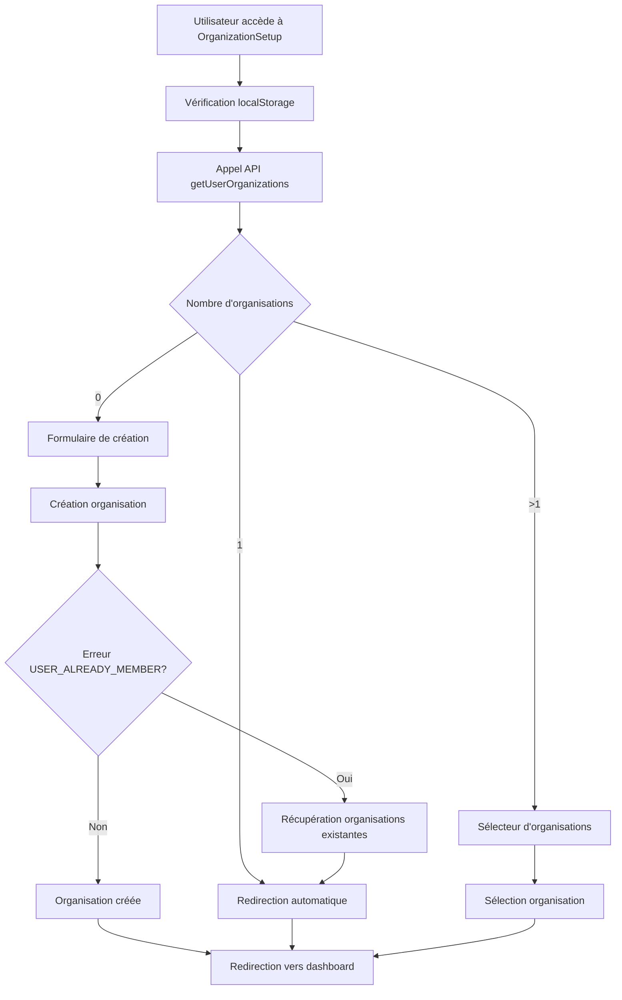

# 🏢 Flux d'appartenance aux organisations - Guide de développement

## 📋 Vue d'ensemble

Ce document décrit les améliorations apportées au flux d'onboarding des organisations pour mieux gérer les cas où l'utilisateur appartient déjà à une organisation ou a fourni des informations lors de l'inscription.

## 🎯 Objectifs

- **Éviter les duplications** d'organisations
- **Améliorer l'expérience utilisateur** lors de l'onboarding
- **Gérer les appartenances multiples** aux organisations
- **Finaliser automatiquement** les inscriptions incomplètes
- **Permettre l'exploration** de l'application sans configuration obligatoire

## 🔧 Fonctionnalités implémentées

### 1. API Backend - GET /users/{userId}/organizations

**Endpoint :** `GET /api/v1/users/{userId}/organizations`

**Description :** Récupère la liste des organisations auxquelles un utilisateur appartient.

**Réponse :**
```json
{
  "success": true,
  "data": [
    {
      "organizationId": "org123",
      "organizationName": "Mon Entreprise",
      "role": "admin",
      "isActive": true,
      "joinedAt": "2024-01-15T10:30:00Z",
      "permissions": ["manage_users", "view_reports"]
    }
  ]
}
```

**Permissions :**
- L'utilisateur peut voir ses propres organisations
- Les admins peuvent voir les organisations de tous les utilisateurs

### 2. Vérification automatique d'appartenance

Le composant `OrganizationSetup` vérifie maintenant automatiquement si l'utilisateur appartient déjà à des organisations :

```typescript
// Vérification d'appartenance
const response = await userService.getUserOrganizations(userId);

if (response.success && response.data.length > 0) {
  if (response.data.length === 1) {
    // Redirection automatique vers l'organisation unique
    navigate(`/organization/${organization.organizationId}/dashboard`);
  } else {
    // Affichage du sélecteur d'organisations multiples
    setCurrentStep(0);
  }
}
```

### 3. Sélecteur d'organisations multiples

Interface améliorée pour choisir parmi plusieurs organisations :

- **Design moderne** avec cartes interactives
- **Informations détaillées** (rôle, statut actif/inactif)
- **Option de création** d'une nouvelle organisation
- **Feedback visuel** lors de la sélection

### 4. Pré-remplissage des données d'inscription

Le nom d'organisation fourni lors de l'inscription est automatiquement récupéré :

```typescript
// Récupération depuis localStorage
const pendingOrgName = localStorage.getItem('pendingOrganizationName');
if (pendingOrgName && !organizationData.name) {
  setOrganizationData(prev => ({
    ...prev,
    name: pendingOrgName,
    displayName: pendingOrgName
  }));
}
```

### 5. Gestion des utilisateurs existants

Détection et gestion du cas "utilisateur appartient déjà à l'organisation" :

```typescript
catch (error: any) {
  if (error.message?.includes('appartient déjà') || 
      error.message?.includes('USER_ALREADY_MEMBER')) {
    
    // Récupération automatique des organisations
    const response = await userService.getUserOrganizations(userId);
    
    // Redirection vers l'organisation existante
    navigate(`/organization/${organization.organizationId}/dashboard`);
  }
}
```

## 🔒 Sécurité et permissions

### Contrôle d'accès

```typescript
// Vérification des permissions dans le contrôleur
if (id !== requestingUserId) {
  const hasPermission = await userService.hasPermission(requestingUser, "view_all_users");
  
  if (!hasPermission) {
    return res.status(403).json({
      success: false,
      message: "Accès refusé : vous ne pouvez voir que vos propres organisations",
    });
  }
}
```

### Permissions par rôle

Les permissions sont définies dans `SecurityUtils.getRolePermissions()` :

- **SUPER_ADMIN :** Toutes les permissions système
- **ADMIN :** Gestion des utilisateurs et événements
- **MANAGER :** Création d'événements et gestion des présences
- **GUEST :** Consultation et marquage de présence

## 🧪 Tests

### Tests unitaires backend

```typescript
describe('GET /users/:id/organizations', () => {
  it('should return user organizations successfully', async () => {
    const response = await request(app)
      .get(`/api/v1/users/${testUserId}/organizations`)
      .set('Authorization', authToken)
      .expect(200);

    expect(response.body.success).toBe(true);
    expect(response.body.data).toHaveLength(1);
  });
});
```

### Tests d'intégration frontend

- Vérification du pré-remplissage des données
- Test de la redirection automatique
- Validation du sélecteur d'organisations multiples
- Test de la gestion d'erreurs

## 📱 Interface utilisateur

### Écran de chargement amélioré

```tsx
<div className="flex items-center justify-center min-h-screen bg-gradient-to-br from-blue-50 to-indigo-100">
  <Card className="w-full max-w-md">
    <CardContent className="p-8 text-center">
      <div className="w-16 h-16 bg-blue-100 rounded-full flex items-center justify-center mx-auto mb-4">
        <Building className="h-8 w-8 text-blue-600" />
      </div>
      <Loader2 className="h-6 w-6 animate-spin mx-auto mb-4 text-blue-600" />
      <h3 className="text-lg font-semibold mb-2">Initialisation...</h3>
      <p className="text-muted-foreground text-sm">
        Préparation de votre espace de travail AttendanceX
      </p>
    </CardContent>
  </Card>
</div>
```

### Sélecteur d'organisations

- **Design responsive** avec dégradés de couleurs
- **Indicateurs visuels** pour le statut (actif/inactif)
- **Animations fluides** lors des interactions
- **Feedback utilisateur** avec toasts informatifs

## 🔄 Flux de données



## 🚀 Déploiement

### Variables d'environnement

Aucune nouvelle variable d'environnement requise.

### Migration de données

```sql
-- Aucune migration de base de données nécessaire
-- Les nouvelles fonctionnalités utilisent les structures existantes
```

### Déploiement progressif

1. **Phase 1 :** Déployer l'API backend
2. **Phase 2 :** Activer la vérification d'appartenance frontend
3. **Phase 3 :** Tester avec des utilisateurs pilotes
4. **Phase 4 :** Déploiement complet

## 🐛 Dépannage

### Problèmes courants

**1. API getUserOrganizations retourne 404**
```typescript
// Vérification dans le code
if (error.message?.includes('Route not found') || error.message?.includes('404')) {
  console.warn('API getUserOrganizations non encore implémentée côté backend');
  // Fallback vers création d'organisation
}
```

**2. Permissions insuffisantes**
```typescript
// Vérification des permissions
const hasPermission = await userService.hasPermission(user, "view_all_users");
if (!hasPermission) {
  return res.status(403).json({ message: "Accès refusé" });
}
```

**3. Données localStorage corrompues**
```typescript
// Nettoyage automatique
try {
  const pendingOrgName = localStorage.getItem('pendingOrganizationName');
  // Validation des données
} catch (error) {
  localStorage.removeItem('pendingOrganizationName');
}
```

## 📈 Métriques et monitoring

### Métriques à surveiller

- **Taux de redirection automatique** (utilisateurs avec organisation unique)
- **Utilisation du sélecteur** (utilisateurs avec organisations multiples)
- **Taux de création d'organisation** vs **utilisation d'organisations existantes**
- **Erreurs USER_ALREADY_MEMBER** et leur résolution automatique

### Logs importants

```typescript
// Logs de débogage
logger.info('User organization check', { userId, organizationCount });
logger.warn('Organization not found for user', { userId, organizationId });
logger.error('Failed to retrieve user organizations', { userId, error });
```

## 🔮 Évolutions futures

### Fonctionnalités prévues

1. **Gestion des invitations** d'organisation
2. **Changement d'organisation** en cours de session
3. **Paramètres d'organisation** depuis le dashboard
4. **Notifications** de changements d'appartenance

### Améliorations techniques

1. **Cache** des informations d'appartenance
2. **Synchronisation temps réel** des changements d'organisation
3. **Audit trail** des actions sur les organisations
4. **API GraphQL** pour les requêtes complexes

---

**Dernière mise à jour :** 23 août 2025  
**Version :** 1.0.0  
**Auteur :** Équipe de développement AttendanceX