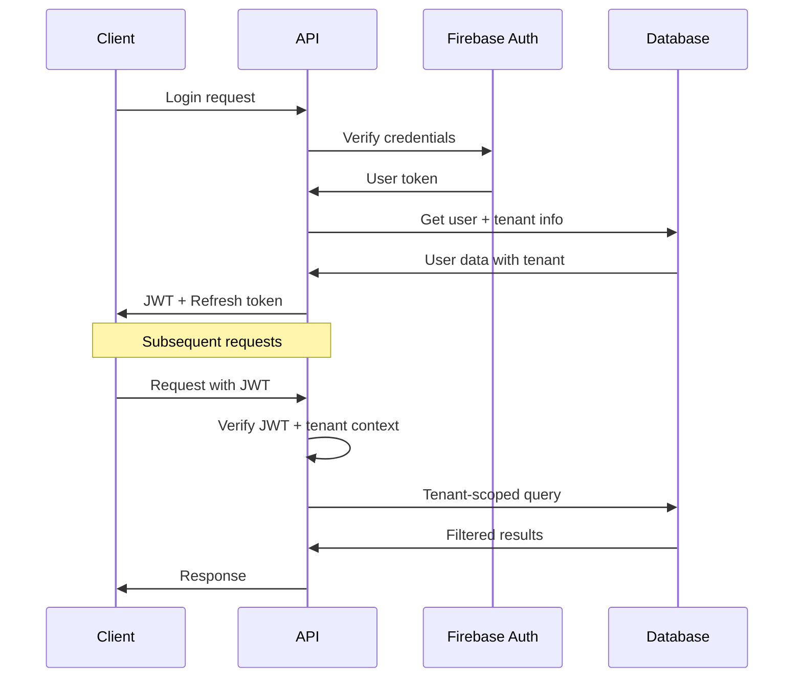

# AttendanceX Architecture Guide

This document provides a comprehensive overview of AttendanceX's system architecture, focusing on the multi-tenant design, TypeScript implementation, and enterprise-grade features.

## 🏗️ System Overview

AttendanceX is built as a modern, cloud-native application with a focus on multi-tenancy, scalability, and developer experience. The architecture follows microservices principles with a monorepo structure for simplified development and deployment.

### Key Architectural Principles

- **Multi-Tenant First**: Complete data isolation with tenant-scoped operations
- **TypeScript Everywhere**: Full-stack type safety from database to UI
- **API-First Design**: Every feature accessible via REST API
- **Security by Default**: Authentication, authorization, and audit logging built-in
- **Cloud Native**: Designed for serverless and containerized deployments

## 🏢 Multi-Tenant Architecture

### Tenant Isolation Strategy

AttendanceX implements **complete tenant isolation** at multiple levels:

#### 1. Data Layer Isolation
```typescript
// All database operations are automatically scoped by tenant
interface TenantScopedQuery {
  tenantId: string;
  // ... other query parameters
}

// Example: Users are always filtered by tenant
const users = await collections.users
  .where('tenantId', '==', currentTenantId)
  .get();
```

#### 2. Application Layer Isolation
```typescript
// Middleware ensures tenant context in all requests
export const tenantContextMiddleware = (req: AuthenticatedRequest, res: Response, next: NextFunction) => {
  const tenantId = req.user?.tenantId;
  if (!tenantId) {
    throw new UnauthorizedError('Tenant context required');
  }
  req.tenantId = tenantId;
  next();
};
```

#### 3. UI Layer Isolation
- Tenant-specific branding and themes
- Organization-level configuration
- Role-based UI components

### Tenant Data Model

```typescript
interface Tenant {
  id: string;
  name: string;
  domain?: string;
  settings: TenantSettings;
  branding: TenantBranding;
  subscription: SubscriptionInfo;
  createdAt: Date;
  updatedAt: Date;
}

interface TenantSettings {
  timezone: string;
  currency: string;
  dateFormat: string;
  workingHours: WorkingHours;
  features: FeatureFlags;
}
```

## 🔧 Backend Architecture

### Technology Stack

- **Runtime**: Node.js 18+ with TypeScript
- **Framework**: Express.js with Firebase Functions
- **Database**: Firestore (NoSQL) with Redis caching
- **Authentication**: JWT with Firebase Auth
- **File Storage**: Firebase Storage with CDN
- **Real-time**: WebSocket connections

### Layer Architecture

```
┌─────────────────────────────────────────┐
│                Routes                   │ ← HTTP endpoints
├─────────────────────────────────────────┤
│              Middleware                 │ ← Auth, validation, rate limiting
├─────────────────────────────────────────┤
│              Controllers                │ ← Request/response handling
├─────────────────────────────────────────┤
│               Services                  │ ← Business logic
├─────────────────────────────────────────┤
│                Models                   │ ← Data validation & persistence
├─────────────────────────────────────────┤
│              Database                   │ ← Firestore collections
└─────────────────────────────────────────┘
```

### MVC Pattern Implementation

#### 1. Routes Layer
```typescript
// routes/users/users.routes.ts
router.use(smartRateLimit);
router.use(authMiddleware);
router.use(tenantContextMiddleware);

router.post('/', UserController.createUser);
router.get('/', UserController.getUsers);
router.get('/:userId', UserController.getUser);
router.put('/:userId', UserController.updateUser);
router.delete('/:userId', UserController.deleteUser);
```

#### 2. Controller Layer
```typescript
// controllers/users/user.controller.ts
export class UserController {
  static createUser = asyncAuthHandler(async (req: AuthenticatedRequest, res: Response) => {
    const tenantId = req.user?.tenantId;
    const userData: CreateUserRequest = req.body;
    
    const user = await userService.createUser(userData, tenantId, req.user?.uid);
    
    res.status(201).json({
      success: true,
      data: user,
      message: 'User created successfully'
    });
  });
}
```

#### 3. Service Layer
```typescript
// services/users/user.service.ts
export class UserService {
  async createUser(userData: CreateUserRequest, tenantId: string, createdBy: string): Promise<User> {
    // Business logic validation
    await this.validateCreateRequest(userData, tenantId);
    
    // Create model with validation
    const userModel = UserModel.fromCreateRequest({
      ...userData,
      tenantId,
      createdBy
    });
    
    await userModel.validate();
    
    // Persist to database
    const userRef = collections.users.doc();
    await userRef.set(userModel.toFirestore());
    
    return userModel.toAPI() as User;
  }
}
```

#### 4. Model Layer
```typescript
// models/user.model.ts
export class UserModel extends BaseModel<UserDocument> {
  async validate(): Promise<boolean> {
    BaseModel.validateRequired(this.data, ['email', 'name', 'tenantId']);
    
    if (!this.isValidEmail(this.data.email)) {
      throw new ValidationError('Invalid email format');
    }
    
    return true;
  }
  
  toAPI(): Partial<UserDocument> {
    const data = { ...this.data };
    // Remove sensitive fields
    delete data.passwordHash;
    delete data.internalNotes;
    return data;
  }
}
```

## 💻 Frontend Architecture

### Technology Stack

- **Framework**: Next.js 14 with App Router
- **Language**: TypeScript with strict mode
- **Styling**: Tailwind CSS with custom design system
- **State Management**: React Context + Custom hooks
- **API Client**: Custom TypeScript client with auto-generated types
- **Real-time**: WebSocket integration

### Component Architecture

```
src/
├── app/                    # Next.js App Router
│   ├── (auth)/            # Authentication routes
│   ├── (dashboard)/       # Main application routes
│   └── api/               # API routes (if needed)
├── components/
│   ├── ui/                # Base UI components
│   ├── forms/             # Form components
│   ├── layout/            # Layout components
│   └── features/          # Feature-specific components
├── hooks/                 # Custom React hooks
├── services/              # API service layer
├── types/                 # TypeScript type definitions
├── utils/                 # Utility functions
└── styles/               # Global styles and themes
```

### Type-Safe API Integration

```typescript
// services/api/users.service.ts
export class UsersService {
  async getUsers(params?: GetUsersParams): Promise<ApiResponse<User[]>> {
    return this.apiClient.get<User[]>('/users', { params });
  }
  
  async createUser(userData: CreateUserRequest): Promise<ApiResponse<User>> {
    return this.apiClient.post<User>('/users', userData);
  }
}

// hooks/useUsers.ts
export const useUsers = () => {
  const [users, setUsers] = useState<User[]>([]);
  const [loading, setLoading] = useState(false);
  
  const fetchUsers = useCallback(async (params?: GetUsersParams) => {
    setLoading(true);
    try {
      const response = await usersService.getUsers(params);
      setUsers(response.data);
    } catch (error) {
      handleApiError(error);
    } finally {
      setLoading(false);
    }
  }, []);
  
  return { users, loading, fetchUsers };
};
```

## 🗄️ Database Design

### Firestore Collections Structure

```
attendance-x/
├── tenants/                    # Organization data
├── users/                      # User profiles (tenant-scoped)
├── attendance/                 # Attendance records
├── customers/                  # CRM data
├── appointments/               # Scheduling data
├── products/                   # Product catalog
├── orders/                     # Sales orders
├── invoices/                   # Billing data
├── subscriptions/              # Subscription management
├── permissions/                # Role-based permissions
├── audit_logs/                 # Audit trail
└── integrations/               # Third-party connections
```

### Document Structure Example

```typescript
// users collection document
interface UserDocument {
  id: string;
  tenantId: string;           // Tenant isolation
  email: string;
  name: string;
  role: UserRole;
  permissions: Permission[];
  profile: UserProfile;
  settings: UserSettings;
  createdAt: Timestamp;
  updatedAt: Timestamp;
  createdBy: string;
  lastLoginAt?: Timestamp;
  isActive: boolean;
  
  // Audit fields
  auditLog: AuditEntry[];
  
  // Sensitive fields (excluded from API responses)
  passwordHash?: string;
  internalNotes?: string;
}
```

### Indexing Strategy

```typescript
// firestore.indexes.json
{
  "indexes": [
    {
      "collectionGroup": "users",
      "queryScope": "COLLECTION",
      "fields": [
        { "fieldPath": "tenantId", "order": "ASCENDING" },
        { "fieldPath": "role", "order": "ASCENDING" },
        { "fieldPath": "createdAt", "order": "DESCENDING" }
      ]
    },
    {
      "collectionGroup": "attendance",
      "queryScope": "COLLECTION",
      "fields": [
        { "fieldPath": "tenantId", "order": "ASCENDING" },
        { "fieldPath": "userId", "order": "ASCENDING" },
        { "fieldPath": "date", "order": "DESCENDING" }
      ]
    }
  ]
}
```

## 🔐 Security Architecture

### Authentication Flow



### Authorization Model

```typescript
interface Permission {
  resource: string;      // e.g., 'users', 'attendance', 'billing'
  action: string;        // e.g., 'create', 'read', 'update', 'delete'
  scope: 'own' | 'team' | 'organization';
  conditions?: Record<string, any>;
}

interface Role {
  id: string;
  name: string;
  permissions: Permission[];
  tenantId: string;
  isSystemRole: boolean;
}

// Example permission check
const hasPermission = (user: User, resource: string, action: string, targetUserId?: string): boolean => {
  return user.permissions.some(permission => {
    if (permission.resource !== resource || permission.action !== action) {
      return false;
    }
    
    switch (permission.scope) {
      case 'own':
        return targetUserId === user.id;
      case 'team':
        return user.teamId === getTargetUserTeam(targetUserId);
      case 'organization':
        return true;
      default:
        return false;
    }
  });
};
```

## 📊 Performance & Scalability

### Caching Strategy

```typescript
// Redis caching for frequently accessed data
export class CacheService {
  async getUserPermissions(userId: string, tenantId: string): Promise<Permission[]> {
    const cacheKey = `permissions:${tenantId}:${userId}`;
    
    // Try cache first
    const cached = await redis.get(cacheKey);
    if (cached) {
      return JSON.parse(cached);
    }
    
    // Fetch from database
    const permissions = await this.fetchUserPermissions(userId, tenantId);
    
    // Cache for 15 minutes
    await redis.setex(cacheKey, 900, JSON.stringify(permissions));
    
    return permissions;
  }
}
```

### Query Optimization

```typescript
// Efficient pagination with cursor-based approach
export const getPaginatedUsers = async (
  tenantId: string,
  limit: number = 20,
  startAfter?: string
): Promise<PaginatedResult<User>> => {
  let query = collections.users
    .where('tenantId', '==', tenantId)
    .orderBy('createdAt', 'desc')
    .limit(limit);
  
  if (startAfter) {
    const startAfterDoc = await collections.users.doc(startAfter).get();
    query = query.startAfter(startAfterDoc);
  }
  
  const snapshot = await query.get();
  const users = snapshot.docs.map(doc => UserModel.fromFirestore(doc)?.toAPI()).filter(Boolean);
  
  return {
    data: users,
    hasMore: snapshot.docs.length === limit,
    nextCursor: snapshot.docs[snapshot.docs.length - 1]?.id
  };
};
```

## 🔄 Real-Time Features

### WebSocket Integration

```typescript
// Real-time attendance updates
export class AttendanceRealtimeService {
  private io: Server;
  
  constructor(server: http.Server) {
    this.io = new Server(server, {
      cors: { origin: process.env.CORS_ORIGIN }
    });
    
    this.setupEventHandlers();
  }
  
  private setupEventHandlers() {
    this.io.on('connection', (socket) => {
      socket.on('join-tenant', (tenantId: string) => {
        socket.join(`tenant:${tenantId}`);
      });
      
      socket.on('attendance-update', (data) => {
        // Broadcast to all clients in the same tenant
        socket.to(`tenant:${data.tenantId}`).emit('attendance-updated', data);
      });
    });
  }
  
  broadcastAttendanceUpdate(tenantId: string, attendanceData: AttendanceRecord) {
    this.io.to(`tenant:${tenantId}`).emit('attendance-updated', attendanceData);
  }
}
```

## 🚀 Deployment Architecture

### Container Strategy

```dockerfile
# Multi-stage build for optimal image size
FROM node:18-alpine AS builder
WORKDIR /app
COPY package*.json ./
RUN npm ci --only=production

FROM node:18-alpine AS runtime
WORKDIR /app
COPY --from=builder /app/node_modules ./node_modules
COPY . .
RUN npm run build

EXPOSE 5001
CMD ["npm", "start"]
```

### Infrastructure as Code

```yaml
# docker-compose.yml for development
version: '3.8'
services:
  backend:
    build: ./backend
    ports:
      - "5001:5001"
    environment:
      - NODE_ENV=development
      - FIREBASE_PROJECT_ID=${FIREBASE_PROJECT_ID}
    depends_on:
      - redis
      
  frontend:
    build: ./frontend-v2
    ports:
      - "3000:3000"
    environment:
      - NEXT_PUBLIC_API_URL=http://localhost:5001
      
  redis:
    image: redis:7-alpine
    ports:
      - "6379:6379"
```

## 📈 Monitoring & Observability

### Logging Strategy

```typescript
// Structured logging with tenant context
export const logger = winston.createLogger({
  format: winston.format.combine(
    winston.format.timestamp(),
    winston.format.errors({ stack: true }),
    winston.format.json()
  ),
  defaultMeta: {
    service: 'attendancex-api',
    version: process.env.npm_package_version
  },
  transports: [
    new winston.transports.Console(),
    new winston.transports.File({ filename: 'logs/error.log', level: 'error' }),
    new winston.transports.File({ filename: 'logs/combined.log' })
  ]
});

// Usage with tenant context
logger.info('User created', {
  userId: user.id,
  tenantId: user.tenantId,
  createdBy: req.user?.uid,
  timestamp: new Date().toISOString()
});
```

### Health Checks

```typescript
// Health check endpoint
export const healthCheck = async (req: Request, res: Response) => {
  const health = {
    status: 'healthy',
    timestamp: new Date().toISOString(),
    version: process.env.npm_package_version,
    checks: {
      database: await checkDatabaseConnection(),
      redis: await checkRedisConnection(),
      firebase: await checkFirebaseConnection()
    }
  };
  
  const isHealthy = Object.values(health.checks).every(check => check.status === 'healthy');
  
  res.status(isHealthy ? 200 : 503).json(health);
};
```

## 🔮 Future Architecture Considerations

### Planned Enhancements

1. **Microservices Migration**
   - Split monolith into domain-specific services
   - Event-driven architecture with message queues
   - Service mesh for inter-service communication

2. **AI/ML Integration**
   - Predictive analytics service
   - Anomaly detection for attendance patterns
   - Intelligent scheduling optimization

3. **Global Scale**
   - Multi-region deployment
   - Edge computing for reduced latency
   - Data residency compliance

4. **Advanced Security**
   - Zero-trust architecture
   - Advanced threat detection
   - Compliance automation (SOC 2, ISO 27001)

---

This architecture guide provides the foundation for understanding AttendanceX's design decisions and implementation patterns. For specific implementation details, refer to the individual service documentation and code examples in the repository.