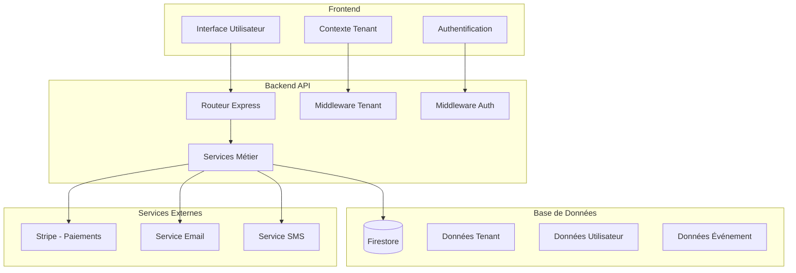
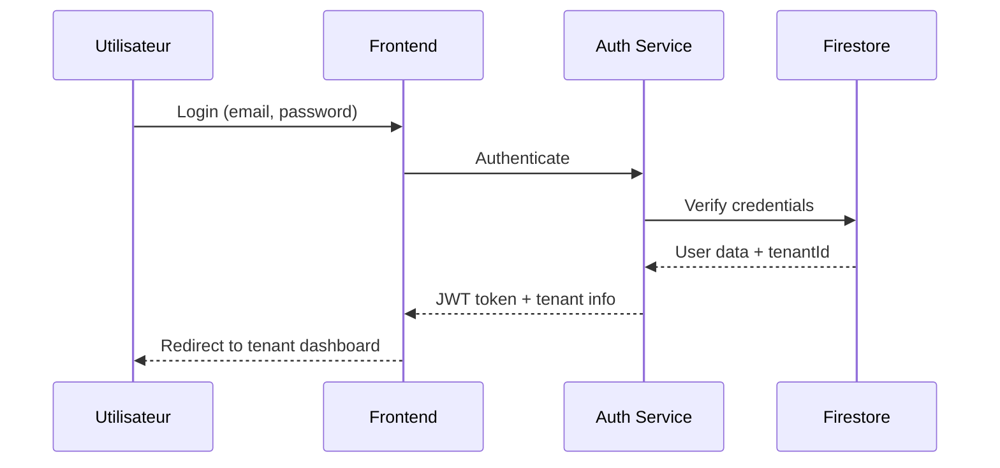
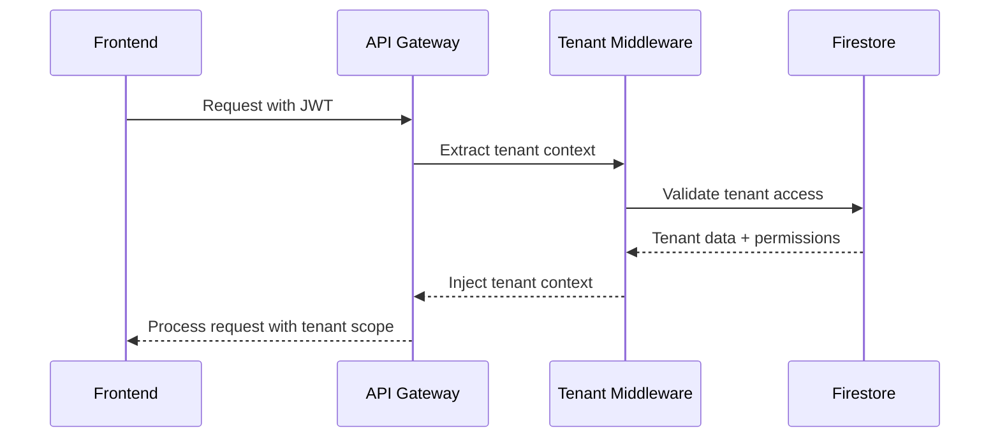

# Architecture Multi-Tenant - Vue d'ensemble

## Introduction

Ce document présente l'architecture multi-tenant implémentée dans le système de gestion de présence. L'architecture permet à plusieurs organisations (tenants) de partager la même infrastructure tout en maintenant une isolation complète des données et des configurations.

## Concepts Clés

### Tenant (Locataire)
Un tenant représente une organisation cliente utilisant le système. Chaque tenant dispose de :
- Ses propres données isolées
- Sa configuration personnalisée
- Ses utilisateurs et permissions
- Son abonnement et facturation

### Isolation des Données
L'isolation est assurée à plusieurs niveaux :
- **Base de données** : Chaque document Firestore contient un `tenantId`
- **API** : Middleware de validation automatique du contexte tenant
- **Interface** : Filtrage automatique des données par tenant
- **Facturation** : Suivi séparé de l'usage par tenant

## Architecture Générale



## Modèle de Données

### Structure des Collections Firestore

```typescript
// Collection principale des tenants
tenants/{tenantId}
├── name: string
├── slug: string
├── status: 'active' | 'suspended' | 'cancelled'
├── subscription: SubscriptionInfo
├── usage: UsageMetrics
├── settings: TenantSettings
└── createdAt: Date

// Données utilisateur avec isolation tenant
users/{userId}
├── tenantId: string  // Clé d'isolation
├── email: string
├── role: string
├── permissions: string[]
└── profile: UserProfile

// Événements avec isolation tenant
events/{eventId}
├── tenantId: string  // Clé d'isolation
├── title: string
├── description: string
├── startDate: Date
├── endDate: Date
└── attendees: string[]
```

### Modèles TypeScript

```typescript
interface Tenant {
  id: string;
  name: string;
  slug: string;
  status: TenantStatus;
  subscription: SubscriptionInfo;
  usage: UsageMetrics;
  settings: TenantSettings;
  createdAt: Date;
  updatedAt: Date;
}

interface TenantScopedEntity {
  tenantId: string;
  // Autres propriétés spécifiques à l'entité
}

interface TenantContext {
  tenant: Tenant;
  user: User;
  permissions: string[];
  plan: SubscriptionPlan;
}
```

## Flux d'Authentification et Autorisation

### 1. Authentification Utilisateur


### 2. Validation du Contexte Tenant


## Middleware de Gestion des Tenants

### TenantContextMiddleware

Le middleware principal qui gère l'isolation des tenants :

```typescript
class TenantContextMiddleware {
  // Injecte le contexte tenant dans la requête
  injectTenantContext(): RequestHandler;
  
  // Valide l'accès de l'utilisateur au tenant
  validateTenantAccess(): RequestHandler;
  
  // Force l'isolation des données par tenant
  enforceTenantIsolation(): RequestHandler;
}
```

### Utilisation dans les Routes

```typescript
// Protection automatique des routes
router.use('/api/events', [
  authenticate,
  tenantContextMiddleware.injectTenantContext(),
  tenantContextMiddleware.validateTenantAccess(),
  eventsRouter
]);
```

## Gestion des Abonnements et Facturation

### Plans d'Abonnement

| Plan | Utilisateurs | Événements | Stockage | API Calls | Prix |
|------|-------------|------------|----------|-----------|------|
| Free | 5 | 10/mois | 100MB | 1,000/mois | 0€ |
| Basic | 25 | 100/mois | 1GB | 10,000/mois | 29€/mois |
| Pro | 100 | 500/mois | 5GB | 50,000/mois | 99€/mois |
| Enterprise | Illimité | Illimité | 50GB | 500,000/mois | 299€/mois |

### Facturation Usage-Based

```typescript
interface UsageMetrics {
  users: number;           // Utilisateurs actifs
  events: number;          // Événements créés ce mois
  storage: number;         // Stockage utilisé (MB)
  apiCalls: number;        // Appels API ce mois
}

interface OverageCalculation {
  metric: string;
  baseLimit: number;
  actualUsage: number;
  overageAmount: number;
  unitPrice: number;
  totalCost: number;
}
```

## Sécurité et Isolation

### Règles de Sécurité Firestore

```javascript
rules_version = '2';
service cloud.firestore {
  match /databases/{database}/documents {
    // Règle générale : accès uniquement aux données du tenant
    match /{collection}/{document} {
      allow read, write: if request.auth != null 
        && resource.data.tenantId == getUserTenant(request.auth.uid);
    }
    
    // Collection des tenants : accès restreint
    match /tenants/{tenantId} {
      allow read: if request.auth != null 
        && isUserMemberOfTenant(request.auth.uid, tenantId);
      allow write: if request.auth != null 
        && hasPermission(request.auth.uid, tenantId, 'manage_tenant');
    }
  }
}
```

### Validation des Permissions

```typescript
// Middleware de vérification des fonctionnalités
const requireFeature = (feature: string) => {
  return (req: Request, res: Response, next: NextFunction) => {
    const { tenantContext } = req as any;
    
    if (!tenantContext.plan.features[feature]) {
      return res.status(403).json({
        error: 'Feature not available in current plan'
      });
    }
    
    next();
  };
};

// Utilisation
router.post('/api/events', 
  requireFeature('advanced_events'),
  createEvent
);
```

## Performance et Optimisation

### Stratégies de Cache

1. **Cache du Contexte Tenant**
   - Redis pour les données tenant fréquemment accédées
   - TTL de 15 minutes avec invalidation sur mise à jour

2. **Cache des Permissions**
   - Cache en mémoire des permissions utilisateur
   - Invalidation lors des changements de rôle

3. **Cache des Plans d'Abonnement**
   - Cache statique des plans avec invalidation manuelle

### Optimisation des Requêtes

```typescript
// Index Firestore optimisés pour les requêtes multi-tenant
// Collection: events
// Index composite: [tenantId, startDate]
// Index composite: [tenantId, status, startDate]

// Requête optimisée
const getEventsByTenant = async (tenantId: string, startDate: Date) => {
  return await db.collection('events')
    .where('tenantId', '==', tenantId)
    .where('startDate', '>=', startDate)
    .orderBy('startDate')
    .limit(50)
    .get();
};
```

## Monitoring et Observabilité

### Métriques Clés

1. **Métriques par Tenant**
   - Nombre d'utilisateurs actifs
   - Volume de données stockées
   - Nombre d'API calls
   - Temps de réponse moyen

2. **Métriques Plateforme**
   - Nombre total de tenants
   - Taux de croissance
   - Revenus par tenant
   - Taux de churn

### Alertes Automatiques

```typescript
// Alertes de dépassement d'usage
const checkUsageLimits = async (tenantId: string) => {
  const usage = await getUsageMetrics(tenantId);
  const limits = await getPlanLimits(tenantId);
  
  for (const [metric, current] of Object.entries(usage)) {
    const limit = limits[metric];
    const percentage = (current / limit) * 100;
    
    if (percentage >= 90) {
      await createUsageAlert(tenantId, metric, percentage);
    }
  }
};
```

## Déploiement et Maintenance

### Structure des Environnements

```
environments/
├── development/
│   ├── firebase-config.json
│   ├── stripe-test-keys
│   └── feature-flags.json
├── staging/
│   ├── firebase-config.json
│   ├── stripe-test-keys
│   └── feature-flags.json
└── production/
    ├── firebase-config.json
    ├── stripe-live-keys
    └── feature-flags.json
```

### Processus de Déploiement

1. **Tests Automatisés**
   - Tests unitaires des services tenant
   - Tests d'intégration de l'isolation
   - Tests E2E multi-tenant

2. **Déploiement Graduel**
   - Feature flags pour nouvelles fonctionnalités
   - Déploiement par pourcentage de tenants
   - Rollback automatique en cas d'erreur

## Bonnes Pratiques

### Développement

1. **Toujours inclure tenantId** dans les requêtes de données
2. **Utiliser les middlewares** pour l'isolation automatique
3. **Tester l'isolation** dans tous les nouveaux endpoints
4. **Valider les permissions** avant les opérations sensibles

### Opérations

1. **Monitorer l'usage** par tenant régulièrement
2. **Sauvegarder les données** avec isolation tenant
3. **Tester les procédures** de récupération par tenant
4. **Maintenir la documentation** à jour

## Troubleshooting

### Problèmes Courants

1. **Fuite de données entre tenants**
   - Vérifier les requêtes sans filtre tenantId
   - Contrôler les règles Firestore
   - Auditer les logs d'accès

2. **Problèmes de performance**
   - Vérifier les index Firestore
   - Analyser les requêtes lentes
   - Optimiser le cache

3. **Erreurs de facturation**
   - Vérifier les webhooks Stripe
   - Contrôler les calculs d'usage
   - Auditer les processus de relance

### Outils de Diagnostic

```bash
# Vérifier l'isolation des données
npm run test:tenant-isolation

# Analyser les performances par tenant
npm run analyze:tenant-performance

# Auditer la sécurité
npm run audit:tenant-security
```

## Conclusion

Cette architecture multi-tenant offre :
- **Isolation complète** des données entre tenants
- **Scalabilité** pour des milliers de tenants
- **Flexibilité** dans la configuration par tenant
- **Sécurité** renforcée avec validation automatique
- **Monitoring** détaillé de l'usage et des performances

Pour plus de détails sur des aspects spécifiques, consultez les documents dédiés dans ce dossier.