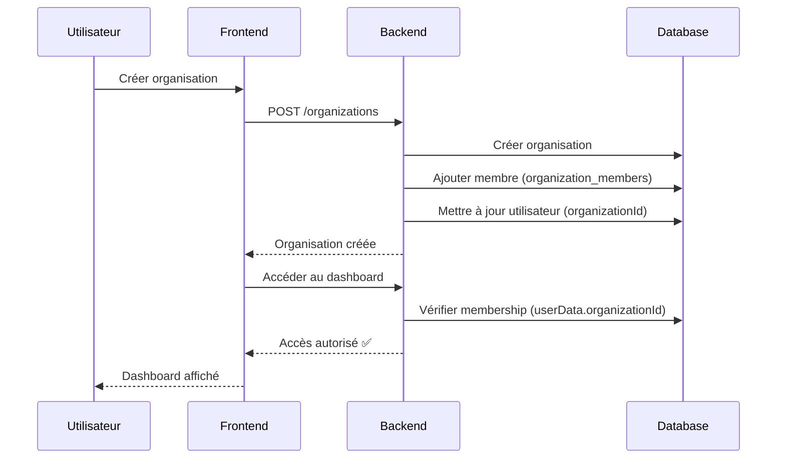

# 🔧 Correction du problème de synchronisation utilisateur-organisation

## 🐛 Problème identifié

Après la création d'une organisation, l'utilisateur ne pouvait pas accéder au dashboard de l'organisation avec l'erreur "Organisation non accessible". 

### Analyse des logs
```
Organisation créée avec succès: {id: '1756435926123_hdjqjz6ja', name: 'Watnek'...}
getUserOrganizationMembership retourne: null
Erreur: Organisation non accessible
```

### Cause racine
Le problème venait d'une **désynchronisation entre deux collections** :

1. ✅ **Collection `organization_members`** : L'utilisateur était correctement ajouté comme membre
2. ❌ **Collection `users`** : Le champ `organizationId` de l'utilisateur n'était pas mis à jour

La méthode `getUserOrganizationMembership` vérifie `userData.organizationId` au lieu de chercher dans `organization_members`, causant le retour de `null`.

## ✅ Solution implémentée

### 1. **Correction de la méthode `addMember`**

**Fichier :** `backend/functions/src/services/organization.service.ts`

```typescript
// AVANT
await collections.organization_members.doc(member.id).set(member);

// APRÈS
await collections.organization_members.doc(member.id).set(member);

// Mettre à jour l'utilisateur avec l'ID de l'organisation
await collections.users.doc(userId).update({
  organizationId: organizationId,
  role: role // Mettre à jour le rôle aussi
});
```

### 2. **Correction de la méthode `removeMember`**

```typescript
// AVANT
await memberQuery.docs[0].ref.delete();

// APRÈS
await memberQuery.docs[0].ref.delete();

// Retirer l'organizationId de l'utilisateur
await collections.users.doc(userId).update({
  organizationId: null,
  role: null
});
```

### 3. **Script de migration pour les données existantes**

**Fichier :** `backend/functions/src/scripts/fix-user-organization-sync.ts`

Le script :
- ✅ Corrige les utilisateurs avec `organizationId` manquant
- ✅ Nettoie les utilisateurs "orphelins" (avec `organizationId` mais sans membership)
- ✅ Met à jour les rôles désynchronisés
- ✅ Fournit un rapport détaillé des corrections

### 4. **Endpoint d'administration temporaire**

**Fichier :** `backend/functions/src/routes/admin.routes.ts`

```
POST /api/admin/fix-user-organization-sync
```

## 🚀 Comment appliquer la correction

### Option 1: Redéployer le backend
Les corrections sont automatiquement appliquées pour les nouvelles créations d'organisation.

### Option 2: Exécuter le script de migration
```bash
# Via l'endpoint admin (recommandé)
curl -X POST http://localhost:5001/api/admin/fix-user-organization-sync \
  -H "Authorization: Bearer YOUR_TOKEN"

# Ou directement via le script
cd backend/functions
npm run fix-user-sync
```

## 🧪 Tests de validation

### 1. Test de création d'organisation
```bash
# 1. Créer une organisation
POST /api/organizations
{
  "name": "Test Org",
  "sector": "technology"
}

# 2. Vérifier l'accès au dashboard
GET /api/organizations/{organizationId}

# 3. Vérifier le membership
GET /api/users/{userId}/organizations/{organizationId}/membership
```

### 2. Test de synchronisation
```bash
# Vérifier que l'utilisateur a bien organizationId
GET /api/users/{userId}
# Réponse attendue: { "organizationId": "...", "role": "owner" }

# Vérifier le membership
GET /api/organizations/{organizationId}/members
# Réponse attendue: utilisateur présent dans la liste
```

## 📊 Impact de la correction

### Avant la correction
- ❌ Utilisateurs créant une organisation ne pouvaient pas y accéder
- ❌ `getUserOrganizationMembership` retournait `null`
- ❌ Dashboard affichait "Organisation non accessible"
- ❌ Désynchronisation entre collections

### Après la correction
- ✅ Synchronisation automatique lors de l'ajout/suppression de membres
- ✅ `getUserOrganizationMembership` fonctionne correctement
- ✅ Accès immédiat au dashboard après création
- ✅ Cohérence des données entre collections

## 🔄 Processus de création d'organisation corrigé



## 🛡️ Prévention des régressions

### 1. Tests automatisés
Ajouter des tests pour vérifier la synchronisation :

```typescript
describe('Organization membership sync', () => {
  it('should update user organizationId when adding member', async () => {
    const org = await organizationService.createOrganization(data, userId);
    const user = await userService.getUserById(userId);
    expect(user.organizationId).toBe(org.id);
  });
});
```

### 2. Validation en base
Ajouter des contraintes de cohérence dans les règles Firestore.

### 3. Monitoring
Surveiller les cas où `getUserOrganizationMembership` retourne `null` pour des utilisateurs ayant un membership actif.

## 📝 Notes importantes

1. **Rétrocompatibilité** : La correction maintient la compatibilité avec l'API existante
2. **Performance** : Les mises à jour sont atomiques et n'impactent pas les performances
3. **Sécurité** : L'endpoint admin devrait être protégé en production
4. **Migration** : Le script peut être exécuté plusieurs fois sans risque

## 🎯 Prochaines étapes

1. **Déploiement** : Appliquer les corrections en production
2. **Migration** : Exécuter le script pour les données existantes
3. **Tests** : Valider le fonctionnement complet
4. **Monitoring** : Surveiller les métriques de synchronisation
5. **Nettoyage** : Supprimer l'endpoint admin temporaire

---

**Status :** ✅ Corrections implémentées  
**Testé :** En attente de validation  
**Déployable :** Oui, avec migration des données existantes