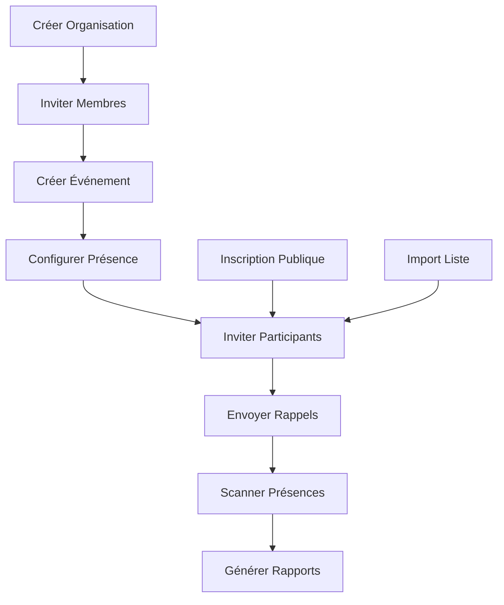

# Workflow Principal - Gestion d'Événements et Présences à des évenements

## Vue d'ensemble du Workflow

Ce workflow couvre le cycle complet de gestion d'événements depuis la création d'organisation jusqu'à la validation des présences.

## Étapes du Workflow

### 1. Création et Configuration d'Organisation
**Acteur :** Administrateur/Propriétaire
**Objectif :** Établir la structure organisationnelle

#### Actions :
- ✅ Créer une organisation avec informations de base
- ✅ Configurer les paramètres (fuseau horaire, langue, branding)
- ✅ Définir les rôles et permissions
- ✅ Configurer les méthodes de notification (email, SMS)

#### APIs Utilisées :
- `POST /api/organizations` - Créer organisation
- `PUT /api/organizations/:id` - Configurer organisation
- `PUT /api/organizations/:id/settings` - Paramètres avancés

### 2. Gestion des Membres d'Équipe
**Acteur :** Administrateur/Manager
**Objectif :** Constituer l'équipe organisatrice

#### Actions :
- ✅ Inviter des membres par email
- ✅ Gérer les rôles (Admin, Manager, Membre)
- ✅ Suivre le statut des invitations
- ✅ Gérer les permissions d'accès

#### APIs Utilisées :
- `POST /api/organizations/:id/invitations` - Créer invitation
- `GET /api/organizations/:id/invitations` - Lister invitations
- `POST /api/organizations/invitations/accept` - Accepter invitation
- `GET /api/organizations/:id/members` - Lister membres

### 3. Création et Configuration d'Événements
**Acteur :** Organisateur (Admin/Manager)
**Objectif :** Créer des événements avec tous les détails

#### Actions :
- ✅ Créer un événement avec détails complets
- ✅ Configurer les paramètres de présence (QR, géolocalisation)
- ✅ Définir les participants autorisés
- ✅ Configurer les notifications automatiques
- ✅ Générer les codes QR pour l'événement

#### APIs Utilisées :
- `POST /api/events` - Créer événement
- `PUT /api/events/:id` - Modifier événement
- `POST /api/events/:id/participants` - Ajouter participants
- `GET /api/qr-codes/events/:id` - Générer QR code

### 4. Inscription des Participants
**Acteur :** Participants/Invités
**Objectif :** Permettre l'inscription à l'événement

#### Actions :
- ✅ Inscription publique via lien/QR code
- ✅ Inscription par invitation directe
- ✅ Confirmation d'inscription par email
- ✅ Gestion des listes d'attente si capacité limitée

#### APIs Utilisées :
- `POST /api/events/:id/register` - Inscription publique
- `POST /api/events/:id/participants/:userId/confirm` - Confirmer participation
- `GET /api/events/:id/participants` - Lister participants

### 5. Gestion des Invités et Communications
**Acteur :** Organisateur
**Objectif :** Gérer la liste des invités et communications

#### Actions :
- ✅ Importer/Exporter listes d'invités
- ✅ Envoyer invitations par email/SMS
- ✅ Envoyer rappels automatiques
- ✅ Gérer les réponses et confirmations
- ✅ Suivre les statistiques d'engagement

#### APIs Utilisées :
- `POST /api/events/:id/participants/bulk-invite` - Invitation en masse
- `POST /api/notifications/send-bulk` - Envoi de notifications
- `GET /api/events/:id/analytics` - Statistiques événement
- `POST /api/events/:id/reminders` - Envoyer rappels

### 6. Validation des Présences
**Acteur :** Organisateur/Participants
**Objectif :** Enregistrer et valider les présences

#### Actions :
- ✅ Scan QR code pour marquer présence
- ✅ Validation par géolocalisation
- ✅ Pointage manuel par organisateur
- ✅ Gestion des retards et absences
- ✅ Export des données de présence

#### APIs Utilisées :
- `POST /api/attendances/mark/:eventId` - Marquer présence
- `POST /api/attendances/qr-scan` - Scan QR code
- `GET /api/attendances/event/:id` - Lister présences
- `POST /api/attendances/export` - Exporter données

## Interfaces Utilisateur Nécessaires

### 1. Dashboard Organisation
- Vue d'ensemble des événements
- Statistiques de participation
- Gestion rapide des membres

### 2. Gestionnaire d'Événements
- Création/édition d'événements
- Configuration des paramètres de présence
- Gestion des participants

### 3. Interface d'Invitation
- Formulaire d'invitation en masse
- Templates d'emails personnalisables
- Suivi des réponses

### 4. Scanner de Présence
- Interface de scan QR code
- Validation manuelle
- Vue temps réel des présences

### 5. Rapports et Analytics
- Statistiques de participation
- Rapports d'assiduité
- Export des données

## Services Frontend à Implémenter/Améliorer

### 1. organizationService (✅ Existe)
- Étendre avec gestion des invitations
- Ajouter méthodes de configuration avancée

### 2. eventService (✅ Existe)
- Ajouter gestion des inscriptions publiques
- Intégrer système de notifications

### 3. attendanceService (✅ Existe)
- Améliorer avec scan QR code
- Ajouter validation géolocalisation

### 4. notificationService (✅ Existe)
- Ajouter templates personnalisables
- Intégrer envoi en masse

### 5. invitationService (🆕 À créer)
- Gestion complète des invitations
- Suivi des réponses
- Templates d'emails

## Composants UI à Créer/Améliorer

### 1. OrganizationSetup
- Assistant de configuration initiale
- Gestion des paramètres avancés

### 2. EventCreationWizard
- Assistant de création d'événement
- Configuration des paramètres de présence

### 3. InvitationManager
- Interface de gestion des invitations
- Envoi en masse avec templates

### 4. AttendanceScanner
- Interface de scan QR code
- Validation temps réel

### 5. ParticipantDashboard
- Vue participant avec ses événements
- Interface d'inscription

## Flux de Données

## Priorités d'Implémentation

### Phase 1 - Core Workflow (Semaine 1-2)
1. ✅ Améliorer organizationService avec invitations
2. ✅ Créer invitationService complet
3. ✅ Améliorer eventService avec inscriptions
4. ✅ Créer composants de base (OrganizationSetup, EventWizard)

### Phase 2 - Communications (Semaine 3)
1. ✅ Intégrer système de notifications avancé
2. ✅ Créer templates d'emails personnalisables
3. ✅ Implémenter envoi en masse
4. ✅ Créer InvitationManager

### Phase 3 - Présences (Semaine 4)
1. ✅ Améliorer attendanceService avec QR/géoloc
2. ✅ Créer AttendanceScanner
3. ✅ Intégrer validation temps réel
4. ✅ Créer rapports de présence

### Phase 4 - Analytics & Optimisation (Semaine 5)
1. ✅ Intégrer analytics avancés
2. ✅ Créer tableaux de bord
3. ✅ Optimiser performances
4. ✅ Tests et validation

## Métriques de Succès

### Techniques
- ✅ 100% des APIs du workflow intégrées
- ✅ Temps de réponse < 500ms
- ✅ Taux d'erreur < 1%
- ✅ Couverture de tests > 80%

### Business
- ✅ Temps de création d'événement < 5 minutes
- ✅ Taux d'inscription > 70%
- ✅ Temps de validation présence < 30 secondes
- ✅ Satisfaction utilisateur > 4.5/5