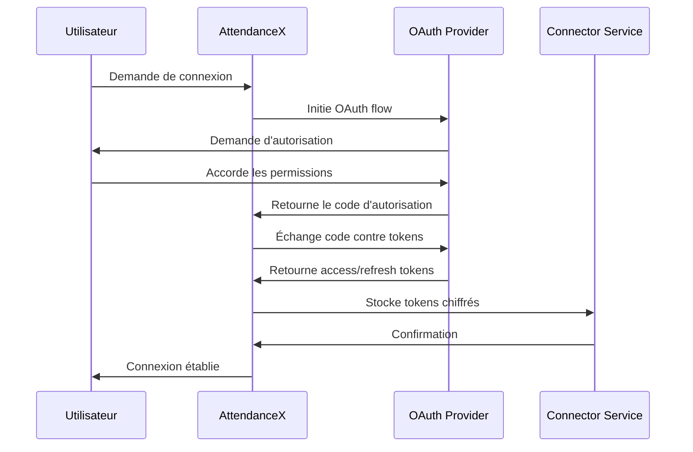

# Guide des Connecteurs AttendanceX

Ce guide explique comment utiliser les connecteurs Teams et Slack intégrés dans AttendanceX pour automatiser la création de réunions et l'envoi de notifications d'événements.

## Vue d'ensemble

AttendanceX propose des connecteurs natifs pour :
- **Microsoft Teams** : Création automatique de réunions avec liens de visioconférence
- **Slack** : Notifications d'événements, création de canaux dédiés, et rappels programmés

## Architecture des Connecteurs

### Services Principaux

1. **ConnectorManagerService** : Service central qui orchestre tous les connecteurs
2. **TeamsConnectorService** : Gestion spécifique de Microsoft Teams
3. **SlackConnectorService** : Gestion spécifique de Slack
4. **TokenService** : Gestion sécurisée des tokens OAuth

### Flux d'Authentification



## Fonctionnalités par Connecteur

### Microsoft Teams

#### Capacités
- ✅ Création de réunions avec liens Teams
- ✅ Synchronisation du calendrier
- ✅ Gestion des participants
- ✅ Récupération des événements existants
- ❌ Notifications directes
- ❌ Création de canaux

#### Endpoints Disponibles

**Créer une réunion Teams :**
```http
POST /api/connectors/meeting
Content-Type: application/json
Authorization: Bearer <token>

{
  "eventId": "evt_123",
  "eventTitle": "Réunion équipe",
  "eventDescription": "Discussion hebdomadaire",
  "startDateTime": "2024-01-15T14:00:00Z",
  "endDateTime": "2024-01-15T15:00:00Z",
  "attendees": ["user1@company.com", "user2@company.com"],
  "timeZone": "Europe/Paris"
}
```

**Récupérer les événements du calendrier :**
```http
GET /api/connectors/teams/{integrationId}/events?startDate=2024-01-01&endDate=2024-01-31
Authorization: Bearer <token>
```

### Slack

#### Capacités
- ✅ Envoi de notifications d'événements
- ✅ Création de canaux dédiés aux événements
- ✅ Programmation de rappels
- ✅ Récupération de la liste des canaux
- ❌ Création de réunions
- ❌ Synchronisation calendrier

#### Endpoints Disponibles

**Envoyer une notification d'événement :**
```http
POST /api/connectors/notifications
Content-Type: application/json
Authorization: Bearer <token>

{
  "eventId": "evt_123",
  "eventTitle": "Formation sécurité",
  "eventDate": "2024-01-15T09:00:00Z",
  "message": "N'oubliez pas la formation sécurité demain matin !",
  "channelId": "C1234567890",
  "reminderMinutes": 60
}
```

**Créer un canal pour un événement :**
```http
POST /api/connectors/channels
Content-Type: application/json
Authorization: Bearer <token>

{
  "eventId": "evt_123",
  "eventTitle": "Hackathon 2024",
  "isPrivate": false,
  "attendeeEmails": ["dev1@company.com", "dev2@company.com"]
}
```

**Programmer des rappels :**
```http
POST /api/connectors/reminders
Content-Type: application/json
Authorization: Bearer <token>

{
  "eventId": "evt_123",
  "eventTitle": "All Hands Meeting",
  "eventDate": "2024-01-15T14:00:00Z",
  "reminderMinutes": [60, 15, 5],
  "channelIds": {
    "slack": "C1234567890"
  }
}
```

## Utilisation du Service Unifié

### Création Automatique de Réunion

Le `ConnectorManagerService` sélectionne automatiquement le meilleur connecteur disponible :

```typescript
import { connectorManagerService } from '../services/integrations/connector-manager.service';

const result = await connectorManagerService.createEventMeeting(userId, {
  eventId: 'evt_123',
  eventTitle: 'Réunion équipe',
  startDateTime: new Date('2024-01-15T14:00:00Z'),
  endDateTime: new Date('2024-01-15T15:00:00Z'),
  attendees: ['user1@company.com', 'user2@company.com']
});

if (result.meetingUrl) {
  console.log(`Réunion créée : ${result.meetingUrl}`);
  console.log(`Provider utilisé : ${result.provider}`);
}
```

### Ordre de Priorité

Pour la création de réunions :
1. **Microsoft Teams** (priorité haute)
2. **Google Meet** (priorité moyenne)
3. **Zoom** (priorité basse)

### Gestion des Erreurs

Les connecteurs gèrent automatiquement :
- **Expiration des tokens** : Rafraîchissement automatique
- **Permissions insuffisantes** : Messages d'erreur explicites
- **Limites de taux** : Retry avec backoff exponentiel
- **Erreurs réseau** : Tentatives multiples

## Configuration et Sécurité

### Variables d'Environnement Requises

```bash
# Microsoft Teams / Graph API
MICROSOFT_CLIENT_ID=your_client_id
MICROSOFT_CLIENT_SECRET=your_client_secret
MICROSOFT_REDIRECT_URI=https://your-domain.com/auth/microsoft/callback

# Slack API
SLACK_CLIENT_ID=your_client_id
SLACK_CLIENT_SECRET=your_client_secret
SLACK_REDIRECT_URI=https://your-domain.com/auth/slack/callback

# Chiffrement des tokens
ENCRYPTION_MASTER_KEY=your_encryption_key
```

### Permissions Requises

#### Microsoft Teams
- `Calendars.ReadWrite` : Gestion du calendrier
- `OnlineMeetings.ReadWrite` : Création de réunions Teams
- `User.Read` : Informations utilisateur
- `Presence.Read` : Statut de présence

#### Slack
- `channels:read` : Lecture des canaux publics
- `channels:write` : Création de canaux
- `chat:write` : Envoi de messages
- `users:read` : Informations utilisateur
- `team:read` : Informations workspace

### Sécurité des Tokens

- **Chiffrement AES-256-GCM** : Tous les tokens sont chiffrés
- **Clés par utilisateur** : Chaque utilisateur a sa propre clé de chiffrement
- **Rotation automatique** : Rafraîchissement automatique des tokens
- **Audit complet** : Toutes les opérations sont loggées

## Monitoring et Diagnostics

### Endpoints de Diagnostic

**Résumé des connecteurs :**
```http
GET /api/connectors/summary
Authorization: Bearer <token>
```

**Test de toutes les connexions :**
```http
GET /api/connectors/test
Authorization: Bearer <token>
```

**Test d'une connexion spécifique :**
```http
GET /api/connectors/{integrationId}/test?provider=microsoft
Authorization: Bearer <token>
```

### Métriques Disponibles

- **Taux de succès** par connecteur
- **Temps de réponse** moyen
- **Erreurs par type** et fréquence
- **Utilisation** par fonctionnalité

## Exemples d'Intégration

### Workflow Complet d'Événement

```typescript
// 1. Créer l'événement
const event = await eventService.createEvent(eventData);

// 2. Générer automatiquement le lien de réunion
const meetingResult = await connectorManagerService.createEventMeeting(userId, {
  eventId: event.id,
  eventTitle: event.title,
  startDateTime: event.startDate,
  endDateTime: event.endDate,
  attendees: event.attendees
});

// 3. Mettre à jour l'événement avec le lien
if (meetingResult.meetingUrl) {
  await eventService.updateEvent(event.id, {
    meetingUrl: meetingResult.meetingUrl,
    meetingProvider: meetingResult.provider
  });
}

// 4. Envoyer les notifications
await connectorManagerService.sendEventNotifications(userId, {
  eventId: event.id,
  eventTitle: event.title,
  eventDate: event.startDate,
  message: `Nouvel événement créé : ${event.title}`
});

// 5. Programmer les rappels
await connectorManagerService.scheduleEventReminders(userId, {
  eventId: event.id,
  eventTitle: event.title,
  eventDate: event.startDate,
  reminderMinutes: [60, 15] // 1h et 15min avant
});
```

### Gestion des Erreurs

```typescript
try {
  const result = await connectorManagerService.createEventMeeting(userId, eventData);
  
  if (!result.meetingUrl) {
    // Aucun connecteur disponible
    logger.warn('No meeting connectors available', { userId });
    // Fallback : utiliser un lien générique ou demander à l'utilisateur
  }
  
} catch (error) {
  if (error.message.includes('token expired')) {
    // Rediriger vers la reconnexion
    return { error: 'RECONNECTION_REQUIRED', provider: 'teams' };
  }
  
  // Autres erreurs
  logger.error('Meeting creation failed', { error, userId });
  throw error;
}
```

## Bonnes Pratiques

### Performance
- **Cache des métadonnées** : Informations utilisateur et canaux
- **Batch des opérations** : Grouper les notifications multiples
- **Retry intelligent** : Backoff exponentiel avec jitter

### Fiabilité
- **Validation des permissions** : Vérifier avant chaque opération
- **Fallback gracieux** : Alternatives en cas d'échec
- **Monitoring proactif** : Alertes sur les taux d'erreur

### Expérience Utilisateur
- **Messages explicites** : Erreurs compréhensibles
- **Progression visible** : Indicateurs de statut
- **Configuration simple** : Processus d'authentification fluide

## Dépannage

### Problèmes Courants

**Token expiré :**
```
Error: Teams integration token expired. Please reconnect your account.
```
→ Rediriger l'utilisateur vers la page de reconnexion

**Permissions insuffisantes :**
```
Error: Insufficient permissions for calendar access
```
→ Vérifier les scopes accordés lors de l'authentification

**Canal Slack introuvable :**
```
Error: Channel not found or access denied
```
→ Vérifier que le bot a accès au canal ou utiliser un canal public

### Logs de Debug

Activer les logs détaillés :
```bash
export LOG_LEVEL=debug
export CONNECTOR_DEBUG=true
```

Les logs incluent :
- **Requêtes API** avec headers (sans tokens)
- **Réponses** avec codes de statut
- **Durées** d'exécution
- **Erreurs** avec stack traces

## Roadmap

### Prochaines Fonctionnalités
- **Google Meet** : Intégration complète
- **Zoom** : Création de réunions natives
- **Microsoft Outlook** : Synchronisation email
- **Webhooks** : Notifications temps réel des changements

### Améliorations Prévues
- **Cache intelligent** : Réduction des appels API
- **Retry avancé** : Gestion des limites de taux
- **Analytics** : Métriques d'utilisation détaillées
- **Templates** : Messages personnalisables par organisation

---

Pour plus d'informations, consultez la [documentation API complète](/docs/api) ou contactez l'équipe de support.