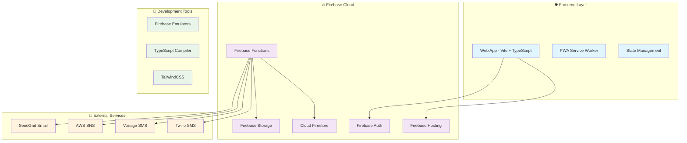
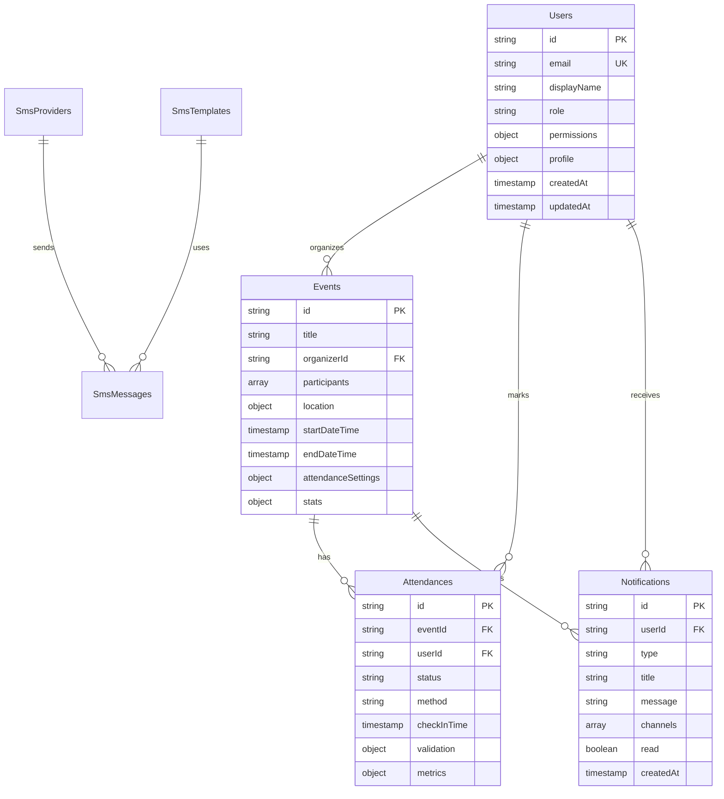
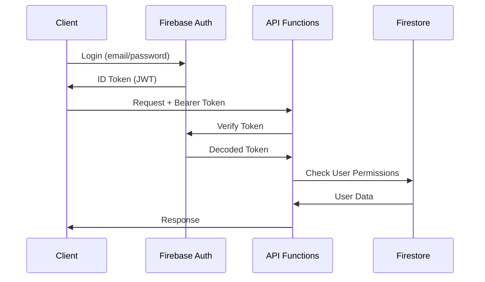
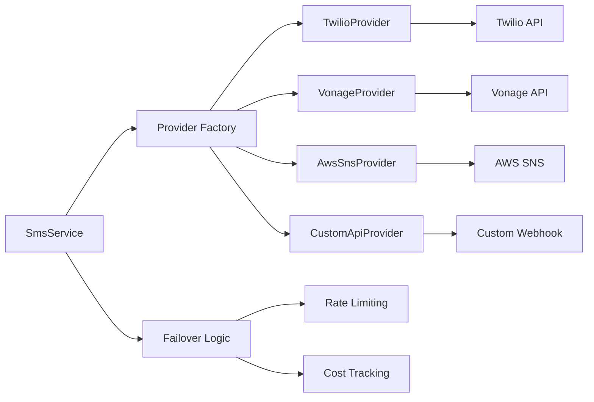

# 🏗️ Architecture Technique - AttendanceX

> 📐 **Guide complet** de l'architecture système, des patterns de conception et des décisions techniques

## 🎯 Vue d'ensemble architecturale

AttendanceX suit une **architecture microservices** moderne basée sur le cloud avec séparation claire entre frontend, backend et services externes. L'ensemble est conçu pour la scalabilité, la résilience et la maintenabilité.



## 🏛️ Patterns architecturaux

### 🔄 **Architecture en couches**
```
┌─────────────────────────────────────┐
│  🎨 Presentation Layer              │
│  (Frontend - UI/UX)                 │
├─────────────────────────────────────┤
│  🎮 Controller Layer                │
│  (API Endpoints - Express)          │
├─────────────────────────────────────┤
│  🔧 Service Layer                   │
│  (Business Logic - Services)        │
├─────────────────────────────────────┤
│  🏗️ Model Layer                     │
│  (Data Models - TypeScript Classes) │
├─────────────────────────────────────┤
│  💾 Data Layer                      │
│  (Firestore - NoSQL Database)       │
└─────────────────────────────────────┘
```

### 🧩 **Pattern MVC adapté**
- **Models** : Classes TypeScript avec validation et logique métier
- **Views** : Composants frontend avec TailwindCSS
- **Controllers** : Endpoints Express avec middleware

### 🔄 **Repository Pattern**
```typescript
interface IUserRepository {
  findById(id: string): Promise<User | null>;
  findByEmail(email: string): Promise<User | null>;
  create(user: CreateUserRequest): Promise<User>;
  update(id: string, updates: UpdateUserRequest): Promise<User>;
  delete(id: string): Promise<void>;
}
```

## 🗂️ Architecture des données

### 📊 **Modèle de données Firestore**


### 🏗️ **Collections Firestore optimisées**

#### 👥 **Users Collection**
```typescript
// users/{userId}
{
  email: "user@example.com",
  displayName: "John Doe",
  role: "organizer",
  permissions: {
    canCreateEvents: true,
    canManageUsers: false,
    // ...
  },
  profile: {
    department: "IT",
    preferences: {
      emailNotifications: true,
      language: "fr"
    }
  },
  // Index composites : role + createdAt, status + role
}
```

#### 📅 **Events Collection**
```typescript
// events/{eventId}
{
  title: "Team Meeting",
  organizerId: "user123",
  participants: ["user1", "user2"], // Array pour queries
  location: {
    type: "physical",
    coordinates: { latitude: 48.8566, longitude: 2.3522 }
  },
  startDateTime: Timestamp,
  attendanceSettings: {
    requireGeolocation: true,
    checkInRadius: 100
  },
  // Index composites : organizerId + startDateTime, status + startDateTime
}
```

#### ✅ **Attendances Collection**
```typescript
// attendances/{attendanceId}
{
  eventId: "event123",
  userId: "user123", 
  status: "present",
  method: "qr_code",
  checkInTime: Timestamp,
  validation: {
    isValidated: true,
    validatedBy: "organizer123"
  },
  // Index composites : eventId + createdAt, userId + createdAt
}
```

### 📊 **Index Firestore optimisés**
```json
{
  "indexes": [
    {
      "collectionGroup": "users",
      "fields": [
        {"fieldPath": "role", "order": "ASCENDING"},
        {"fieldPath": "createdAt", "order": "DESCENDING"}
      ]
    },
    {
      "collectionGroup": "events", 
      "fields": [
        {"fieldPath": "organizerId", "order": "ASCENDING"},
        {"fieldPath": "startDateTime", "order": "DESCENDING"}
      ]
    },
    {
      "collectionGroup": "attendances",
      "fields": [
        {"fieldPath": "eventId", "order": "ASCENDING"},
        {"fieldPath": "status", "order": "ASCENDING"},
        {"fieldPath": "createdAt", "order": "DESCENDING"}
      ]
    }
  ]
}
```

## 🔧 Architecture Backend

### 🚀 **Firebase Functions Structure**
```
backend/functions/src/
├── 🎮 controllers/          # API endpoints
├── 🔧 services/            # Business logic
├── 🏗️ models/              # Data models
├── 🛡️ middleware/          # Request processing
├── 🛣️ routes/              # URL routing
├── 🔧 utils/               # Utilities
├── ⚡ triggers/            # Firestore triggers
└── 🔄 jobs/                # Scheduled tasks
```

### 🎮 **Controllers Layer**
```typescript
// Pattern standardisé pour tous les contrôleurs
export class UserController {
  private userService: UserService;

  constructor() {
    this.userService = new UserService();
  }

  // GET /api/users
  list = async (req: AuthenticatedRequest, res: Response) => {
    try {
      const params = RequestUtils.extractPaginationParams(req);
      const result = await this.userService.list(params);
      
      res.json({
        success: true,
        data: result.data,
        pagination: result.pagination
      });
    } catch (error) {
      res.status(400).json({
        success: false,
        error: error.message
      });
    }
  };
}
```

### 🔧 **Services Layer**
```typescript
// Pattern Service avec injection de dépendances
export class UserService {
  private collection: CollectionReference;
  private authService: AuthService;

  constructor() {
    this.collection = db.collection('users');
    this.authService = new AuthService();
  }

  async create(userData: CreateUserRequest): Promise<User> {
    // 1. Validation métier
    await this.validateCreateUser(userData);
    
    // 2. Transformation des données
    const user = UserModel.fromCreateRequest(userData);
    
    // 3. Persistance
    await this.collection.doc(user.id).set(user.toFirestore());
    
    // 4. Actions post-création
    await this.authService.sendWelcomeEmail(user.email);
    
    return user.getData();
  }
}
```

### 🏗️ **Models Layer**
```typescript
// Pattern Active Record avec validation
export class UserModel extends BaseModel<User> {
  async validate(): Promise<boolean> {
    // Validation métier spécifique
    BaseModel.validateRequired(this.data, ['email', 'displayName']);
    
    if (!BaseModel.validateEmail(this.data.email)) {
      throw new Error('Invalid email format');
    }
    
    return true;
  }

  // Méthodes métier
  isActive(): boolean {
    return this.data.status === UserStatus.ACTIVE;
  }

  canPerformAction(action: keyof UserPermissions): boolean {
    return this.isActive() && this.data.permissions[action];
  }
}
```

## 🎨 Architecture Frontend

### 📱 **Structure modulaire**
```
frontend/src/
├── 🎨 components/          # Composants réutilisables
│   ├── common/             # Composants de base
│   ├── forms/              # Composants formulaires
│   └── layout/             # Composants layout
├── 📱 pages/               # Pages application
├── 🔧 services/            # Services API
├── 📦 store/               # Gestion d'état
├── 🔧 utils/               # Utilitaires
└── 🎨 styles/              # Styles globaux
```

### 🧩 **Pattern Component**
```typescript
// Composant avec TypeScript strict
interface ButtonProps {
  variant: 'primary' | 'secondary' | 'danger';
  size: 'sm' | 'md' | 'lg';
  disabled?: boolean;
  loading?: boolean;
  onClick: () => void;
  children: React.ReactNode;
}

export const Button: React.FC<ButtonProps> = ({
  variant,
  size,
  disabled = false,
  loading = false,
  onClick,
  children
}) => {
  const baseClasses = 'font-medium rounded-lg transition-colors';
  const variantClasses = {
    primary: 'bg-blue-600 text-white hover:bg-blue-700',
    secondary: 'bg-gray-200 text-gray-900 hover:bg-gray-300',
    danger: 'bg-red-600 text-white hover:bg-red-700'
  };
  
  return (
    <button
      className={`${baseClasses} ${variantClasses[variant]}`}
      disabled={disabled || loading}
      onClick={onClick}
    >
      {loading ? <Spinner /> : children}
    </button>
  );
};
```

### 🔧 **Services API Frontend**
```typescript
// Service API avec gestion d'erreurs centralisée
export class ApiService {
  private baseUrl: string;
  private authToken: string | null = null;

  constructor() {
    this.baseUrl = import.meta.env.VITE_API_URL;
  }

  async request<T>(
    endpoint: string, 
    options: RequestOptions = {}
  ): Promise<ApiResponse<T>> {
    const url = `${this.baseUrl}${endpoint}`;
    const headers = {
      'Content-Type': 'application/json',
      ...(this.authToken && { Authorization: `Bearer ${this.authToken}` }),
      ...options.headers
    };

    try {
      const response = await fetch(url, {
        ...options,
        headers
      });

      const data = await response.json();

      if (!response.ok) {
        throw new ApiError(data.error, response.status);
      }

      return data;
    } catch (error) {
      throw this.handleError(error);
    }
  }
}
```

## 🔒 Sécurité et authentification

### 🛡️ **Layers de sécurité**
```
┌─────────────────────────────────────┐
│  🌐 Network Security (HTTPS/TLS)    │
├─────────────────────────────────────┤
│  🔐 Authentication (Firebase Auth)  │
├─────────────────────────────────────┤  
│  🛡️ Authorization (Role-based)      │
├─────────────────────────────────────┤
│  ✅ Validation (Input sanitization) │
├─────────────────────────────────────┤
│  🔒 Encryption (Data at rest)       │
└─────────────────────────────────────┘
```

### 🔐 **Flux d'authentification**


### 🛡️ **Middleware sécurité**
```typescript
// Middleware d'authentification
export const requireAuth = async (
  req: AuthenticatedRequest, 
  res: Response, 
  next: NextFunction
) => {
  try {
    const token = extractToken(req);
    const decodedToken = await admin.auth().verifyIdToken(token);
    const user = await UserService.getById(decodedToken.uid);
    
    req.user = user;
    req.userId = user.id;
    
    next();
  } catch (error) {
    res.status(401).json({
      success: false,
      error: 'Authentication required'
    });
  }
};

// Middleware de permissions
export const requirePermission = (permission: string) => {
  return (req: AuthenticatedRequest, res: Response, next: NextFunction) => {
    if (!req.user?.permissions[permission]) {
      return res.status(403).json({
        success: false,
        error: 'Insufficient permissions'
      });
    }
    next();
  };
};
```

### 🔒 **Règles Firestore**
```javascript
// Sécurité au niveau base de données
rules_version = '2';
service cloud.firestore {
  match /databases/{database}/documents {
    // Users collection
    match /users/{userId} {
      allow read, write: if request.auth != null 
        && (request.auth.uid == userId 
            || hasRole(['admin', 'super_admin']));
    }
    
    // Events collection  
    match /events/{eventId} {
      allow read: if request.auth != null 
        && (request.auth.uid in resource.data.participants
            || resource.data.organizerId == request.auth.uid
            || hasRole(['admin', 'super_admin']));
            
      allow create: if request.auth != null 
        && hasPermission('canCreateEvents');
    }
  }
}
```

## 📡 Communication et intégrations

### 🔄 **Architecture SMS modulaire**


### 📱 **Pattern Provider SMS**
```typescript
// Interface commune pour tous les providers
export interface ISmsProvider {
  readonly id: string;
  readonly name: string;
  readonly type: SmsProviderType;
  
  sendSms(phone: string, message: string): Promise<SmsResult>;
  testConnection(): Promise<boolean>;
  getStats(): Promise<ProviderStats>;
}

// Implémentation Twilio
export class TwilioProvider implements ISmsProvider {
  private client: Twilio;
  
  constructor(config: TwilioConfig) {
    this.client = new Twilio(config.accountSid, config.authToken);
  }
  
  async sendSms(phone: string, message: string): Promise<SmsResult> {
    try {
      const result = await this.client.messages.create({
        body: message,
        from: this.config.phoneNumber,
        to: phone
      });
      
      return {
        success: true,
        messageId: result.sid,
        cost: parseFloat(result.price) || 0
      };
    } catch (error) {
      throw new SmsError(`Twilio error: ${error.message}`);
    }
  }
}
```

### 🔄 **Failover automatique**
```typescript
export class SmsService {
  private providers: ISmsProvider[];
  
  async sendSms(phone: string, message: string): Promise<SmsResult> {
    const sortedProviders = this.providers
      .filter(p => p.isActive)
      .sort((a, b) => a.priority - b.priority);
    
    for (const provider of sortedProviders) {
      try {
        // Vérifier les limites de taux
        if (!await this.checkRateLimit(provider)) continue;
        
        // Tentative d'envoi
        const result = await provider.sendSms(phone, message);
        
        // Succès - mettre à jour les stats
        await this.updateProviderStats(provider, true);
        return result;
        
      } catch (error) {
        // Échec - essayer le provider suivant
        await this.updateProviderStats(provider, false, error);
        continue;
      }
    }
    
    throw new Error('All SMS providers failed');
  }
}
```

## ⚡ Performance et optimisation

### 🚀 **Stratégies de performance**

#### 📊 **Cache multi-niveaux**
```typescript
// Cache en mémoire avec TTL
export class MemoryCache {
  private cache = new Map<string, CacheItem>();
  
  async getOrSet<T>(
    key: string, 
    fetchFn: () => Promise<T>, 
    ttl: number = 300000
  ): Promise<T> {
    const cached = this.get<T>(key);
    if (cached) return cached;
    
    const value = await fetchFn();
    this.set(key, value, ttl);
    return value;
  }
}

// Utilisation dans les services
export class EventService {
  @Cacheable(300000) // 5 minutes
  async getById(id: string): Promise<Event> {
    return this.collection.doc(id).get();
  }
}
```

#### 📄 **Pagination optimisée**
```typescript
// Pagination avec cursors pour Firestore
export class PaginationHelper {
  static async paginateQuery<T>(
    query: Query,
    params: PaginationParams
  ): Promise<PaginatedResponse<T>> {
    const { page, limit } = params;
    
    // Utiliser startAfter pour les grandes collections
    let paginatedQuery = query.limit(limit);
    
    if (page > 1) {
      const offset = (page - 1) * limit;
      const skipQuery = query.limit(offset);
      const skipSnapshot = await skipQuery.get();
      
      if (!skipSnapshot.empty) {
        const lastDoc = skipSnapshot.docs[skipSnapshot.docs.length - 1];
        paginatedQuery = query.startAfter(lastDoc).limit(limit);
      }
    }
    
    const snapshot = await paginatedQuery.get();
    const data = snapshot.docs.map(doc => ({ id: doc.id, ...doc.data() }));
    
    return {
      data,
      pagination: {
        page,
        limit,
        total: await this.getCollectionCount(query),
        hasNext: data.length === limit,
        hasPrev: page > 1
      }
    };
  }
}
```

### 📊 **Monitoring des performances**
```typescript
// Décorateur pour mesurer les performances
export function MeasurePerformance(target: any, propertyKey: string, descriptor: PropertyDescriptor) {
  const originalMethod = descriptor.value;
  
  descriptor.value = async function (...args: any[]) {
    const start = Date.now();
    
    try {
      const result = await originalMethod.apply(this, args);
      const duration = Date.now() - start;
      
      // Logger les performances
      logger.logPerformance(`${target.constructor.name}.${propertyKey}`, duration);
      
      return result;
    } catch (error) {
      const duration = Date.now() - start;
      logger.logPerformance(`${target.constructor.name}.${propertyKey}`, duration, { error: true });
      throw error;
    }
  };
}

// Utilisation
export class UserService {
  @MeasurePerformance
  async create(userData: CreateUserRequest): Promise<User> {
    // Implementation...
  }
}
```

## 🔄 Déploiement et DevOps

### 🚀 **Pipeline CI/CD**
```yaml
# .github/workflows/deploy.yml
name: Deploy to Firebase

on:
  push:
    branches: [main]

jobs:
  test:
    runs-on: ubuntu-latest
    steps:
      - uses: actions/checkout@v3
      - uses: actions/setup-node@v3
        with:
          node-version: '18'
      - run: npm ci
      - run: npm run test
      - run: npm run lint

  deploy:
    needs: test
    runs-on: ubuntu-latest
    steps:
      - uses: actions/checkout@v3
      - uses: actions/setup-node@v3
      - run: npm ci
      - run: npm run build
      - uses: FirebaseExtended/action-hosting-deploy@v0
        with:
          repoToken: '${{ secrets.GITHUB_TOKEN }}'
          firebaseServiceAccount: '${{ secrets.FIREBASE_SERVICE_ACCOUNT }}'
          projectId: your-project-id
```

### 📊 **Monitoring production**
```typescript
// Health check endpoint
export const healthCheck = functions.https.onRequest(async (req, res) => {
  const checks = {
    database: await checkFirestoreConnection(),
    auth: await checkAuthService(),
    storage: await checkStorageService(),
    sms: await checkSmsProviders(),
    memory: process.memoryUsage(),
    uptime: process.uptime()
  };
  
  const allHealthy = Object.values(checks).every(check => 
    typeof check === 'boolean' ? check : check.status === 'healthy'
  );
  
  res.status(allHealthy ? 200 : 503).json({
    status: allHealthy ? 'healthy' : 'unhealthy',
    timestamp: new Date().toISOString(),
    checks
  });
});
```

## 📚 Documentation et standards

### 📝 **Standards de code**
- **TypeScript strict** : `"strict": true`
- **ESLint + Prettier** : Formatage automatique
- **Naming conventions** : camelCase, PascalCase, SCREAMING_SNAKE_CASE
- **Documentation inline** : JSDoc pour toutes les fonctions publiques

### 🧪 **Stratégie de tests**
```
├── 🧪 Tests unitaires (80%)
│   ├── Models validation
│   ├── Services business logic  
│   └── Utils functions
├── 🔗 Tests intégration (15%)
│   ├── API endpoints
│   ├── Database operations
│   └── External services
└── 🎭 Tests E2E (5%)
    ├── User journeys
    ├── Critical paths
    └── Cross-browser
```

### 📊 **Métriques qualité**
- **Code coverage** : > 90%
- **Performance** : API < 200ms (95e percentile)
- **Security** : 0 vulnérabilité critique
- **Accessibility** : WCAG 2.1 AA compliant

---

## 🎯 Décisions architecturales

### ✅ **Pourquoi Firebase ?**
- **Rapidité de développement** : Backend-as-a-Service
- **Scalabilité automatique** : 0 à des millions d'utilisateurs
- **Sécurité intégrée** : Authentication et rules
- **Écosystème riche** : Analytics, Crashlytics, Performance

### ✅ **Pourquoi TypeScript ?**
- **Type safety** : Réduction des bugs en production
- **Developer experience** : IntelliSense et refactoring
- **Maintenabilité** : Self-documenting code
- **Évolutivité** : Facilite les changements à grande échelle

### ✅ **Pourquoi cette architecture modulaire ?**
- **Séparation des préoccupations** : Chaque module a une responsabilité
- **Testabilité** : Injection de dépendances et mocks
- **Réutilisabilité** : Code partagé entre frontend/backend
- **Évolutivité** : Ajout de features sans impact

---

**📚 Prochaine lecture** : [Guide Sécurité](SECURITY.md) | [Guide Déploiement](DEPLOYMENT.md)