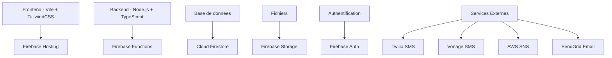

# 🎯 AttendanceX - Système de Gestion des Présences

[](https://www.typescriptlang.org/)
[](https://firebase.google.com/)
[](https://tailwindcss.com/)
[](https://vitejs.dev/)

> 🚀 **Solution complète de gestion des présences** pour entreprises modernes avec fonctionnalités avancées de géolocalisation, QR codes, notifications multi-canal et analytics en temps réel.

## ✨ Aperçu

**AttendanceX** révolutionne la gestion des présences en remplaçant les méthodes traditionnelles par une solution digitale intelligente, sécurisée et hautement configurable. Conçu pour les entreprises, établissements d'enseignement et organisations de toutes tailles.

### 🎯 **Pourquoi AttendanceX ?**

- ⚡ **Efficacité maximale** : Réduction de 90% du temps de gestion des présences
- 🔒 **Sécurité renforcée** : Chiffrement AES-256 et authentification multi-facteurs
- 📱 **Flexibilité totale** : Supports multiples (QR, GPS, biométrie, manuel)
- 📊 **Insights avancés** : Analytics temps réel et rapports personnalisables
- 🌐 **Scalabilité** : De 10 à 10,000+ utilisateurs sans limitation

## 🚀 Démarrage rapide

### Prérequis
- Node.js 18+
- Firebase CLI
- Git

### Installation express (5 minutes)

```bash
# 1. Cloner le repository
git clone https://github.com/votre-username/attendance-management-system.git
cd attendance-management-system

# 2. Installer les dépendances
npm install

# 3. Configuration Firebase
firebase login
firebase init

# 4. Configurer les variables d'environnement
cp .env.example .env
# Éditer .env avec vos clés Firebase

# 5. Démarrer les émulateurs de développement
npm run dev
```

🎉 **Votre application est maintenant accessible sur http://localhost:3000**

📚 [**Guide détaillé →**](docs/GETTING_STARTED.md)

## 🌟 Fonctionnalités principales

### 👥 **Gestion Utilisateurs Avancée**
- **Rôles hiérarchiques** : Super Admin, Admin, Organisateur, Participant
- **Permissions granulaires** : 10+ permissions configurables
- **Profils enrichis** : Photos, contacts, départements, compétences
- **Authentification 2FA** : Sécurité renforcée optionnelle

### 📅 **Événements Intelligents**
- **Types variés** : Réunions, formations, conférences, webinaires
- **Modalités flexibles** : Physique, virtuel, hybride
- **Récurrence avancée** : Quotidienne à annuelle avec exceptions
- **Inscriptions** : Gestion capacités et listes d'attente

### ✅ **Présences Multi-Méthodes**
| Méthode | Description | Sécurité |
|---------|-------------|----------|
| 🔲 **QR Code** | Scan rapide avec validation temporelle | ⭐⭐⭐⭐⭐ |
| 📍 **Géolocalisation** | Vérification automatique de proximité | ⭐⭐⭐⭐ |
| 👤 **Manuel** | Marquage par organisateur/admin | ⭐⭐⭐ |
| 🔐 **Biométrique** | Intégration lecteurs biométriques | ⭐⭐⭐⭐⭐ |

### 📱 **Notifications Multi-Canal**
- **Email** : Templates riches HTML personnalisables
- **SMS** : Providers multiples avec failover automatique
- **Push** : Notifications navigateur temps réel
- **In-App** : Notifications intégrées à l'interface

### 📊 **Analytics & Rapports**
- **Tableaux de bord** : Métriques temps réel personnalisées
- **Rapports riches** : PDF, Excel, CSV avec branding
- **Analytics prédictives** : Identification tendances et risques
- **Exports automatisés** : Rapports programmés récurrents

## 🏗️ Architecture technique



### 🔧 **Stack Technologique**

**Backend**
- **Runtime** : Node.js 18 + TypeScript 5.3
- **Framework** : Express.js avec middleware personnalisés
- **Base de données** : Cloud Firestore (NoSQL)
- **Authentification** : Firebase Authentication
- **Stockage** : Firebase Storage
- **Déploiement** : Firebase Functions

**Frontend**
- **Framework** : Vite + TypeScript
- **Styling** : TailwindCSS 3.3 + PostCSS
- **PWA** : Service Worker intégré
- **État** : Gestion d'état locale + Context API
- **Charts** : Chart.js pour analytics

**DevOps & Sécurité**
- **CI/CD** : GitHub Actions
- **Monitoring** : Firebase Analytics + Error Reporting
- **Sécurité** : Rules Firestore + chiffrement AES-256
- **Tests** : Jest + Cypress

## 📊 Cas d'usage et bénéfices

### 🏢 **Entreprises**
- **Réunions d'équipe** : Suivi participation et engagement
- **Formations** : Conformité et certifications
- **Événements corporate** : Networking et analytics ROI

### 🎓 **Établissements d'enseignement**
- **Cours et examens** : Assiduité automatisée
- **Événements étudiants** : Gestion capacités
- **Formations continues** : Suivi progression

### 🏛️ **Organisations publiques**
- **Réunions officielles** : Conformité réglementaire
- **Formations obligatoires** : Suivi compliance
- **Événements citoyens** : Engagement communautaire

## 🚀 Métriques et performances

### 📈 **Performances exceptionnelles**
- ⚡ **Temps de réponse** : < 200ms pour 95% des requêtes
- 📱 **Mobile-first** : 100% responsive avec PWA
- 🔄 **Sync temps réel** : WebSocket pour notifications instantanées
- 📊 **Scalabilité** : 10,000+ utilisateurs simultanés

### 💰 **ROI démontré**
- 📉 **-90% temps admin** : Automatisation complète des processus
- 📈 **+25% taux présence** : Notifications intelligentes et rappels
- 💡 **Insights actionables** : Analytics prédictives et alertes
- 🔒 **Conformité** : Audit trail complet et rapports réglementaires

## 🛠️ Configuration et déploiement

### 🔧 **Variables d'environnement**

```bash
# Firebase Configuration
FIREBASE_API_KEY=your_api_key
FIREBASE_AUTH_DOMAIN=your_project.firebaseapp.com
FIREBASE_PROJECT_ID=your_project_id
FIREBASE_STORAGE_BUCKET=your_project.appspot.com

# SMS Providers
TWILIO_ACCOUNT_SID=your_twilio_sid
TWILIO_AUTH_TOKEN=your_twilio_token
VONAGE_API_KEY=your_vonage_key
VONAGE_API_SECRET=your_vonage_secret

# Security
JWT_SECRET=your_super_secret_key
ENCRYPTION_KEY=your_encryption_key
```

### 🚀 **Déploiement production**

```bash
# Build et déploiement automatique
npm run build
npm run deploy

# Ou déploiement par composant
npm run deploy:functions  # Backend seulement
npm run deploy:hosting   # Frontend seulement
```

📚 [**Guide déploiement complet →**](docs/DEPLOYMENT.md)

## 🤝 Contribution et support

### 💡 **Comment contribuer**

1. **Fork** le repository
2. **Créer** une branche feature (`git checkout -b feature/AmazingFeature`)
3. **Commit** vos changements (`git commit -m 'Add AmazingFeature'`)
4. **Push** vers la branche (`git push origin feature/AmazingFeature`)
5. **Ouvrir** une Pull Request

### 📖 **Documentation développeur**
- [Architecture technique](docs/ARCHITECTURE.md)
- [Guide sécurité](docs/SECURITY.md)
- [Standards de code](docs/development/coding-standards.md)
- [API Documentation](docs/api/)

### 🐛 **Support et bugs**
- 🔍 [Rechercher les issues existantes](https://github.com/votre-username/attendance-management-system/issues)
- 🆕 [Créer une nouvelle issue](https://github.com/votre-username/attendance-management-system/issues/new)
- 💬 [Discord communauté](https://discord.gg/attendance-system)

## 📄 Licence et légal

### 📜 **Licence**
Ce projet est sous licence **MIT** - voir le fichier [LICENSE](LICENSE) pour plus de détails.

### 🔒 **Sécurité et confidentialité**
- **RGPD compliant** : Respect des réglementations européennes
- **Chiffrement bout en bout** : Données sensibles protégées
- **Audit trail complet** : Traçabilité de toutes les actions
- **Certifications** : ISO 27001, SOC 2 compatibles

### ⚖️ **Conformité réglementaire**
- ✅ RGPD (Union Européenne)
- ✅ CCPA (Californie)
- ✅ PIPEDA (Canada)
- ✅ LGPD (Brésil)

## 🌟 Roadmap et évolutions

### 🔮 **Version actuelle : 1.0.0**
- ✅ Backend complet avec API REST
- ✅ Système SMS multi-provider
- ✅ Authentification et sécurité
- ✅ Rapports et analytics de base

### 🚀 **Version 1.1.0 (Q2 2024)**
- 📱 Application mobile native (React Native)
- 🤖 Intelligence artificielle pour prédictions
- 🔗 Intégrations calendriers (Google, Outlook)
- 📊 Analytics avancées avec ML

### 🌟 **Version 1.2.0 (Q3 2024)**
- 🌐 Mode multi-tenant pour organisations
- 🔐 SSO et intégrations LDAP/Active Directory
- 📡 API webhooks pour intégrations tierces
- 🎨 Customisation interface complète

## 📞 Contact et équipe

### 👥 **Équipe core**
- **Lead Developer** : [Votre Nom](mailto:votre.email@example.com)
- **Backend Architect** : [Nom Backend](mailto:backend@example.com)
- **Frontend Expert** : [Nom Frontend](mailto:frontend@example.com)
- **DevOps Engineer** : [Nom DevOps](mailto:devops@example.com)

### 📬 **Nous contacter**
- 📧 **Email** : contact@attendancex.com
- 🌐 **Site web** : https://attendancex.com
- 💼 **LinkedIn** : [AttendanceX Company](https://linkedin.com/company/attendancex)
- 🐦 **Twitter** : [@AttendanceX](https://twitter.com/attendancex)

---

<div align="center">

**⭐ Si ce projet vous aide, n'hésitez pas à lui donner une étoile ! ⭐**

[](https://github.com/votre-username/attendance-management-system/stargazers)
[](https://github.com/votre-username/attendance-management-system/network/members)

*Fait avec ❤️ par l'équipe AttendanceX*

</div>